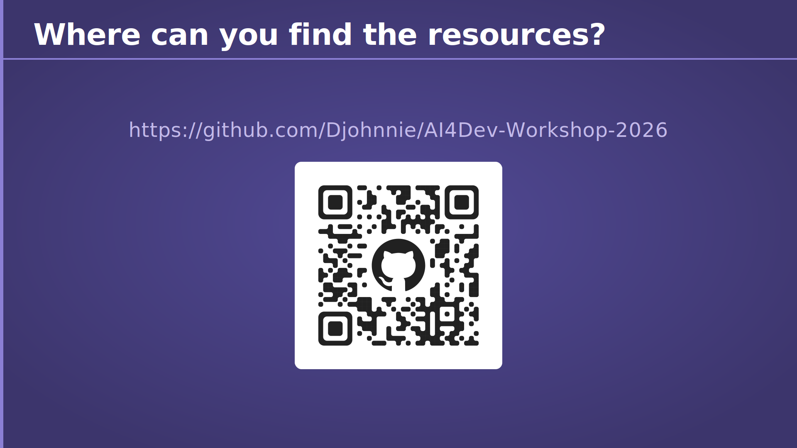
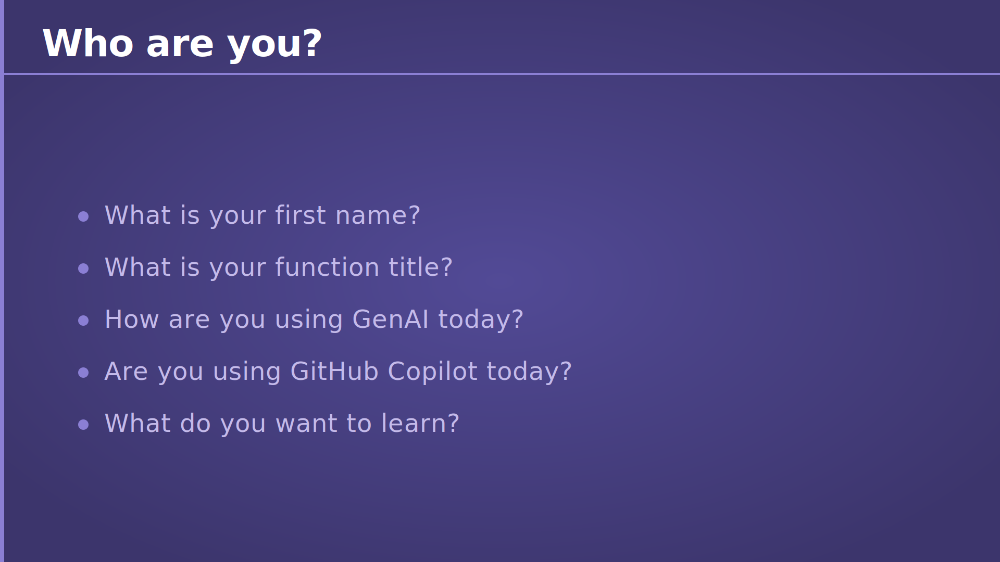
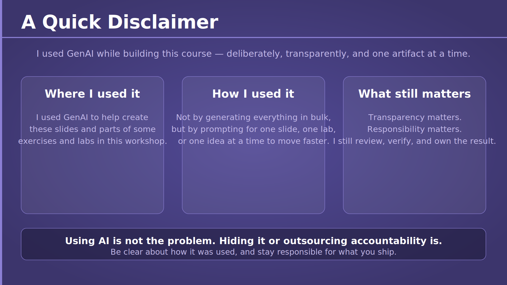
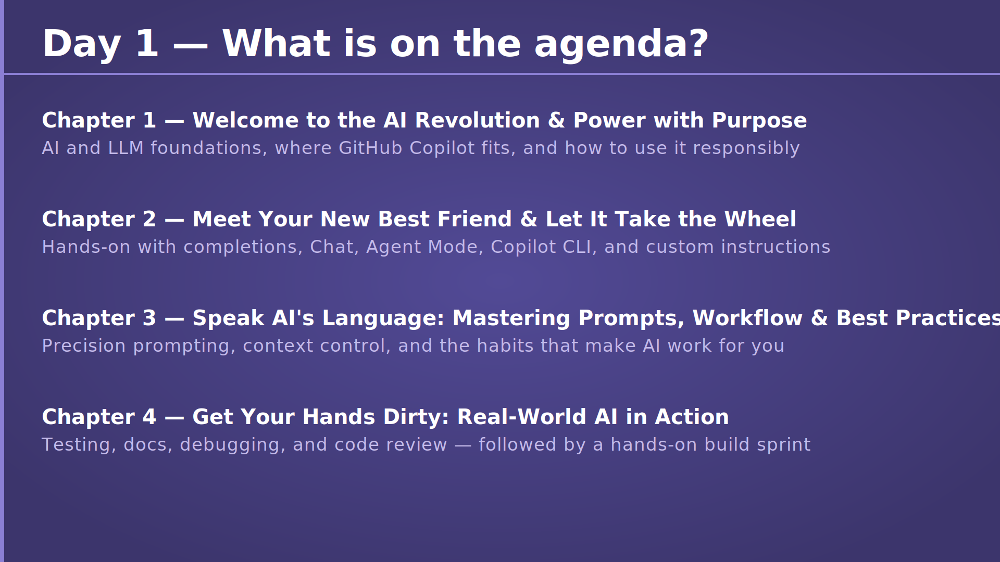

# Chapter 0 — Introduction

## Slide 01 — AI4Dev

> **TL;DR:** This workshop is about using AI to become more effective as a developer without giving up judgment, quality, or control.

This title slide sets the tone for the full workshop. We are not here to treat AI as magic, and we are not here to fear it either. The goal is to learn how to use AI tools in a practical, disciplined way so they help you move faster while you still stay responsible for the result.

## Slide 02 — Who is your trainer?

> **TL;DR:** Your trainer brings long hands-on experience in .NET, Azure, and AI-enabled development.

This slide introduces Johnny Hooyberghs and gives participants a sense of the perspective behind the course. The focus is not just on theory, but on real software delivery, cloud work, and modern developer tooling.

It also helps establish trust for the sessions ahead. When someone has spent many years building software, speaking publicly, and working deeply with Microsoft technologies, their guidance on where AI helps — and where it needs caution — becomes much more grounded and useful.

## Slide 03 — Where can you find the resources?

> **TL;DR:** Everything you need for the workshop lives in the GitHub repository.

This slide points everyone to the central place for slides, exercises, labs, and supporting material. That matters because the workshop is designed to be hands-on, and participants should be able to find the exact files they need without confusion.

It is also a reminder that the learning does not stop when the session ends. If you keep the repository bookmarked, you can revisit the examples, rerun the exercises, and use the material later in your own projects.

## Slide 04 — My Stance on GenAI Tooling

> **TL;DR:** Use GenAI with curiosity and discipline — neither rejecting it outright nor trusting it blindly.

This slide explains a balanced position on AI tooling. The trainer is honest about still having doubts, but also recognises the real productivity gains these tools can offer when used well.

That is an important mindset for developers. Our job is not to defend hype or to resist change by default. Our job is to evaluate what actually works, measure the impact, and keep human judgment in the loop wherever correctness, quality, and accountability matter.

## Slide 05 — A Quick Disclaimer

> **TL;DR:** AI was used to help build this course, but every result was reviewed and owned by a human.

This slide models the kind of transparency we should want in professional software work. AI can absolutely help create slides, labs, and code faster, but that does not remove the need for review, verification, and responsibility.

The real issue is not whether AI was involved. The real issue is whether people are honest about how it was used and whether they still take ownership of what they deliver. That is the standard this workshop promotes from the start.

## Slide 06 — Who are you?

> **TL;DR:** This workshop works best when participants share their background, current AI usage, and learning goals.

This slide is an invitation to make the room visible. Knowing each other's names, roles, and current experience with AI helps the trainer adapt examples and explanations to the audience.

It also creates a useful baseline for discussion. Some people may already use GitHub Copilot every day, while others may still be exploring their first AI tools. Sharing what you want to learn helps shape the conversation and makes the workshop more relevant for everyone.

## Slide 07 — Day 1 - What is on the agenda?

> **TL;DR:** The day covers AI foundations, Copilot, responsible use, advanced workflows, and ends with a real-world capstone build.

This slide gives participants a map of the full day. It starts with the basics of AI and large language models, moves into practical GitHub Copilot usage, covers responsible adoption, dives into advanced agent-mode and prompt workflows, and finishes with an end-to-end build that ties everything together.

That progression is deliberate. Before you can use AI well, you need both conceptual understanding and practical habits. Each chapter builds on the previous one so the capstone exercise feels natural rather than overwhelming.
