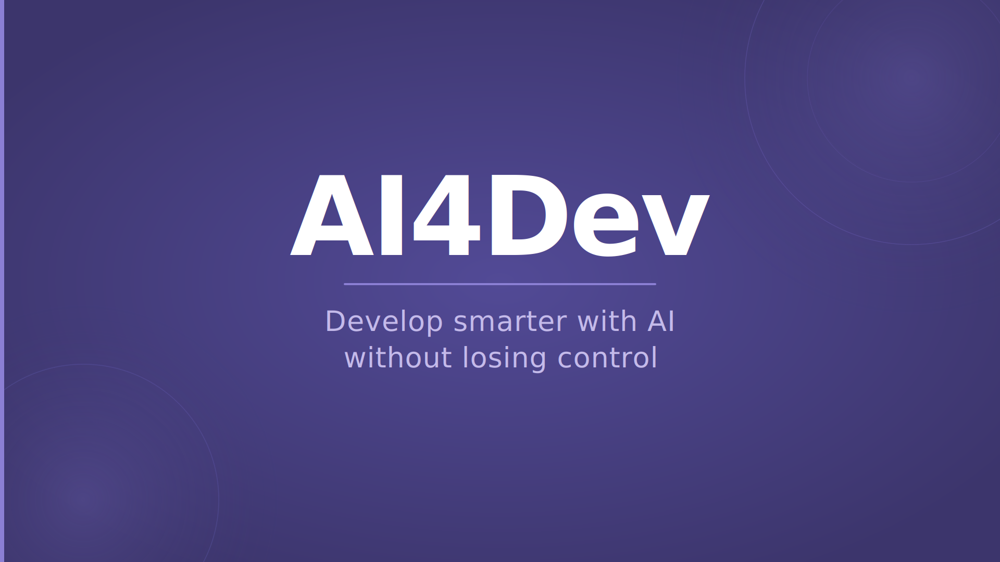
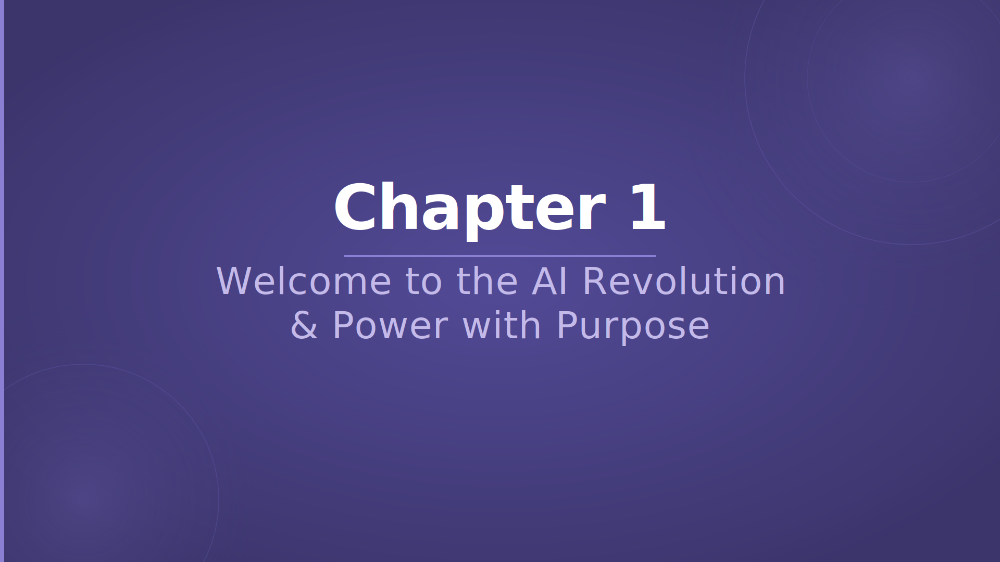

# Chapter 1 — Welcome to the AI Revolution & Power with Purpose

## Slide 01 — AI4Dev

> **TL;DR:** This is the opening logo slide for the AI4Dev workshop.

This slide marks the start of Chapter 1. It introduces the workshop's core theme: developing smarter with AI without losing control. It sets a professional and practical tone for the sessions that follow.

## Slide 02 — Chapter 1 — Welcome to the AI Revolution & Power with Purpose

> **TL;DR:** Chapter 1 combines the AI Revolution introduction with the Responsible AI module into one focused session for the one-day format.

In the one-day workshop, Chapters 1 and 3 from the two-day format are merged into a single chapter. Participants will get an introduction to how AI and large language models work, what GitHub Copilot is and where it fits, and how to use these tools with fairness, accountability, privacy, and security in mind from the very start.