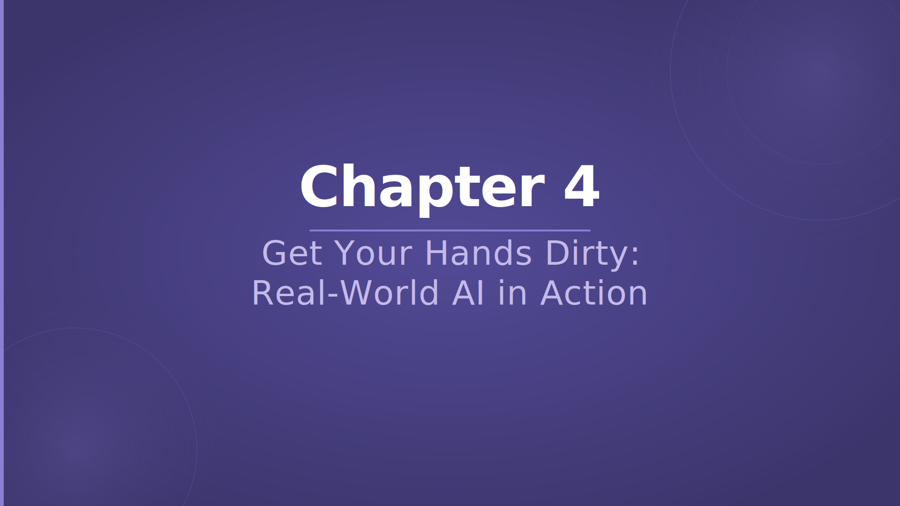

# Chapter 4 — Get Your Hands Dirty: Real-World AI in Action

## Slide 01 — AI4Dev

> **TL;DR:** This is the opening logo slide for the final chapter of the one-day workshop.

This slide marks the start of Chapter 4, the capstone chapter. By this point participants have covered AI foundations, Copilot basics and advanced features, responsible use, and prompt mastery. Now the focus shifts to applying all of that in a realistic, end-to-end build.

## Slide 02 — Chapter 4 — Get Your Hands Dirty: Real-World AI in Action

> **TL;DR:** Chapter 4 is the capstone that combines recap, reflection, and a full real-world AI-assisted build.

In the one-day format this chapter mirrors Chapter 8 of the two-day workshop. It begins with a structured recap of all previous chapters so the key lessons are fresh, runs a set of interactive quizzes to consolidate understanding, and then sends participants into a final lab where they build a complete feature using Copilot as a partner across analysis, implementation, testing, debugging, documentation, and pull request preparation.