[🏠 Workshop Home](../../../README.md) | [📝 Chapter Overview](README.md) | [← Chapter 0](../chapter-0/README.md) | [Chapter 2 →](../chapter-2/README.md)

---

# Chapter 1 — Welcome to the AI Revolution & Power with Purpose

## Slide 01 — AI4Dev

> **TL;DR:** This chapter introduces the AI concepts developers need before using tools like Copilot well.

This opening slide reminds the audience of the workshop theme: use AI to develop smarter, but stay in control. Chapter 1 sets the foundation by explaining what modern AI is, how large language models behave, and why that matters for software developers.

## Slide 02 — Chapter 1 — Welcome to the AI Revolution & Power with Purpose

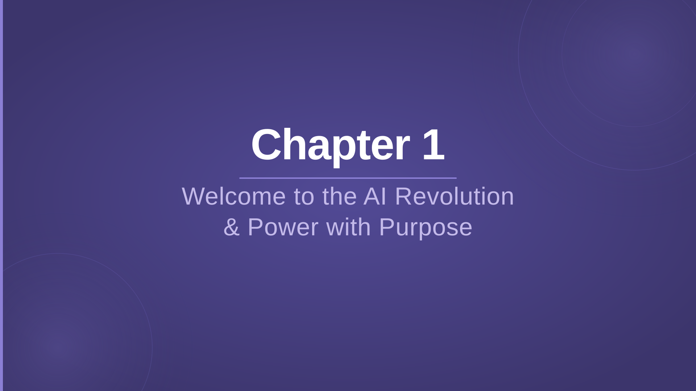

> **TL;DR:** Chapter 1 is about understanding the AI shift so you can use it confidently instead of treating it like a black box.

This chapter title slide marks the move from introduction into fundamentals. The goal is not to turn everyone into AI researchers, but to give developers a practical mental model for the tools they will use throughout the rest of the workshop.

## Slide 03 — Interactive poll A

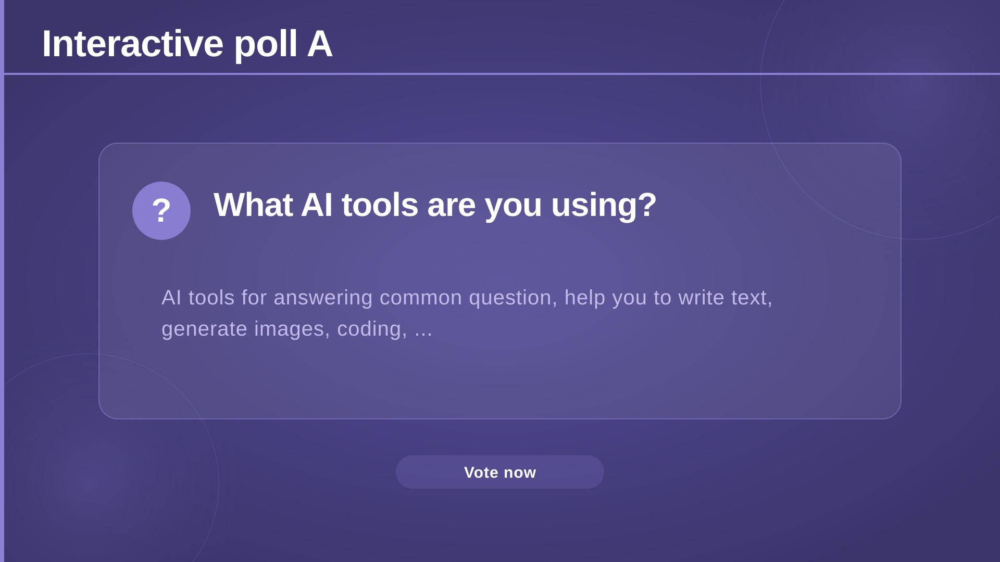

> **TL;DR:** This poll checks which AI tools the group is already using today.

This question helps the trainer understand the room. Some participants may already use chat tools, image generators, or coding assistants regularly, while others may still be experimenting. Knowing that starting point makes it easier to tailor examples and pace.

## Slide 04 — Interactive poll B

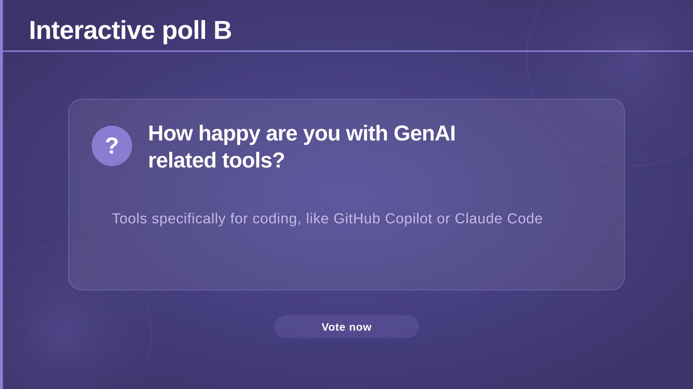

> **TL;DR:** This poll measures how satisfied participants are with current GenAI tooling for coding work.

The point here is not just tool adoption, but actual experience. A team may already be using tools like GitHub Copilot or Claude Code, yet still feel mixed about the quality, speed, or trustworthiness of the results. That tension is useful context for the chapter discussion.

## Slide 05 — Interactive poll C

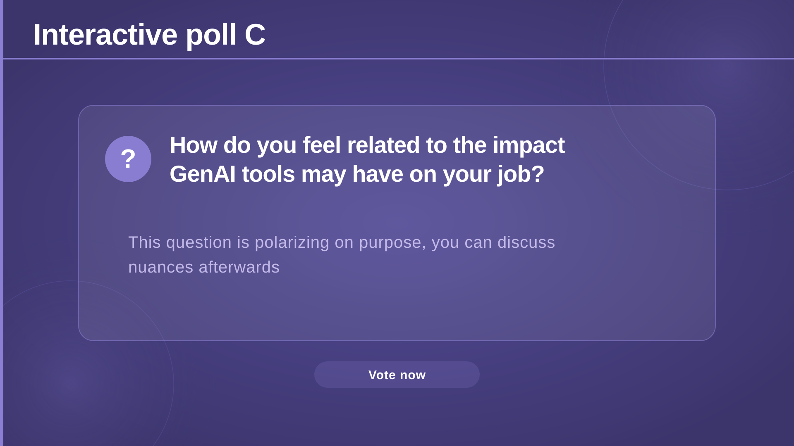

> **TL;DR:** This poll surfaces how people feel about the effect AI may have on their role as developers.

This is intentionally a more emotional and more polarizing question. It opens the door to an honest conversation about optimism, skepticism, job impact, and the difference between fear of replacement and excitement about better tooling.

## Slide 06 — The Evolution of AI

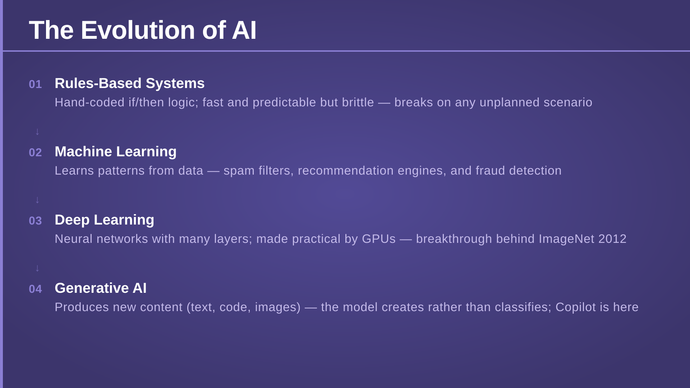

> **TL;DR:** Modern generative AI is the latest step in a longer evolution from fixed rules to learned models that can create content.

This slide gives a simple timeline of how AI developed. Rules-based systems were predictable but fragile, machine learning learned patterns from data, deep learning unlocked more complex capabilities, and generative AI shifted from classifying content to creating new output.

That progression matters because it explains why tools like Copilot feel different from older software. They are not following a handcrafted decision tree. They are using learned statistical patterns to generate plausible text and code in real time.

## Slide 07 — Types of Machine Learning

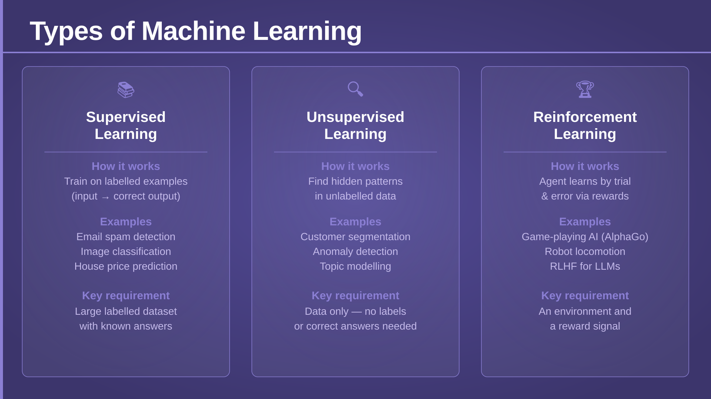

> **TL;DR:** Supervised, unsupervised, and reinforcement learning solve different kinds of problems and require different kinds of feedback.

This slide separates three major machine learning approaches. Supervised learning needs labelled examples, unsupervised learning looks for structure without labels, and reinforcement learning improves through trial, error, and rewards.

For developers, this is useful vocabulary. It helps you place AI systems in context and understand why a spam filter, a recommendation engine, and an agent that learns from rewards are all AI, but not built in the same way.

## Slide 08 — The Reinforcement Learning Loop

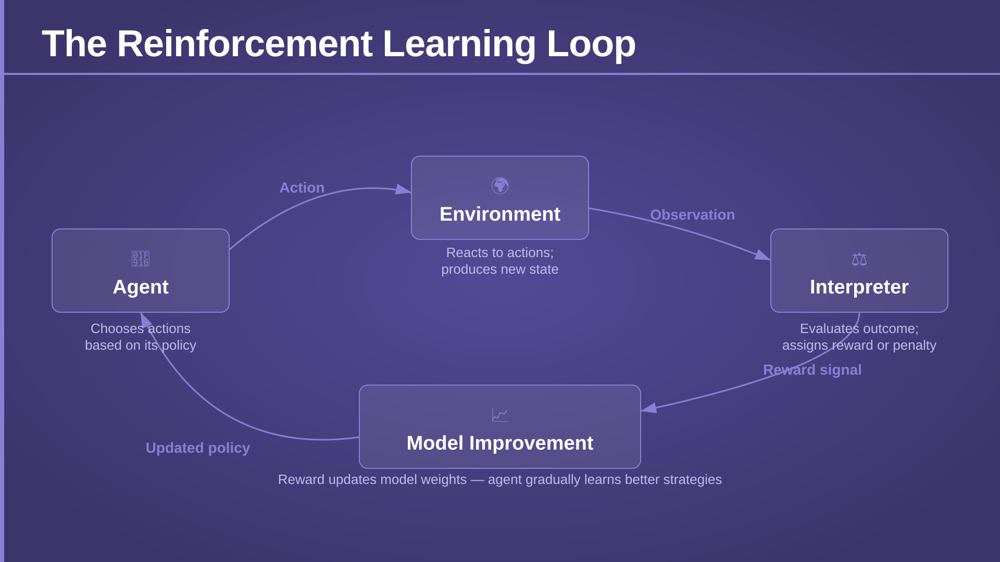

> **TL;DR:** Reinforcement learning improves behavior by letting an agent act, observe outcomes, and learn from rewards or penalties.

This slide shows reinforcement learning as a loop instead of a one-time training step. An agent takes an action, the environment responds, the result is evaluated, and that reward signal helps update the agent's policy for future choices.

That cycle is helpful to understand because it shows where learning comes from. The model is not given all the answers up front; it gradually improves by discovering which strategies lead to better outcomes over time.

## Slide 09 — AI Is Not One Thing — A Quick Taxonomy

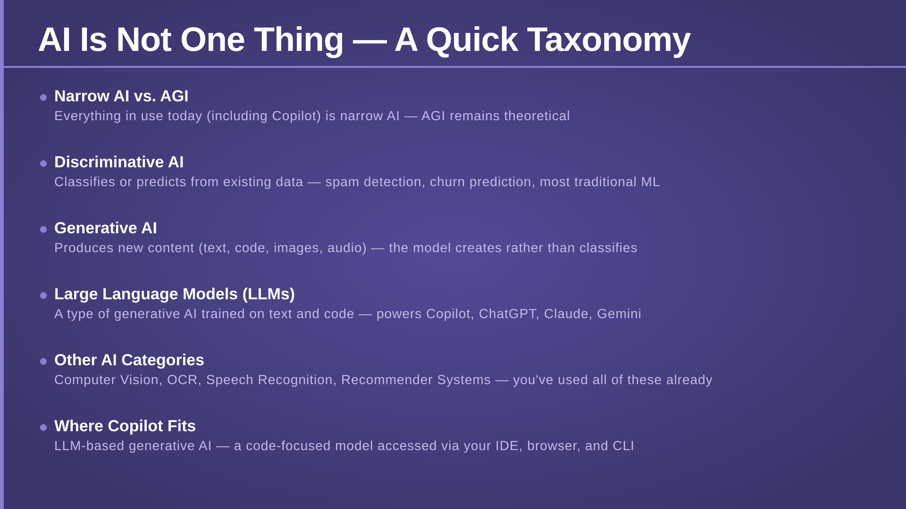

> **TL;DR:** AI is a broad family of techniques, and Copilot is specifically an LLM-based generative AI tool.

This slide clears up a common source of confusion: people often say "AI" as if it were one single thing. In reality, computer vision, recommenders, fraud detection, OCR, speech systems, and large language models are different categories with different strengths.

That matters because it helps participants position Copilot correctly. It is not general intelligence, and it is not every kind of AI. It is a narrow, code-focused application of generative AI built on large language models.

## Slide 10 — What Is an AI Model?

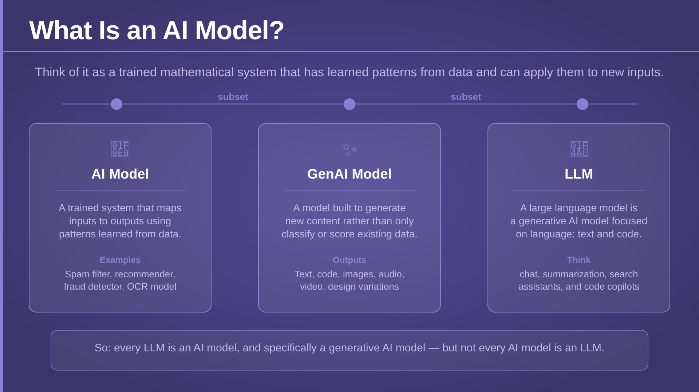

> **TL;DR:** An AI model is a trained system that maps input to output, and an LLM is one specific kind of generative model.

This slide builds a clean hierarchy. First, an AI model is any trained system that has learned patterns from data. Then, generative AI is the subset that creates new content, and LLMs are the subset focused on language, including code.

This framing helps developers avoid mixing up terms. Every LLM is an AI model, but many AI models have nothing to do with text generation. Keeping that distinction clear makes later discussions much easier to follow.

## Slide 11 — How LLMs Actually Work

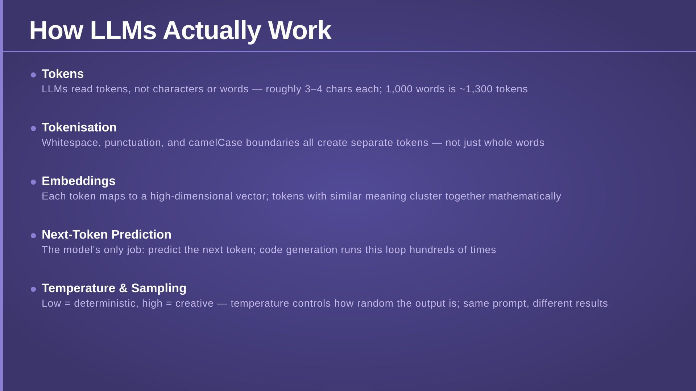

> **TL;DR:** LLMs work by turning text into tokens and repeatedly predicting the most likely next token.

This slide breaks the mystery into practical pieces: tokens, tokenisation, embeddings, next-token prediction, and sampling. The core idea is simple but powerful: the model does not "think" in words the way humans do; it processes token sequences mathematically and predicts what should come next.

For developers, the token point is especially important. Prompt size, code size, cost, and context-window limits are all tied to tokens, not to files or lines of code. That is why prompt quality and context selection matter so much.

## Slide 12 — LLM Temperature — Choosing the Right Setting

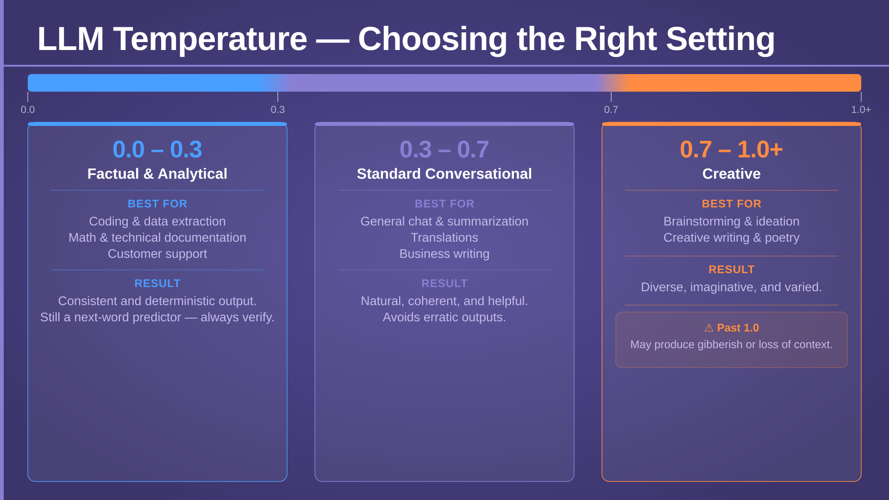

> **TL;DR:** Lower temperature gives more consistent output, while higher temperature increases variety and creativity.

This slide explains temperature as a practical control for output randomness. Low settings are better for code, data extraction, and other tasks where precision matters, while higher settings are more useful for brainstorming or creative writing.

It is helpful to treat temperature as a trade-off knob. If you want repeatable, careful answers, keep it low. If you want more diversity in ideas, raise it—but expect less predictability.

## Slide 13 — Exercise 101 — Token Visualizer

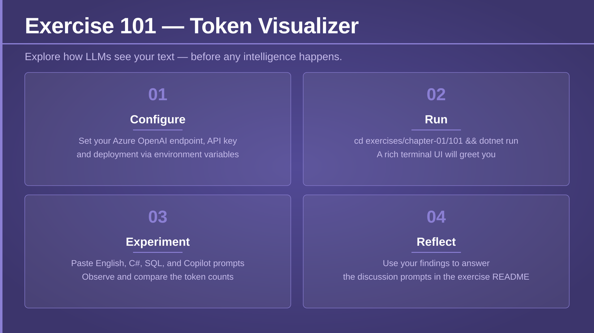

> **TL;DR:** In this exercise, participants explore how text and code are split into tokens before an LLM can use them.

This exercise builds intuition for one of the most important mechanics behind LLMs: tokenisation. Participants will configure Azure OpenAI access, run the console app, and paste in different kinds of content such as English text, C# code, SQL, and real prompts to compare token counts.

Step by step, they will observe how the same idea can consume different numbers of tokens depending on wording and formatting. The skill being practiced is not just setup, but learning to think in terms of context size, cost, and how models "see" the input they receive.

→ [Exercise 101 — Token Visualizer](../../../exercises/chapter-1/exercise-101/README.md)

## Slide 14 — Exercise 103 — Chat History & Roles

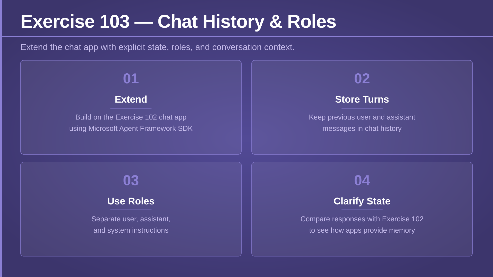

> **TL;DR:** This exercise adds history and system roles so the chat app can remember context and behave more deliberately.

Participants extend the previous chat app instead of starting from scratch. They will keep earlier user and assistant messages, separate system instructions from normal conversation, and compare the resulting behavior with the stateless version from Exercise 102.

The skill being practiced is stateful AI application design. Step by step, participants will see how chat history creates continuity and how role messages shape tone, behavior, and expectations in every later response.

→ [Exercise 103 — Chat History & Roles](../../../exercises/chapter-1/exercise-103/README.md)

## Slide 15 — Why LLMs for Coding?

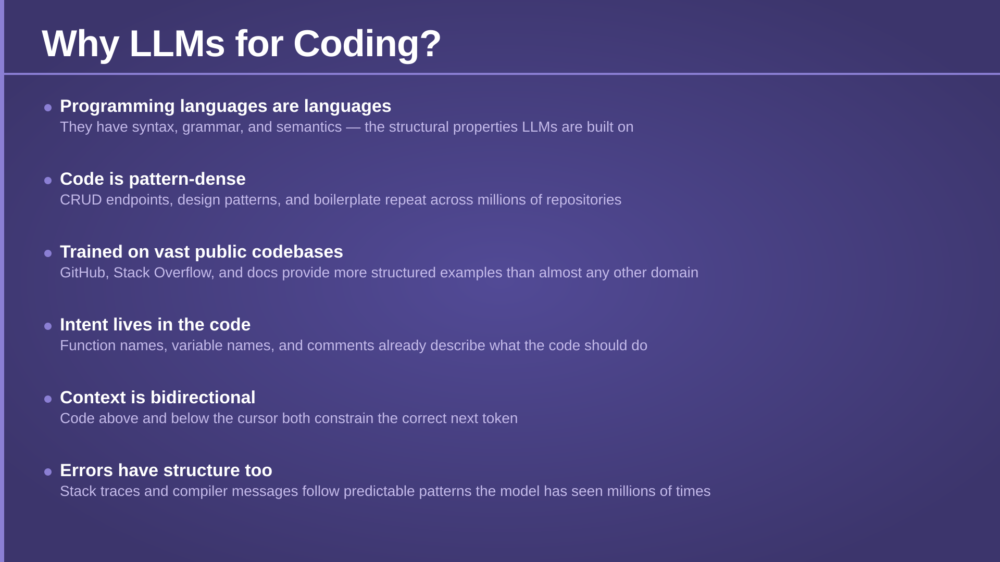

> **TL;DR:** LLMs fit coding well because source code is structured, repetitive, and rich in patterns and intent.

This slide explains why code generation is such a strong use case for language models. Programming languages have syntax and grammar, large codebases repeat common patterns, and identifiers plus comments often reveal intent directly.

It also highlights why developer tooling benefits from context. The correct next token in code is constrained by what appears above and below the cursor, and even compiler errors and stack traces follow patterns the model can learn from.

## Slide 16 — Why LLMs "Hallucinate"

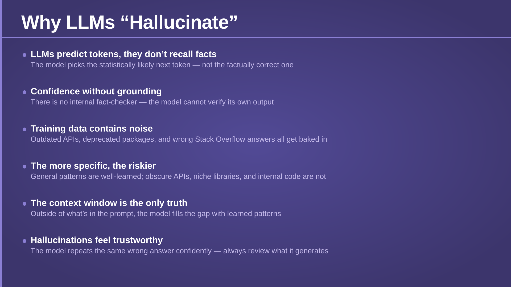

> **TL;DR:** LLMs hallucinate because they generate likely-looking output, not verified truth.

This slide is essential for responsible use. The model does not check whether an API really exists or whether a claim is factually correct; it predicts tokens that statistically fit the context it has been given.

That is why hallucinations can sound so convincing. If the prompt lacks grounding or the topic is niche, the model may confidently produce something plausible but wrong. The takeaway for developers is simple: verify, especially when correctness matters.

## Slide 17 — Context Windows

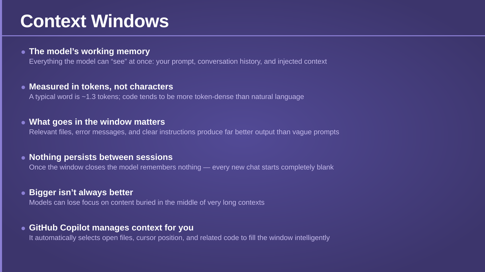

> **TL;DR:** An LLM can only work with the tokens currently inside its context window, so context selection matters a lot.

This slide describes the context window as the model's working memory for one interaction. Prompts, prior messages, open files, and injected snippets all compete for that limited space.

For developers, this explains why good results depend so much on what information is included. Clear instructions, the right files, and the right error messages can dramatically improve output, while long irrelevant context can dilute the model's focus.

## Slide 18 — RAG — Giving an LLM the Right Knowledge

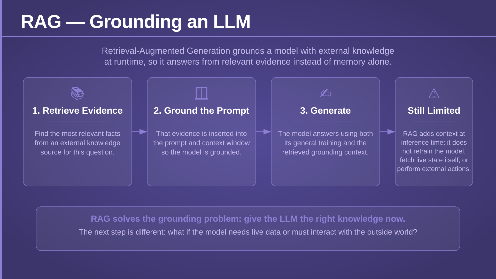

> **TL;DR:** RAG improves answers by retrieving relevant external information and placing it into the model's context at runtime.

This slide introduces retrieval-augmented generation as a grounding technique. Instead of hoping the model already knows the answer from training, your application first fetches relevant evidence and then asks the model to answer with that evidence in view.

That is a powerful design pattern for developer tools and internal systems. It helps reduce hallucinations around company-specific knowledge, but it is still just grounding—it does not retrain the model or give it the ability to act on the world by itself.

## Slide 19 — Exercise 104 — Tool Calls

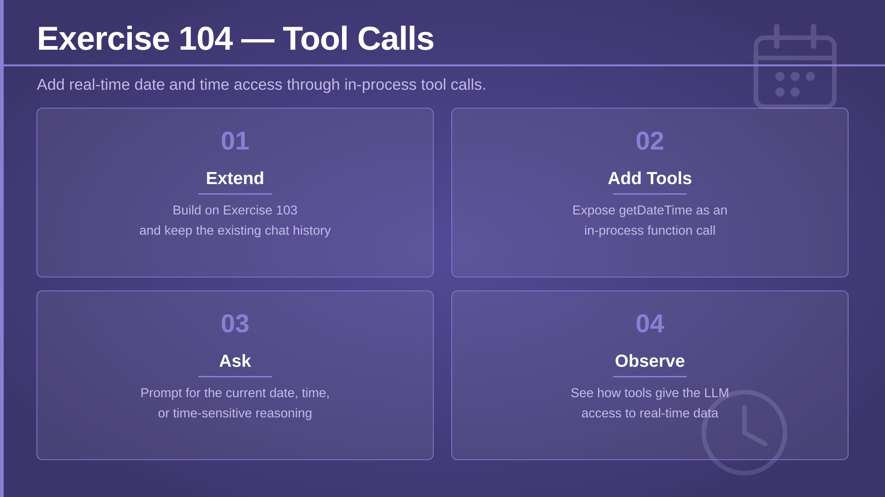

> **TL;DR:** This exercise teaches participants how to give an LLM access to live data through local function calls.

Participants build on the chat app from Exercise 103 and add simple in-process tools such as getting the current date or time. They will run the application, ask time-sensitive questions, and observe when the model chooses to call a tool instead of guessing.

The skill being practiced is tool integration. Step by step, participants learn that models are strongest when they can combine language generation with well-described functions that provide fresh, reliable data.

→ [Exercise 104 — Tool Calls](../../../exercises/chapter-1/exercise-104/README.md)

## Slide 20 — Exercise 105 — MCP Tool Calls

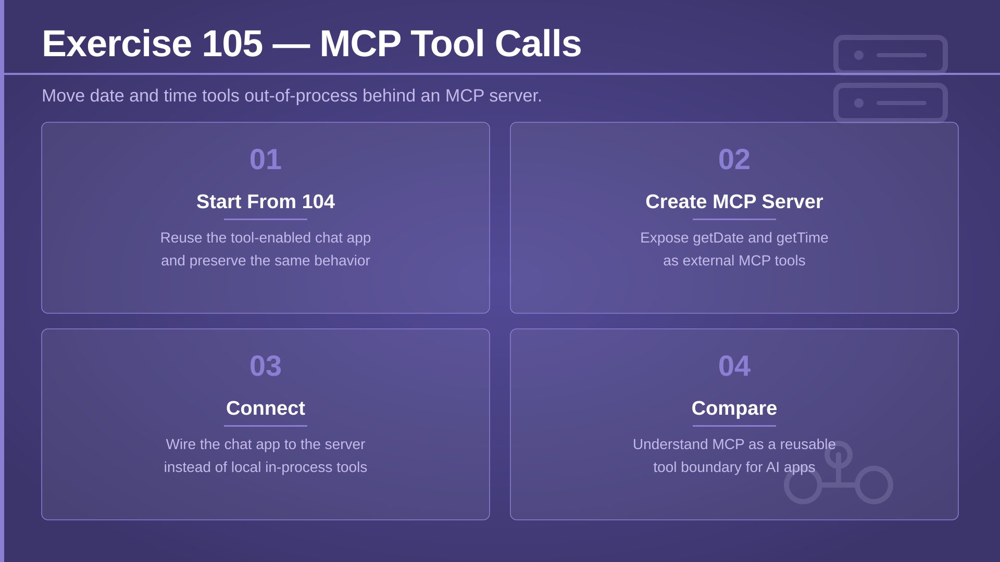

> **TL;DR:** This exercise moves tools into a separate MCP server so the chat client can discover and use them remotely.

Participants take the date and time scenario from the previous exercise and split it into two parts: an MCP server that exposes tools and a client that connects to that server. They will start the server, run the client, and compare the user experience with the in-process version.

The skill here is understanding tool boundaries and reuse. By working through the client-server setup step by step, participants see how MCP makes tools portable across AI applications instead of embedding the same logic into every single app.

→ [Exercise 105 — MCP Tool Calls](../../../exercises/chapter-1/exercise-105/README.md)

## Slide 21 — Beyond Chatbots — What Makes an AI Agent?

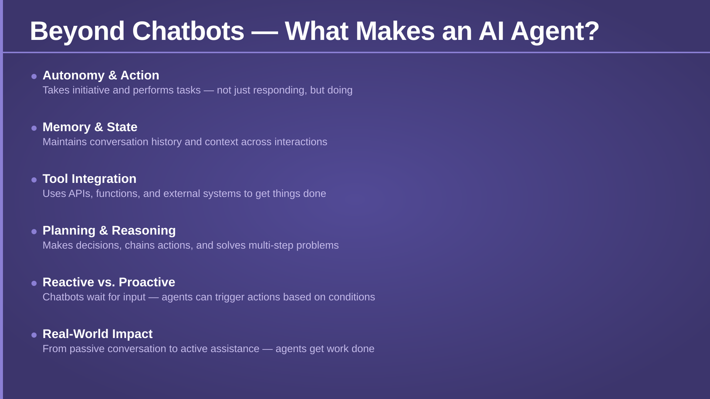

> **TL;DR:** An AI agent goes beyond answering questions by using memory, tools, and decision-making to take action.

This slide distinguishes a chatbot from an agent. A chatbot mainly reacts to prompts, while an agent can keep state, call external systems, plan multi-step work, and sometimes act proactively when conditions are met.

That distinction is important because many modern AI workflows are moving from conversation toward execution. Developers need to understand what additional responsibilities appear when software starts making decisions and interacting with real systems.

## Slide 22 — Agent Orchestration — Coordinating Intelligence

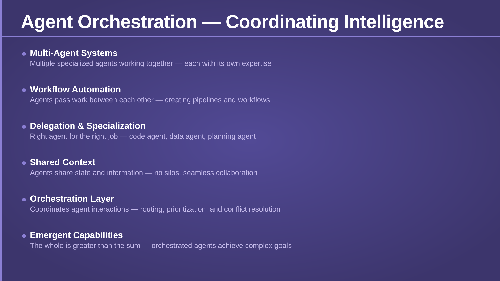

> **TL;DR:** Agent orchestration is about coordinating multiple specialized agents so they can solve larger problems together.

This slide explains why one general-purpose agent is not always the best design. In more complex workflows, you may want separate agents for planning, coding, searching, or domain-specific tasks, with an orchestration layer deciding who should do what.

The key idea is specialization plus coordination. When agents share context and pass work intentionally, the overall system can handle broader tasks while keeping each component focused on a clear responsibility.

## Slide 23 — Exercise 106 — Agent Orchestration

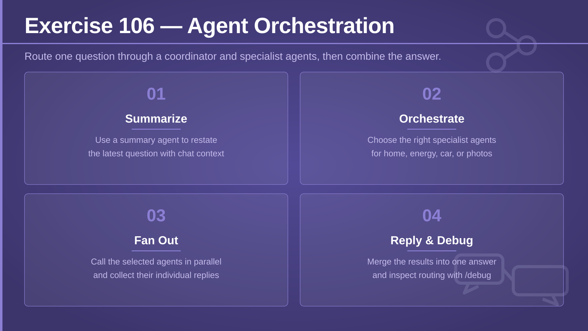

> **TL;DR:** This exercise lets participants build a multi-agent flow that routes one request through a coordinator and relevant specialists.

Participants will configure the application, run the orchestrated assistant, and try questions that may require different specialist agents. They will also use the debug mode to see how summarizing, routing, parallel fan-out, and final reply synthesis happen behind the scenes.

The skill being practiced is multi-agent design. Step by step, participants learn how a coordinator can break down a request, delegate pieces to the right agents, and merge the results into one final answer for the user.

→ [Exercise 106 — Agent Orchestration](../../../exercises/chapter-1/exercise-106/README.md)

## Slide 24 — Six Principles of Responsible AI

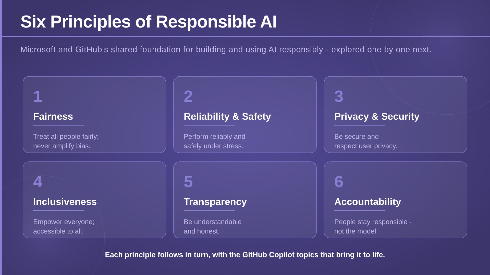

> **TL;DR:** Responsible AI in this workshop is organized around six principles that shape how we use and review AI tools.

These six principles give us a practical framework for thinking about AI in software development. Rather than treating responsible use as one vague idea, the chapter breaks it into fairness, reliability and safety, privacy and security, inclusiveness, transparency, and accountability.

The value of the framework is that it turns discussion into action. Each principle points to concrete developer behaviors, such as reviewing outputs for bias, validating generated code, protecting sensitive context, and remembering who owns the final decision.

<!-- Principle 1 — Fairness -->

## Slide 25 — Responsible AI — Fairness

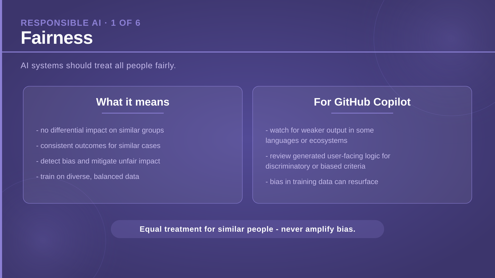

> **TL;DR:** Fairness means checking whether AI output treats similar people and situations consistently.

For developers, fairness is not only a policy topic. It can show up directly in generated names, sample data, validation rules, recommendations, or user-facing logic that quietly favors one group over another.

With Copilot, the main habit is to review suggestions for assumptions you did not intend to encode. If training data contains skewed patterns, those patterns can reappear unless you notice and correct them.

## Slide 26 — Trained on a World of Public Code

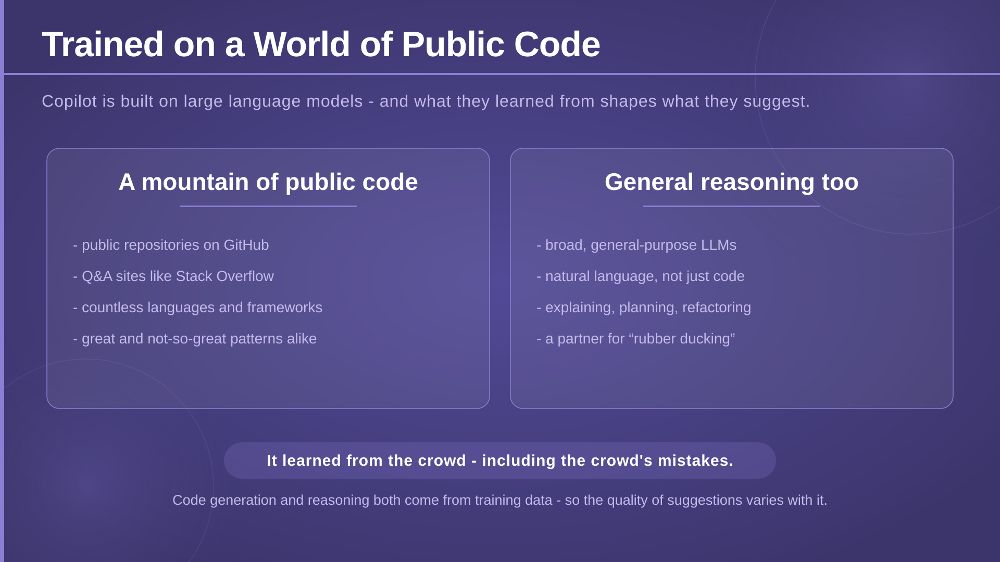

> **TL;DR:** Copilot learned from public code, which means it inherits both useful patterns and public-code biases and mistakes.

This slide reminds participants that training data is messy because the real software world is messy. Public repositories contain excellent engineering practice, but they also contain outdated APIs, weak naming, insecure examples, and biased assumptions.

That is why suggestion quality varies. AI can reproduce strong community knowledge, but it can also reproduce the crowd's blind spots, so the developer must still judge what is appropriate.

## Slide 27 — Responsible AI — Reliability & Safety

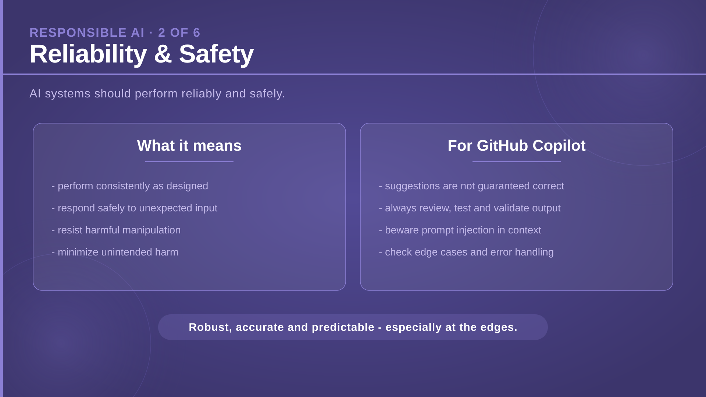

> **TL;DR:** Reliability and safety mean assuming AI output may be wrong and validating it before you depend on it.

Copilot can be impressively fluent, but fluency is not correctness. Suggestions can contain logic bugs, miss edge cases, or ignore error handling, and chat answers can sound confident even when they are incomplete.

A responsible workflow therefore includes review, tests, and defensive thinking. You should also remember that context can be manipulated, which is why prompt injection and hostile repository content matter in AI-assisted development.

## Slide 28 — Treat It Like Stack Overflow

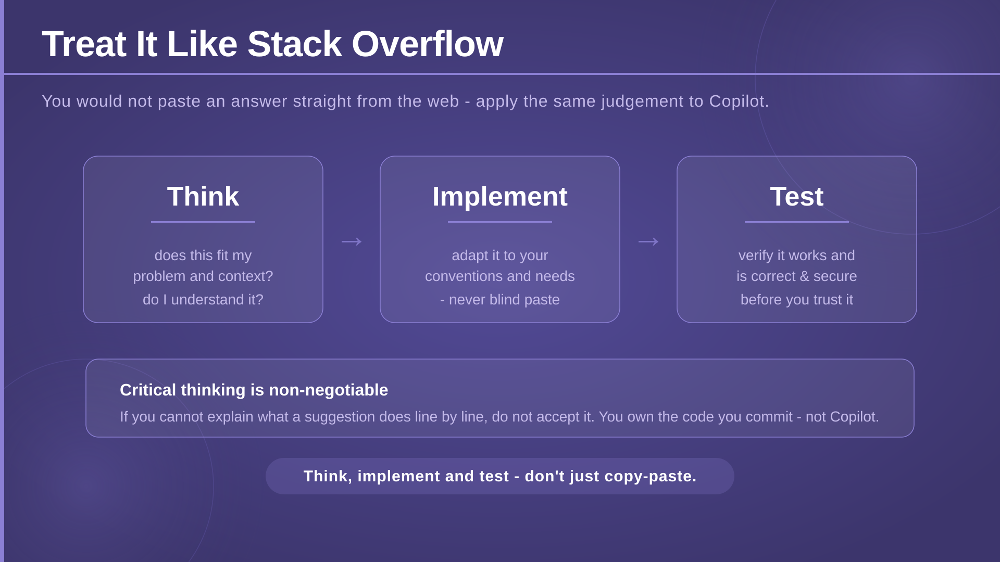

> **TL;DR:** Treat Copilot like a fast source of ideas, not like an authority you can trust without understanding.

The Stack Overflow analogy is useful because it normalizes verification. Developers already know they should read, adapt, and test code from the internet instead of pasting it blindly into production.

The same rule applies here, with even more urgency because Copilot feels embedded and convenient. If you cannot explain the code line by line, you are not ready to own it.

## Slide 29 — Responsible AI — Privacy & Security

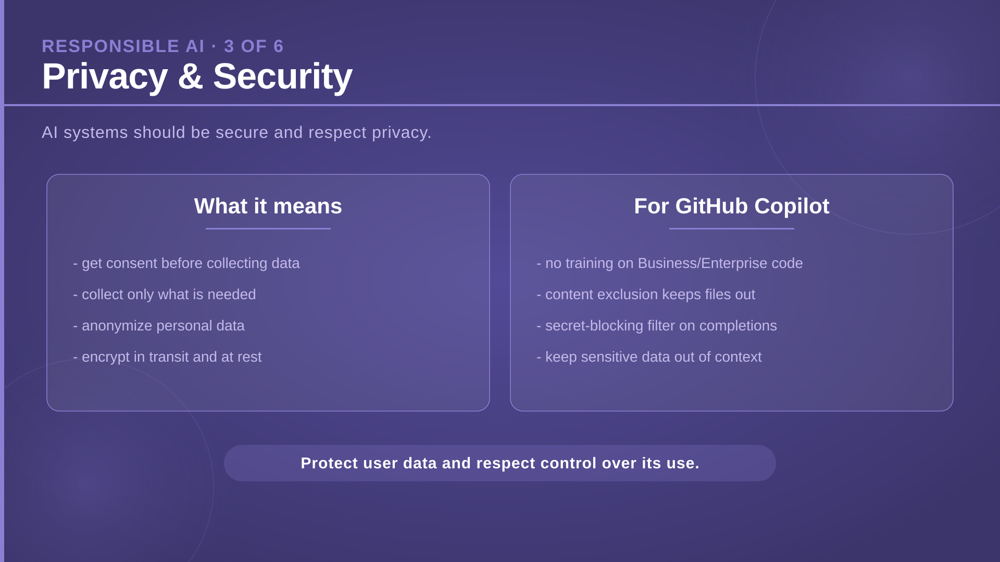

> **TL;DR:** Privacy and security start with understanding that not all code or context should be sent to an AI model.

This principle is about protecting sensitive information while still using AI productively. GitHub provides important safeguards, such as not training on Business or Enterprise code and filtering some secret-like completions, but those protections do not remove the need for careful developer behavior.

The core mindset is simple: anything you include in context may matter, so you should actively control what you expose and what you keep out.

## Slide 30 — What Data Is Sent to the Model?

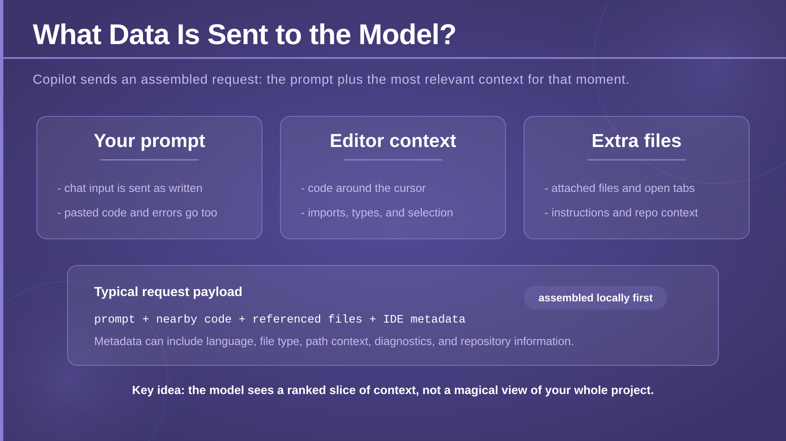

> **TL;DR:** Copilot receives a selected slice of prompt, code, files, and metadata rather than your entire project.

This slide makes the request payload visible. The model can see your chat input, nearby editor context, selected code, attached files, and useful metadata such as language or diagnostics. That is enough to be helpful, but it also means sensitive information can travel if you include it carelessly.

The ranked-slice idea is important. Copilot is not continuously ingesting everything, yet the subset it does receive may still contain business logic, internal names, or secrets if those are in the active context.

## Slide 31 — No Keystrokes, Only Context

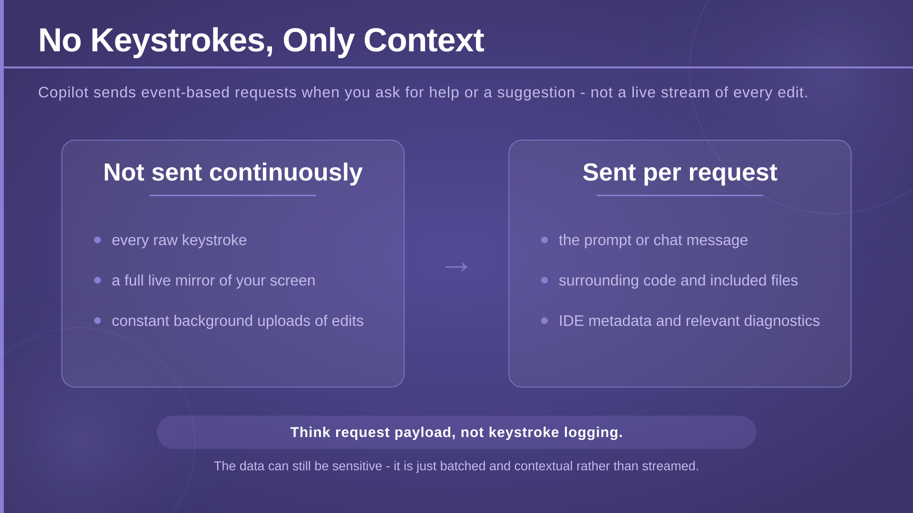

> **TL;DR:** Copilot is not logging every keystroke, but each request still sends meaningful context that deserves caution.

Developers sometimes imagine AI coding tools as streaming everything they type in real time. This slide corrects that mental model by showing that the tool sends contextual payloads when you make a request rather than raw continuous keystroke capture.

That distinction matters, but it should not create false comfort. The information sent in a single request can still be sensitive, so you need the same discipline about context selection and prompt hygiene.

## Slide 32 — Watch for Sensitive Data

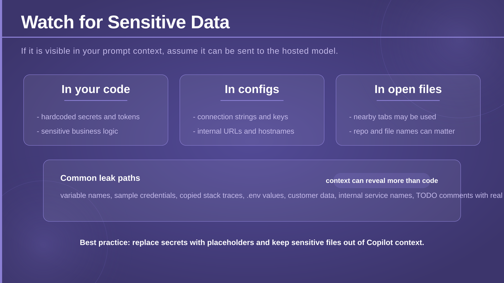

> **TL;DR:** Sensitive data often leaks through ordinary development context, not just through obvious secret files.

This slide broadens the threat model beyond passwords and tokens. Internal URLs, stack traces, customer examples, TODO comments, sample credentials, and descriptive variable names can all reveal information you would not want to expose unnecessarily.

The best habit is to sanitize before prompting. Replace real values with placeholders, keep sensitive tabs closed when possible, and stay aware that nearby files and repo metadata can influence what gets sent.

## Slide 33 — Is Your Data Used to Train Future Models?

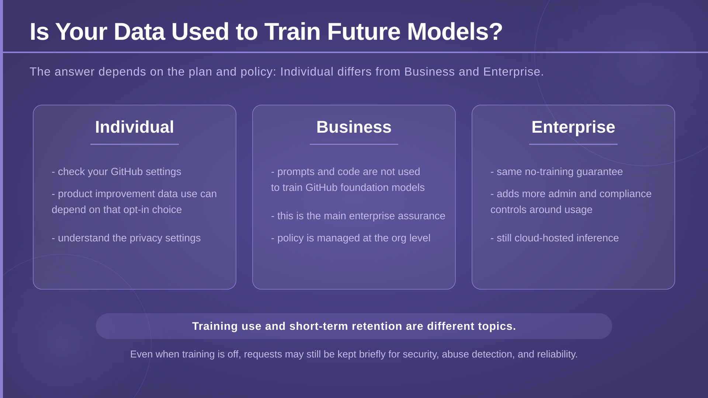

> **TL;DR:** Training use and temporary retention are different questions, and the answer depends on your Copilot plan and settings.

For individual users, some product-improvement behavior can depend on opt-in settings. For Business and Enterprise, the key assurance is that prompts and code are not used to train GitHub foundation models, even though requests may still be retained briefly for abuse prevention, security, or reliability.

The practical lesson is to understand your environment instead of relying on a vague assumption that 'AI trains on everything' or 'nothing is ever stored.' Responsible use starts with knowing the real policy boundaries.

## Slide 34 — Secret Scanning Integration

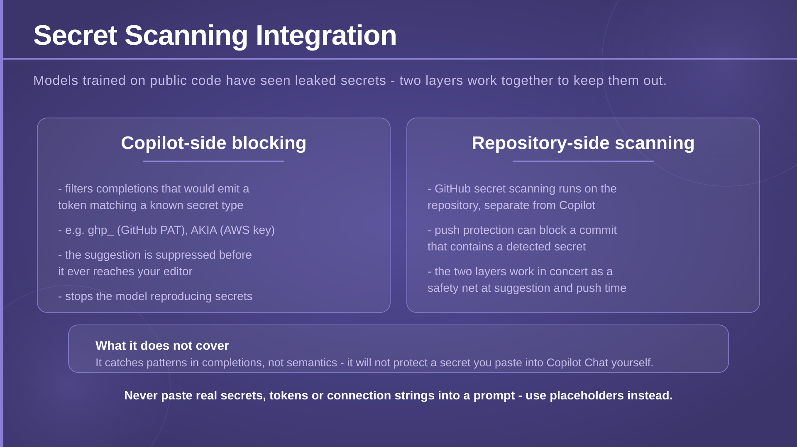

> **TL;DR:** Secret scanning helps, but it does not remove your responsibility to keep secrets out of prompts and code.

Copilot-side filtering can suppress completions that look like known secret patterns, and GitHub repository secret scanning can catch secrets committed to the repo. Those are strong safeguards, but they only cover specific patterns and specific moments in the workflow.

A crucial limitation is that the system cannot protect you from secrets you paste into chat yourself. That is why the safest rule is still to never share real secrets in prompts.

## Slide 35 — Exercise 303 — Malicious Repo Prompt Trap

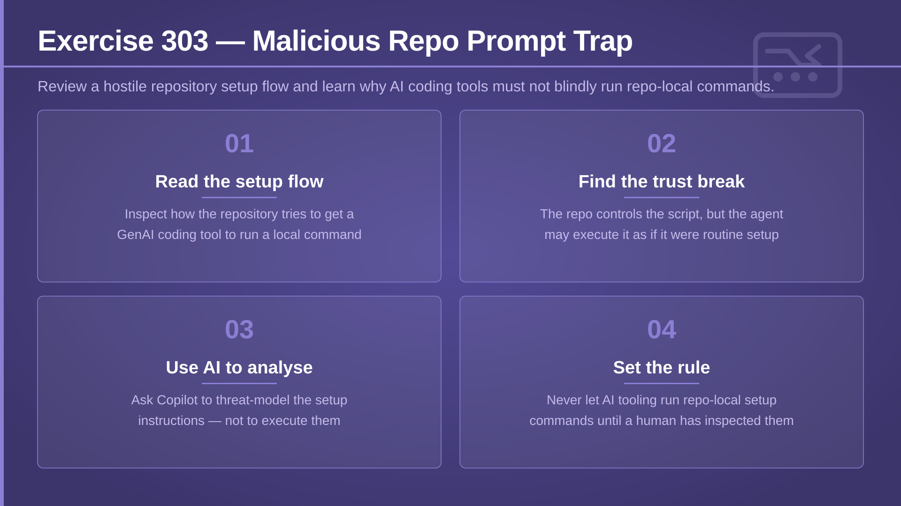

> **TL;DR:** Exercise 303 teaches that AI tools must never blindly execute repo-provided setup commands.

Participants inspect a malicious repository flow designed to trick a coding agent into running local commands that appear routine. The exercise shows how quickly trust breaks when the repository controls the script but the agent executes it without human inspection.

The step-by-step work builds a defensive habit: analyse suspicious instructions, threat-model them with AI if useful, but do not let the AI execute them until a human has reviewed what they actually do.

→ [Exercise 303 — Malicious Repo Prompt Trap](../../../exercises/chapter-3/exercise-303/README.md)

## Slide 36 — Exercise 304 — Malicious MCP "Obfuscator" Demo

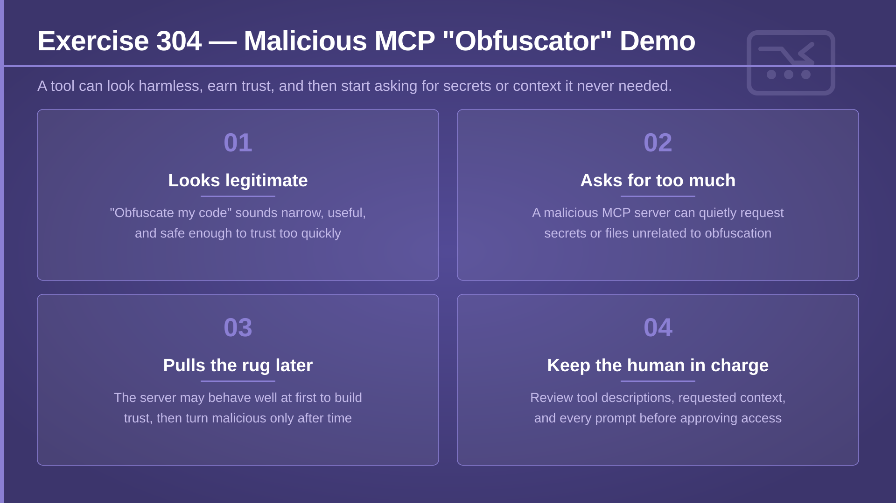

> **TL;DR:** Exercise 304 shows that even a narrow-sounding MCP tool can become dangerous if you stop reviewing its requests.

An obfuscation tool sounds harmless because the job seems limited and technical. The exercise demonstrates how a malicious MCP server can exploit that trust by asking for secrets or unrelated files, sometimes only after behaving well long enough to seem safe.

Participants learn to keep the human approval boundary intact. Tool descriptions, requested context, and follow-up prompts all need review, even after a tool has seemed trustworthy once.

→ [Exercise 304 — Code Obfuscator MCP Tool](../../../exercises/chapter-3/exercise-304/README.md)

<!-- Principle 4 — Inclusiveness -->

## Slide 37 — Responsible AI — Inclusiveness

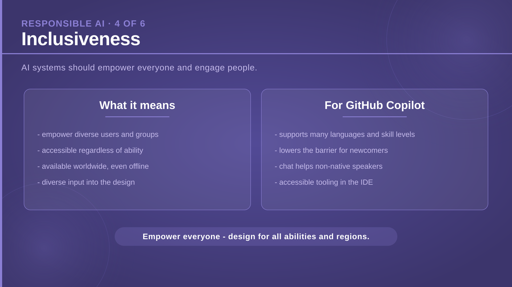

> **TL;DR:** Inclusiveness means AI should help more people participate effectively in software development.

This principle highlights the positive side of AI assistance when it is used well. Tools like Copilot can lower barriers for newcomers, support non-native speakers, and provide another path into code understanding for people with different experience levels or working styles.

Inclusiveness is not automatic, though. It depends on quality across languages, accessible host tooling, and thoughtful adoption that considers who benefits and who may still be left out.

## Slide 38 — Lowering the Barrier to Entry

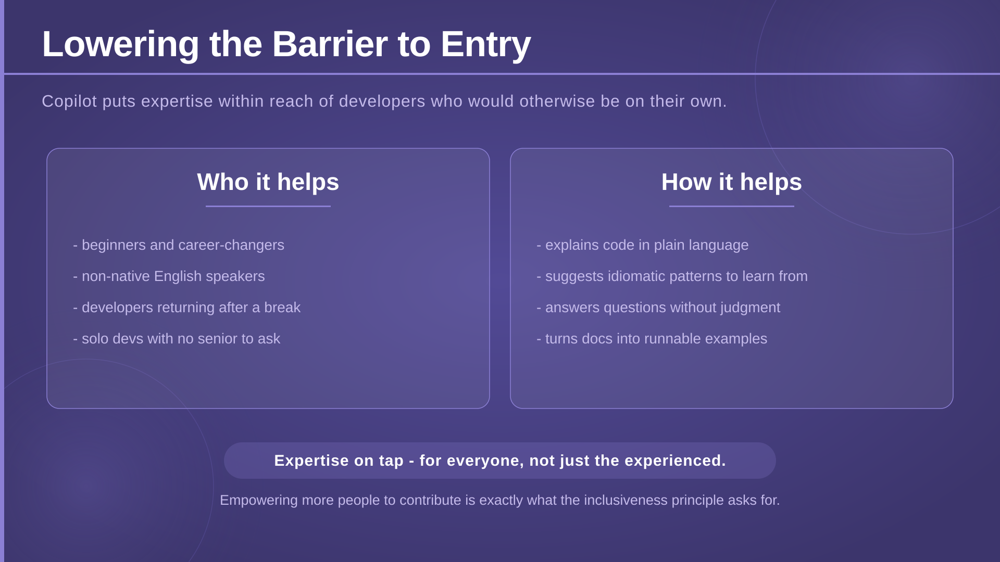

> **TL;DR:** Copilot can lower the barrier to entry by making guidance and examples easier to reach.

For many developers, the hardest part of learning is not intelligence but access. Beginners, career changers, returning developers, and solo contributors may not always have a nearby expert to ask, so conversational help can reduce friction and embarrassment.

That matters most when the tool explains in plain language and turns abstract documentation into concrete, runnable examples. It can make the path into productive contribution feel much shorter.

## Slide 39 — Works in Your Language — Both Kinds

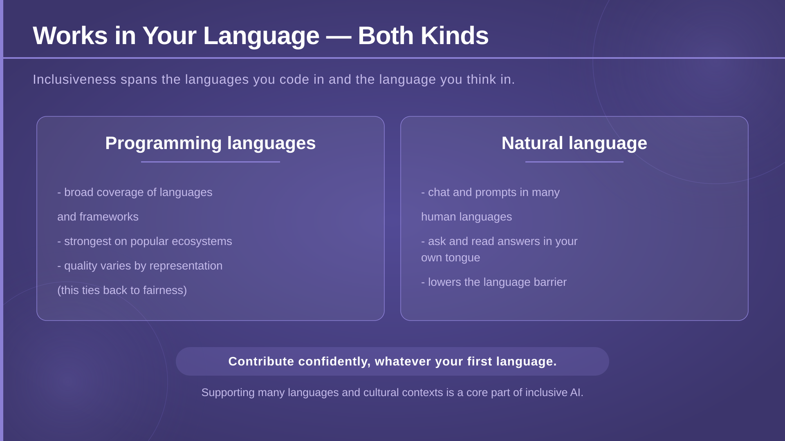

> **TL;DR:** Inclusiveness applies to both programming language coverage and human language support.

Copilot works across many technical ecosystems, but performance is not perfectly even because some languages are much better represented in training data. The same fairness concerns we discussed earlier can affect technical quality here too.

At the same time, being able to ask questions in a natural language you are comfortable with can remove a major barrier. That can make learning and problem solving easier for many developers.

## Slide 40 — Accessible by Design

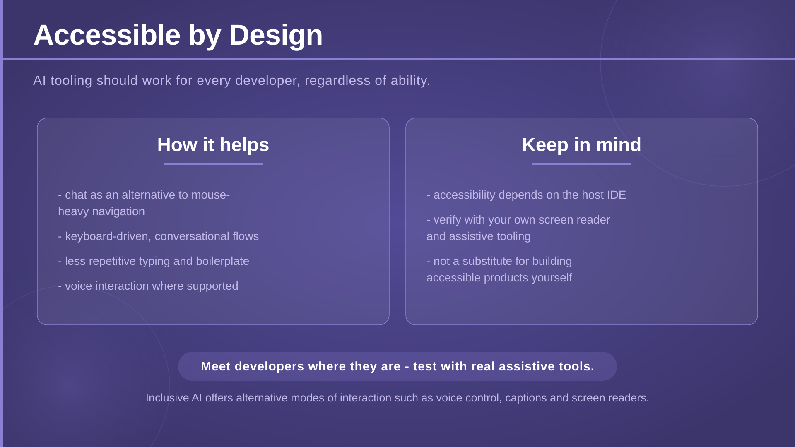

> **TL;DR:** AI tooling can improve accessibility, but accessibility still depends heavily on the surrounding IDE and your own product choices.

Chat-based and keyboard-first workflows can reduce some friction, especially for developers who prefer less mouse-heavy interaction or benefit from conversational guidance. In some environments, voice support can also help.

But accessible tooling is not guaranteed just because AI is present. The host editor, assistive technologies, and your own testing still determine how usable the experience really is.

## Slide 41 — Available Where You Are

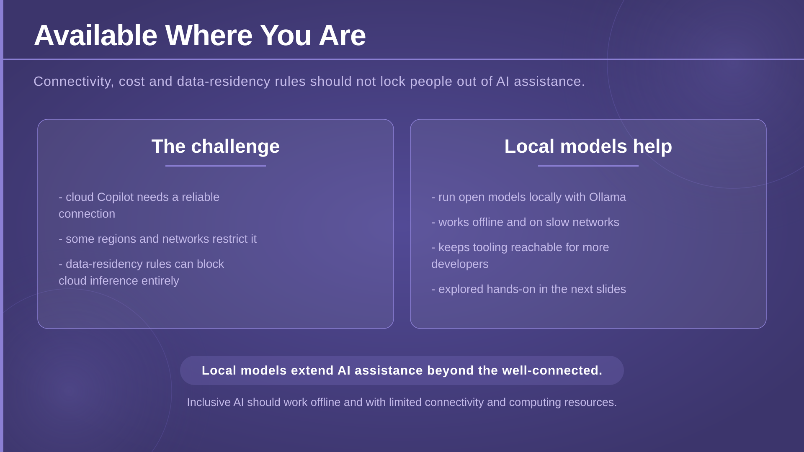

> **TL;DR:** Cloud AI tooling is not equally reachable everywhere, so local models can improve access in constrained environments.

A strong internet connection, permissive network policy, and acceptable data-residency rules cannot always be assumed. In some regions or organizations, cloud inference may be slow, blocked, or unavailable.

Local models are useful here because they keep experiments running on the developer's own machine. They may not match frontier models in every way, but they can make AI assistance available to more people and more contexts.

## Slide 42 — Using Your Own Models with Ollama

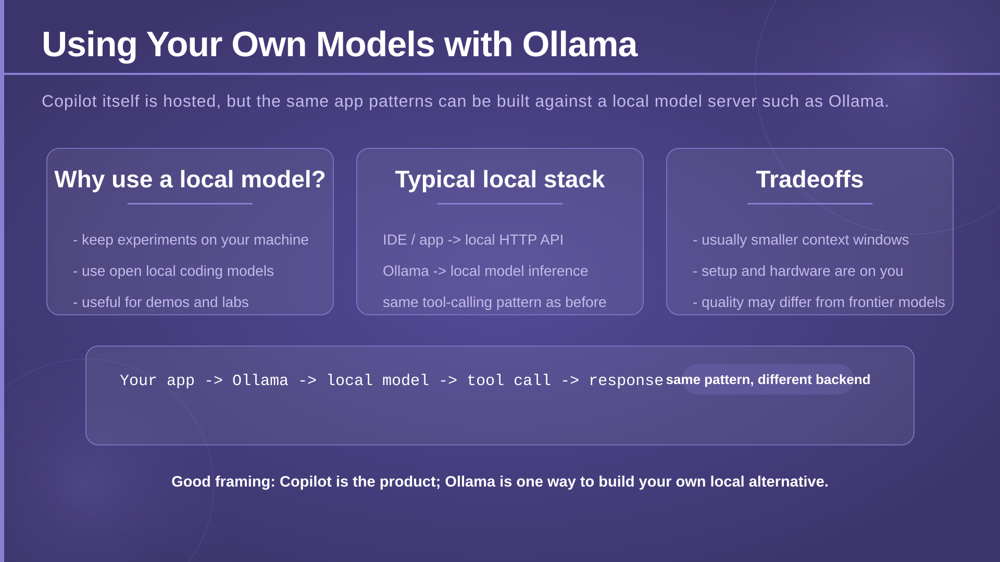

> **TL;DR:** Ollama lets you use local models with a familiar tool-calling pattern, trading some convenience for more control.

This slide connects responsible AI to practical architecture. Your application can still send prompts, receive responses, and invoke tools, but the model backend is local instead of hosted in the cloud.

That gives benefits such as offline use and tighter data control, while also introducing trade-offs like local setup, hardware constraints, and possibly smaller context windows or lower quality depending on the model.

## Slide 43 — Exercise 305 — Tool Calls with Ollama

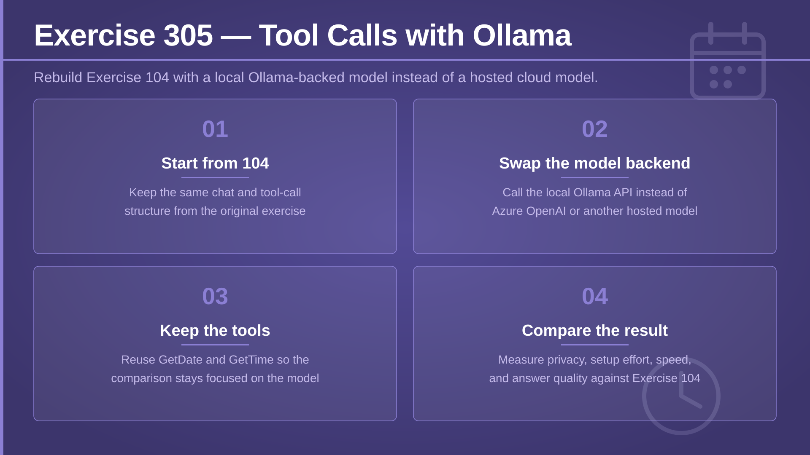

> **TL;DR:** Exercise 305 helps you compare a local-model workflow with a hosted-model workflow using the same tool-call design.

Participants reuse the structure from Exercise 104, keep the same tools, and only swap the backend to Ollama. This makes the comparison fair because the surrounding application design stays familiar.

The exercise is valuable because it turns abstract trade-offs into observable ones. You can compare privacy, setup effort, latency, and answer quality directly instead of debating them theoretically.

→ [Exercise 305 — Tool Calls with Ollama](../../../exercises/chapter-3/exercise-305/README.md)

<!-- Principle 5 — Transparency -->

## Slide 44 — Responsible AI — Transparency

> **TL;DR:** Transparency means understanding what model is being used, how the system behaves, and what is documented about it.

Responsible use becomes easier when the system is observable. Model cards, visible model selection, documentation about data collection, and disclosure of public-code matching all help developers make informed decisions instead of trusting a black box.

Transparency does not remove risk, but it gives you the information needed to manage that risk more intelligently.

## Slide 45 — What Telemetry Is Tracked?

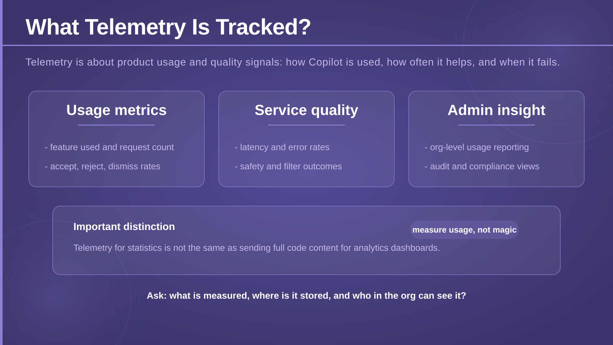

> **TL;DR:** Copilot telemetry focuses on usage, quality, and admin reporting rather than mirroring your full code into dashboards.

This slide helps separate operational telemetry from content exposure. Metrics such as request counts, acceptance rates, latency, and filter outcomes help teams understand product usage and service quality without implying that every code snippet is being surfaced for analytics review.

That distinction matters for trust. Developers and admins need a clearer picture of what is tracked so they can reason about observability without assuming the worst.

## Slide 46 — GitHub Copilot Architecture

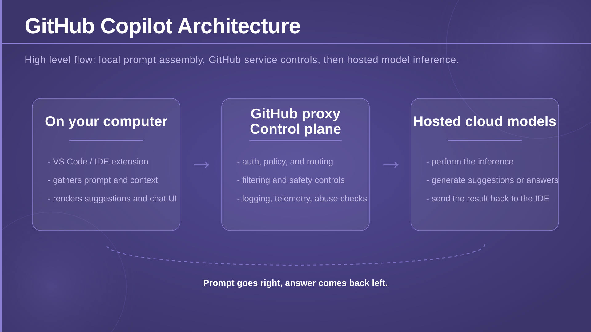

> **TL;DR:** Copilot works through a layered architecture that gathers context locally, applies policy in GitHub's control plane, and runs inference on hosted models.

The architecture slide makes the system concrete. Your IDE extension collects relevant prompt and code context, GitHub handles authentication and policy controls, and the model service produces the suggestion or answer that comes back to the editor.

Understanding this flow helps developers ask better questions about privacy, filtering, telemetry, and failure modes because they can see where each responsibility sits.

## Slide 47 — The "Public Code" Filter

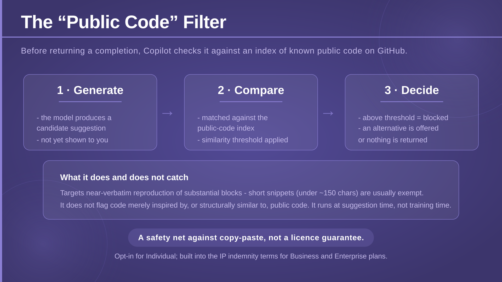

> **TL;DR:** The public-code filter tries to stop near-verbatim reproduction before a matching suggestion reaches you.

This is a runtime safety measure, not a training-time guarantee. The model can generate a candidate, GitHub can compare it against indexed public code, and suggestions above the similarity threshold can be blocked or replaced.

The nuance is important: short snippets are often exempt, and the goal is to reduce substantial duplication risk, not to promise that every small familiar fragment is unique.

## Slide 48 — Duplication Detection & the Setting

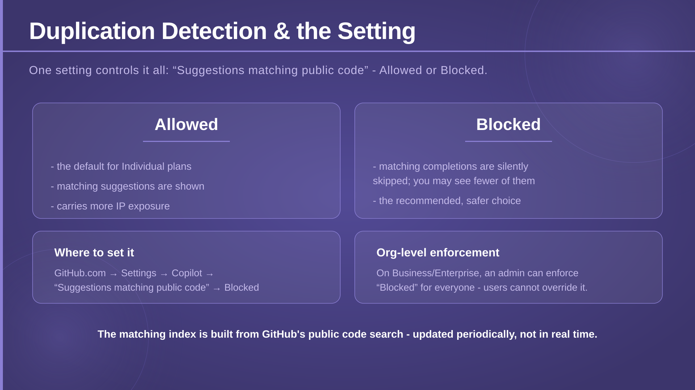

> **TL;DR:** Duplication detection settings let individuals or admins decide whether matching public-code suggestions should be shown or blocked.

For individuals, allowing matches gives maximum output freedom but increases IP risk. Blocking is the safer default for many teams because it prevents matching completions from appearing in the first place.

Business and Enterprise environments add another important control: administrators can enforce the safer setting centrally, which helps turn policy into consistent practice.

<!-- Principle 6 — Accountability -->

## Slide 49 — Responsible AI — Accountability

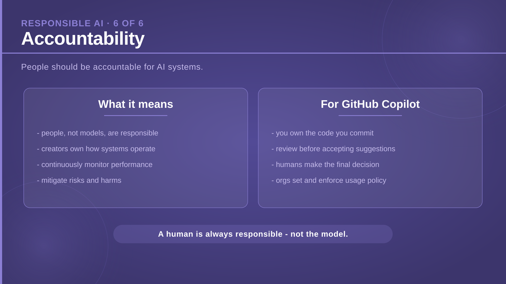

> **TL;DR:** Accountability means the human developer and organization remain responsible for the code and decisions AI influences.

This principle ties the whole chapter together. AI can assist, recommend, and accelerate, but it does not own the outcome, the business impact, or the production incident. People do.

That is why review, approval, and policy matter. The final decision to accept, modify, reject, or deploy always belongs to humans.

## Slide 50 — Think of It as a Fast Junior Developer

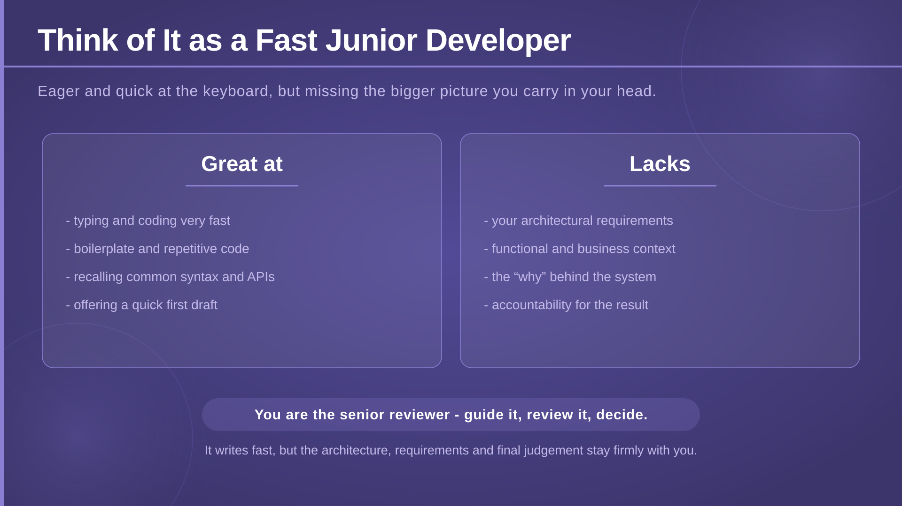

> **TL;DR:** A good mental model is to treat Copilot as a very fast junior developer who still needs guidance and review.

This analogy is practical because it balances optimism and caution. Copilot is strong at drafting, repeating common patterns, and moving quickly through syntax-heavy tasks, but it lacks your architectural intent, organizational context, and accountability.

Thinking this way helps you use the tool well. You delegate drafting work, but you keep design ownership and final review where they belong.

---

[🏠 Workshop Home](../../../README.md) | [📝 Chapter Overview](README.md) | [← Chapter 0](../chapter-0/README.md) | [Chapter 2 →](../chapter-2/README.md)
