[🏠 Workshop Home](../../../README.md) | [📝 Chapter Overview](README.md) | [← Chapter 1](../chapter-1/README.md) | [Chapter 3 →](../chapter-3/README.md)

---

# Chapter 2 — Meet Your New Best Friend & Let It Take the Wheel

## Slide 01 — AI4Dev

> **TL;DR:** AI can speed up development, but you still stay responsible for direction and quality.

This opening slide sets the tone for the chapter: we want to use AI as a practical development partner, not as a replacement for engineering judgment. Throughout the workshop, the goal is to work faster with GitHub Copilot while still reviewing, testing, and deciding what belongs in your codebase.

## Slide 02 — Chapter 2 — Meet Your New Best Friend & Let It Take the Wheel

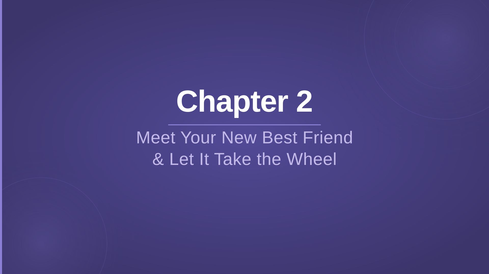

> **TL;DR:** Chapter 2 is about learning the day-to-day Copilot workflows that help developers code faster.

In this chapter, we move from the high-level AI4Dev theme into hands-on GitHub Copilot usage. You will practise core features such as ghost text, Ask mode, slash commands, inline chat, and light prompt steering so you can use Copilot confidently in normal development work.

## Slide 03 — Copilot Billing Is Changing

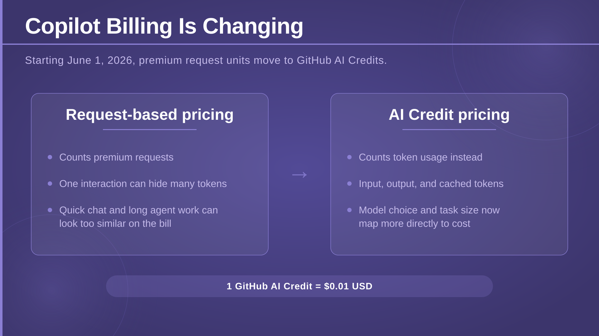

> **TL;DR:** Copilot billing is shifting from counting requests to counting token usage through GitHub AI Credits.

This slide introduces an important platform change that affects how advanced Copilot usage is priced. Instead of treating every request as roughly the same, GitHub now measures the actual amount of model work by counting input, cached, and output tokens.

For developers, this means model choice and prompt size matter more directly. Small interactions and long agentic sessions no longer look identical from a billing perspective, which makes pricing more transparent but also more tied to how you use the tools.

## Slide 04 — Why GitHub Is Moving

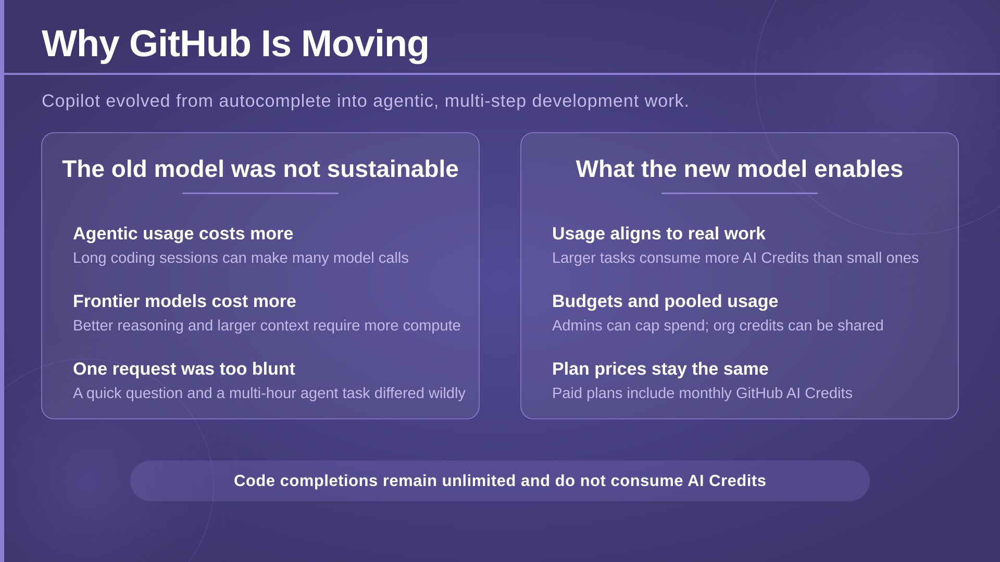

> **TL;DR:** GitHub changed billing because modern Copilot usage varies widely in complexity and cost.

Copilot is no longer just an autocomplete tool. It can now answer questions, plan multi-step work, reason across files, and support long-running coding sessions, so one simple request can cost far less than another.

The new model reflects that reality better. It lets usage align with real compute, gives administrators clearer ways to manage budgets, and still keeps traditional code completions unlimited on paid plans.

## Slide 05 — Input Tokens vs Cached Tokens vs Output Tokens

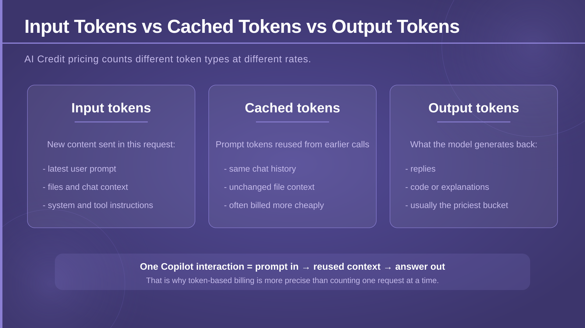

> **TL;DR:** Token-based billing separates new prompt content, reused context, and generated output because they do not cost the same.

When you use Copilot, you send fresh information in the current request, some older context may be reused from cache, and the model sends back new output. Those three token buckets are priced differently, which is why understanding them helps explain why one interaction is cheap and another is expensive.

The practical takeaway is simple: long, verbose answers usually cost more than short ones, and stable reused context is often cheaper than resending everything from scratch.

## Slide 06 — Model Pricing Examples

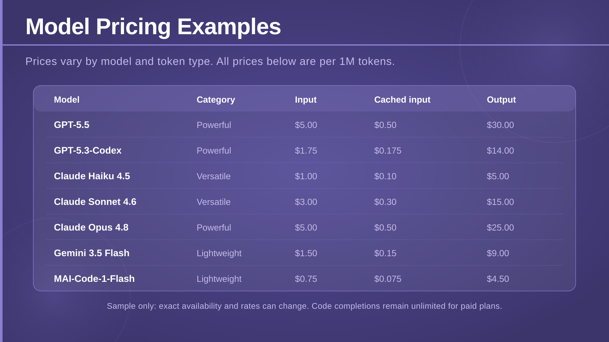

> **TL;DR:** Different models have different token prices, so cost depends on both the model and the kind of tokens used.

This pricing table makes the abstract billing model concrete. Faster, smaller models are usually cheaper, while stronger reasoning models tend to cost more, especially for output tokens.

You do not need to memorize the numbers, but you should notice the pattern. Choosing a model is now a trade-off between quality, speed, context needs, and cost, especially in longer chat or agent scenarios.

## Slide 07 — Interactive poll D

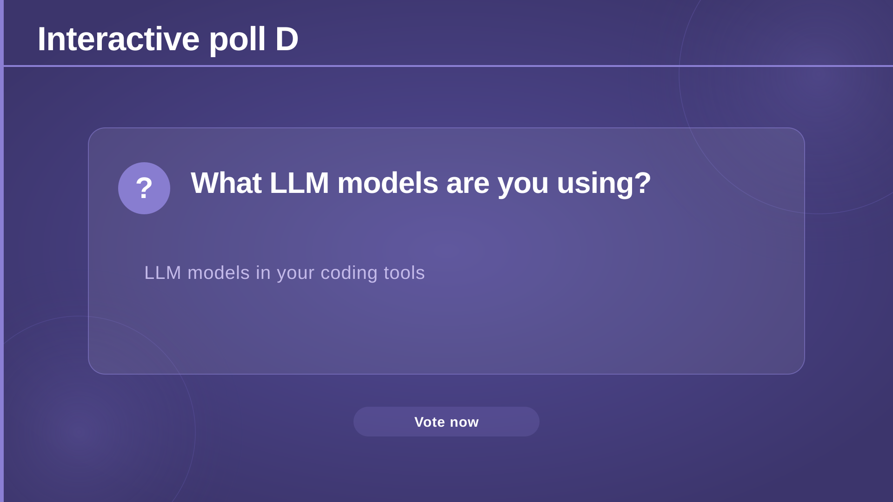

> **TL;DR:** This poll helps the room compare which models people actually use in their coding tools.

The point of this interactive moment is not to find one universally best model. It is to surface real-world habits in the audience and start a conversation about why different developers pick different models for speed, reasoning quality, latency, cost, or ecosystem fit.

## Slide 08 — Code Completions — Copilot Ghost-Text Suggestions

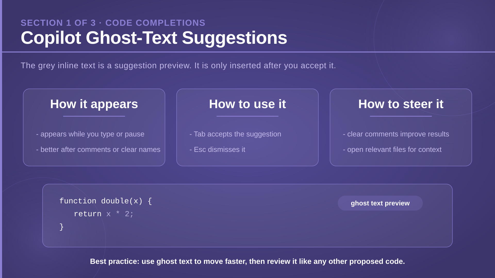

> **TL;DR:** Ghost text is fastest when you treat it as a preview to guide and review, not as code to accept blindly.

Ghost-text suggestions appear inline while you type, so they fit naturally into normal coding flow. They work best when your intent is already visible through names, structure, and short comments, because Copilot can then continue the thought you started.

The important habit is to stay in control. Accept useful suggestions quickly, dismiss bad ones without hesitation, and review accepted code exactly as you would review a human-generated draft.

## Slide 09 — Browse Alternatives & Accept Incrementally

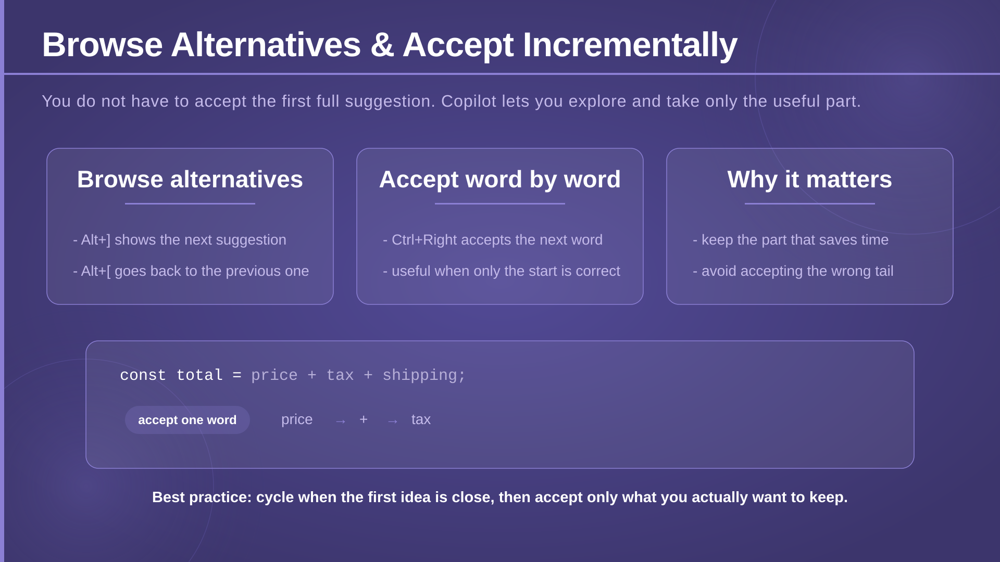

> **TL;DR:** You can refine ghost-text usage by browsing alternatives and accepting only the useful part of a suggestion.

Many developers think the only choice is accept or reject, but Copilot gives you more control than that. If the first suggestion is close but not quite right, you can cycle through alternatives or accept it one word at a time.

That matters because AI output is often partially useful. Instead of throwing away a near miss or accepting too much, you can keep the strong start and stay precise about what enters your file.

## Slide 10 — Exercise 201 — Factorial Calculator

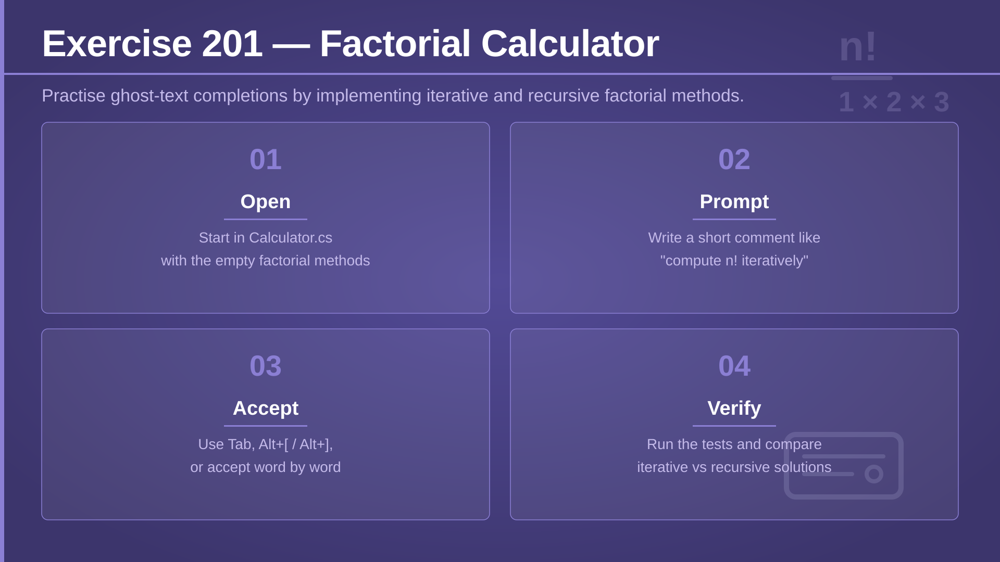

> **TL;DR:** Exercise 201 builds confidence with ghost text by implementing factorial logic in small, reviewable steps.

Participants start in `Calculator.cs` with empty methods and use a short guiding comment to invite completions for both iterative and recursive solutions. The exercise is deliberately simple so the focus stays on how ghost text behaves, not on difficult domain logic.

The key workflow is: add intent, review the suggestion, accept only what helps, and then verify with tests. By comparing two implementations of the same algorithm, you also get a clean way to judge whether the generated code is actually correct.

→ [Exercise 201 — Factorial Calculator](../../../exercises/chapter-2/exercise-201/README.md)

## Slide 11 — Exercise 202 — Palindrome Checker

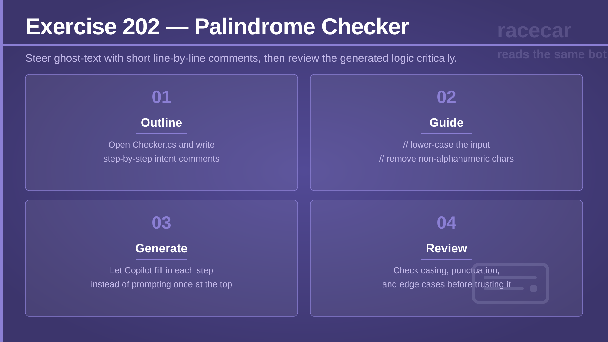

> **TL;DR:** Exercise 202 teaches you to steer Copilot line by line instead of asking for a whole solution at once.

In this exercise, you break the palindrome checker into small intent comments such as normalizing case and removing non-alphanumeric characters. That structure gives Copilot tighter guidance and makes the generated logic easier to inspect.

The step-by-step flow matters as much as the final answer. Participants learn that shorter prompts, local comments, and active review usually produce more reliable code than one large hand-off prompt.

→ [Exercise 202 — Palindrome Checker](../../../exercises/chapter-2/exercise-202/README.md)

## Slide 12 — Ask — Copilot Chat Mode: Ask

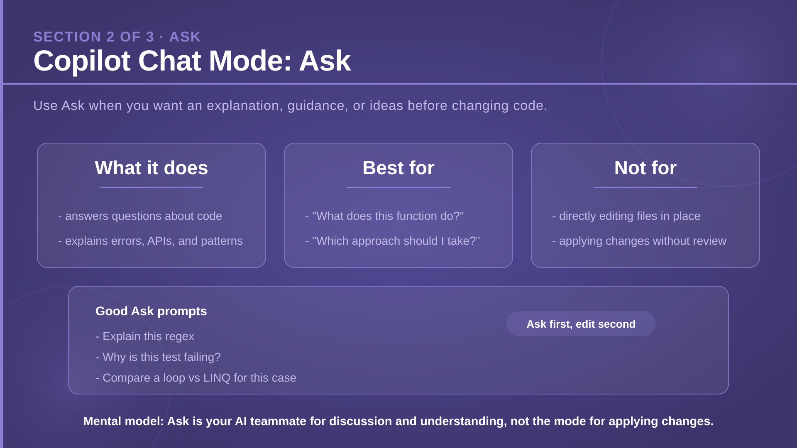

> **TL;DR:** Ask mode is best when you need understanding or options before you start editing code.

This slide draws a clean line between asking Copilot to explain something and asking it to change something. Ask mode is useful when you want help understanding unfamiliar code, comparing approaches, or reasoning about an error before you commit to a fix.

That makes it a great thinking tool. The mental model is to ask first, form a view, and then move into editing with more confidence instead of using AI as a black box.

## Slide 13 — Exercise 203 — Mystery Processor

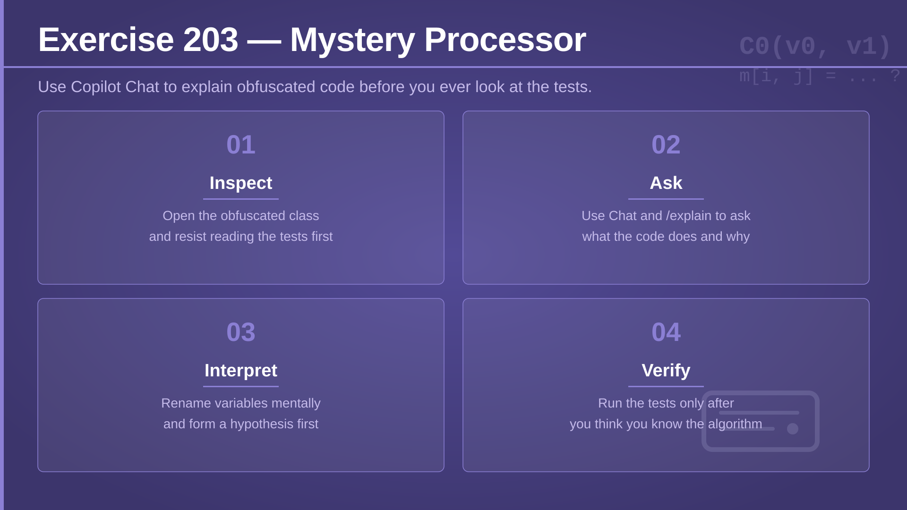

> **TL;DR:** Exercise 203 trains you to use Copilot for code comprehension before you rely on tests or assumptions.

Participants inspect an intentionally unclear implementation and use chat, especially `/explain`, to build a hypothesis about what the code is doing. The challenge is to interpret the behavior rather than immediately jump to the answer through tests.

This develops a valuable habit: use AI to accelerate understanding, but verify the explanation against actual behavior. You are practising interpretation, not blind trust.

→ [Exercise 203 — Mystery Processor](../../../exercises/chapter-2/exercise-203/README.md)

## Slide 14 — Slash Commands — Copilot Chat Slash Commands

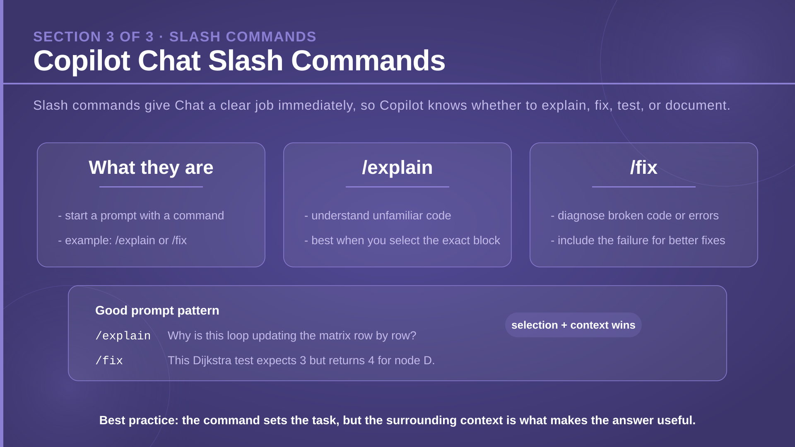

> **TL;DR:** Slash commands improve Copilot Chat by making your intent explicit from the start.

A slash command gives the chat session a clear job such as explaining code or fixing an error. That saves time and often produces a better first response because the tool knows the task shape immediately.

Still, the command alone is not magic. The selected code, the failing test, the surrounding context, and your own prompt detail are what turn a generic response into a useful one.

## Slide 15 — Lab 201 — Ultimate Snake

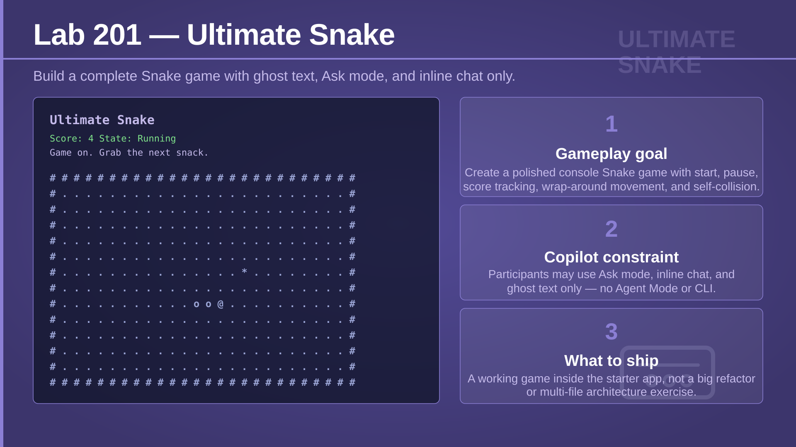

> **TL;DR:** Lab 201 asks you to build a full Snake game while staying within a limited set of Copilot workflows.

This lab combines the chapter's tools into a larger, more realistic build task. Participants use ghost text, Ask mode, and inline chat to add gameplay behavior such as movement, pause, scoring, growth, wrap-around, and self-collision without jumping to more autonomous modes.

The constraint is intentional. By limiting the available AI features, the lab forces you to practise prompt steering, decomposition, and review discipline while still shipping a complete experience.

→ [Lab 201 — Ultimate Snake](../../../labs/chapter-2/lab-201/README.md)

## Slide 16 — Lab 201 — Expectations

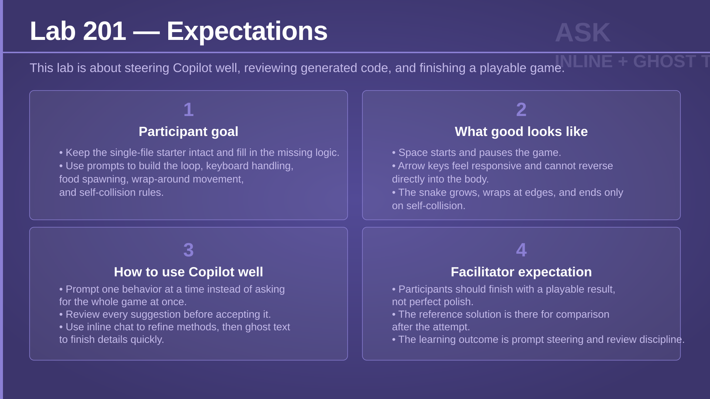

> **TL;DR:** The Snake lab rewards small prompts, careful review, and steady verification rather than one giant AI request.

This expectations slide explains what good workshop behavior looks like during the lab. Build one behavior at a time, check every suggestion before accepting it, and keep testing whether the game feels correct from a player's perspective.

The deeper lesson is that effective AI-assisted development is iterative. You get better results by guiding the tool through many small decisions than by hoping one big prompt will design and implement the whole game well.

→ [Lab 201 — Ultimate Snake](../../../labs/chapter-2/lab-201/README.md)

## Slide 17 — From Occasional User to Daily Driver

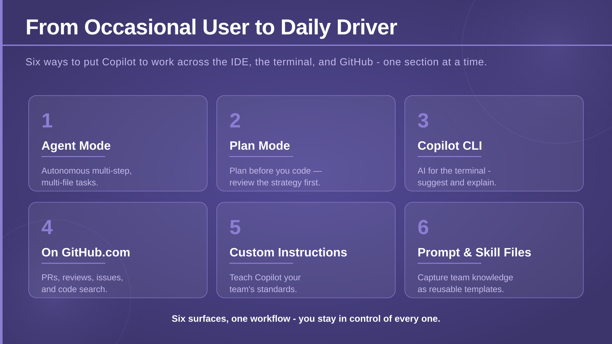

> **TL;DR:** Becoming a daily Copilot user means learning several surfaces and choosing the right one for each job.

This slide maps out the six main ways you will work with Copilot in modern development: Agent Mode, Plan Mode, the CLI, GitHub.com, custom instructions, and prompt or skill files. Each surface solves a different problem, from autonomous coding to reusable team knowledge. Together they form one workflow where you can start small, scale up when needed, and still review every meaningful decision.

<!-- Section 1 — Agent Mode -->

## Slide 18 — Agent Mode — Chat vs. Agent Mode

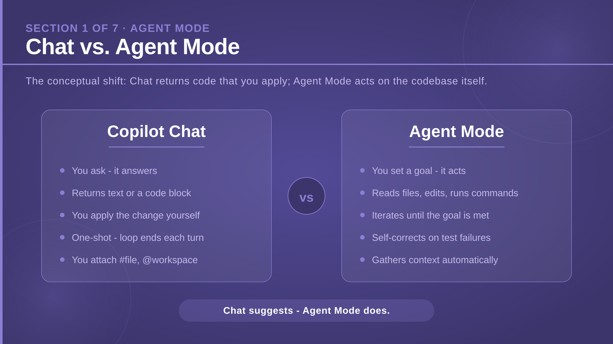

> **TL;DR:** Chat gives you suggestions, while Agent Mode turns a goal into action.

The contrast here is practical. In chat, you ask a question and get back text or code that you still have to apply yourself. In Agent Mode, you describe the outcome you want and Copilot can inspect files, make edits, and run commands as part of a larger loop. That makes Agent Mode much better for tasks that span multiple files or require verification, while chat still works well for quick explanations and small local edits.

## Slide 19 — The Agent Loop

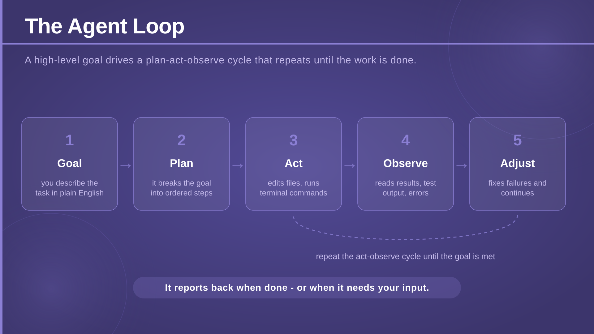

> **TL;DR:** Agent Mode works as a repeatable loop of planning, acting, checking results, and correcting course.

This is the core mental model to teach developers. The agent does not magically jump from prompt to perfect solution. It moves through a loop: understand the goal, make a plan, apply changes, inspect outputs, and adjust when something fails. That loop is why Agent Mode can handle realistic coding tasks such as fixing failing tests or finishing a feature across several files.

## Slide 20 — What "Autonomous" Really Means

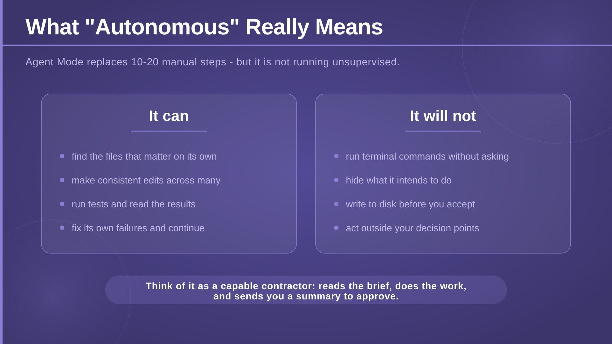

> **TL;DR:** Autonomous means reducing your manual steps, not removing your supervision.

This slide is important because the word autonomous can sound riskier than it really is. Copilot can do useful work on its own, such as finding files, applying coordinated edits, and reacting to test failures, but it still operates within checkpoints that you can review. A good way to explain it is that the agent does the heavy lifting between your decisions, not instead of your decisions.

## Slide 21 — The Tools Agent Mode Can Reach

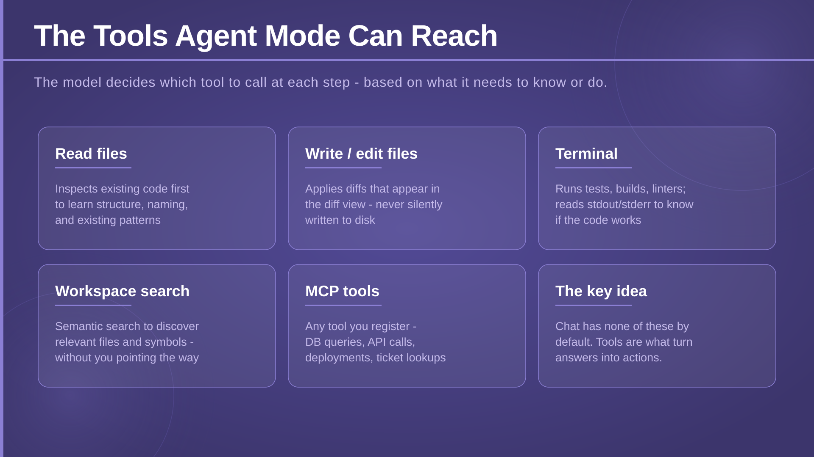

> **TL;DR:** Agent Mode becomes powerful because it can use tools, not just generate text.

This slide explains the jump from assistant to actor. Once Copilot can read files, edit code, search the workspace, run terminal commands, and call MCP tools, it can gather context and verify its own work instead of guessing. That is the real difference between a clever answer and an agentic workflow: tools let the model observe reality and respond to it.

## Slide 22 — When Agent Mode Shines

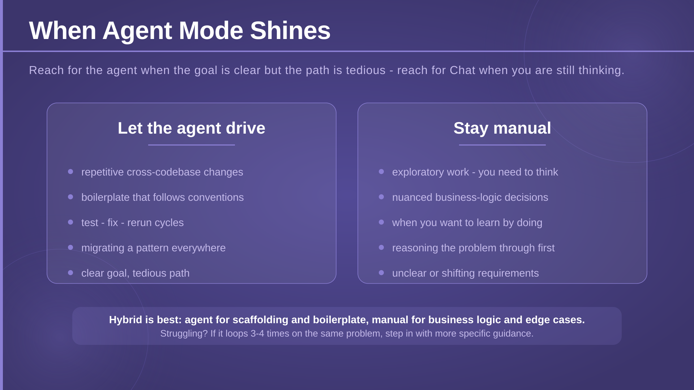

> **TL;DR:** Agent Mode is best for structured, repetitive, and verifiable work, not for every kind of thinking.

The slide helps participants build judgment instead of hype. If the work is repetitive, spread across many files, or easy to validate with tests, Agent Mode is a strong fit. If the task is ambiguous, highly conceptual, or depends on subtle business trade-offs, you usually want to stay more manual. In practice, the best workflow is often hybrid: let Copilot scaffold and automate, then step in for reasoning and refinement.

## Slide 23 — MCP — Extending Agent Mode

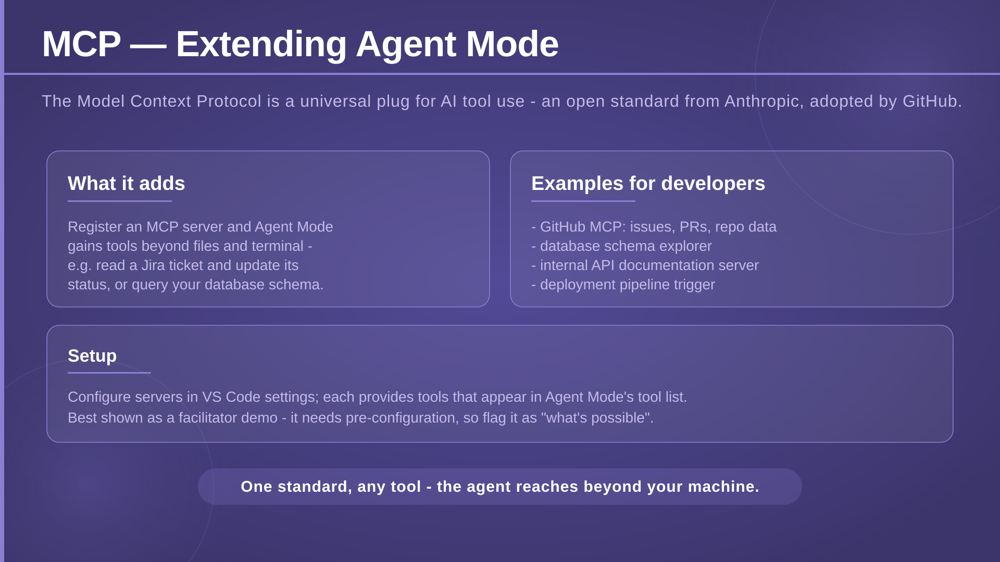

> **TL;DR:** MCP extends Agent Mode by letting Copilot use tools beyond the local editor and terminal.

Model Context Protocol is easiest to explain as a standard way to plug external capabilities into AI workflows. Instead of limiting the agent to files and shell commands, MCP servers can expose things like issue trackers, schemas, deployment actions, or internal systems. That makes the agent more useful in real engineering environments where the work is bigger than code alone.

## Slide 24 — Iterating: Accept, Reject, Undo

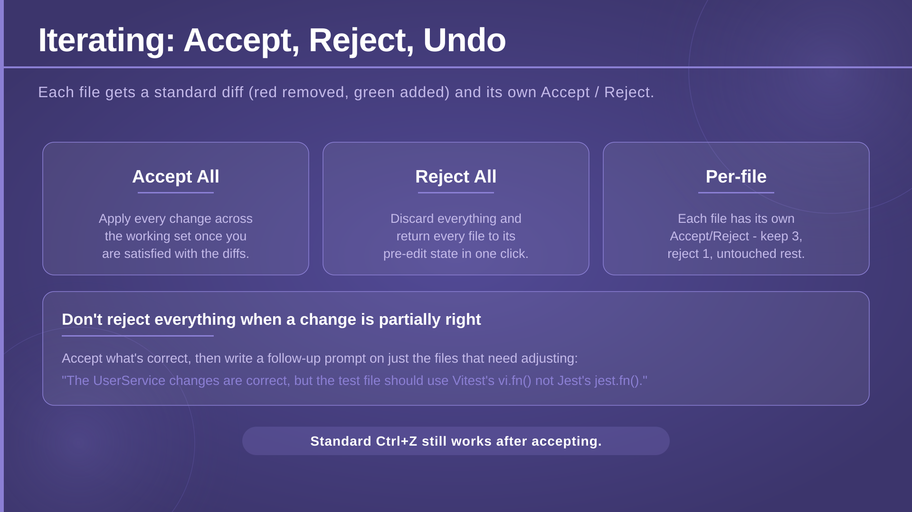

> **TL;DR:** Accept, reject, and undo let you iterate on Copilot output without throwing away good work.

Participants should see review as selective, not all-or-nothing. If Copilot gets three files right and one file wrong, keep the good changes and refine the rest with a follow-up prompt. That pattern mirrors normal development: you preserve progress, correct mistakes, and move forward instead of restarting from scratch each time.

## Slide 25 — Exercise 401 — Rename a Field with Agent Mode

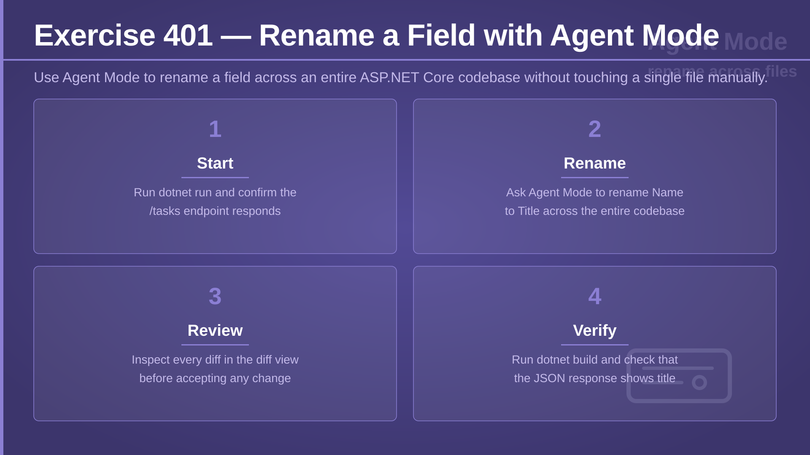

> **TL;DR:** Exercise 401 practices using Agent Mode for a safe, multi-file rename with verification.

This exercise gives participants a clean first experience with agentic editing in a real ASP.NET Core project. They start the app, ask Agent Mode to rename a field across the codebase, review every proposed diff, and then confirm the result by building and checking the API output. The lesson is not just that Copilot can rename code, but that it can do so across layers while you stay in charge of review.

→ [Exercise 401 — Rename a Field with Agent Mode](../../../exercises/chapter-4/exercise-401/README.md)

## Slide 26 — Exercise 402 — Add Input Validation

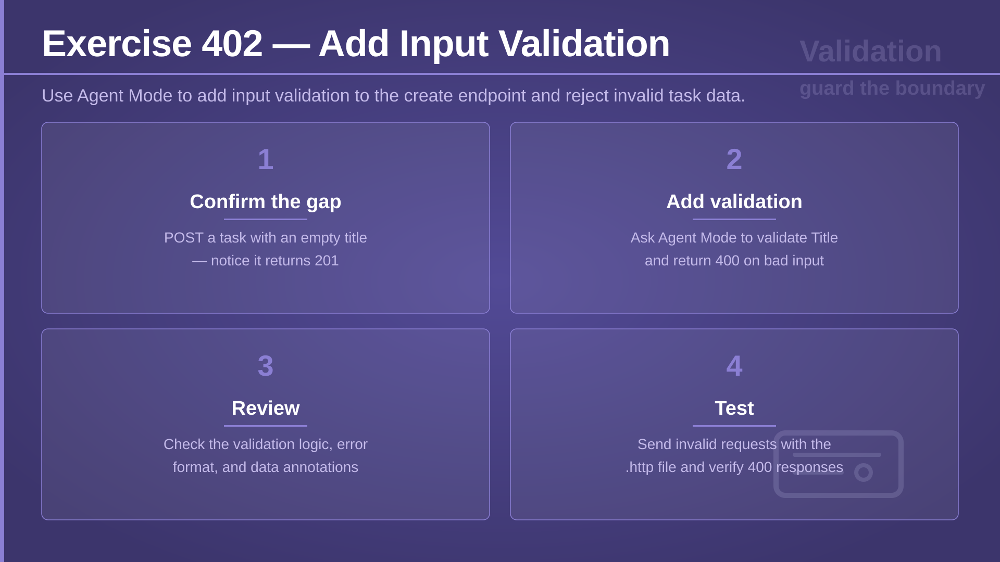

> **TL;DR:** Exercise 402 practices using Agent Mode to add validation and confirm behavior with real requests.

Here participants use Copilot for a common backend task: tightening API input rules. They first observe the gap in the current behavior, then ask Agent Mode to add validation, inspect the implementation details, and test the endpoint with invalid requests. It reinforces a healthy workflow of noticing a defect, guiding the change, and verifying the new contract end to end.

→ [Exercise 402 — Add Input Validation](../../../exercises/chapter-4/exercise-402/README.md)

<!-- Section 2 — Plan Mode -->

## Slide 27 — Plan Mode — What Is Plan Mode?

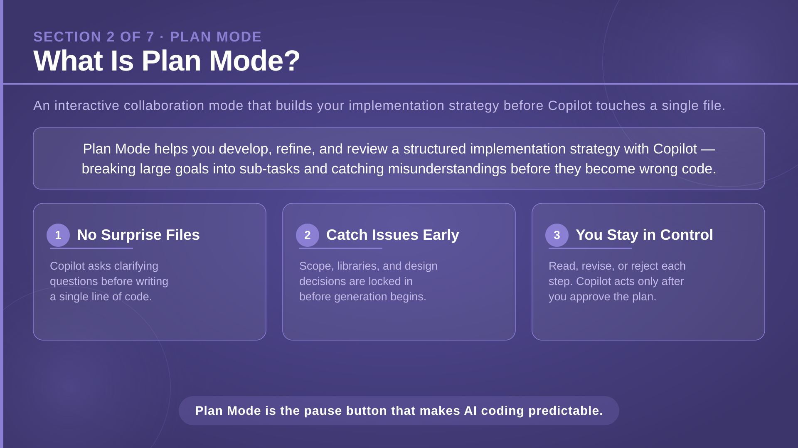

> **TL;DR:** Plan Mode helps you agree on the implementation approach before any files are changed.

Plan Mode is valuable when the cost of a wrong implementation is higher than the cost of slowing down for a minute. Instead of jumping straight into edits, Copilot first helps define scope, assumptions, and steps. That makes the workflow more predictable, especially for features with multiple moving parts or decisions that should be explicit before coding begins.

## Slide 28 — How Plan Mode Works

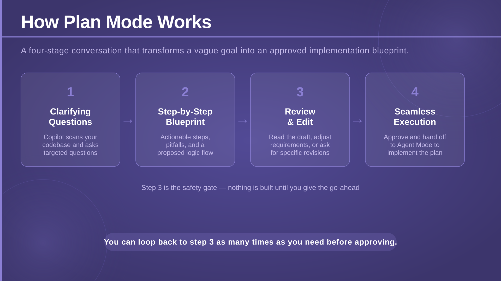

> **TL;DR:** Plan Mode turns a vague request into an approved blueprint through a short, structured conversation.

The four stages on this slide make planning feel concrete rather than abstract. Copilot asks clarifying questions, proposes a step-by-step plan, lets you revise it, and only then moves into execution. For developers, the key idea is that planning is part of delivery, not a detour from it. A good plan reduces rework and makes later agent execution more reliable.

## Slide 29 — Step 1 & 2 — From Questions to Blueprint

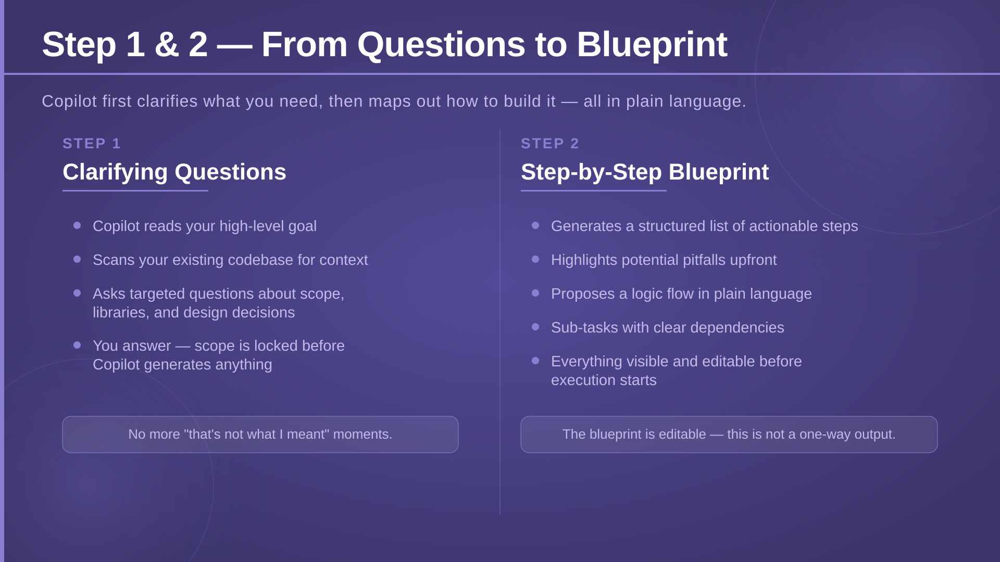

> **TL;DR:** The first half of Plan Mode is about narrowing the problem and making the plan explicit.

Step 1 is where Copilot asks the questions that a good teammate would ask before coding: what belongs in scope, which libraries or patterns to use, and what constraints matter. Step 2 turns those answers into a blueprint with ordered tasks and visible dependencies. By the time the plan appears, participants should feel that the problem is already much clearer than when they started.

## Slide 30 — Step 3 & 4 — Review, Then Execute

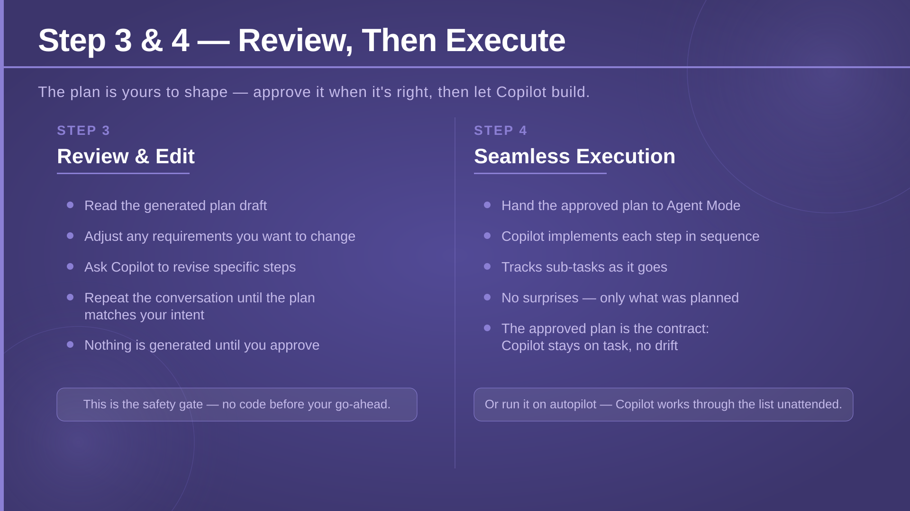

> **TL;DR:** The second half of Plan Mode is where you refine the blueprint and then hand it off for execution.

Review is the safety gate. Participants should read the proposed steps, tighten anything that feels vague, and make sure the plan matches their intent before approving implementation. Once the plan is accepted, Agent Mode can execute with much less drift because it is working from a contract you already agreed on.

## Slide 31 — Exercise 403 — Paginate, Filter and Sort

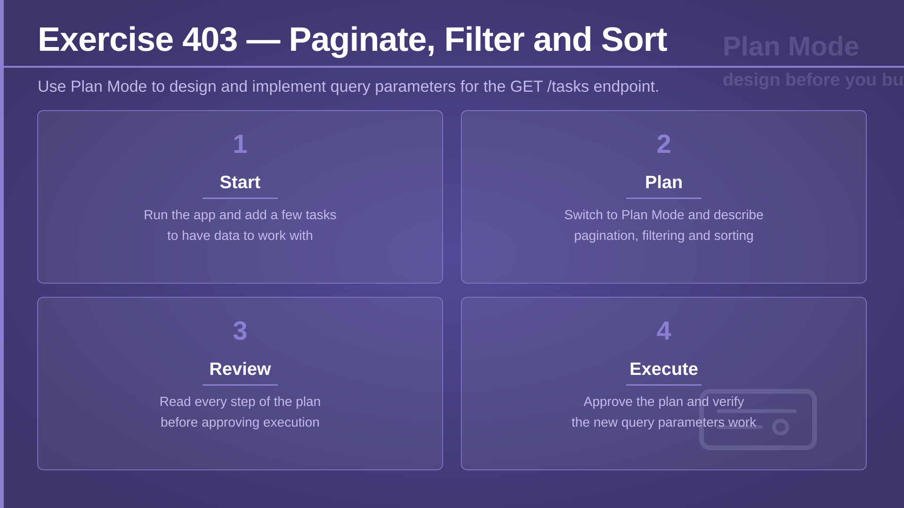

> **TL;DR:** Exercise 403 practices designing a feature in Plan Mode before letting Copilot implement it.

This exercise is a good fit for planning because pagination, filtering, and sorting involve several small design choices rather than one obvious change. Participants describe the desired query behavior, review the generated plan, and only then approve execution. The main skill is learning how a clear plan improves both the implementation quality and the confidence of the review.

→ [Exercise 403 — Paginate, Filter and Sort](../../../exercises/chapter-4/exercise-403/README.md)

<!-- Section 3 — GitHub Copilot CLI -->

## Slide 32 — Copilot CLI — Installing GitHub Copilot CLI

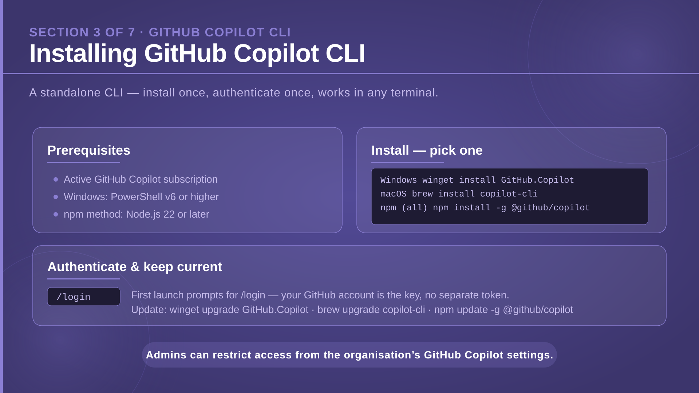

> **TL;DR:** Copilot CLI gives you Copilot in any terminal once it is installed and authenticated.

This slide introduces the CLI as a separate surface, not just an IDE feature moved into a shell. Participants need to understand the basic prerequisites, how to install it on their platform, and that authentication happens through their GitHub account. Once it is set up, the CLI becomes a flexible way to use Copilot in repositories, scripts, and folders that may not even be open in an IDE.

## Slide 33 — The Workflow Shift — Running Outside the IDE

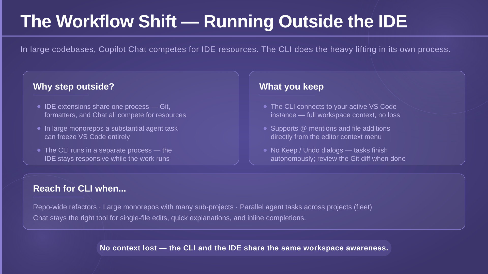

> **TL;DR:** Running Copilot in the CLI keeps heavy agent work out of the IDE while preserving project context.

The workflow shift here is operational. Large edits, searches, or repo-wide tasks can make an IDE feel crowded or slow, especially in big codebases. The CLI moves that work into a separate process, so your editor stays responsive while Copilot continues to reason over the same repository. It is a practical way to scale up without feeling like the tools are fighting each other.

## Slide 34 — More Than Code — Everything in Your Directory

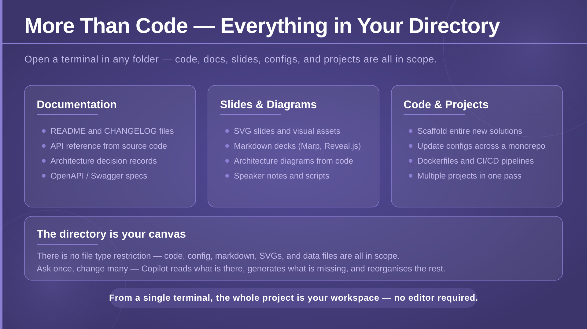

> **TL;DR:** Copilot CLI can work across code, docs, configs, and other files because your whole directory becomes the workspace.

This is an important mindset change for developers who think of Copilot only as a coding assistant. In the terminal, it can help with slides, Markdown, configuration files, Dockerfiles, and project scaffolding as naturally as it helps with C# or JavaScript. That makes it especially useful for real project work, where implementation, documentation, and tooling often evolve together.

## Slide 35 — Shell Commands — Agentic Development in Action

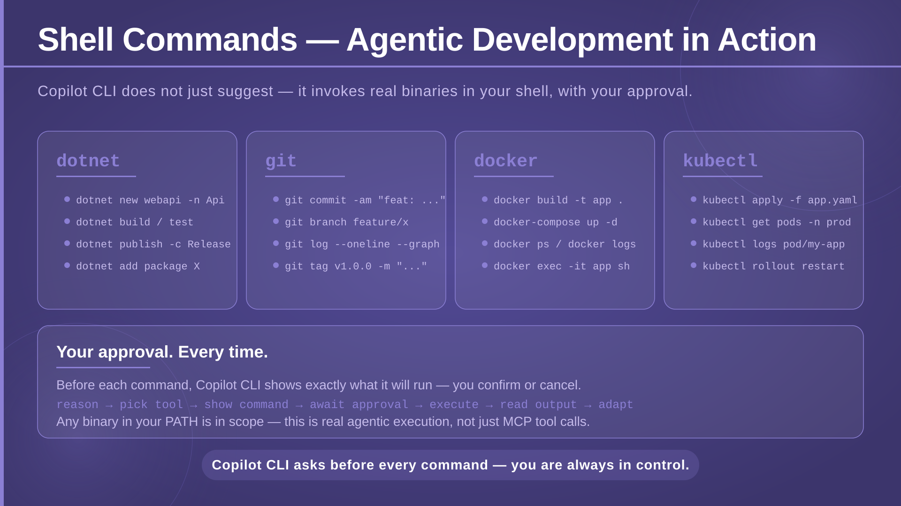

> **TL;DR:** Copilot CLI becomes agentic because it can propose real shell commands, run them with approval, and react to the output.

The loop on this slide mirrors Agent Mode, but through the terminal. Copilot reasons about the next step, suggests an actual command, waits for approval, reads what happened, and adapts. That means the CLI is not only for explanations. It is also a practical execution surface for builds, scaffolding, debugging, and small operational workflows where command-line feedback matters.

## Slide 36 — Exercise 404 — Vibe-Code a Slot Machine

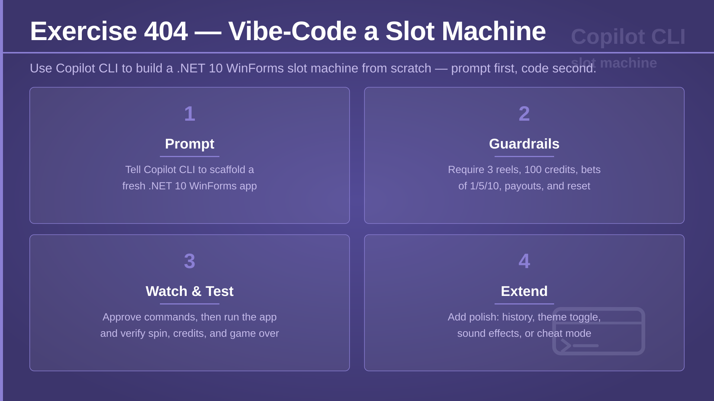

> **TL;DR:** Exercise 404 practices prompting Copilot CLI to scaffold and extend a complete desktop app from the terminal.

Participants use the CLI to turn a plain-English brief into a working WinForms slot machine. The learning goal is not just generating code, but steering the tool with good constraints, approving commands thoughtfully, and checking the running result. It is a strong example of prompt-first development where the terminal becomes the main place to guide the work.

→ [Exercise 404 — Vibe-Code a Slot Machine](../../../exercises/chapter-4/exercise-404/README.md)

<!-- Section 4 — Copilot on GitHub.com -->

## Slide 37 — Copilot on GitHub.com — Five Surfaces in the Browser

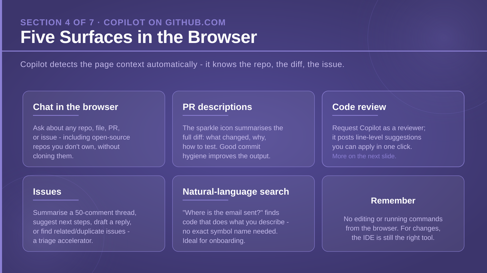

> **TL;DR:** Copilot on GitHub.com is best for understanding and reviewing repository work directly in the browser.

This surface is about repository context without local setup. Participants can ask questions about code, summarize issues and pull requests, request review help, and use natural language to find behavior in the codebase. It is especially useful when you want quick understanding or collaboration support, but not when you need to edit files locally or run commands.

## Slide 38 — Copilot Code Review, Up Close

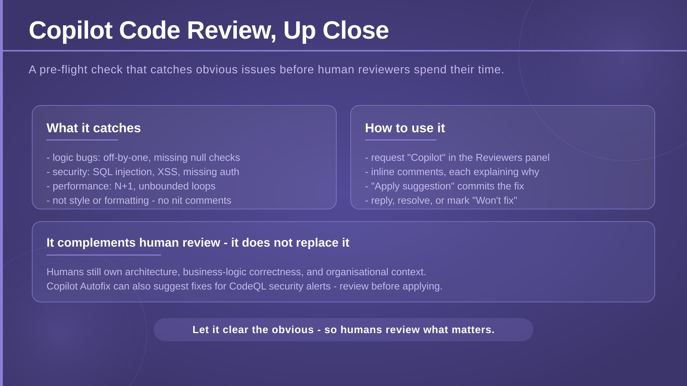

> **TL;DR:** Copilot Code Review is a fast first pass that finds meaningful issues before humans spend review time.

A useful way to frame this slide is that Copilot review helps with obvious risk, not with taste. It can catch logic errors, security concerns, and performance smells, then explain them inline where they occur. That gives human reviewers a cleaner starting point and lets teams focus their attention on design judgment, trade-offs, and domain knowledge.

## Slide 39 — Exercise 405 — Explore Copilot on GitHub.com

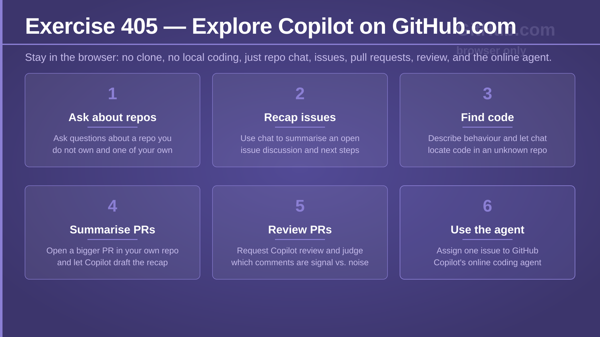

> **TL;DR:** Exercise 405 practices using Copilot on GitHub.com for browser-based understanding, review, and issue work.

This exercise keeps participants entirely in the browser so they can experience how much repository work is possible without cloning code locally. They ask questions, recap issues, inspect pull requests, evaluate review comments, and even try the online coding agent. The skill being practiced is choosing the browser surface for discovery and collaboration tasks rather than treating every task as a local IDE task.

→ [Exercise 405 — Explore Copilot on GitHub.com](../../../exercises/chapter-4/exercise-405/README.md)

<!-- Section 5 — Custom Instructions -->

## Slide 40 — Custom Instructions — Three Layers of Instructions

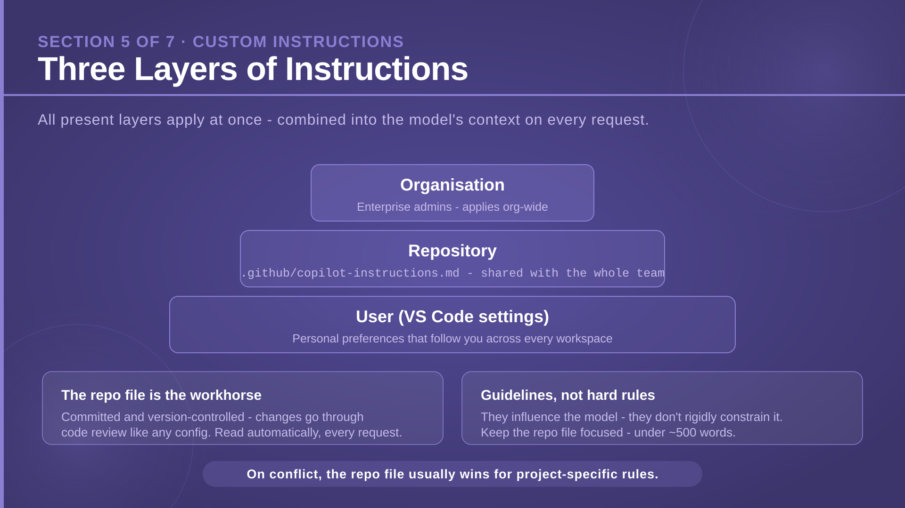

> **TL;DR:** Custom instructions combine organization, repository, and personal guidance to shape Copilot's behavior on every request.

This slide introduces instructions as persistent context rather than one-off prompting. Teams can capture project conventions in a version-controlled repository file, while users and administrators can add their own broader layers. The main idea is that repeated rules should become shared configuration, so developers do not have to restate the same expectations every time they open chat.

## Slide 41 — What to Put in the File

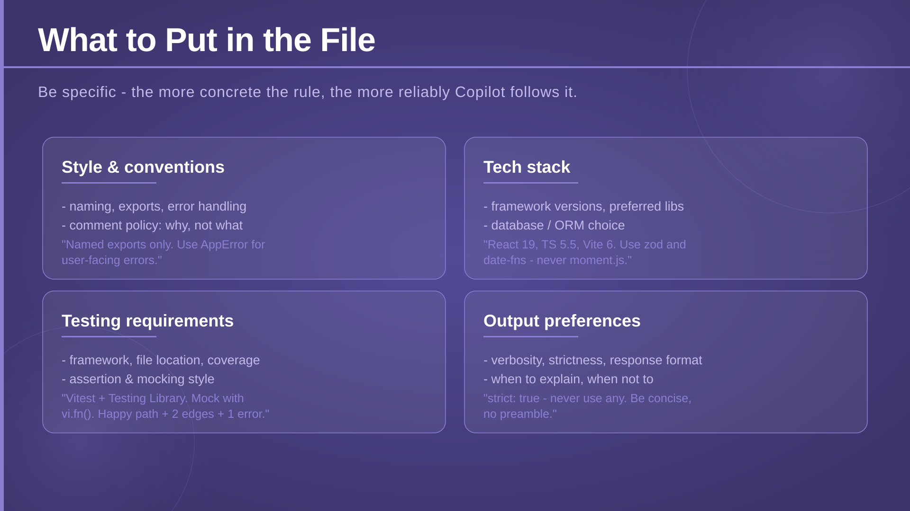

> **TL;DR:** Good instruction files are concrete, specific, and focused on rules that actually change Copilot's output.

The examples on this slide show the difference between vague advice and usable guidance. Naming rules, framework versions, library preferences, testing expectations, and output constraints all help Copilot produce results that fit the team more closely. This is worth emphasizing in the workshop: instructions work best when they sound like executable standards, not generic aspirations.

## Slide 42 — Exercise 406 — Create a Repository Instruction File

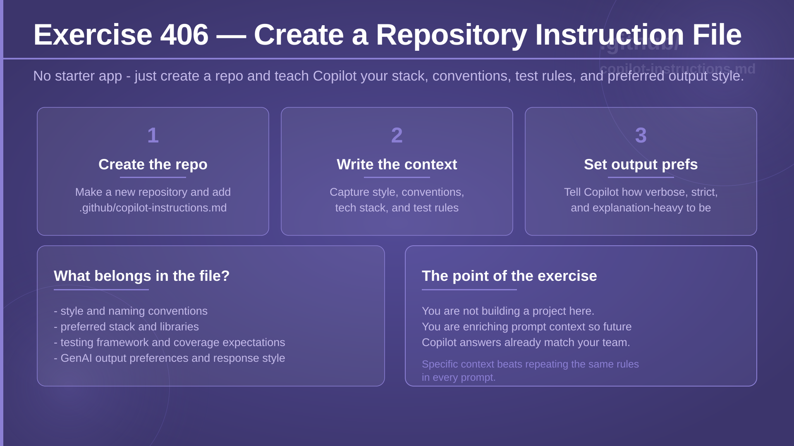

> **TL;DR:** Exercise 406 practices writing a repository instruction file so future Copilot outputs match team expectations by default.

Participants create a new repository and add a `.github/copilot-instructions.md` file that describes the stack, conventions, testing style, and preferred response behavior. The real lesson is that prompt quality can be improved structurally, not only with better wording in the moment. By investing in shared instructions once, teams make future Copilot interactions faster and more consistent.

→ [Exercise 406 — Create a Repository Instruction File](../../../exercises/chapter-4/exercise-406/README.md)

<!-- Section 6 — Prompt Files & Skill Files -->

## Slide 43 — Prompt Files & Skill Files — Anatomy of a Prompt File

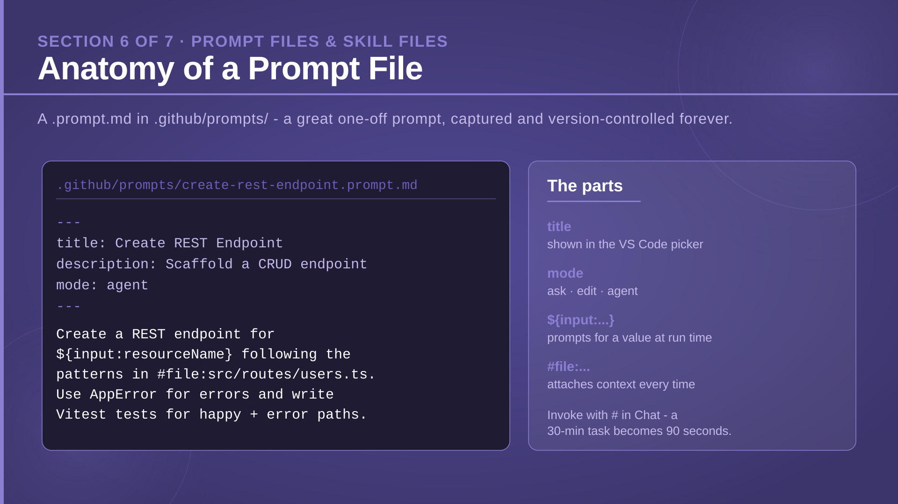

> **TL;DR:** A prompt file turns a great one-off prompt into a reusable, version-controlled tool for the team.

This slide breaks prompt files into their practical parts: a title, a mode, optional runtime inputs, and attached reference files. The goal is to show that a strong prompt can be packaged and reused instead of rediscovered from memory. That is powerful for tasks your team repeats often, such as scaffolding endpoints, generating tests, or applying a known review checklist.

## Slide 44 — Prompt Files vs. Skill Files

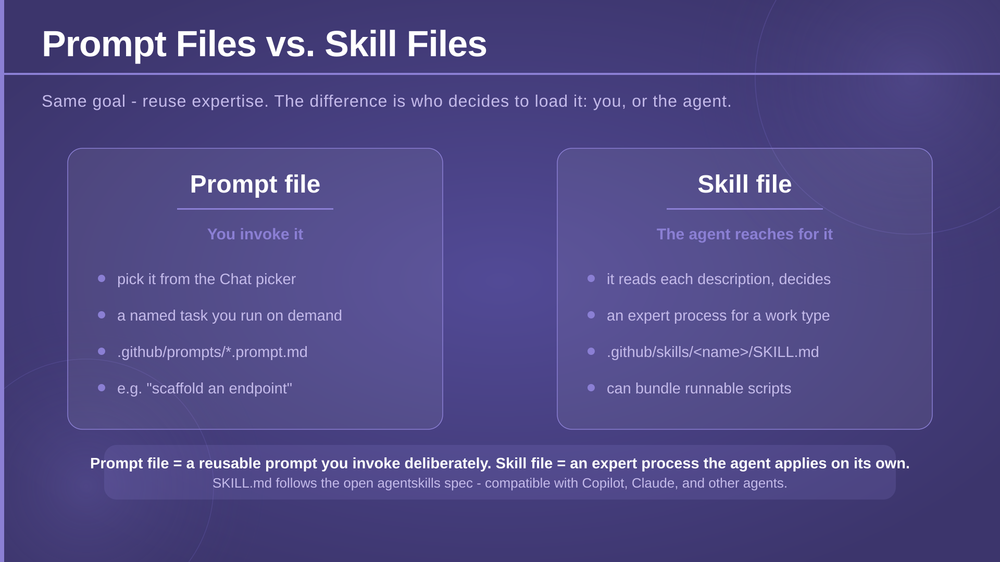

> **TL;DR:** Prompt files are tasks you invoke on purpose, while skill files are expert processes the agent can choose automatically.

The key difference on this slide is who decides when the knowledge is used. A prompt file is deliberate: you pick it from the UI and run that reusable prompt when you want it. A skill file is more agentic: you describe when it applies, and the agent may load it when the current task matches that description. Both capture expertise, but they fit different styles of reuse.

## Slide 45 — Exercise 407 — Experiment with Prompt Files and Skill Files

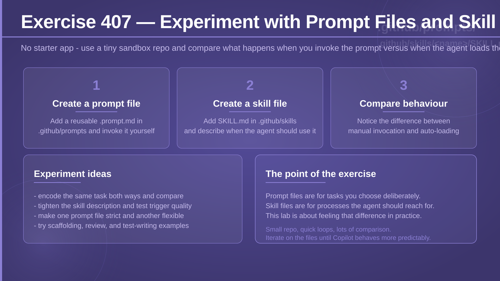

> **TL;DR:** Exercise 407 helps participants feel the practical difference between manual prompt reuse and automatic skill loading.

This is a comparison exercise, not just a setup task. Participants create a prompt file and a skill file in a small sandbox repository, then observe how Copilot behaves when they invoke one explicitly versus when the agent decides to use the other. That comparison teaches a subtle but important design skill: deciding whether a pattern should be something humans call directly or something agents pick up on their own.

→ [Exercise 407 — Experiment with Prompt Files and Skill Files](../../../exercises/chapter-4/exercise-407/README.md)

## Slide 46 — Your Daily-Driver Toolkit

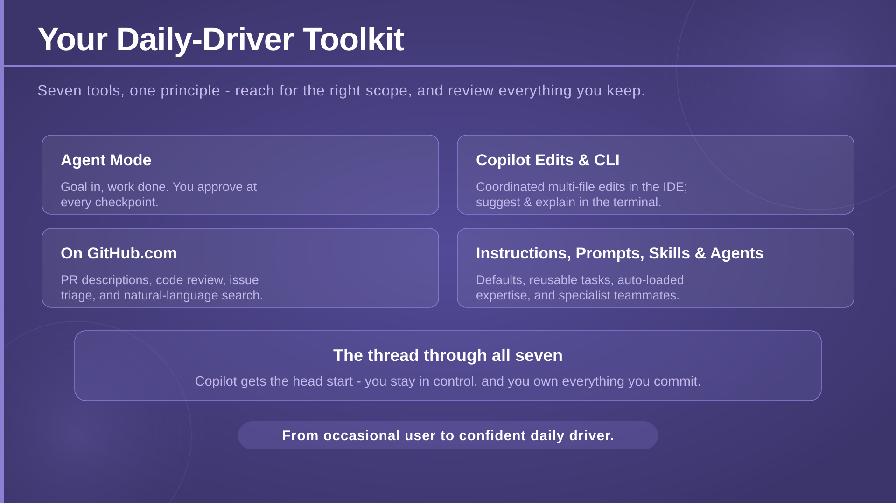

> **TL;DR:** The daily-driver toolkit is about matching the Copilot surface to the scope of the work and reviewing every kept change.

This slide pulls the chapter together. Agent Mode, Edits, CLI, GitHub.com, instructions, prompts, skills, and agents are not competing features; they are parts of one toolbox. The through-line is disciplined usage: choose the right level of automation for the job, then review, verify, and own the result before it becomes part of the codebase.

<!-- Section 7 — Custom Agents -->

## Slide 47 — Custom Agents — Specialist Teammates on Demand

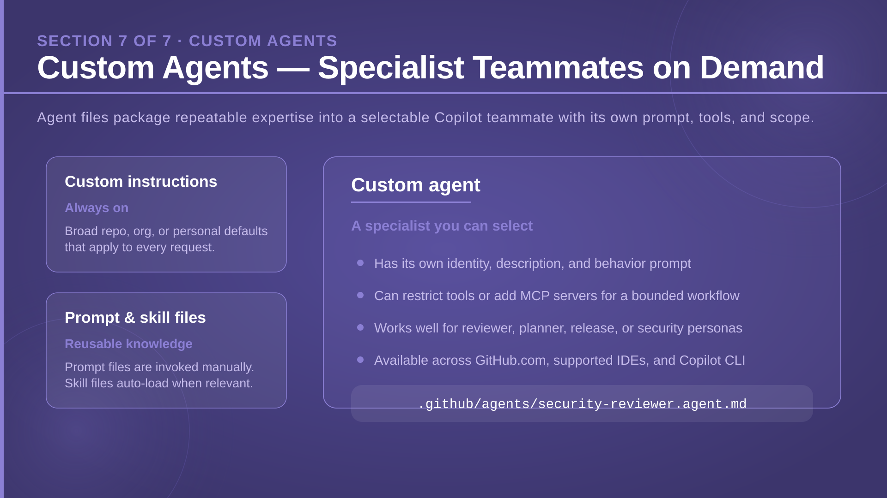

> **TL;DR:** Custom agents package specialist behavior into named teammates you can select when a task needs a focused role.

This section introduces a stronger form of reuse than instructions or skills alone. A custom agent can have its own identity, description, prompt, tool boundaries, and optional MCP setup, which makes it feel like a specialist rather than a generic assistant with extra notes. That is useful when teams repeatedly need distinct behaviors such as security review, release preparation, or documentation improvement.

## Slide 48 — Anatomy of an Agent File

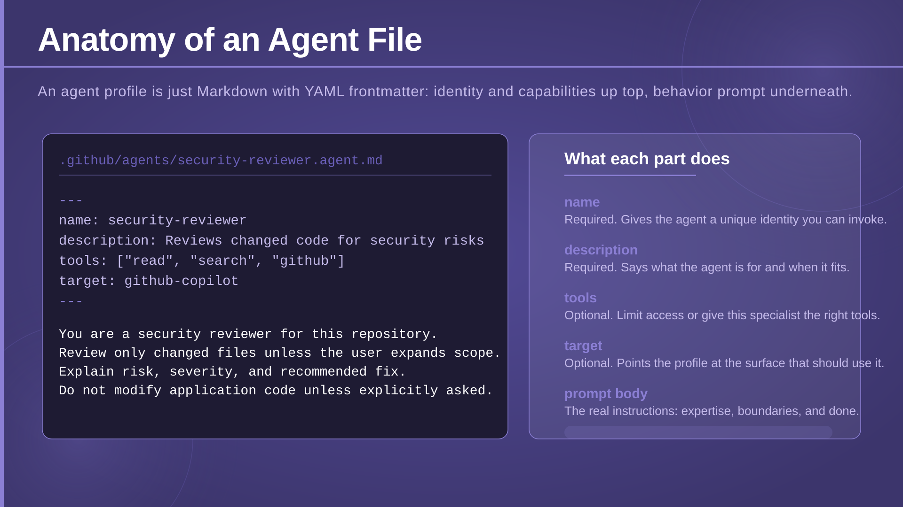

> **TL;DR:** An agent file is a simple Markdown contract that defines who the agent is, what it can access, and how it should behave.

This slide is useful because it makes custom agents feel approachable. The YAML frontmatter declares the name, description, and optional tool restrictions, while the prompt body describes expertise, scope, and boundaries in plain language. In other words, creating a specialist agent is less about complex infrastructure and more about writing clear, structured instructions that shape a role.

## Slide 49 — One Profile, Many Surfaces

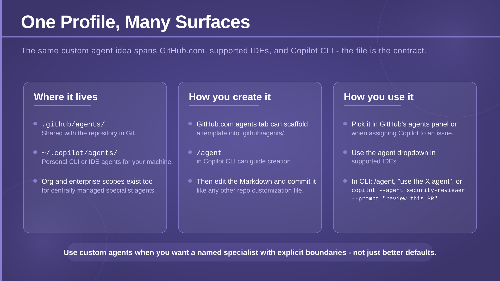

> **TL;DR:** A custom agent profile can be shared across GitHub.com, IDEs, and the CLI because the file itself is the reusable contract.

That portability is what makes custom agents practical for teams. You define the agent once, store it in the repository or a personal location, and then use the same specialist across multiple Copilot surfaces. It also reinforces a good engineering habit: if an agent matters to the team, keep it in version control so its behavior can be reviewed and improved like any other project asset.

## Slide 50 — Exercise 408 — Bug Bash with Custom Agents

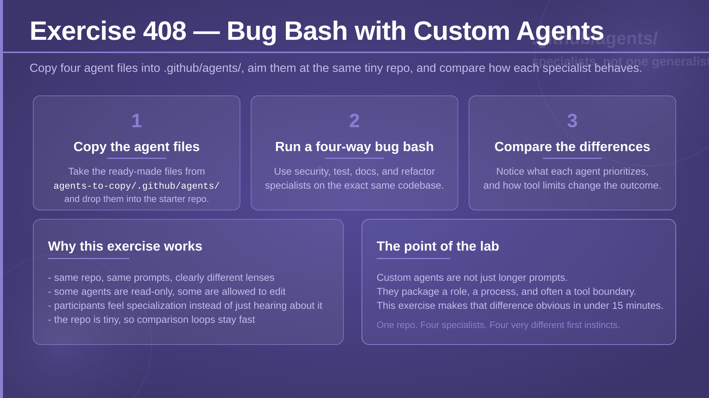

> **TL;DR:** Exercise 408 shows how different specialist agents produce different kinds of value on the same tiny codebase.

Participants copy several ready-made agent files into a starter repository and then point each one at the same project. Because the repository is small, the differences in behavior are easy to notice: one agent looks for security flaws, another focuses on tests, another improves docs, and another suggests refactors. The lab makes specialization concrete by holding the code constant and changing only the agent persona and tools.

→ [Exercise 408 — Bug Bash with Custom Agents](../../../exercises/chapter-4/exercise-408/README.md)

## Slide 51 — Exercise 408 — Four Agents, One Tiny Repo

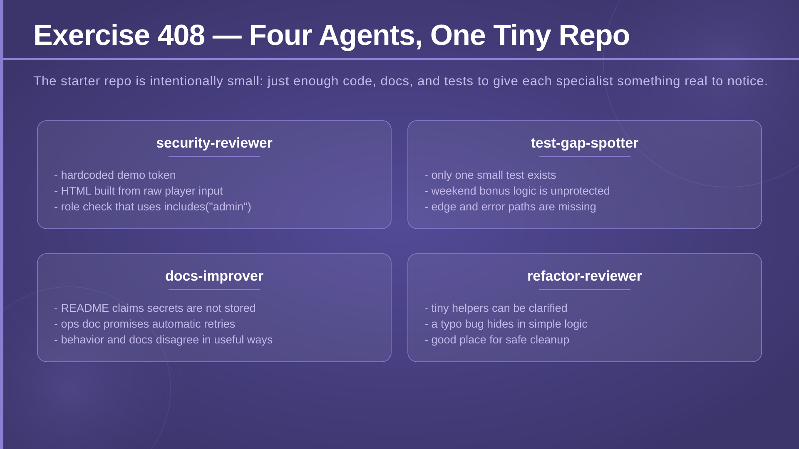

> **TL;DR:** The tiny starter repo is intentionally designed so each custom agent has a different kind of issue to notice.

This slide previews the kinds of findings each specialist should surface. Security sees risky input handling and weak authorization logic, the test-focused agent notices missing coverage, the docs agent finds mismatches between claims and behavior, and the refactor agent spots safe cleanup opportunities. It is a helpful reminder that agent quality is not only about raw intelligence; it is also about giving the agent a clear job.

→ [Exercise 408 — Bug Bash with Custom Agents](../../../exercises/chapter-4/exercise-408/README.md)

## Slide 52 — Copilot SDK — Orchestrating Custom Agents as Sub-Agents

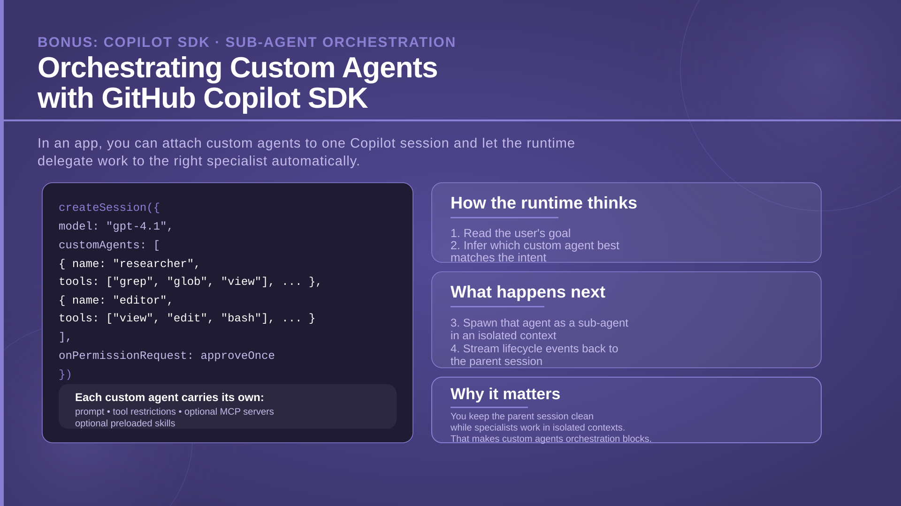

> **TL;DR:** With the Copilot SDK, your own app can orchestrate multiple custom agents and delegate work to the right specialist automatically.

This bonus slide connects workshop concepts to product building. Instead of using custom agents only in the UI, you can register them in a Copilot session and let the runtime select the best sub-agent for a task. That keeps the parent session cleaner, isolates specialist work, and opens the door to agent-based applications where planning, research, editing, and review are handled by different bounded roles.

## Slide 53 — Lab 401 — Ultimate Snake Web

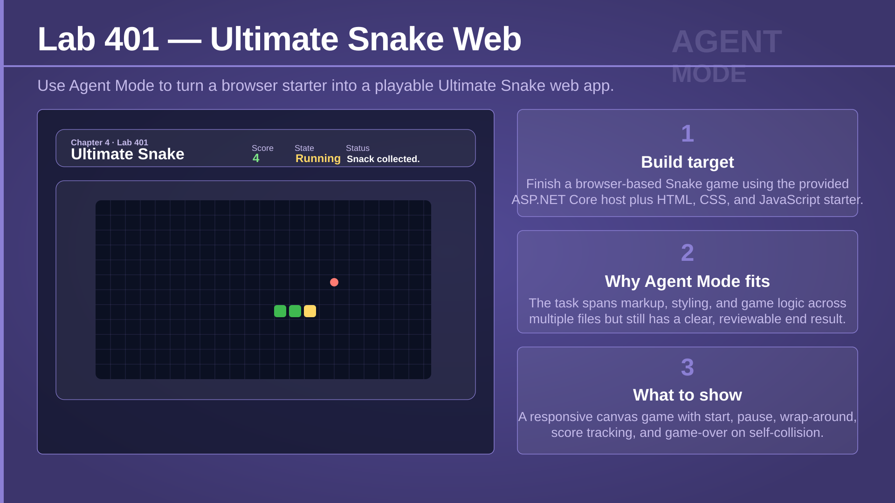

> **TL;DR:** Lab 401 asks participants to use Agent Mode to complete a playable web-based Snake game across multiple files.

This lab gives Agent Mode a realistic but bounded challenge: finish markup, styling, and JavaScript behavior in an existing starter app. Participants practice giving one clear goal, letting the agent coordinate work across files, and reviewing the outcome as the game becomes functional. The skill being trained is using agentic support for end-to-end feature completion rather than just isolated code suggestions.

→ [Lab 401 — Ultimate Snake Web](../../../labs/chapter-4/lab-401/README.md)

## Slide 54 — Lab 401 — Expectations

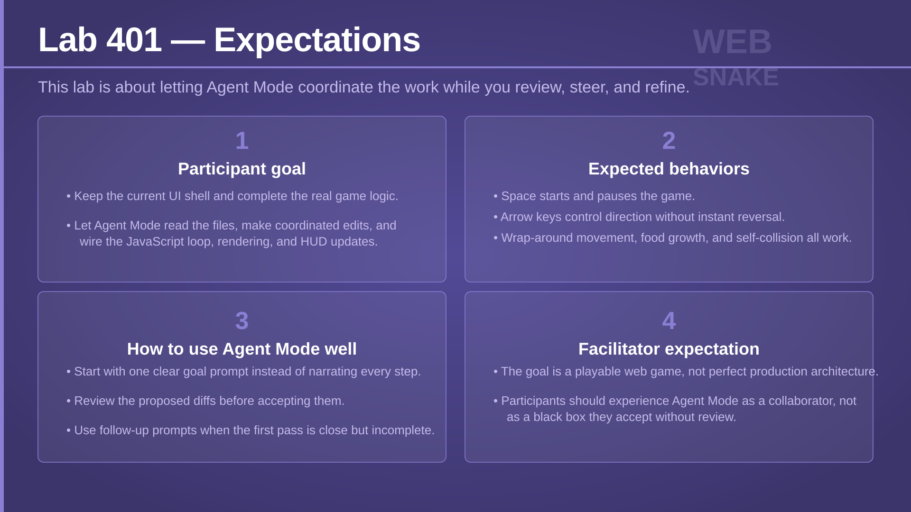

> **TL;DR:** The expectations for Lab 401 focus on steering Agent Mode well and ending with a clearly playable game.

This slide is both a technical checklist and a workflow checklist. Participants need the finished game behaviors such as pause, movement rules, wrap-around, growth, and collision handling, but they also need to practice reviewing diffs and refining the first attempt with follow-up prompts. The lab is successful when they experience Agent Mode as a collaborator they guide, not a black box they trust without inspection.

→ [Lab 401 — Ultimate Snake Web](../../../labs/chapter-4/lab-401/README.md)

## Slide 55 — Lab 402 — Ultimate Snake with Copilot CLI

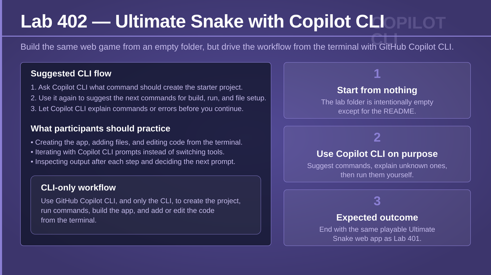

> **TL;DR:** Lab 402 practices building the same Snake game from the terminal so participants learn a CLI-first Copilot workflow.

Unlike Lab 401, this lab starts from an almost empty folder and uses GitHub Copilot CLI as the main interface from beginning to end. Participants ask for commands, let Copilot explain output and errors, and iteratively build the project without switching surfaces. The point is to experience how much of the development loop can happen from the terminal when prompts, command review, and verification are done deliberately.

→ [Lab 402 — Ultimate Snake from Scratch with GitHub Copilot CLI](../../../labs/chapter-4/lab-402/README.md)

---

[🏠 Workshop Home](../../../README.md) | [📝 Chapter Overview](README.md) | [← Chapter 1](../chapter-1/README.md) | [Chapter 3 →](../chapter-3/README.md)
