[🏠 Workshop Home](../../../README.md) | [📝 Chapter Overview](README.md) | [← Chapter 2](../chapter-2/README.md) | [Chapter 4 →](../chapter-4/README.md)

---

# Chapter 3 — Speak AI's Language: Mastering Prompts, Workflow & Best Practices

## Slide 01 — AI4Dev

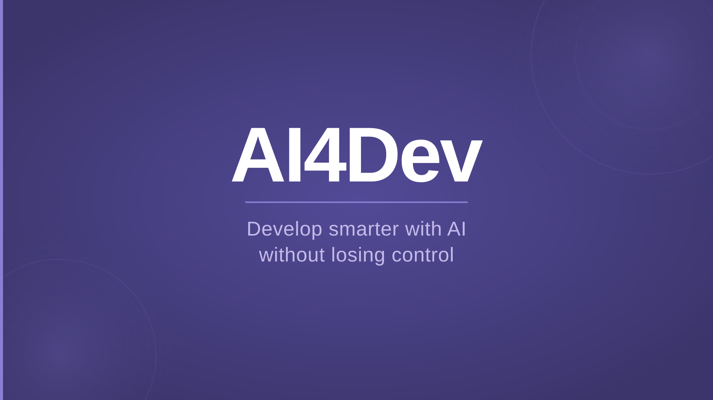

> **TL;DR:** AI can help you build faster without giving up engineering control.

## Slide 02 — Chapter 5 — Speak AI's Language: Mastering Prompts & Context

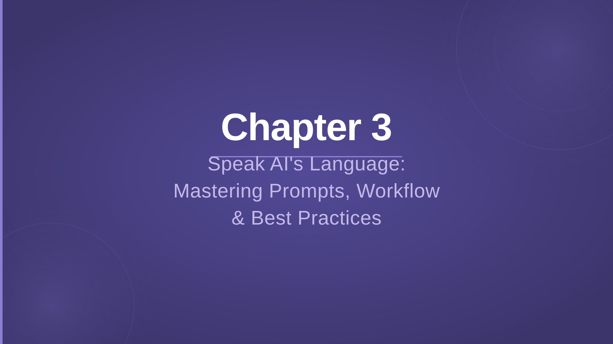

> **TL;DR:** This chapter shows how better prompts and better context lead to better Copilot results.

## Slide 03 — Better Prompts, Better Code

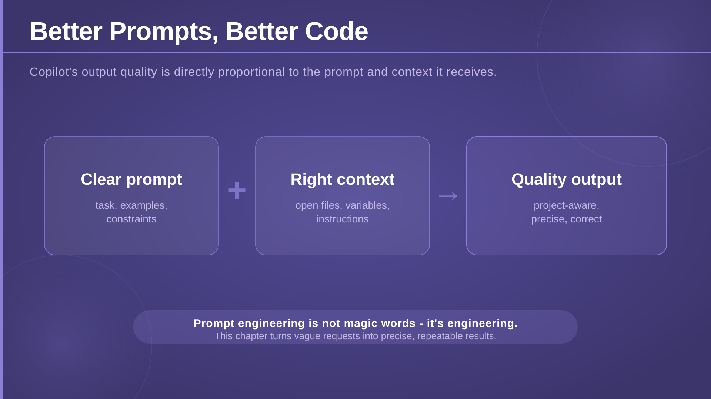

> **TL;DR:** Prompt quality strongly shapes code quality.

Copilot's model may be a black box, but the information you give it is not. This slide explains that output quality depends on how clearly you describe the task, the context, the examples, and the constraints.

The main message is that prompt engineering is really information design. When you make the request precise and useful, Copilot has a much better chance of producing code that matches your intent.

<!-- Section 1 — How Copilot Reads Your Code -->

## Slide 04 — How Copilot Reads Your Code — The Context Window

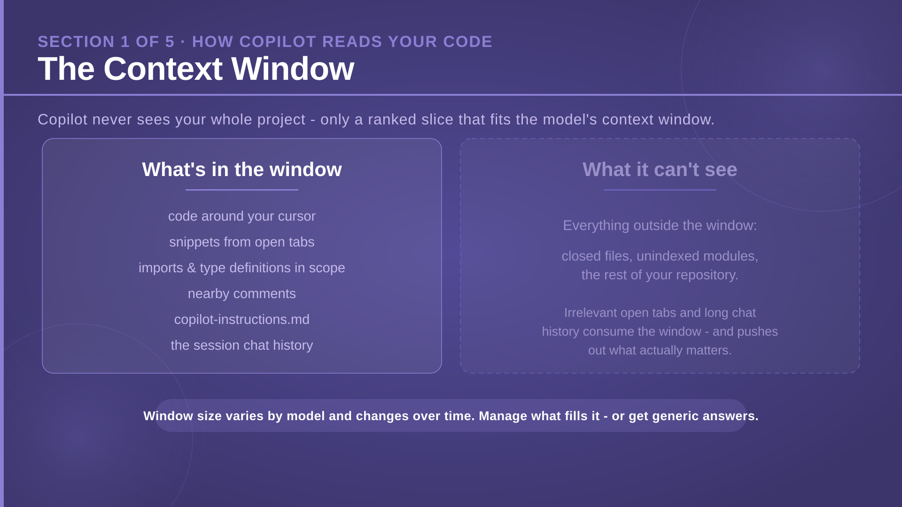

> **TL;DR:** Copilot can only reason over the context that is currently visible to it.

This slide introduces the context window as the material Copilot can see right now, such as the current file, cursor position, imports, open tabs, and attached instructions. It also makes clear that closed files, deleted code, and unrelated repositories are outside that window.

That matters because missing context leads to missing or weaker answers. If you want better results, you must make the right information visible before you prompt.

## Slide 05 — Fill-in-the-Middle (FIM)

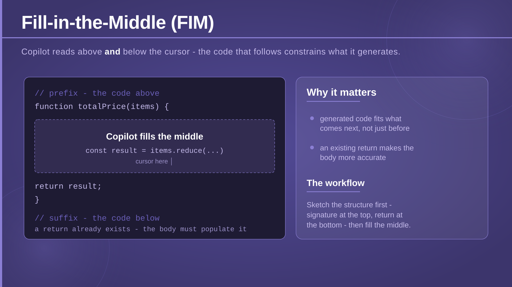

> **TL;DR:** Copilot can use both the code above and below the cursor to fill the gap in between.

This slide describes fill-in-the-middle prompting, where the prefix above the cursor and the suffix below it both guide generation. Instead of predicting from only what came before, Copilot can use the closing lines, stubs, and surrounding structure as extra hints.

A practical takeaway is to leave useful scaffolding in place. A method signature above and a closing bracket or expected shape below can make the generated code much more accurate.

## Slide 06 — The "Tab Setup" Habit

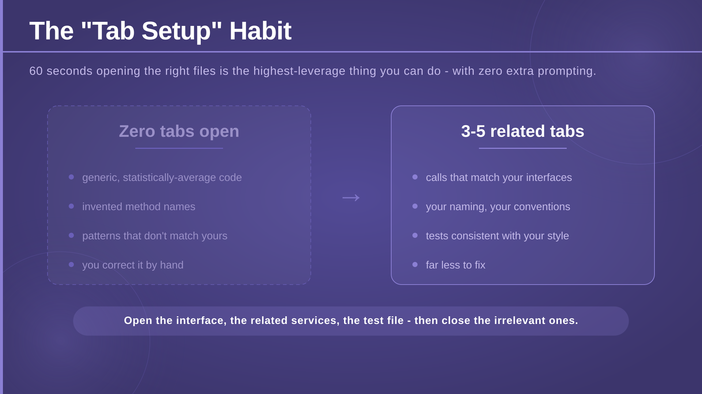

> **TL;DR:** Open the files that help and close the files that add noise.

This slide teaches a simple working habit: curate your open tabs before prompting. Helpful tabs include the contract you are implementing, a related test, or a similar service that shows the local conventions.

The goal is to improve signal quality inside the context window. Too many unrelated tabs can dilute the useful clues Copilot needs to follow your current task.

## Slide 07 — Exercise 501 — Context Window Copilot Clone

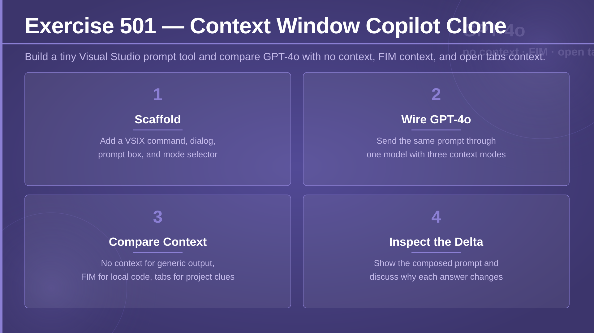

> **TL;DR:** This exercise lets participants simulate how Copilot builds and prioritises context.

Participants will combine open file content, cursor location, suffix code, and relevance scoring to build a small context-window clone. The exercise also includes assembling the final prompt within a token budget and formatting it as a fill-in-the-middle request.

This makes the abstract idea of context concrete. By building a simplified version themselves, participants can better understand why prompt setup changes the quality of suggestions.

→ [Exercise 501 — Context Window Copilot Clone](../../../exercises/chapter-5/exercise-501/README.md)

<!-- Section 2 — The Anatomy of a Good Prompt -->

## Slide 08 — The Anatomy of a Good Prompt — The Four Ingredients

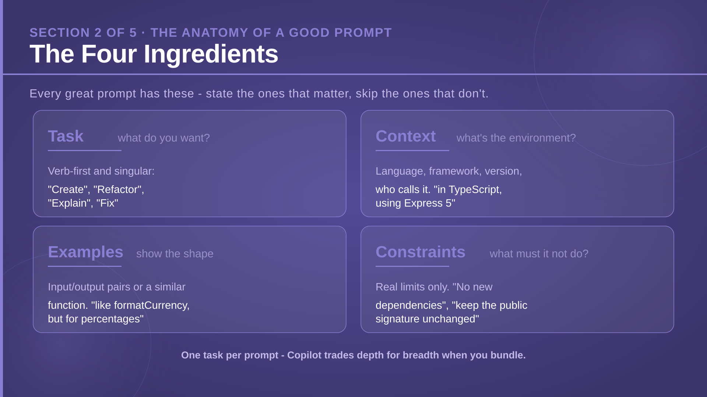

> **TL;DR:** Strong prompts combine task, context, examples, and constraints.

This slide breaks a good prompt into four parts. Copilot needs to know what to do, what surrounding information matters, what good output looks like, and what limits it must respect.

The slide also explains why weak prompts drift. If one ingredient is missing, the answer may still look correct on the surface but fail to match the real intent of the task.

## Slide 09 — Start With the Right Verb

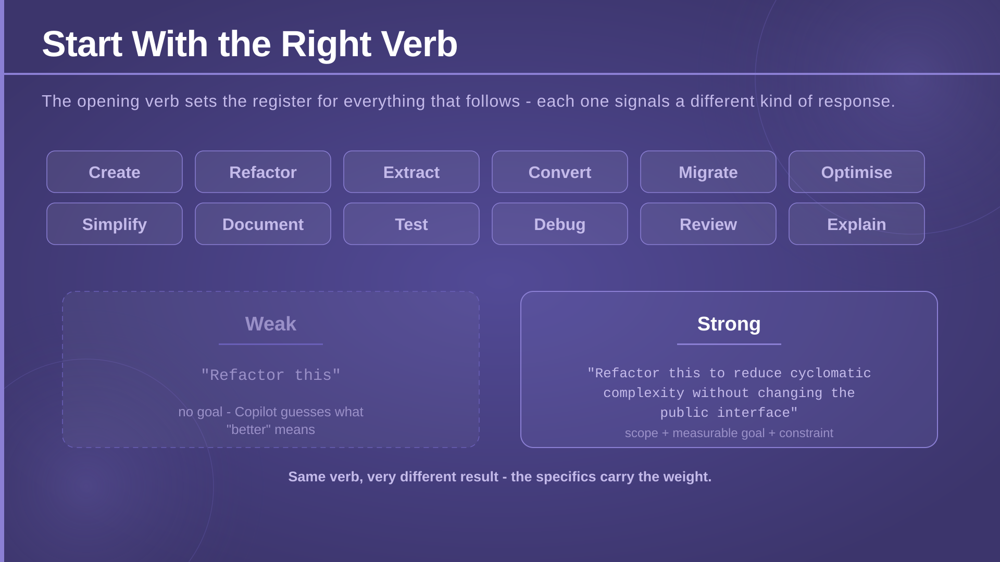

> **TL;DR:** The first verb in your prompt tells Copilot what kind of response to produce.

This slide shows how verbs like refactor, generate, explain, fix, test, and document each signal a different job. The opening word sets expectations for tone, output type, and level of change.

A small wording change can create a very different result. Choosing the verb carefully is an easy way to steer Copilot before you add any other detail.

## Slide 10 — Prompt Anti-Patterns

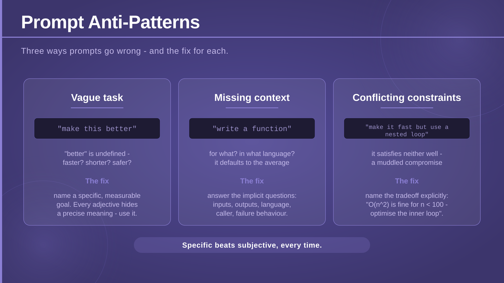

> **TL;DR:** Vague, broad, conflicting, or under-specified prompts usually produce weak results.

This slide lists common prompt mistakes such as asking for too much, giving no context, mixing incompatible constraints, or failing to define the expected output format. In each case, Copilot is forced to guess what matters most.

The workshop takeaway is practical: most bad prompts can be repaired by adding clearer task wording, better context, useful examples, or explicit boundaries.

## Slide 11 — One-Shot vs. Few-Shot

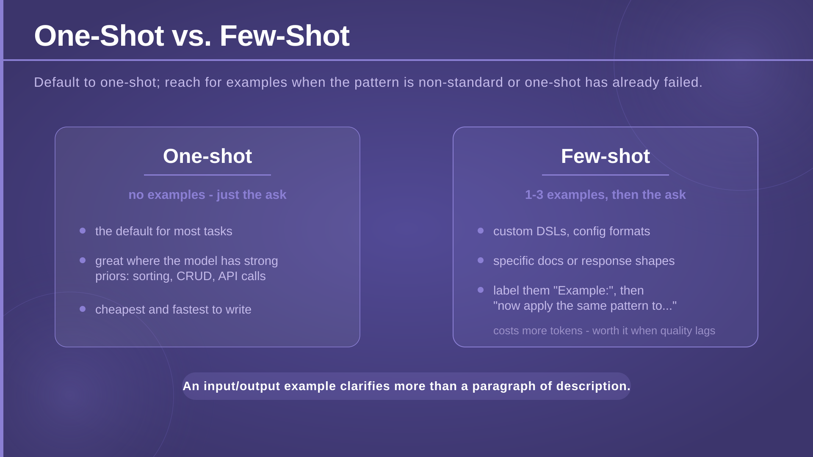

> **TL;DR:** One example shows the shape, but multiple examples teach the pattern.

This slide compares one-shot prompting with few-shot prompting. A single example is often enough for a simple, predictable structure, while two or more examples help Copilot infer a richer pattern with variation.

Participants should see this as a scaling tool. When the first answer is close but inconsistent, adding another example often sharpens the result more effectively than repeating the same instructions.

## Slide 12 — Iterative Prompting

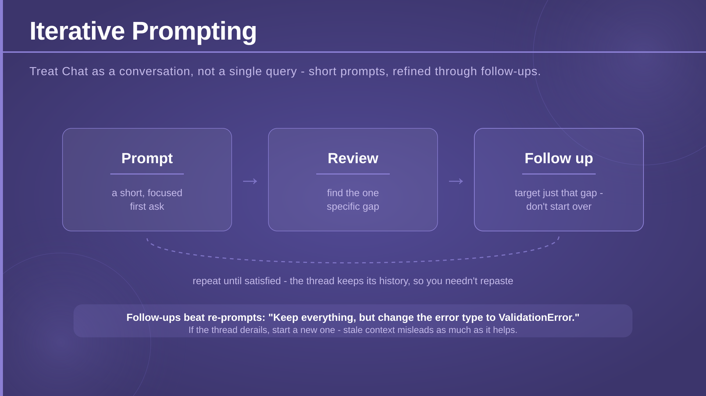

> **TL;DR:** Good AI-assisted work usually comes from prompt, review, and refinement loops.

This slide presents prompting as an iterative process rather than a one-shot event. You ask, inspect the result, tighten the request, and repeat until the diff is small, understandable, and aligned with the goal.

It also helps participants recognise when to stop. If the answer is now reviewable and the intent is clear, more prompting may only add noise instead of value.

## Slide 13 — Exercise 502 — Prompt Arena

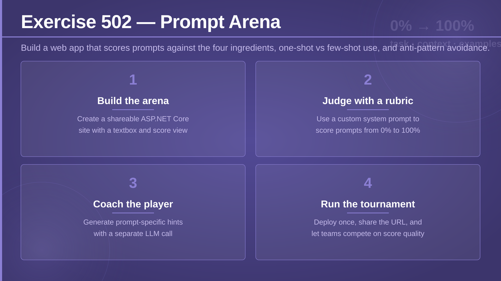

> **TL;DR:** This exercise compares prompt styles against the same coding target.

Participants will try one-shot, few-shot, iterative, and deliberately bad prompts on the same task to observe how wording changes the output. The goal is to see prompt quality as something testable rather than mysterious.

By comparing results side by side, the exercise makes it easier to notice what actually improves code generation and what only sounds helpful.

→ [Exercise 502 — Prompt Arena](../../../exercises/chapter-5/exercise-502/README.md)

<!-- Section 3 — Context Variables -->

## Slide 14 — Context Variables — The @ Participants

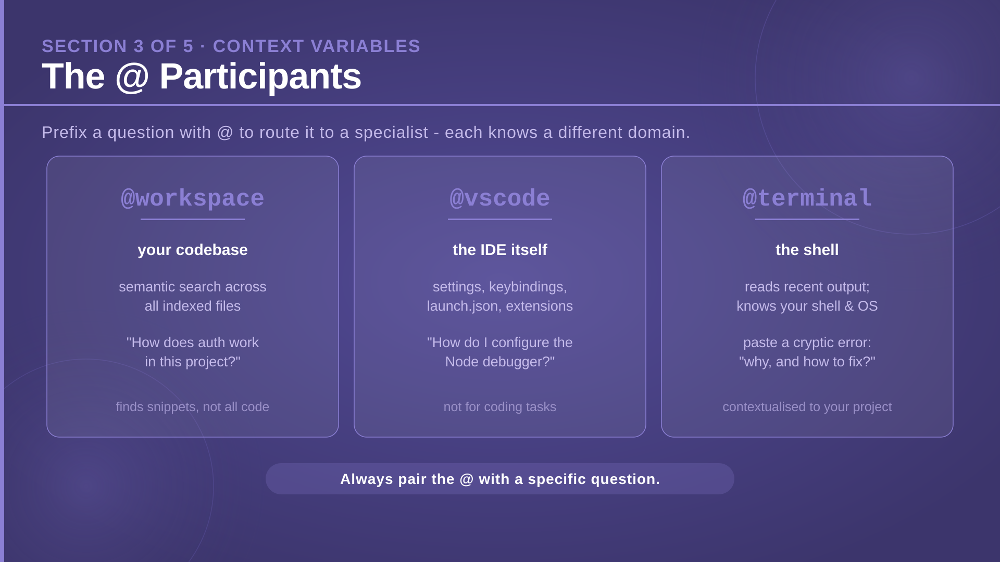

> **TL;DR:** @ variables bring broader tools or participants into the conversation.

This slide explains that @ references can invite a workspace, terminal, GitHub, or editor participant into the prompt. Each one expands what Copilot can inspect, but each also changes the scope and cost of the request.

The main lesson is to choose these participants deliberately. Broad tools are useful for broad questions, but they are slower and less focused than a narrow file-level prompt.

## Slide 15 — The # Variables

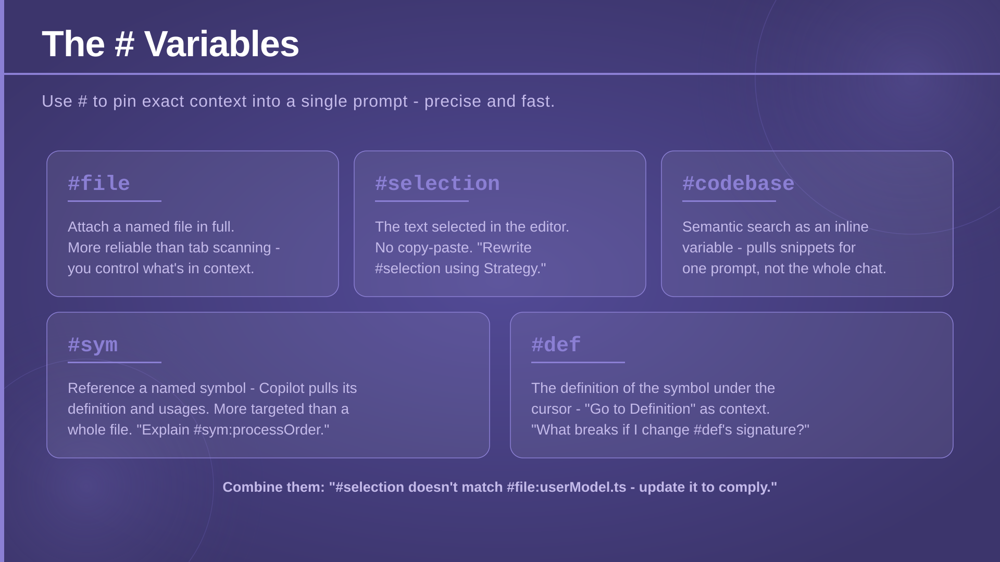

> **TL;DR:** # variables attach a specific artifact such as a file, symbol, selection, or diff.

This slide focuses on narrow context attachments. Instead of asking Copilot to scan everything, you can point it directly at the file, method, selected code, or recent changes that matter.

Narrow prompts usually produce more relevant answers. For workshop participants, this is a simple way to reduce ambiguity and improve precision during everyday development work.

## Slide 16 — Advanced Prompting Patterns — Comment-Driven Development

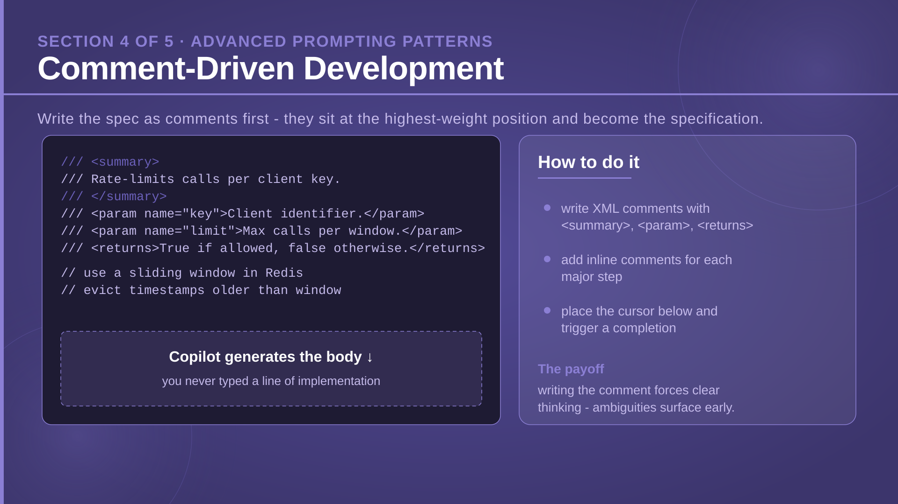

> **TL;DR:** A precise comment can act as a compact specification for generated code.

This slide introduces comment-driven development, where you describe the intended behaviour first and let Copilot implement from that comment. The comment becomes a lightweight spec that states inputs, outputs, and edge cases.

If the generated code misses the target, the fix often starts with improving the comment rather than issuing a separate vague correction.

## Slide 17 — Test-First Prompting

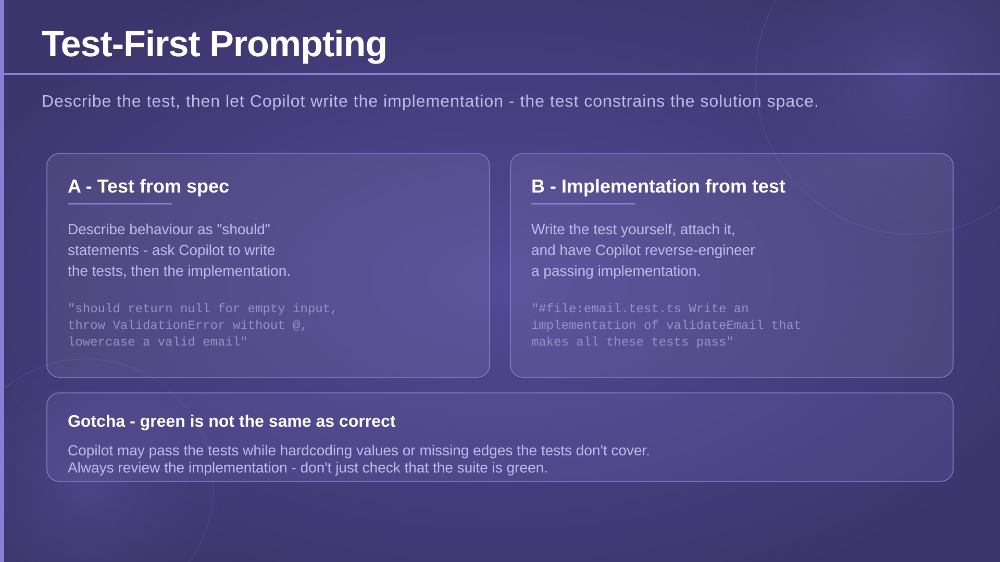

> **TL;DR:** A failing test gives Copilot a precise contract for the implementation.

This slide connects prompting to test-driven development. You write the failing test first, give it to Copilot as context, and ask for the smallest implementation that makes the test pass.

That approach keeps the scope tight and reviewable. It also gives participants a reliable way to turn desired behaviour into concrete code without over-generating.

## Slide 18 — Persona & Chain-of-Thought

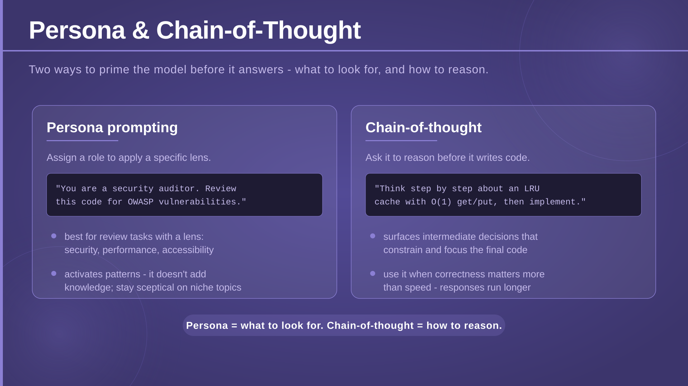

> **TL;DR:** You can improve complex responses by setting a role and asking for structured reasoning.

This slide shows two useful prompt patterns. A persona changes the perspective of the answer, while stepwise reasoning makes the path to the answer more explicit.

Used carefully, these patterns help with reviews, debugging, design trade-offs, and explanations for different audiences. They are especially valuable when the final answer depends on judgment, not only code generation.

## Slide 19 — Completions vs. Chat vs. Agent

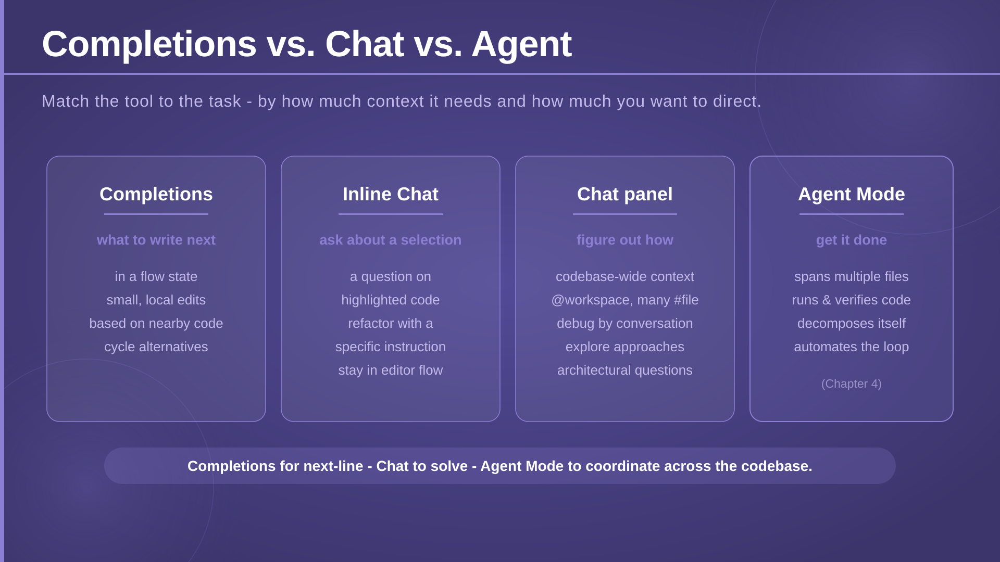

> **TL;DR:** Different Copilot modes fit different task sizes and levels of interaction.

This slide compares inline completions, chat, and agent mode. Completions are best for local next steps, chat is useful for focused back-and-forth work, and agents are designed for larger, multi-step tasks.

The key skill is choosing the smallest mode that fits. That keeps the workflow fast while still giving you more power when the task grows.

## Slide 20 — Custom Instructions — Layered Instructions

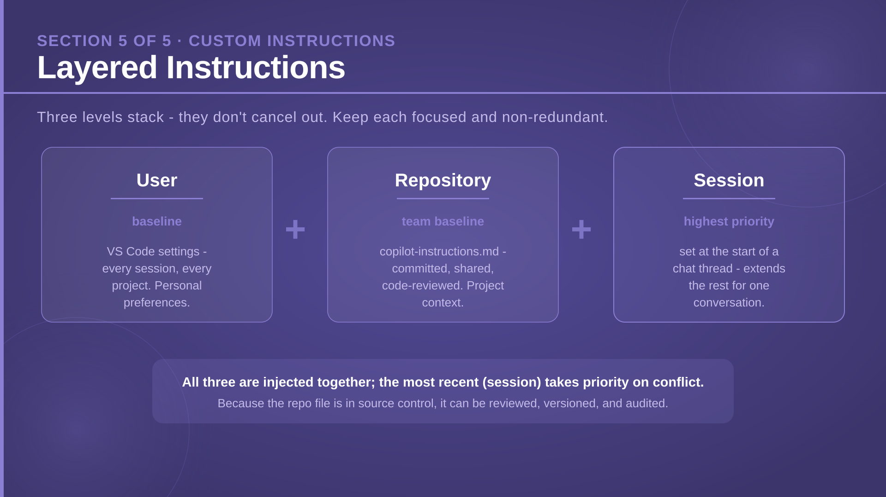

> **TL;DR:** Instructions work in layers, from broad personal defaults to narrow task-specific rules.

This slide explains how instruction scope changes from global settings, to repository instructions, to the current prompt. When rules conflict, the most specific layer wins.

That matters because participants can decide where guidance belongs. Personal style belongs in global settings, shared repo conventions belong in the repository file, and one-off requirements belong in the current request.

## Slide 21 — Specific, But Not Brittle

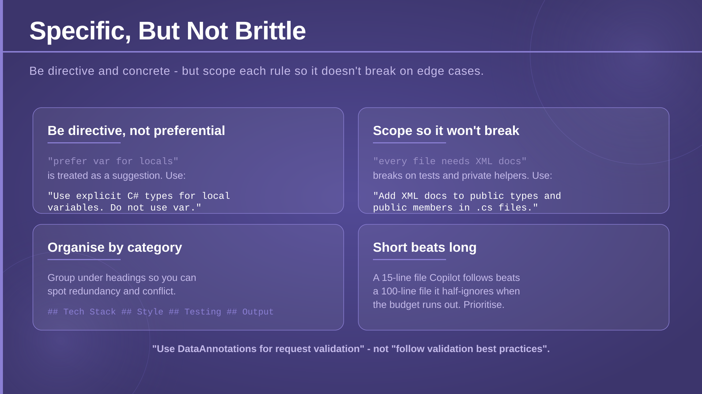

> **TL;DR:** Good instructions express stable intent without locking the AI to today's implementation details.

This slide contrasts strong guidance with brittle rules. Useful instructions describe enduring conventions such as test frameworks, dependency injection, or response shapes, while weak instructions hard-code temporary classes or arbitrary numbers.

For workshop participants, the lesson is to write instructions that survive change. That makes Copilot more consistent without making the repo harder to evolve.

## Slide 22 — The Prompt Engineer's Checklist

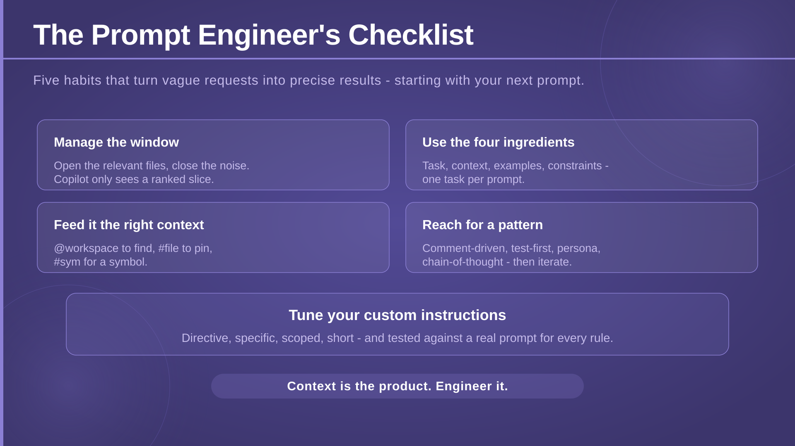

> **TL;DR:** Before sending a prompt, check that task, context, examples, and constraints are all present.

This slide turns the four ingredients into a quick pre-flight checklist. It helps participants ask whether the action is clear, the scope is reviewable, the right files are attached, and the output format and limits are explicit.

Used regularly, this checklist can improve prompt quality with very little extra effort. It is a lightweight habit that prevents many common mistakes.

## Slide 23 — Lab 501 — Ultimate Snake with Instructions & Prompt Files

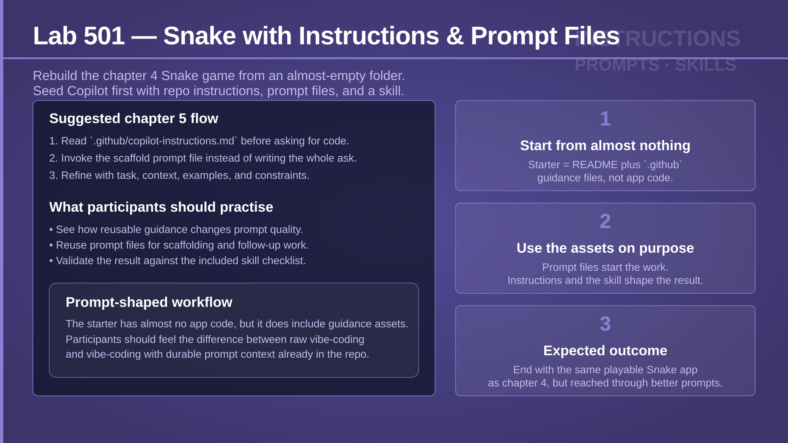

> **TL;DR:** This lab rebuilds Snake while using instructions, prompt files, and skills to shape Copilot from the start.

The lab asks participants to recreate the familiar Snake game from a nearly empty folder, but this time with structured guidance in place before free-form prompting begins. The flow starts with repository instructions, then scaffold prompts, then refinements using the prompt techniques from the chapter.

This matters because it shows how reusable context can raise the floor of AI-assisted development. Instead of repeating setup guidance every time, participants learn to encode it once and benefit throughout the task.

→ [Lab 501 — Ultimate Snake with Instructions, Prompt Files, and Skills](../../../labs/chapter-5/lab-501/README.md)

## Slide 24 — Lab 501 — Expectations

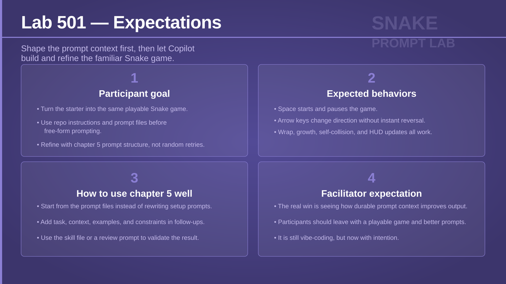

> **TL;DR:** Participants should build a playable Snake game by shaping context first and prompting with intent.

This slide sets the success criteria for the lab: rebuild the game, use the provided instructions and prompt files before improvising, and refine prompts with task, context, examples, and constraints. It also lists the expected gameplay behaviours, such as pausing, movement rules, wrapping, growth, self-collision, and HUD updates.

The slide frames quality as more than just making the game run. Participants are expected to demonstrate a repeatable prompting process, not just random retries until something works.

→ [Lab 501 — Ultimate Snake with Instructions, Prompt Files, and Skills](../../../labs/chapter-5/lab-501/README.md)

## Slide 25 — Overview — Seven Sections

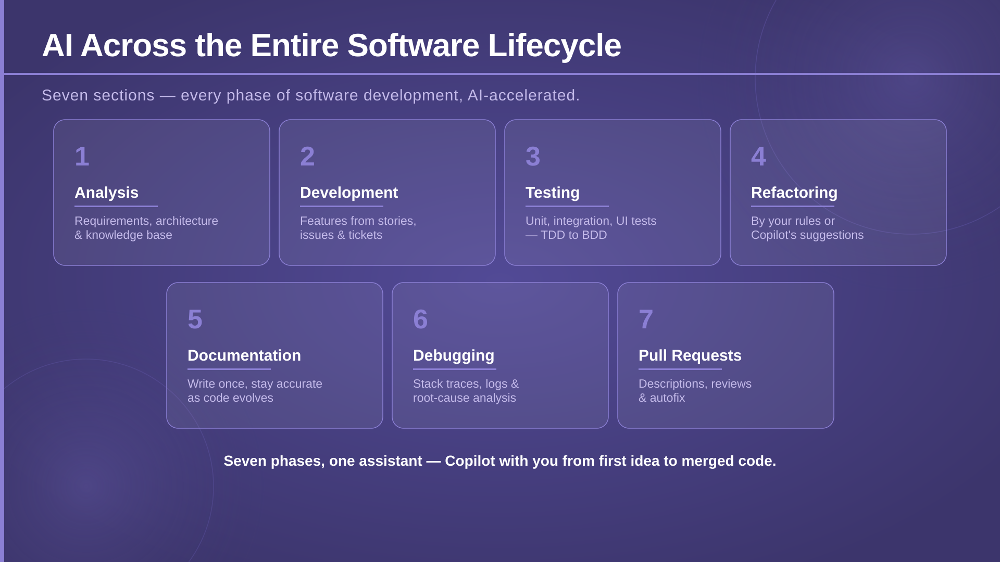

> **TL;DR:** The chapter covers seven lifecycle phases where AI can add practical value.

This slide gives the map for the chapter: analysis, development, testing, refactoring, documentation, debugging, and pull requests. It positions Copilot as one assistant that can support many kinds of work, not just code completion.

For participants, this overview sets the expectation that AI should be integrated into the whole workflow. The goal is to improve how software is delivered end to end.

<!-- Section 1 — Copilot for Analysis -->

## Slide 26 — Section 1 — From Blank Slate to Structured Blueprint

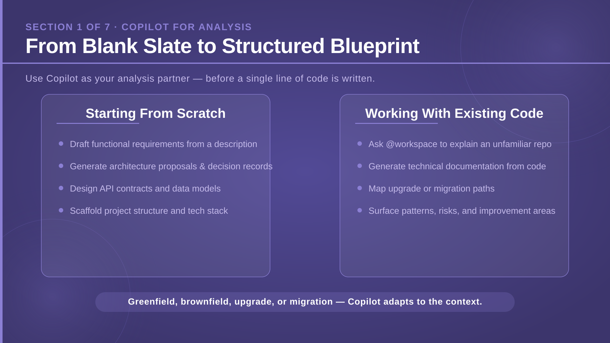

> **TL;DR:** Copilot can help structure thinking before implementation starts.

This section slide introduces analysis as the first place where Copilot adds value. It covers both greenfield work, where you need requirements and architecture, and brownfield work, where you need to understand an existing codebase well enough to act safely.

The message is that faster coding starts with better thinking. If you clarify the blueprint early, later implementation becomes smoother and less risky.

## Slide 27 — Why Copilot Belongs in Analysis

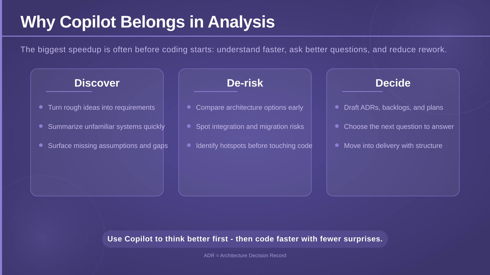

> **TL;DR:** Some of the biggest AI gains happen before anyone writes code.

This slide explains that analysis work benefits from Copilot because it helps teams discover requirements, compare options, surface risks, and draft plans earlier. That means fewer avoidable mistakes later in the lifecycle.

It reframes Copilot as a thinking partner, not only a coding assistant. Better early decisions often save more time than faster typing ever could.

## Slide 28 — Greenfield Analysis — From Idea to First Architecture

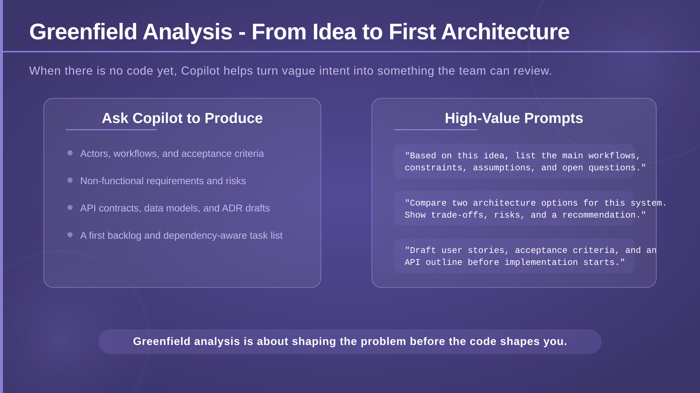

> **TL;DR:** For new systems, Copilot can turn an idea into structured requirements and first-pass design artifacts.

This slide walks through greenfield analysis outputs such as actors, workflows, acceptance criteria, non-functional requirements, API contracts, data models, and early backlog items. It shows that a vague product idea can be shaped into concrete planning material very quickly.

That helps participants start implementation with shared clarity instead of assumptions. Even if the first draft is imperfect, it creates something the team can review and improve.

## Slide 29 — Brownfield Analysis — From Unknown Repo to Actionable Map

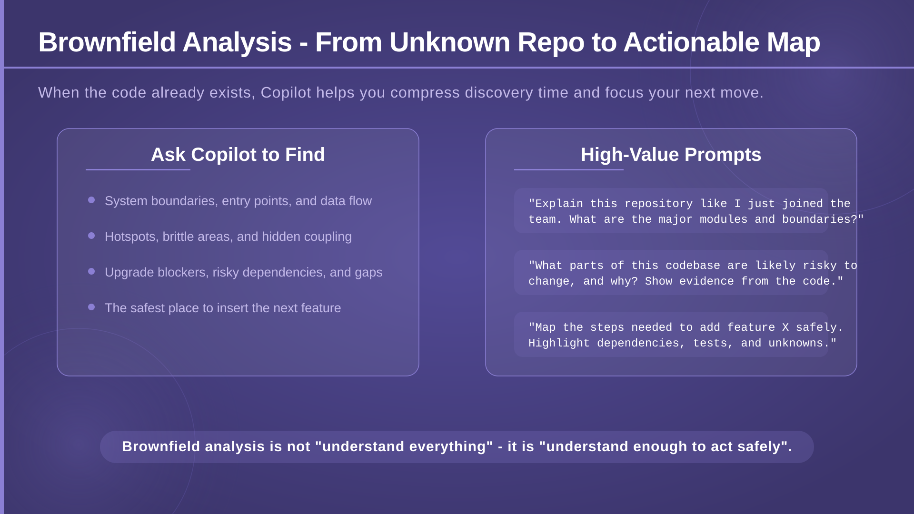

> **TL;DR:** In existing systems, Copilot can help you understand enough of the repo to make safe changes.

This slide focuses on analysis in a codebase you did not design yourself. It suggests using Copilot to identify system boundaries, hotspots, blockers, and the safest insertion point for a new feature or migration.

For workshop participants, this is highly practical. Many real tasks start in unfamiliar code, so the ability to build an actionable mental map quickly is a major advantage.

## Slide 30 — Section 2 — Three Modes, One Goal: Ship Features Faster

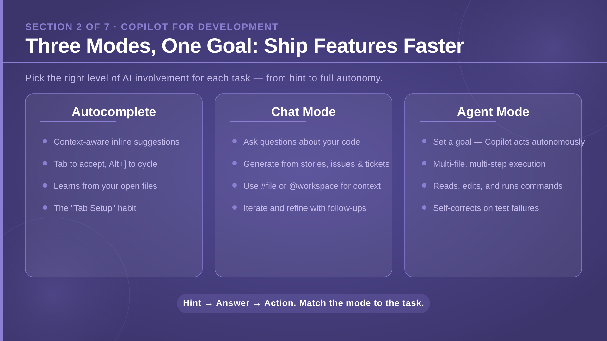

> **TL;DR:** Autocomplete, chat, and agent mode support different kinds of feature work.

This section slide introduces the three main ways Copilot can help during development. Autocomplete handles local next steps, chat supports focused questions and generation, and agent mode helps with larger multi-file tasks.

The goal is not to use the biggest tool every time. It is to match the mode to the size and complexity of the work.

## Slide 31 — Prompt Patterns for Feature Development

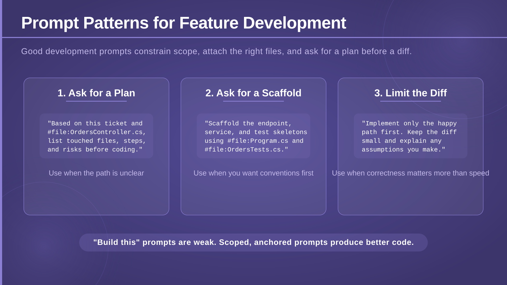

> **TL;DR:** Ask for a plan, a scaffold, and a limited diff instead of saying only “build this.”

This slide presents a strong development prompt sequence: first ask what files and steps are involved, then ask for a scaffold, then constrain the implementation to a small slice. It shows how scope control improves code quality.

The practical lesson is that development prompts should be anchored in the codebase and limited in size. Smaller, clearer requests lead to more reviewable changes.

## Slide 32 — Section 3 — From Zero Coverage to Confident Tests

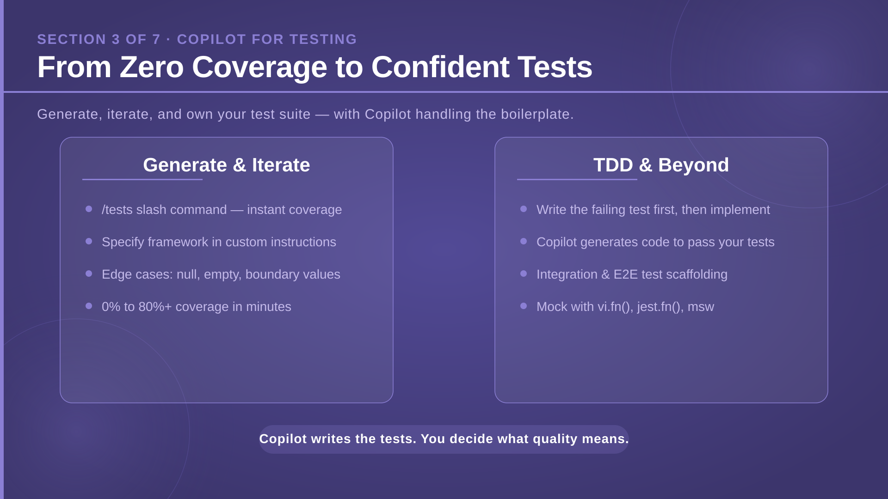

> **TL;DR:** Copilot can help generate tests, but developers still define what good coverage means.

This section slide introduces testing support across unit, integration, and end-to-end levels. It also connects Copilot to TDD, test scaffolding, and mocking patterns.

The message is that AI can accelerate test creation, but quality still depends on the human deciding what risks and behaviours must actually be covered.

## Slide 33 — Test Types — Unit, Integration, and Automated UI

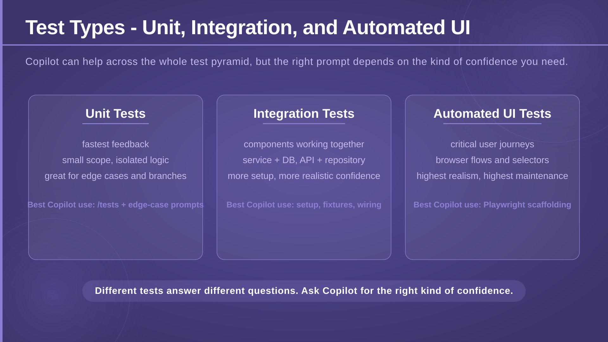

> **TL;DR:** Different test types answer different questions about the system.

This slide compares unit tests, integration tests, and automated UI tests. Each one covers a different level of confidence, from isolated logic to connected services to real user journeys.

Participants should leave with a balanced view of testing. Faster unit tests are useful, but they do not replace the value of integration and browser-level checks.

## Slide 34 — TDD with Copilot — Red, Green, Refactor

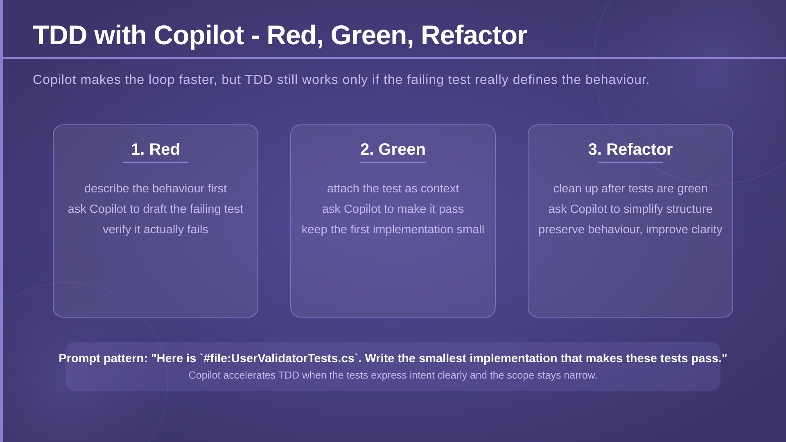

> **TL;DR:** Copilot fits naturally into TDD when the failing test comes first.

This slide maps Copilot onto the classic red, green, refactor cycle. You first define behaviour with a failing test, then ask for the smallest passing implementation, and finally clean up the code.

That workflow keeps Copilot grounded in a precise contract. It is a strong way to turn desired behaviour into working code without losing control over scope.

## Slide 35 — BDD with Reqnroll — Shared Language, Executable Specs

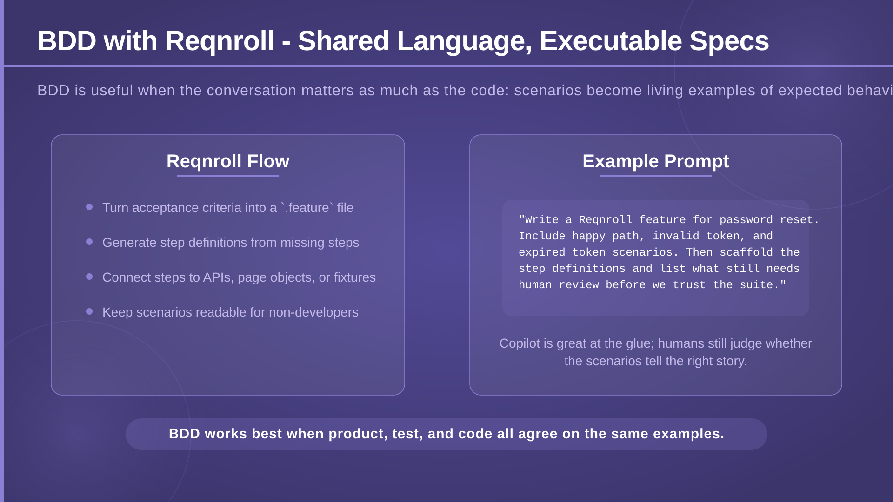

> **TL;DR:** BDD uses readable scenarios as a shared contract between product, test, and code.

This slide introduces Reqnroll-style feature files and step definitions as a way to express behaviour in business language. Copilot can help draft scenarios, generate missing steps, and connect them to the underlying automation.

It matters because shared language reduces misunderstanding. When product, testers, and developers use the same examples, the resulting software is easier to validate.

## Slide 36 — Coverage Reports — Turn Gaps into Better Tests

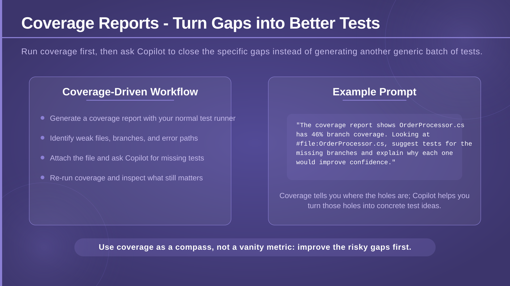

> **TL;DR:** Coverage reports help you aim new tests where they add the most value.

This slide explains a coverage-driven loop: generate a report, find weak branches or files, attach the relevant code, and ask Copilot for targeted tests. The focus is on using coverage as a guide rather than a vanity number.

For participants, the lesson is to combine evidence with generation. AI can help fill gaps, but the gaps should be chosen intentionally.

## Slide 37 — Section 4 — Reshape Code Without Breaking It

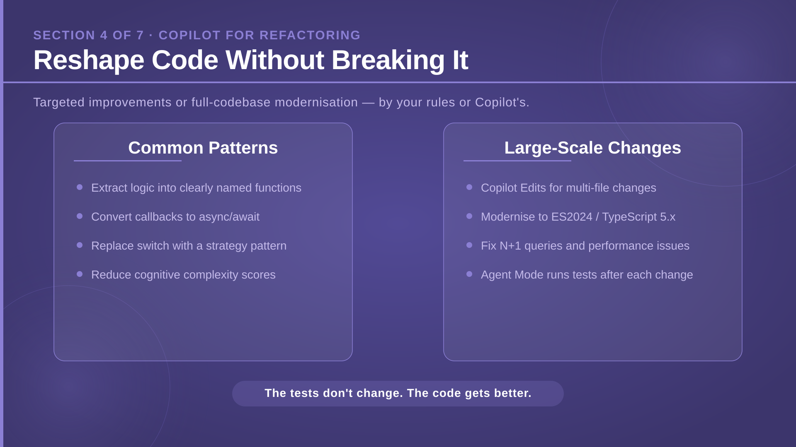

> **TL;DR:** Refactoring with Copilot should improve code structure while preserving behaviour.

This section slide introduces both everyday cleanup and larger multi-file transformations. It frames Copilot as a helper for safer rewrites, modernisation, and complexity reduction.

The anchor point is behavioural safety. Better structure is only useful if the software still does the right thing when you are done.

## Slide 38 — Architectural Refactoring — Make the Design Better, Not Just Different

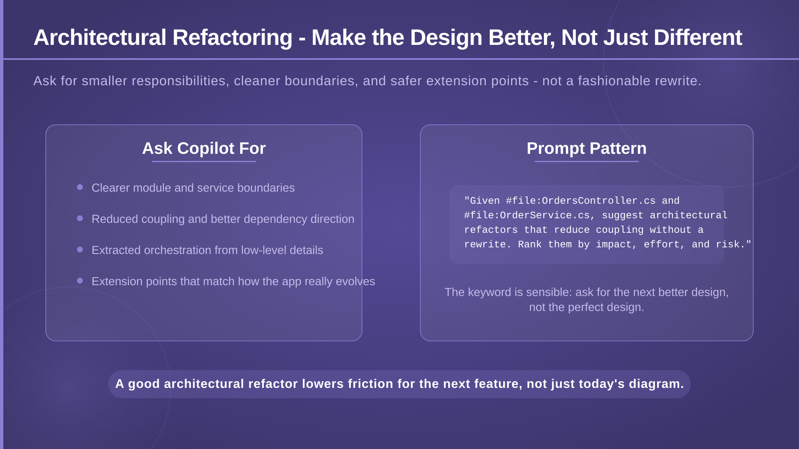

> **TL;DR:** Good architectural refactors reduce future friction instead of merely moving code around.

This slide focuses on design-level improvements such as clearer module boundaries, lower coupling, better orchestration, and stronger extension points. It reminds participants that architecture changes should solve real problems.

A successful refactor makes the next feature easier to build. That is the standard for judging whether the design really improved.

## Slide 39 — Refactor from Evidence — Logs, Metrics, Traces, and Load Tests

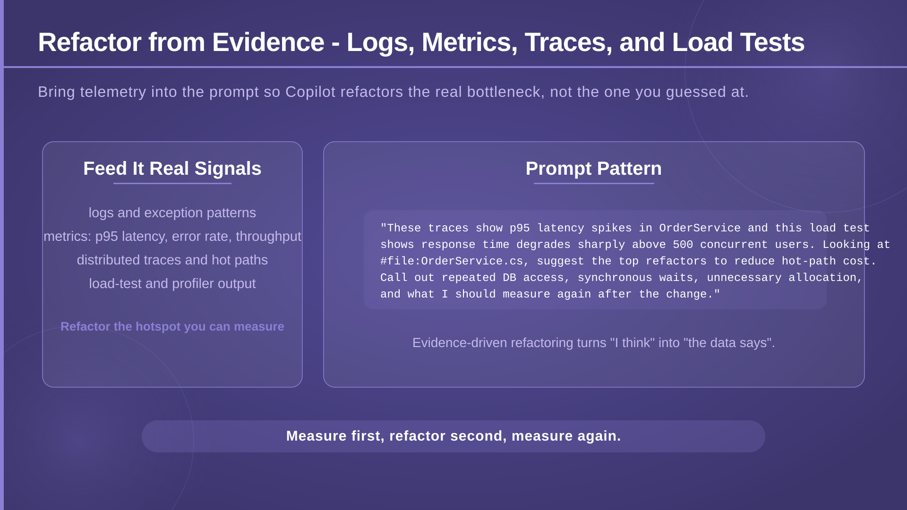

> **TL;DR:** Use real performance or reliability evidence to choose what to refactor.

This slide argues against refactoring by guesswork. By feeding Copilot logs, profiler output, traces, or load-test results, you can focus on measurable hotspots rather than personal hunches.

That makes the work easier to justify and easier to verify afterward. Participants are encouraged to measure before and after, not just trust intuition.

## Slide 40 — Readability Refactors Developers Feel Every Day

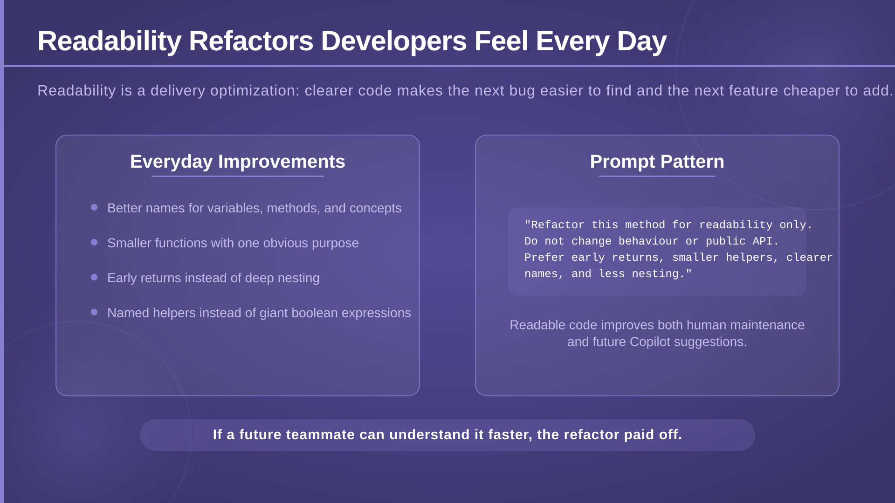

> **TL;DR:** Small readability improvements often pay off immediately in daily development.

This slide highlights everyday refactors such as clearer names, smaller functions, early returns, and named helpers. These changes may not alter architecture, but they make code faster to understand and safer to modify.

For workshop participants, this is a reminder that refactoring is not only about grand redesigns. Many valuable improvements are local and practical.

## Slide 41 — Safer Structural Refactoring — Create Seams, Reduce Coupling

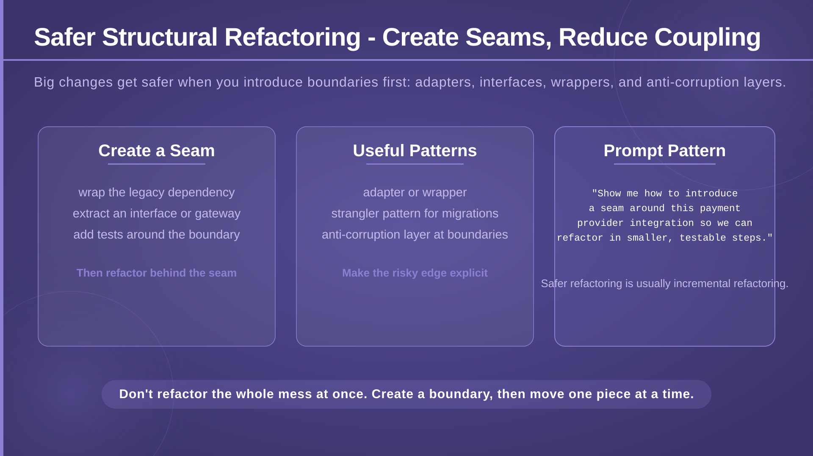

> **TL;DR:** Create safe boundaries first, then refactor behind them.

This slide explains how seams, wrappers, interfaces, and anti-corruption layers make bigger refactors safer. Instead of changing everything at once, you introduce a stable boundary and then improve the internals step by step.

That approach matters in real legacy systems where direct rewrites are risky. Incremental change lowers the chance of breaking important behaviour.

## Slide 42 — Section 5 — Documentation That Stays True

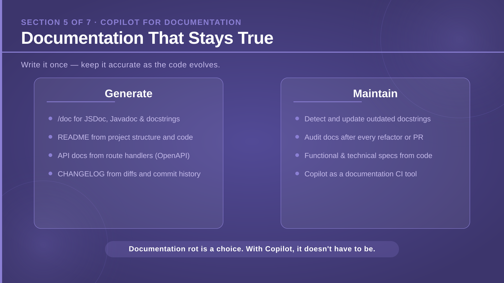

> **TL;DR:** AI can help create and maintain documentation that evolves with the code.

This section slide introduces documentation as an engineering deliverable, not an afterthought. It covers generated docs, README updates, changelogs, and audits for stale explanations.

The theme is honesty. Documentation is only useful when it reflects the current system, and Copilot can help keep that alignment tighter.

## Slide 43 — Inline Documentation — Explain Intent, Not Just Syntax

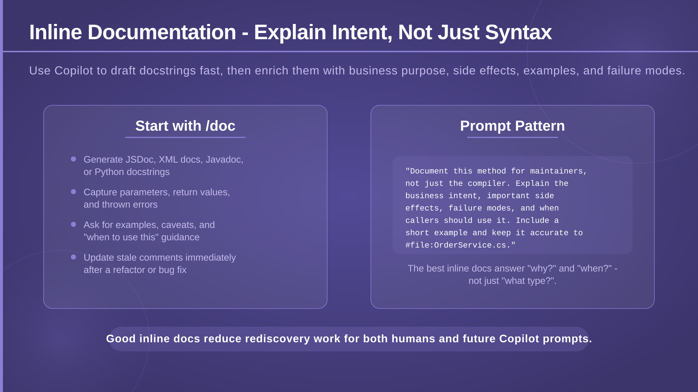

> **TL;DR:** The best inline docs explain why and when to use something, not only what it looks like.

This slide moves beyond simple parameter descriptions. It encourages using Copilot to document intent, caveats, error cases, and usage examples so that future readers understand the reasoning behind the code.

That is especially helpful after refactors or handovers. Good inline docs reduce the need to rediscover design intent later.

## Slide 44 — Docs as Code — Markdown That Lives with the Repo

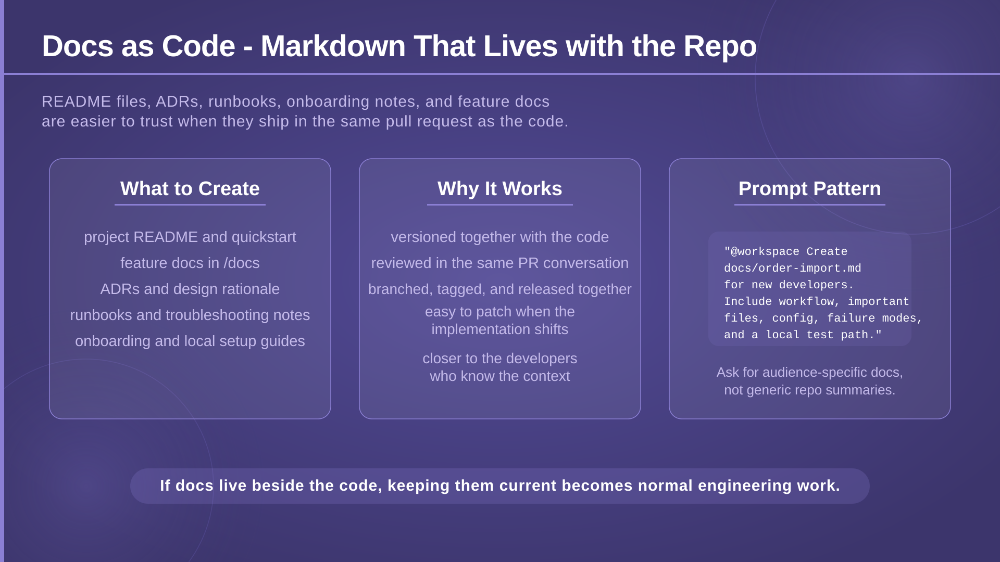

> **TL;DR:** Documentation is easier to maintain when it lives beside the code and follows the same workflow.

This slide explains why project docs, feature guides, ADRs, runbooks, and onboarding notes work well as versioned Markdown in the repository. They can be reviewed, branched, tagged, and released together with the implementation.

For participants, this makes documentation feel like normal engineering work. When docs live in the same place as the code, keeping them current becomes much more natural.

## Slide 45 — Diagrams in Markdown — Draw.io and *.drawio.png

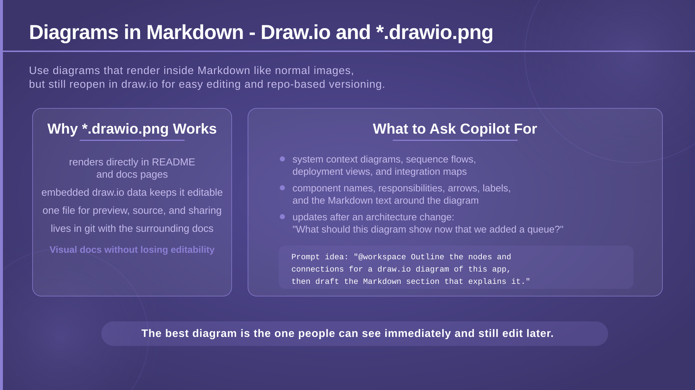

> **TL;DR:** A *.drawio.png file is easy to view in Markdown and still easy to edit later.

This slide introduces a practical diagram format for repositories. It combines previewability with editability, so teams do not have to choose between a readable README image and a separate source file.

That matters because architecture and flow diagrams are more likely to stay useful when they are simple to open, review, and update in normal git workflows.

## Slide 46 — Keep Documentation Honest — Refresh It with Every Change

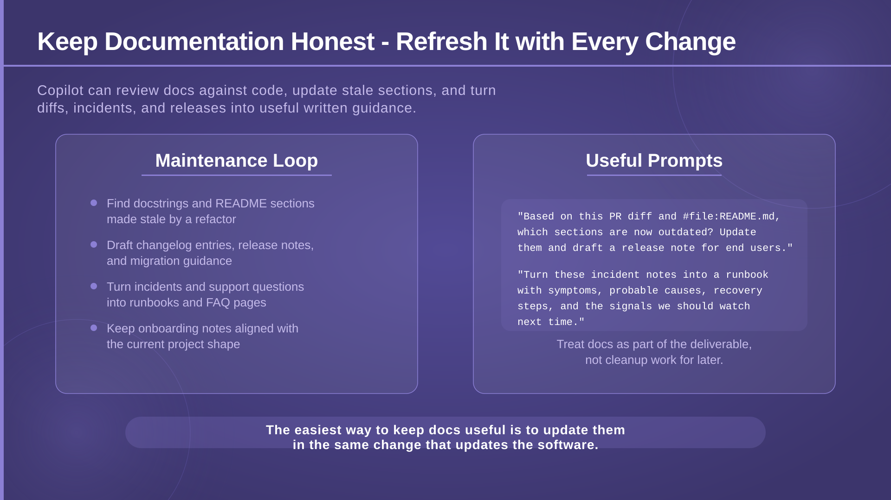

> **TL;DR:** Documentation should be updated as part of the same change, not as cleanup later.

This slide presents a maintenance loop for finding stale comments, updating README sections, drafting changelog entries, and turning incidents into runbooks. Copilot can speed up those updates, but the important part is making them routine.

The broader lesson is cultural. Honest documentation is the result of consistent habits, not one large catch-up effort.

## Slide 47 — Section 6 — From Symptom to Root Cause, Faster

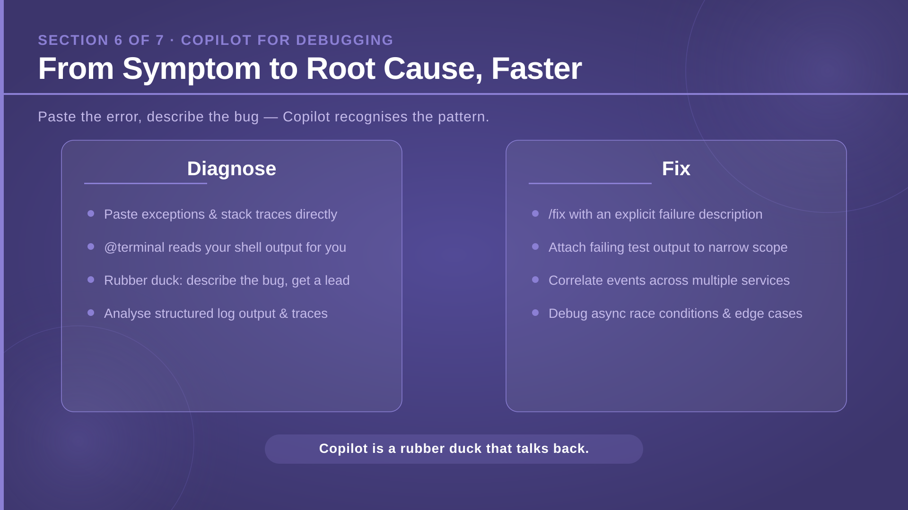

> **TL;DR:** Copilot can accelerate debugging when you give it real evidence from the failure.

This section slide introduces debugging as a structured investigation. Stack traces, terminal output, logs, traces, and failure descriptions give Copilot something concrete to reason over.

The emphasis is on root cause, not symptom patching. Faster debugging comes from better evidence and tighter loops.

## Slide 48 — Exceptions and Stack Traces — Start with the Real Failure

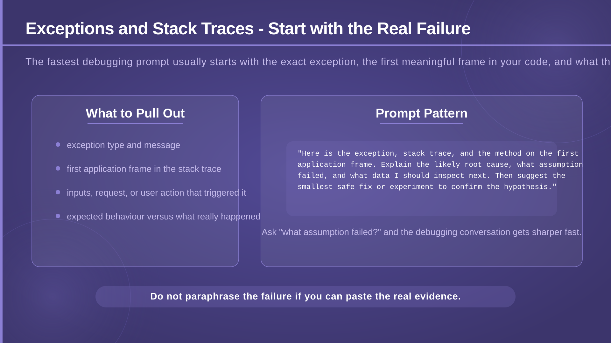

> **TL;DR:** The best debugging prompt starts with the actual exception and stack trace, not a paraphrase.

This slide teaches participants to extract the exception type, the first application frame, the trigger, and the expected-versus-actual behaviour from a real failure. Those details anchor the investigation in facts.

That matters because debugging quality drops when the evidence is filtered too early. Pasting the real failure often gives Copilot the clue it needs.

## Slide 49 — Give the Agent Eyes — Playwright, Screenshots, DOM, and Network

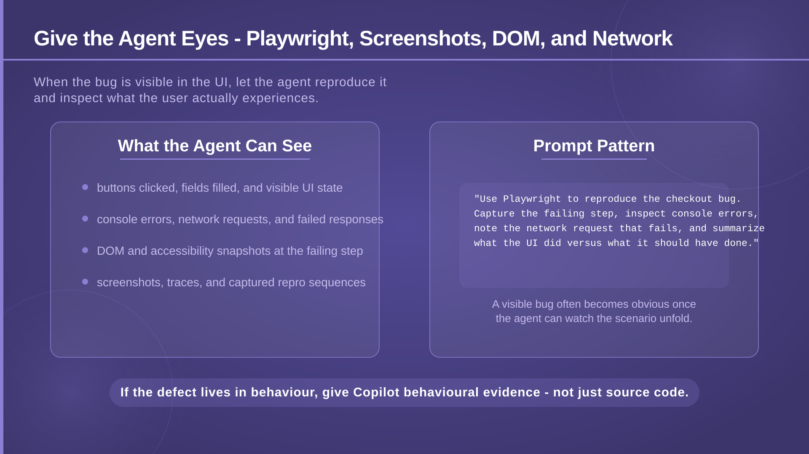

> **TL;DR:** Visual and browser-level evidence can make UI bugs much easier for an agent to understand.

This slide shows how tools like Playwright, screenshots, DOM snapshots, console errors, and network traces help Copilot inspect a failing scenario more directly. For browser issues, this is often far richer than a short text description.

For participants, the key idea is that better observability improves AI debugging too. When the agent can see the behaviour, it can reason about it more effectively.

## Slide 50 — Logs, Traces, and Metrics — Read the Story Across Systems

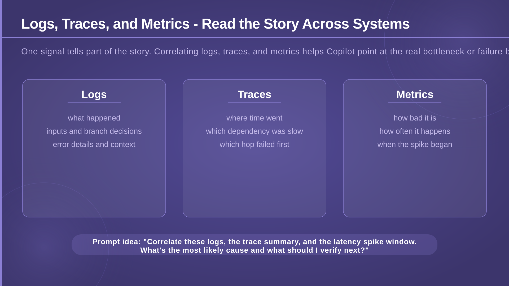

> **TL;DR:** Logs, traces, and metrics each reveal a different part of the failure story.

This slide explains how logs show events and inputs, traces show cross-service flow and latency, and metrics show scale and timing. Together they give a fuller picture than any one signal alone.

That is important in distributed systems where the real problem may sit far from the visible symptom. Participants learn to correlate evidence instead of chasing isolated clues.

## Slide 51 — Reproduce, Narrow, Verify — The AI Debugging Loop

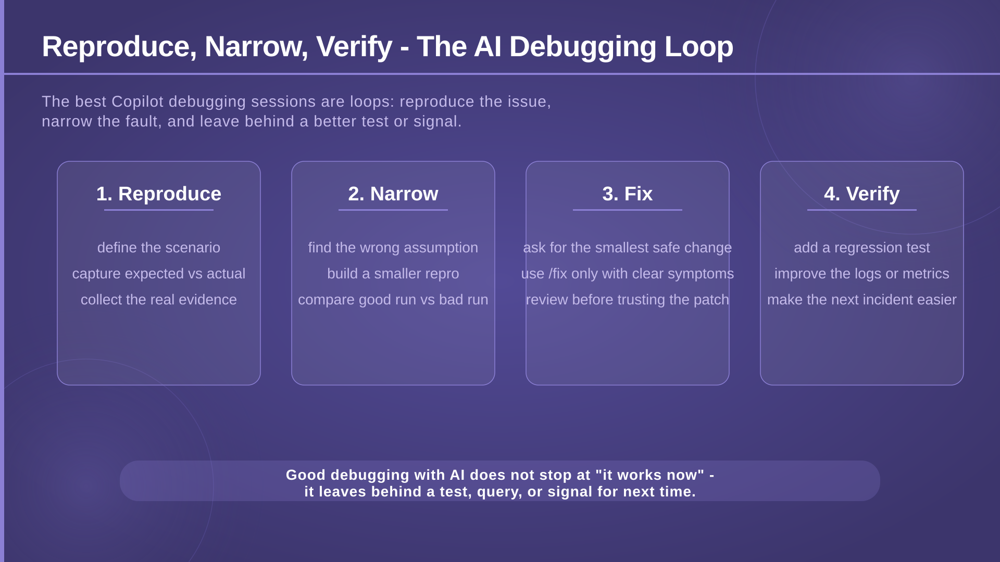

> **TL;DR:** Effective debugging follows a loop: reproduce the bug, narrow the cause, fix it, and verify the result.

This slide turns debugging into a repeatable workflow. It starts by defining the scenario and evidence, then narrows the wrong assumption, applies the smallest safe fix, and finishes with verification and better observability.

The slide matters because it keeps debugging disciplined. A bug is not really done when it disappears once; it is done when the cause is understood and the fix is proved.

## Slide 52 — Section 7 — AI From Commit to Merge

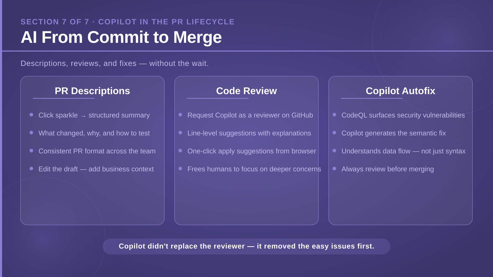

> **TL;DR:** Copilot can help package, review, and improve changes throughout the PR lifecycle.

This section slide introduces PR descriptions, automated review, and security autofix as places where AI adds value after the coding work is done. It shows that the lifecycle continues well beyond implementation.

The important reminder is that AI support does not remove human responsibility. Review and merge decisions still require engineering judgment.

## Slide 53 — Reviewable PRs Start Earlier Than the PR

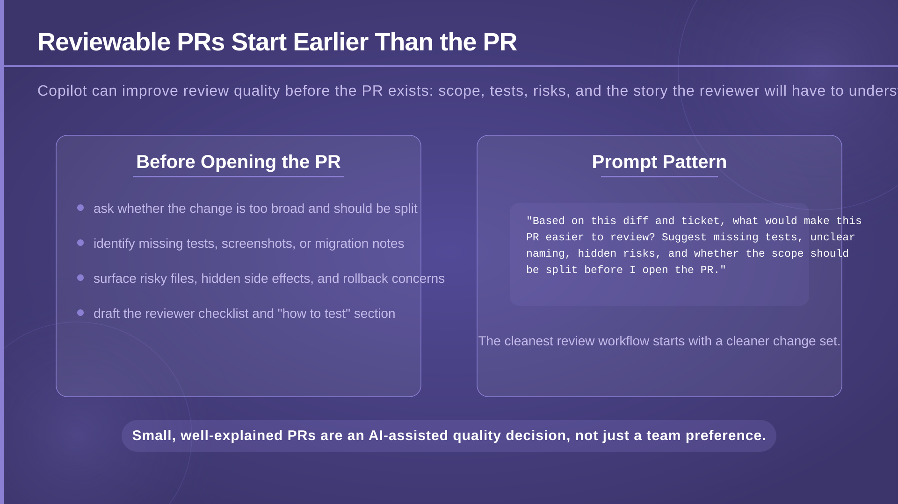

> **TL;DR:** Good pull requests are shaped before the PR is even opened.

This slide explains that reviewability starts with scope control, missing-test checks, rollout notes, screenshots, and a clear reviewer checklist. Copilot can help surface those needs before the PR description is written.

Participants learn that small, well-prepared PRs reduce review friction. Better preparation usually leads to better feedback and faster merges.

## Slide 54 — Copilot Review and Human Review Do Different Jobs

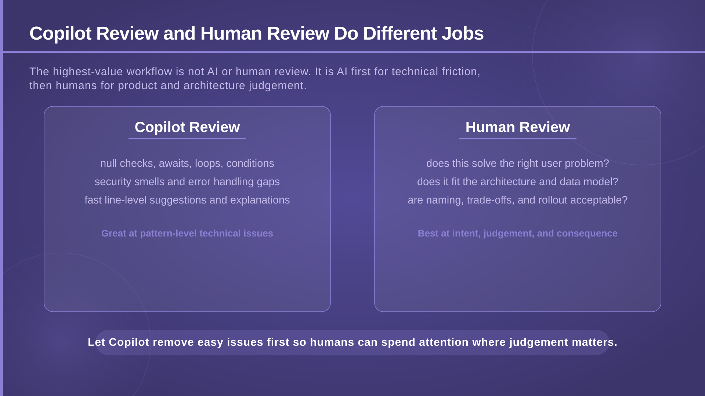

> **TL;DR:** Copilot is good at spotting many code-level issues, while humans still own product and architecture judgment.

This slide separates the strengths of automated and human review. Copilot can quickly flag common implementation issues, but people still need to decide whether the change solves the right problem and fits the system well.

That distinction helps teams use AI review effectively. Let the tool remove easy mistakes so humans can spend more energy on the deeper questions.

## Slide 55 — From Issue to PR — Plan, Implement, Summarize, Iterate

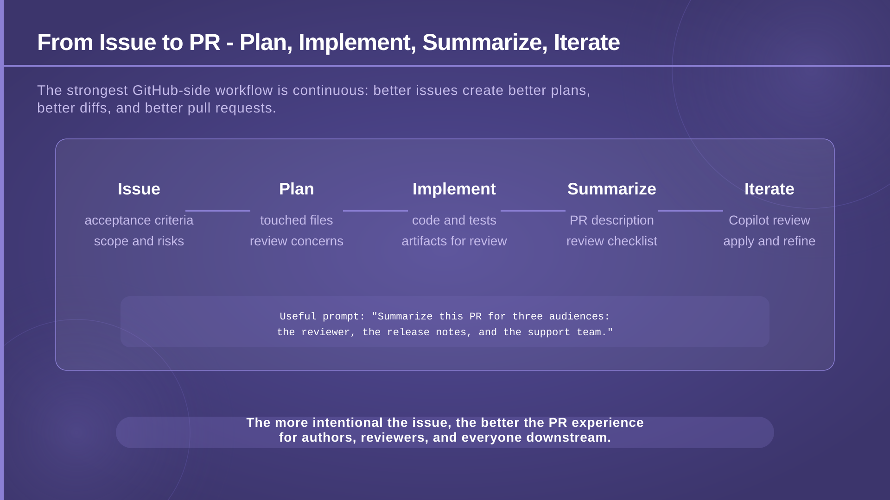

> **TL;DR:** A stronger issue usually leads to a stronger implementation and a clearer pull request.

This slide connects the lifecycle from acceptance criteria and risk planning through coding, testing, PR summarisation, and review iteration. It presents PR quality as the result of the whole workflow, not only the final write-up.

That gives participants a useful mental model: if you want better PRs, improve the steps before the PR as well.

## Slide 56 — Lab 601 — Ultimate Snake Across the Entire Lifecycle

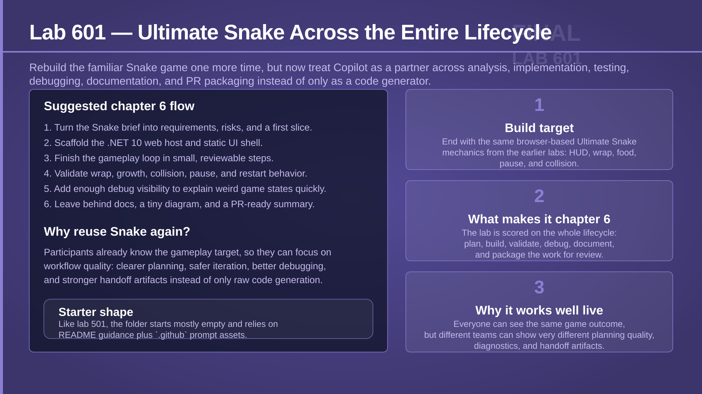

> **TL;DR:** This lab rebuilds Snake while using Copilot across analysis, coding, testing, debugging, documentation, and PR packaging.

The lab asks participants to treat Copilot as a partner from the first requirements discussion to the final PR summary. Because everyone already understands the target game, the focus shifts from product discovery to workflow quality across the lifecycle.

This matters because it turns the chapter into practice. Participants can experience how disciplined AI usage compounds across many stages instead of only during implementation.

→ [Lab 601 — Ultimate Snake Across the Entire Lifecycle](../../../labs/chapter-6/lab-601/README.md)

## Slide 57 — Lab 601 — Expectations

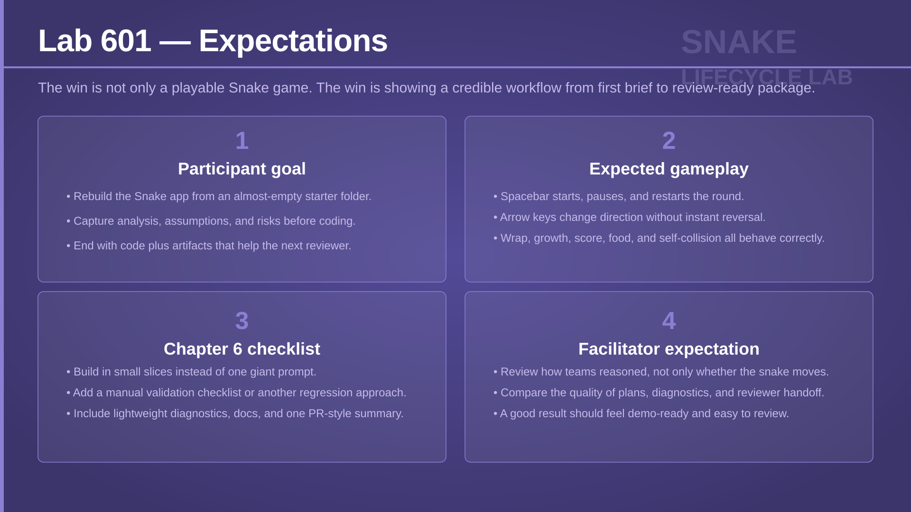

> **TL;DR:** Participants should finish with a working Snake game plus the supporting artifacts a teammate or reviewer would need.

This slide defines success for the lab: capture assumptions and risks before coding, build the expected gameplay behaviours, and produce the surrounding artifacts such as documentation, diagnostics, and a PR summary. It makes clear that the deliverable is more than just playable code.

The slide also reinforces the chapter's end-to-end mindset. A strong result includes implementation quality, validation evidence, and communication for the next person in the lifecycle.

→ [Lab 601 — Ultimate Snake Across the Entire Lifecycle](../../../labs/chapter-6/lab-601/README.md)

---

[🏠 Workshop Home](../../../README.md) | [📝 Chapter Overview](README.md) | [← Chapter 2](../chapter-2/README.md) | [Chapter 4 →](../chapter-4/README.md)
