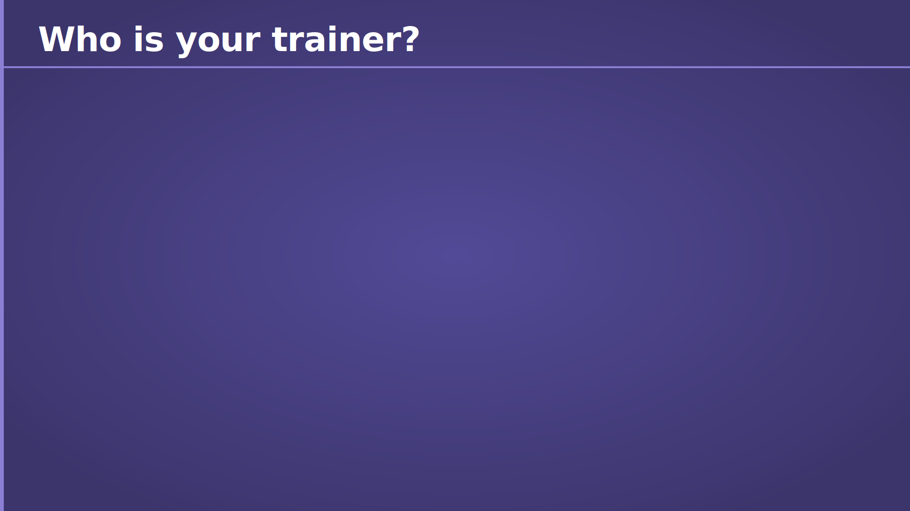
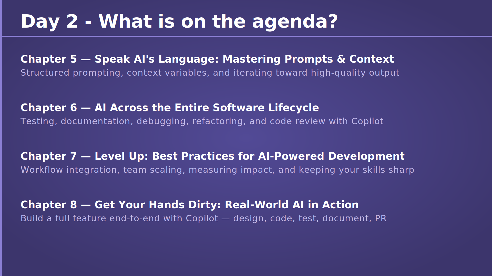
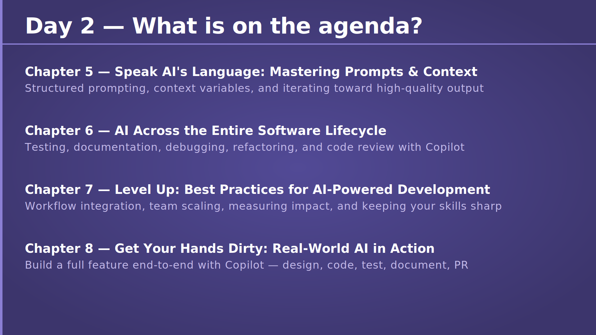
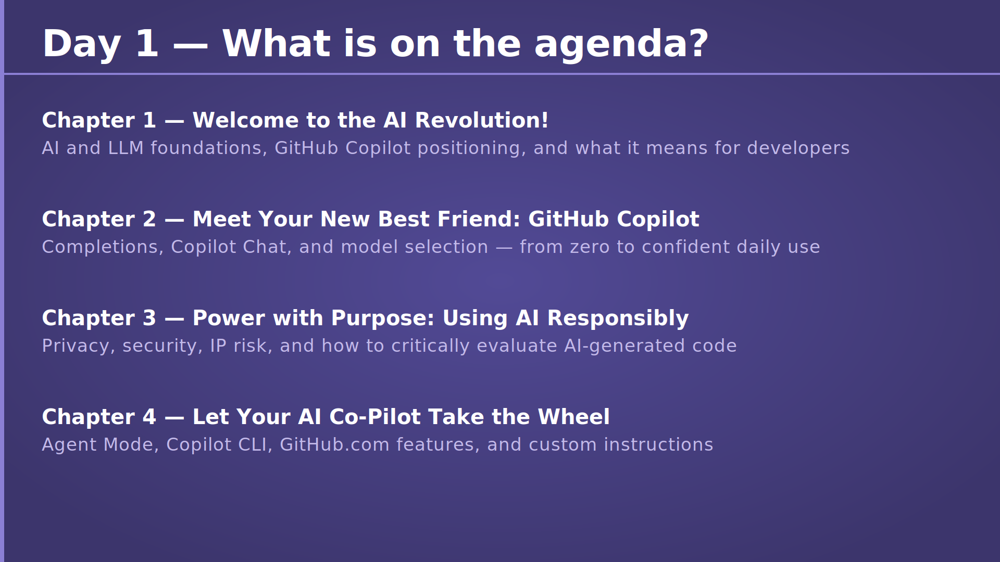

# Chapter 0 — Introduction

## Slide 01 — AI4Dev

## Slide 02 — Who is your trainer?

## Slide 03 — Where can you find the resources?

## Slide 04 — My Stance on GenAI Tooling

## Slide 05 — A Quick Disclaimer

## Slide 06 — Before We Start — Set Up Your Laptop

## Slide 07 — Who are you?

## Slide 08 — Day 1 - What is on the agenda?

## Slide 09 — Day 2 - What is on the agenda?

