# Chapter 1 — Welcome to the AI Revolution!
## Slide 01 — AI4Dev

> **TL;DR:** This chapter introduces the AI concepts developers need before using tools like Copilot well.

This opening slide reminds the audience of the workshop theme: use AI to develop smarter, but stay in control. Chapter 1 sets the foundation by explaining what modern AI is, how large language models behave, and why that matters for software developers.

## Slide 02 — Chapter 1 — Welcome to the AI Revolution!

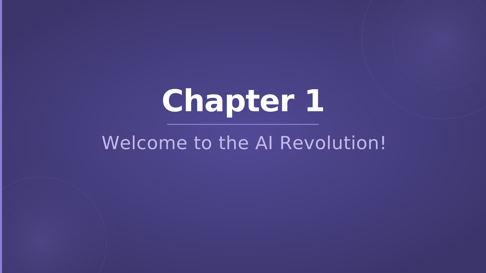

> **TL;DR:** Chapter 1 is about understanding the AI shift so you can use it confidently instead of treating it like a black box.

This chapter title slide marks the move from introduction into fundamentals. The goal is not to turn everyone into AI researchers, but to give developers a practical mental model for the tools they will use throughout the rest of the workshop.

## Slide 03 — Interactive poll A

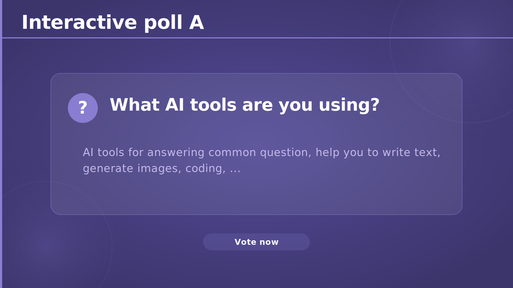

> **TL;DR:** This poll checks which AI tools the group is already using today.

This question helps the trainer understand the room. Some participants may already use chat tools, image generators, or coding assistants regularly, while others may still be experimenting. Knowing that starting point makes it easier to tailor examples and pace.

## Slide 04 — Interactive poll B

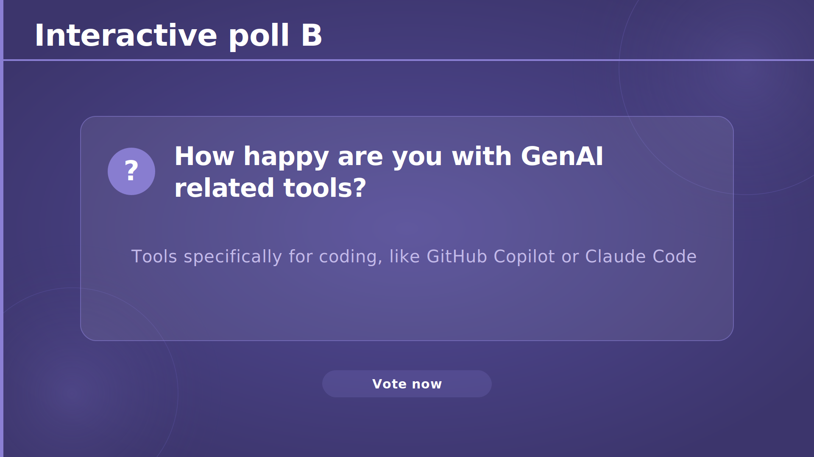

> **TL;DR:** This poll measures how satisfied participants are with current GenAI tooling for coding work.

The point here is not just tool adoption, but actual experience. A team may already be using tools like GitHub Copilot or Claude Code, yet still feel mixed about the quality, speed, or trustworthiness of the results. That tension is useful context for the chapter discussion.

## Slide 05 — Interactive poll C

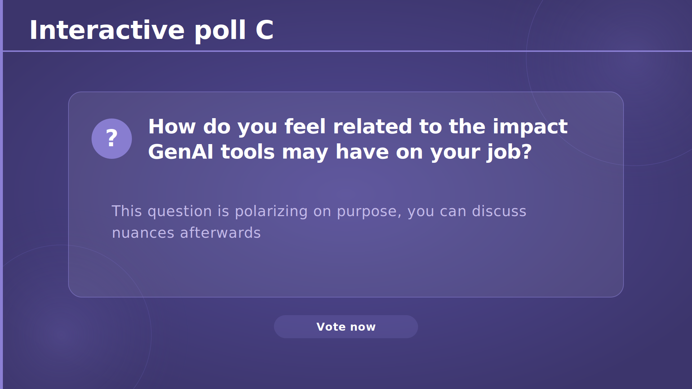

> **TL;DR:** This poll surfaces how people feel about the effect AI may have on their role as developers.

This is intentionally a more emotional and more polarizing question. It opens the door to an honest conversation about optimism, skepticism, job impact, and the difference between fear of replacement and excitement about better tooling.

## Slide 06 — The Evolution of AI

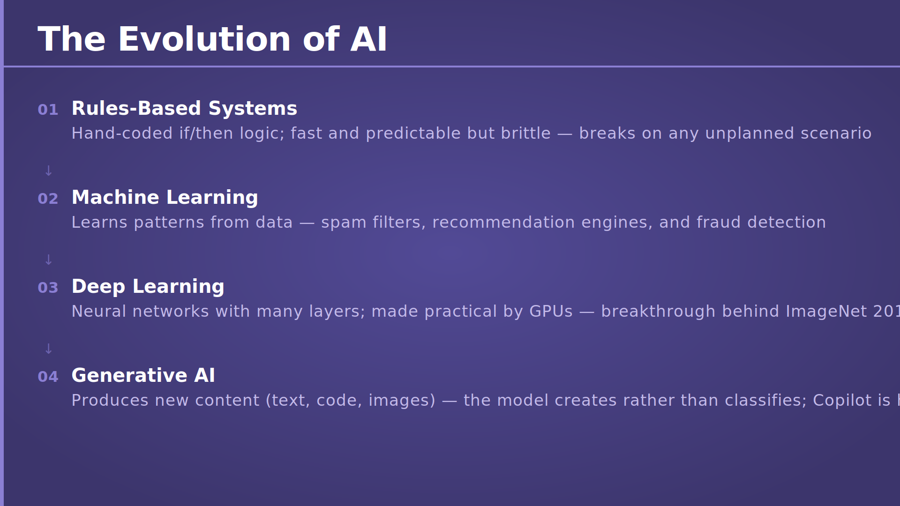

> **TL;DR:** Modern generative AI is the latest step in a longer evolution from fixed rules to learned models that can create content.

This slide gives a simple timeline of how AI developed. Rules-based systems were predictable but fragile, machine learning learned patterns from data, deep learning unlocked more complex capabilities, and generative AI shifted from classifying content to creating new output.

That progression matters because it explains why tools like Copilot feel different from older software. They are not following a handcrafted decision tree. They are using learned statistical patterns to generate plausible text and code in real time.

## Slide 07 — Types of Machine Learning

> **TL;DR:** Supervised, unsupervised, and reinforcement learning solve different kinds of problems and require different kinds of feedback.

This slide separates three major machine learning approaches. Supervised learning needs labelled examples, unsupervised learning looks for structure without labels, and reinforcement learning improves through trial, error, and rewards.

For developers, this is useful vocabulary. It helps you place AI systems in context and understand why a spam filter, a recommendation engine, and an agent that learns from rewards are all AI, but not built in the same way.

## Slide 08 — The Reinforcement Learning Loop

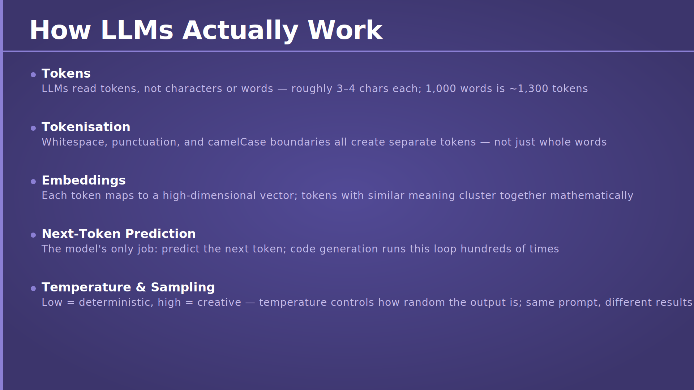

> **TL;DR:** Reinforcement learning improves behavior by letting an agent act, observe outcomes, and learn from rewards or penalties.

This slide shows reinforcement learning as a loop instead of a one-time training step. An agent takes an action, the environment responds, the result is evaluated, and that reward signal helps update the agent's policy for future choices.

That cycle is helpful to understand because it shows where learning comes from. The model is not given all the answers up front; it gradually improves by discovering which strategies lead to better outcomes over time.

## Slide 09 — Generative AI — The GAN Idea

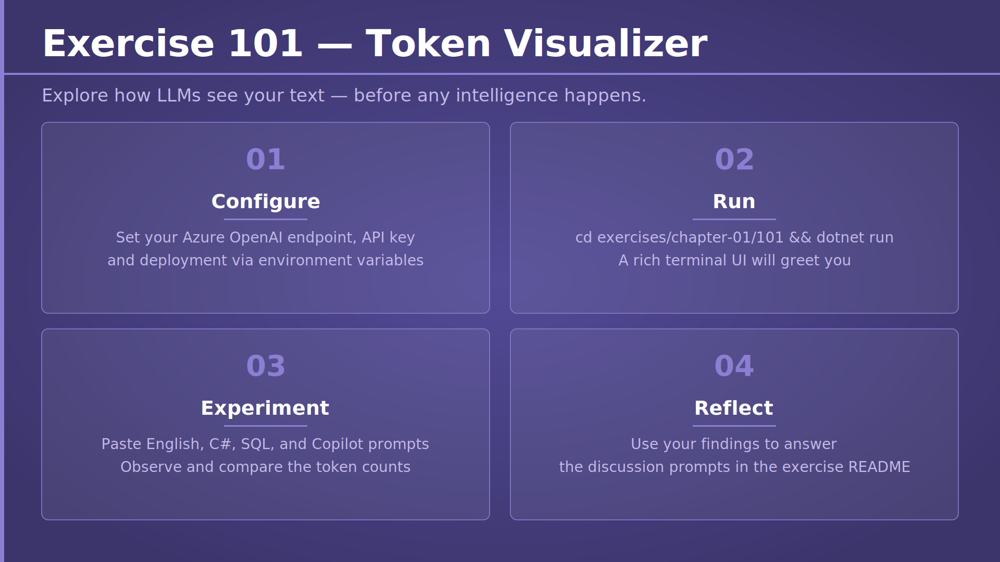

> **TL;DR:** GANs learn to generate realistic content through a competition between a creator and a critic.

This slide introduces the classic generator-versus-discriminator idea. One network tries to create something realistic, while the other tries to detect whether it is fake, and both improve through that repeated contest.

Even if participants never build a GAN themselves, the concept is useful because it makes generative AI less mysterious. It shows that realistic output can emerge from structured training loops, not from human-like understanding.

## Slide 10 — AI Is Not One Thing — A Quick Taxonomy

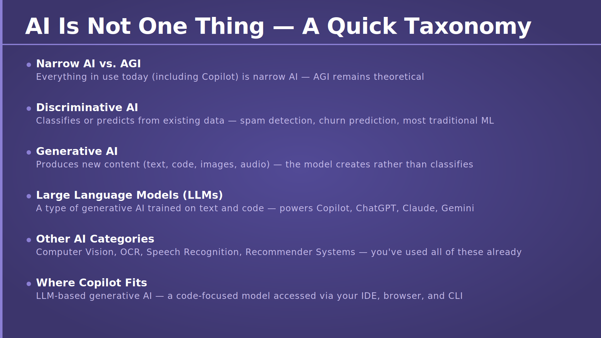

> **TL;DR:** AI is a broad family of techniques, and Copilot is specifically an LLM-based generative AI tool.

This slide clears up a common source of confusion: people often say "AI" as if it were one single thing. In reality, computer vision, recommenders, fraud detection, OCR, speech systems, and large language models are different categories with different strengths.

That matters because it helps participants position Copilot correctly. It is not general intelligence, and it is not every kind of AI. It is a narrow, code-focused application of generative AI built on large language models.

## Slide 11 — What Is an AI Model?

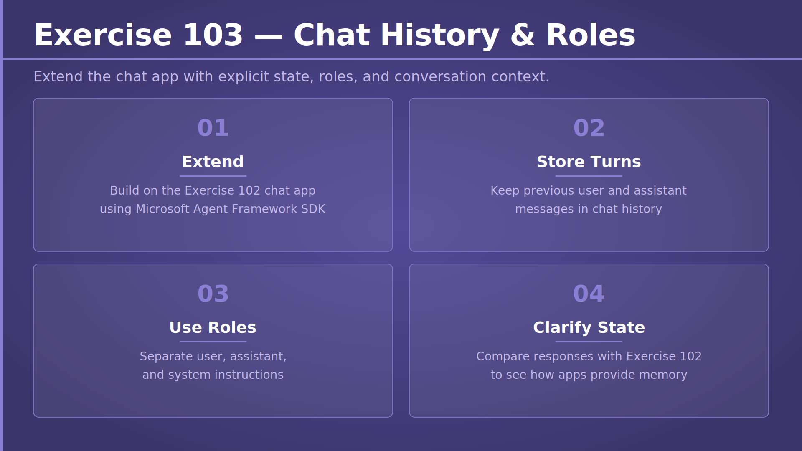

> **TL;DR:** An AI model is a trained system that maps input to output, and an LLM is one specific kind of generative model.

This slide builds a clean hierarchy. First, an AI model is any trained system that has learned patterns from data. Then, generative AI is the subset that creates new content, and LLMs are the subset focused on language, including code.

This framing helps developers avoid mixing up terms. Every LLM is an AI model, but many AI models have nothing to do with text generation. Keeping that distinction clear makes later discussions much easier to follow.

## Slide 12 — How LLMs Actually Work

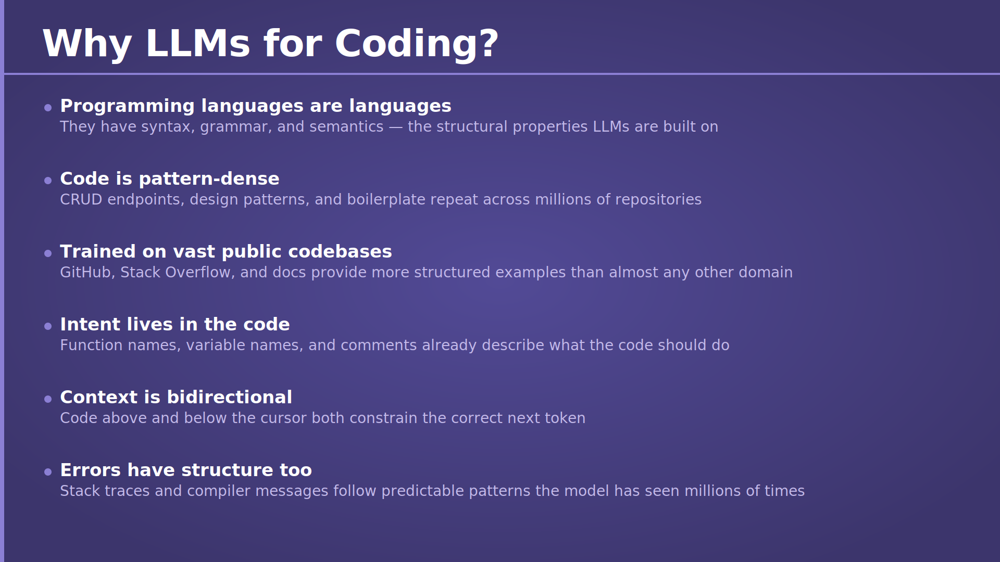

> **TL;DR:** LLMs work by turning text into tokens and repeatedly predicting the most likely next token.

This slide breaks the mystery into practical pieces: tokens, tokenisation, embeddings, next-token prediction, and sampling. The core idea is simple but powerful: the model does not "think" in words the way humans do; it processes token sequences mathematically and predicts what should come next.

For developers, the token point is especially important. Prompt size, code size, cost, and context-window limits are all tied to tokens, not to files or lines of code. That is why prompt quality and context selection matter so much.

## Slide 13 — LLM Temperature — Choosing the Right Setting

> **TL;DR:** Lower temperature gives more consistent output, while higher temperature increases variety and creativity.

This slide explains temperature as a practical control for output randomness. Low settings are better for code, data extraction, and other tasks where precision matters, while higher settings are more useful for brainstorming or creative writing.

It is helpful to treat temperature as a trade-off knob. If you want repeatable, careful answers, keep it low. If you want more diversity in ideas, raise it—but expect less predictability.

## Slide 14 — Exercise 101 — Token Visualizer

> **TL;DR:** In this exercise, participants explore how text and code are split into tokens before an LLM can use them.

This exercise builds intuition for one of the most important mechanics behind LLMs: tokenisation. Participants will configure Azure OpenAI access, run the console app, and paste in different kinds of content such as English text, C# code, SQL, and real prompts to compare token counts.

Step by step, they will observe how the same idea can consume different numbers of tokens depending on wording and formatting. The skill being practiced is not just setup, but learning to think in terms of context size, cost, and how models "see" the input they receive.

→ [Exercise 101 — Token Visualizer](../../../exercises/chapter-01/exercise-101/README.md)

## Slide 15 — Exercise 102 — Stateless LLM Chat

> **TL;DR:** This exercise shows that a basic chat app has no memory unless the application explicitly provides it.

Participants will build and run a simple terminal chat application using the Microsoft Agent Framework and Azure OpenAI. They will send prompts one at a time, receive streamed responses, and deliberately avoid storing earlier messages between turns.

The main skill here is understanding stateless interaction. By asking follow-up questions and seeing the model lose context, participants learn that memory is not automatic in an LLM-based app—the developer has to design and supply it.

→ [Exercise 102 — Stateless LLM Chat](../../../exercises/chapter-01/exercise-102/README.md)

## Slide 16 — Exercise 103 — Chat History & Roles

> **TL;DR:** This exercise adds history and system roles so the chat app can remember context and behave more deliberately.

Participants extend the previous chat app instead of starting from scratch. They will keep earlier user and assistant messages, separate system instructions from normal conversation, and compare the resulting behavior with the stateless version from Exercise 102.

The skill being practiced is stateful AI application design. Step by step, participants will see how chat history creates continuity and how role messages shape tone, behavior, and expectations in every later response.

→ [Exercise 103 — Chat History & Roles](../../../exercises/chapter-01/exercise-103/README.md)

## Slide 17 — Why LLMs for Coding?

> **TL;DR:** LLMs fit coding well because source code is structured, repetitive, and rich in patterns and intent.

This slide explains why code generation is such a strong use case for language models. Programming languages have syntax and grammar, large codebases repeat common patterns, and identifiers plus comments often reveal intent directly.

It also highlights why developer tooling benefits from context. The correct next token in code is constrained by what appears above and below the cursor, and even compiler errors and stack traces follow patterns the model can learn from.

## Slide 18 — Why LLMs "Hallucinate"

> **TL;DR:** LLMs hallucinate because they generate likely-looking output, not verified truth.

This slide is essential for responsible use. The model does not check whether an API really exists or whether a claim is factually correct; it predicts tokens that statistically fit the context it has been given.

That is why hallucinations can sound so convincing. If the prompt lacks grounding or the topic is niche, the model may confidently produce something plausible but wrong. The takeaway for developers is simple: verify, especially when correctness matters.

## Slide 19 — The Training Pipeline

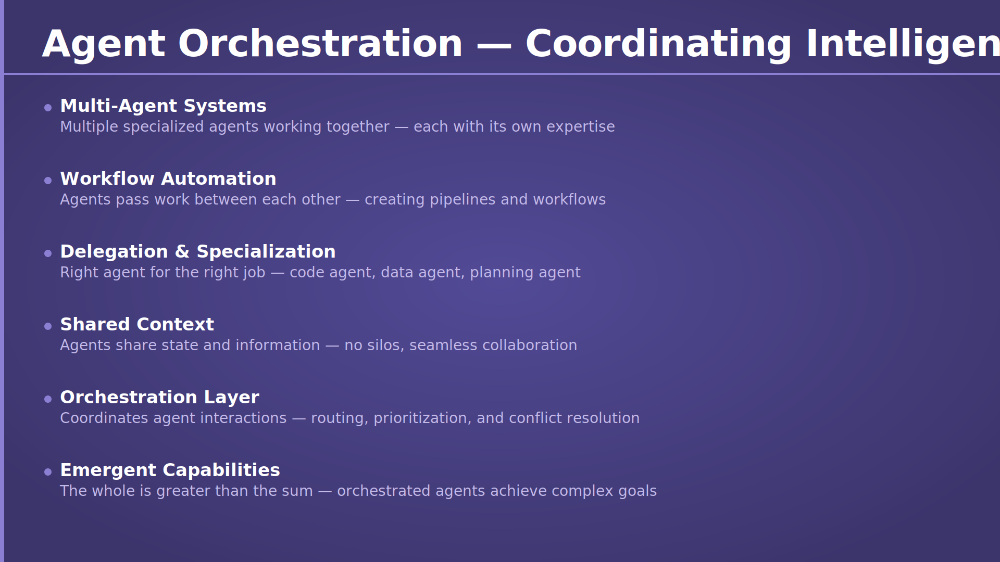

> **TL;DR:** LLMs become useful through staged training: broad pre-training, targeted fine-tuning, and human feedback.

This slide shows that helpful AI behavior does not come from one single step. First the model learns language patterns from huge amounts of raw text and code, then it is adapted to follow instructions, and finally human preferences help shape what "good" answers look like.

It also introduces an important limitation: the knowledge cutoff. Models only know what was in their training data up to a certain point, which is one reason they need prompt context, tools, or retrieval for up-to-date information.

## Slide 20 — Context Windows

> **TL;DR:** An LLM can only work with the tokens currently inside its context window, so context selection matters a lot.

This slide describes the context window as the model's working memory for one interaction. Prompts, prior messages, open files, and injected snippets all compete for that limited space.

For developers, this explains why good results depend so much on what information is included. Clear instructions, the right files, and the right error messages can dramatically improve output, while long irrelevant context can dilute the model's focus.

## Slide 21 — RAG — Giving an LLM the Right Knowledge

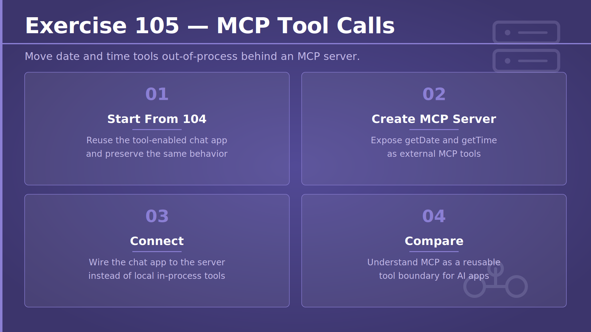

> **TL;DR:** RAG improves answers by retrieving relevant external information and placing it into the model's context at runtime.

This slide introduces retrieval-augmented generation as a grounding technique. Instead of hoping the model already knows the answer from training, your application first fetches relevant evidence and then asks the model to answer with that evidence in view.

That is a powerful design pattern for developer tools and internal systems. It helps reduce hallucinations around company-specific knowledge, but it is still just grounding—it does not retrain the model or give it the ability to act on the world by itself.

## Slide 22 — Exercise 104 — Tool Calls

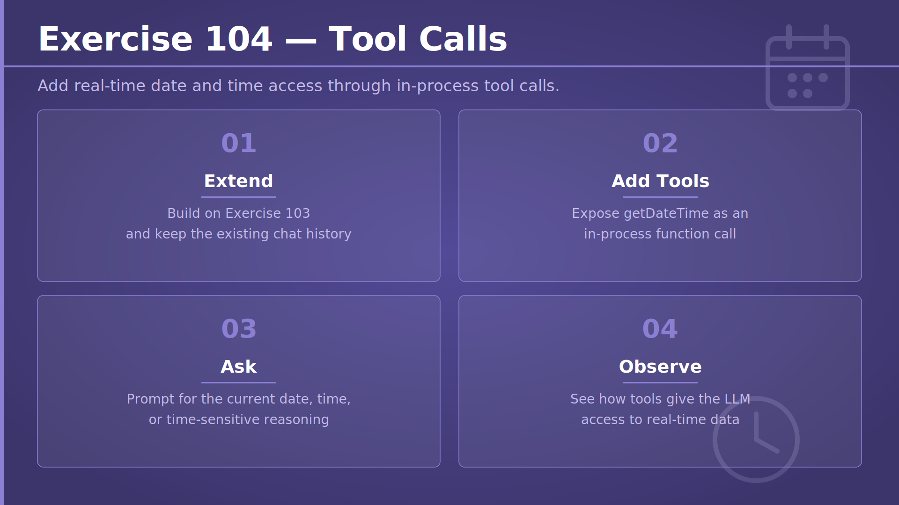

> **TL;DR:** This exercise teaches participants how to give an LLM access to live data through local function calls.

Participants build on the chat app from Exercise 103 and add simple in-process tools such as getting the current date or time. They will run the application, ask time-sensitive questions, and observe when the model chooses to call a tool instead of guessing.

The skill being practiced is tool integration. Step by step, participants learn that models are strongest when they can combine language generation with well-described functions that provide fresh, reliable data.

→ [Exercise 104 — Tool Calls](../../../exercises/chapter-01/exercise-104/README.md)

## Slide 23 — Exercise 105 — MCP Tool Calls

> **TL;DR:** This exercise moves tools into a separate MCP server so the chat client can discover and use them remotely.

Participants take the date and time scenario from the previous exercise and split it into two parts: an MCP server that exposes tools and a client that connects to that server. They will start the server, run the client, and compare the user experience with the in-process version.

The skill here is understanding tool boundaries and reuse. By working through the client-server setup step by step, participants see how MCP makes tools portable across AI applications instead of embedding the same logic into every single app.

→ [Exercise 105 — MCP Tool Calls](../../../exercises/chapter-01/exercise-105/README.md)

## Slide 24 — Beyond Chatbots — What Makes an AI Agent?

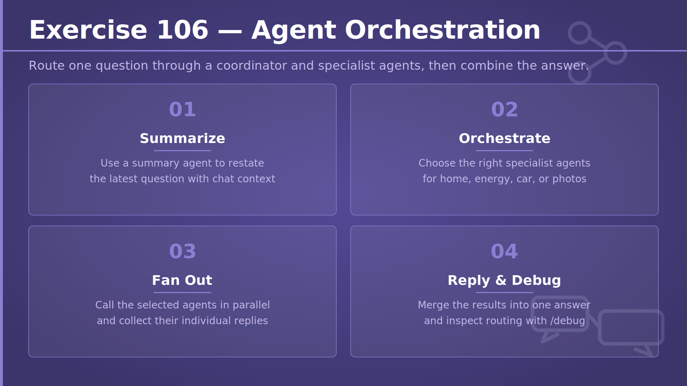

> **TL;DR:** An AI agent goes beyond answering questions by using memory, tools, and decision-making to take action.

This slide distinguishes a chatbot from an agent. A chatbot mainly reacts to prompts, while an agent can keep state, call external systems, plan multi-step work, and sometimes act proactively when conditions are met.

That distinction is important because many modern AI workflows are moving from conversation toward execution. Developers need to understand what additional responsibilities appear when software starts making decisions and interacting with real systems.

## Slide 25 — Agent Orchestration — Coordinating Intelligence

> **TL;DR:** Agent orchestration is about coordinating multiple specialized agents so they can solve larger problems together.

This slide explains why one general-purpose agent is not always the best design. In more complex workflows, you may want separate agents for planning, coding, searching, or domain-specific tasks, with an orchestration layer deciding who should do what.

The key idea is specialization plus coordination. When agents share context and pass work intentionally, the overall system can handle broader tasks while keeping each component focused on a clear responsibility.

## Slide 26 — Exercise 106 — Agent Orchestration

> **TL;DR:** This exercise lets participants build a multi-agent flow that routes one request through a coordinator and relevant specialists.

Participants will configure the application, run the orchestrated assistant, and try questions that may require different specialist agents. They will also use the debug mode to see how summarizing, routing, parallel fan-out, and final reply synthesis happen behind the scenes.

The skill being practiced is multi-agent design. Step by step, participants learn how a coordinator can break down a request, delegate pieces to the right agents, and merge the results into one final answer for the user.

→ [Exercise 106 — Agent Orchestration](../../../exercises/chapter-01/exercise-106/README.md)

## Slide 27 — Interactive Quiz 1

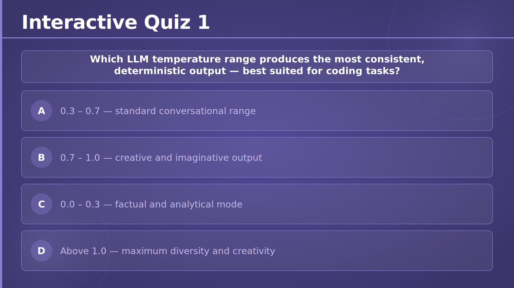

> **TL;DR:** This quiz checks whether participants understand which temperature range is best for stable coding output.

The question tests a practical concept from the earlier temperature slide. Participants should recognize that coding tasks usually benefit from the lowest randomness setting because consistency matters more than creativity.

## Slide 28 — Interactive Quiz 1 — Answer

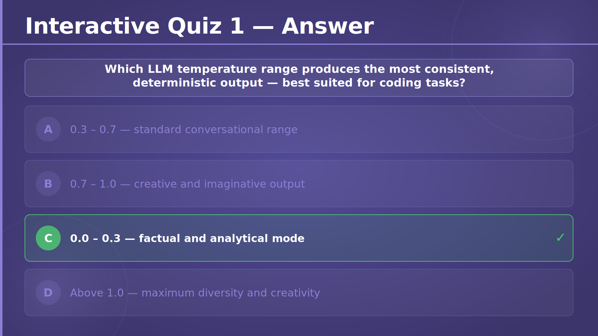

> **TL;DR:** The correct answer is C: the 0.0–0.3 range is best for the most consistent output.

This answer slide confirms that low temperature is the right choice when you want predictable, repeatable results, especially for technical and coding tasks.

## Slide 29 — Interactive Quiz 1 — Explanation

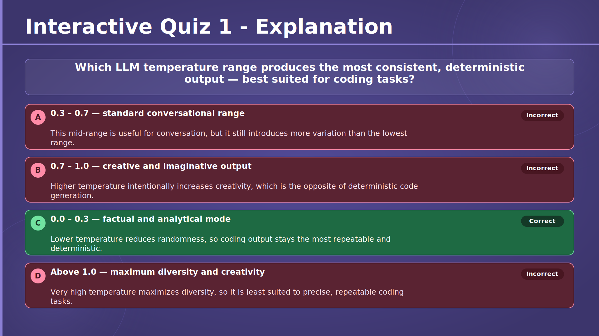

> **TL;DR:** Lower temperature reduces randomness, which is why it is the safest default for precise coding work.

This explanation reinforces the logic behind the correct answer. Mid-range and high temperatures are useful in other situations, but they introduce more variation than most developers want when generating code.

## Slide 30 — Interactive Quiz 2

> **TL;DR:** This quiz checks whether participants can recognize reinforcement learning from a reward-based learning scenario.

The question uses AlphaGo as a familiar example. Participants are expected to connect trial and error plus a reward signal with reinforcement learning rather than with supervised or unsupervised approaches.

## Slide 31 — Interactive Quiz 2 — Answer

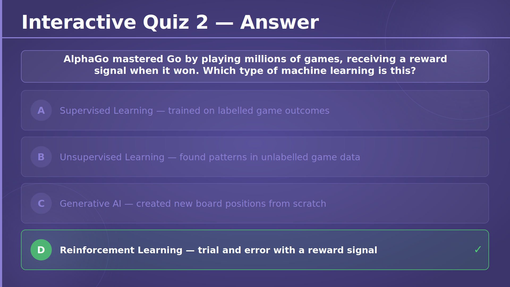

> **TL;DR:** The correct answer is D: AlphaGo's learning pattern is reinforcement learning.

This answer slide confirms that reward-driven improvement through repeated play is the defining clue that points to reinforcement learning.

## Slide 32 — Interactive Quiz 2 — Explanation

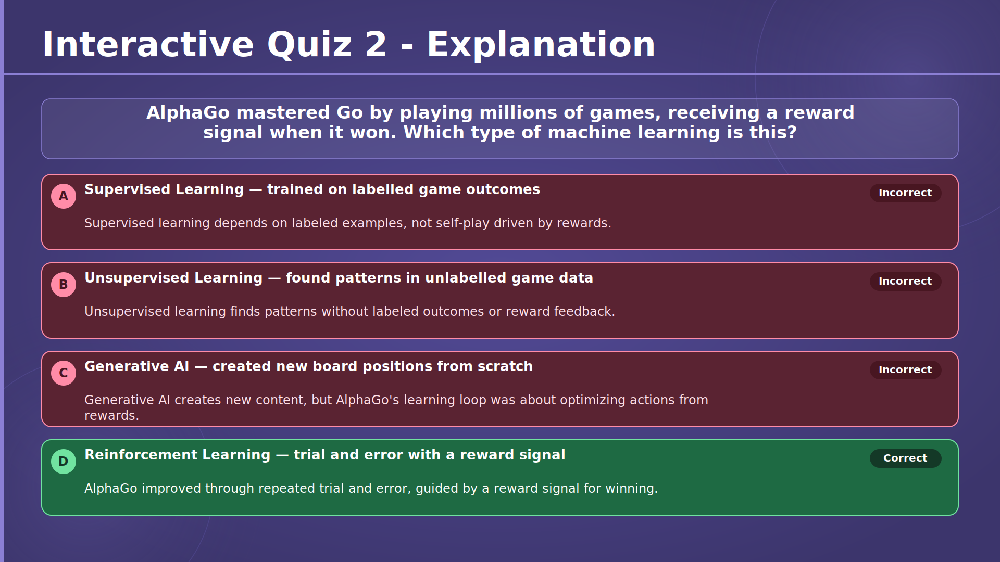

> **TL;DR:** Reinforcement learning is the right answer because the system improves by trying actions and learning from rewards.

This explanation connects the example back to the reinforcement loop shown earlier. AlphaGo did not learn from labelled examples alone; it improved by exploring and being rewarded for better outcomes.

## Slide 33 — Interactive Quiz 3

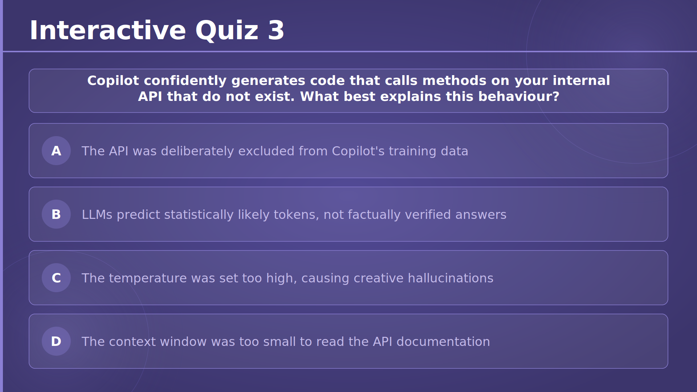

> **TL;DR:** This quiz checks whether participants understand why LLMs can confidently invent nonexistent API details.

The question is really about hallucination mechanics. Participants should identify that the model is generating statistically likely code patterns, not checking whether an internal API truly contains those members.

## Slide 34 — Interactive Quiz 3 — Answer

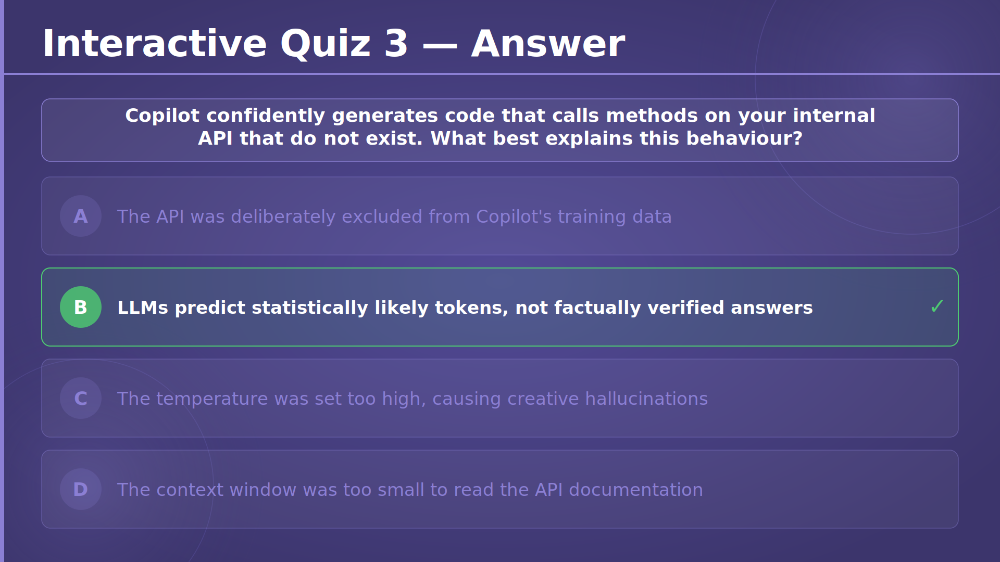

> **TL;DR:** The correct answer is B: LLMs generate likely tokens, not fact-checked answers.

This answer slide confirms the central limitation behind many AI coding mistakes. Confidence in the wording does not mean the generated code is grounded in reality.

## Slide 35 — Interactive Quiz 3 — Explanation

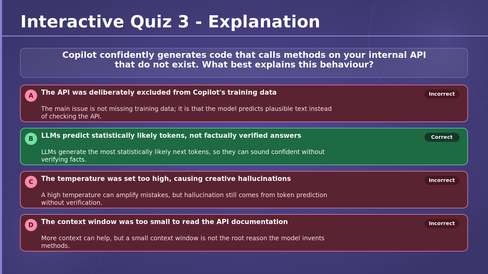

> **TL;DR:** The model sounded convincing because token prediction can produce plausible code even when the underlying fact is wrong.

This explanation ties the example back to the earlier hallucination slide. Unless the needed API details are present in context or retrieved from a trusted source, the model may fill the gap with a believable but incorrect guess.
