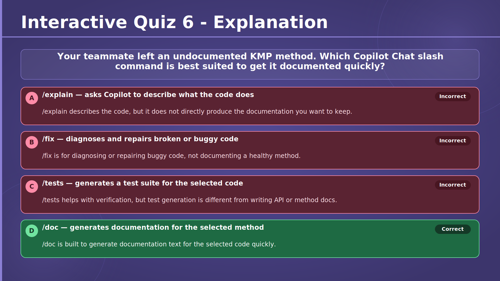
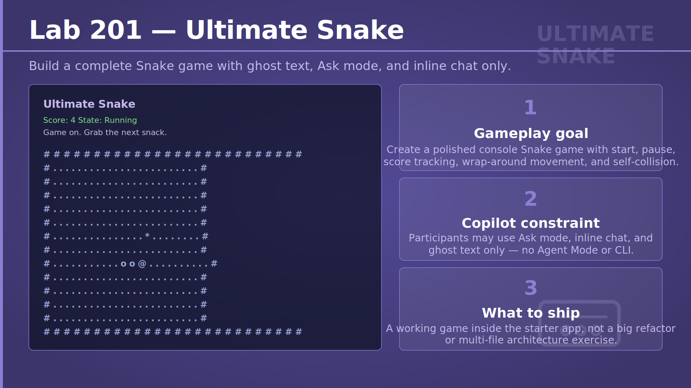
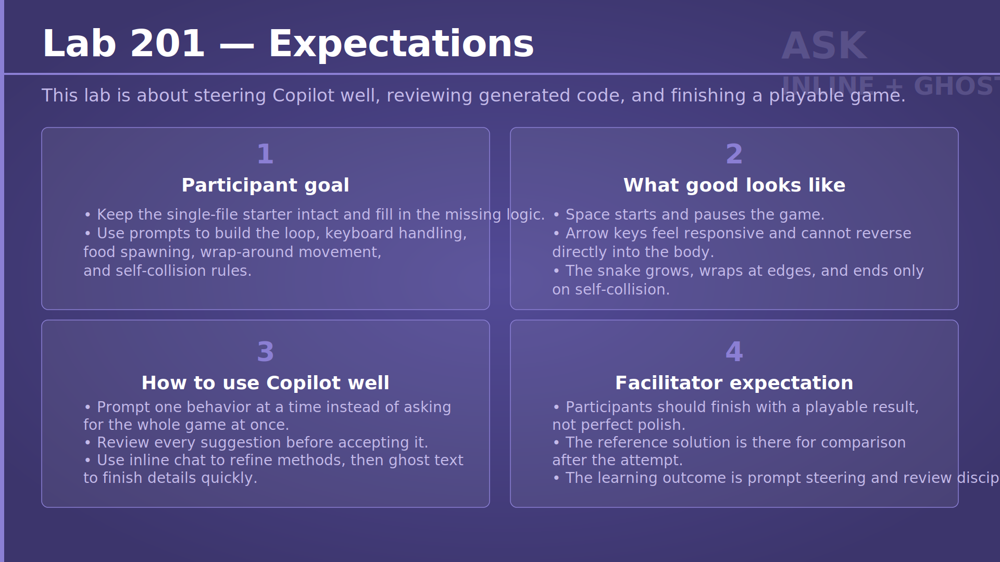

# Chapter 2 — Meet Your New Best Friend: GitHub Copilot
## Slide 01 — AI4Dev

> **TL;DR:** AI can speed up development, but you still stay responsible for direction and quality.

This opening slide sets the tone for the chapter: we want to use AI as a practical development partner, not as a replacement for engineering judgment. Throughout the workshop, the goal is to work faster with GitHub Copilot while still reviewing, testing, and deciding what belongs in your codebase.

## Slide 02 — Chapter 2 — Meet Your New Best Friend: GitHub Copilot

> **TL;DR:** Chapter 2 is about learning the day-to-day Copilot workflows that help developers code faster.

In this chapter, we move from the high-level AI4Dev theme into hands-on GitHub Copilot usage. You will practise core features such as ghost text, Ask mode, slash commands, inline chat, and light prompt steering so you can use Copilot confidently in normal development work.

## Slide 03 — Copilot Billing Is Changing

> **TL;DR:** Copilot billing is shifting from counting requests to counting token usage through GitHub AI Credits.

This slide introduces an important platform change that affects how advanced Copilot usage is priced. Instead of treating every request as roughly the same, GitHub now measures the actual amount of model work by counting input, cached, and output tokens.

For developers, this means model choice and prompt size matter more directly. Small interactions and long agentic sessions no longer look identical from a billing perspective, which makes pricing more transparent but also more tied to how you use the tools.

## Slide 04 — Why GitHub Is Moving

> **TL;DR:** GitHub changed billing because modern Copilot usage varies widely in complexity and cost.

Copilot is no longer just an autocomplete tool. It can now answer questions, plan multi-step work, reason across files, and support long-running coding sessions, so one simple request can cost far less than another.

The new model reflects that reality better. It lets usage align with real compute, gives administrators clearer ways to manage budgets, and still keeps traditional code completions unlimited on paid plans.

## Slide 05 — Input Tokens vs Cached Tokens vs Output Tokens

> **TL;DR:** Token-based billing separates new prompt content, reused context, and generated output because they do not cost the same.

When you use Copilot, you send fresh information in the current request, some older context may be reused from cache, and the model sends back new output. Those three token buckets are priced differently, which is why understanding them helps explain why one interaction is cheap and another is expensive.

The practical takeaway is simple: long, verbose answers usually cost more than short ones, and stable reused context is often cheaper than resending everything from scratch.

## Slide 06 — Model Pricing Examples

> **TL;DR:** Different models have different token prices, so cost depends on both the model and the kind of tokens used.

This pricing table makes the abstract billing model concrete. Faster, smaller models are usually cheaper, while stronger reasoning models tend to cost more, especially for output tokens.

You do not need to memorize the numbers, but you should notice the pattern. Choosing a model is now a trade-off between quality, speed, context needs, and cost, especially in longer chat or agent scenarios.

## Slide 07 — Interactive poll D

> **TL;DR:** This poll helps the room compare which models people actually use in their coding tools.

The point of this interactive moment is not to find one universally best model. It is to surface real-world habits in the audience and start a conversation about why different developers pick different models for speed, reasoning quality, latency, cost, or ecosystem fit.

## Slide 08 — Code Completions — Copilot Ghost-Text Suggestions

> **TL;DR:** Ghost text is fastest when you treat it as a preview to guide and review, not as code to accept blindly.

Ghost-text suggestions appear inline while you type, so they fit naturally into normal coding flow. They work best when your intent is already visible through names, structure, and short comments, because Copilot can then continue the thought you started.

The important habit is to stay in control. Accept useful suggestions quickly, dismiss bad ones without hesitation, and review accepted code exactly as you would review a human-generated draft.

## Slide 09 — Browse Alternatives & Accept Incrementally

> **TL;DR:** You can refine ghost-text usage by browsing alternatives and accepting only the useful part of a suggestion.

Many developers think the only choice is accept or reject, but Copilot gives you more control than that. If the first suggestion is close but not quite right, you can cycle through alternatives or accept it one word at a time.

That matters because AI output is often partially useful. Instead of throwing away a near miss or accepting too much, you can keep the strong start and stay precise about what enters your file.

## Slide 10 — Exercise 201 — Factorial Calculator

> **TL;DR:** Exercise 201 builds confidence with ghost text by implementing factorial logic in small, reviewable steps.

Participants start in `Calculator.cs` with empty methods and use a short guiding comment to invite completions for both iterative and recursive solutions. The exercise is deliberately simple so the focus stays on how ghost text behaves, not on difficult domain logic.

The key workflow is: add intent, review the suggestion, accept only what helps, and then verify with tests. By comparing two implementations of the same algorithm, you also get a clean way to judge whether the generated code is actually correct.

→ [Exercise 201 — Factorial Calculator](../../../exercises/chapter-02/exercise-201/README.md)

## Slide 11 — Exercise 202 — Palindrome Checker

> **TL;DR:** Exercise 202 teaches you to steer Copilot line by line instead of asking for a whole solution at once.

In this exercise, you break the palindrome checker into small intent comments such as normalizing case and removing non-alphanumeric characters. That structure gives Copilot tighter guidance and makes the generated logic easier to inspect.

The step-by-step flow matters as much as the final answer. Participants learn that shorter prompts, local comments, and active review usually produce more reliable code than one large hand-off prompt.

→ [Exercise 202 — Palindrome Checker](../../../exercises/chapter-02/exercise-202/README.md)

## Slide 12 — Ask — Copilot Chat Mode: Ask

> **TL;DR:** Ask mode is best when you need understanding or options before you start editing code.

This slide draws a clean line between asking Copilot to explain something and asking it to change something. Ask mode is useful when you want help understanding unfamiliar code, comparing approaches, or reasoning about an error before you commit to a fix.

That makes it a great thinking tool. The mental model is to ask first, form a view, and then move into editing with more confidence instead of using AI as a black box.

## Slide 13 — Exercise 203 — Mystery Processor

> **TL;DR:** Exercise 203 trains you to use Copilot for code comprehension before you rely on tests or assumptions.

Participants inspect an intentionally unclear implementation and use chat, especially `/explain`, to build a hypothesis about what the code is doing. The challenge is to interpret the behavior rather than immediately jump to the answer through tests.

This develops a valuable habit: use AI to accelerate understanding, but verify the explanation against actual behavior. You are practising interpretation, not blind trust.

→ [Exercise 203 — Mystery Processor](../../../exercises/chapter-02/exercise-203/README.md)

## Slide 14 — Slash Commands — Copilot Chat Slash Commands

> **TL;DR:** Slash commands improve Copilot Chat by making your intent explicit from the start.

A slash command gives the chat session a clear job such as explaining code or fixing an error. That saves time and often produces a better first response because the tool knows the task shape immediately.

Still, the command alone is not magic. The selected code, the failing test, the surrounding context, and your own prompt detail are what turn a generic response into a useful one.

## Slide 15 — Exercise 204 — Shortest Path

> **TL;DR:** Exercise 204 shows how `/fix` works best when you pair it with concrete failures and algorithm context.

Participants begin with failing tests, then select the Dijkstra implementation and try `/fix` with different amounts of context. This reveals an important lesson: the same tool becomes much more effective when you tell it what is wrong and what algorithm it is supposed to preserve.

The exercise also reinforces a disciplined repair loop. Apply the smallest correct change, rerun the tests, and keep iterating until the behavior matches the specification.

→ [Exercise 204 — Shortest Path](../../../exercises/chapter-02/exercise-204/README.md)

## Slide 16 — Copilot Chat Slash Command: /tests

> **TL;DR:** `/tests` is useful for drafting a starter test suite, but you still have to judge what is missing.

This command can quickly generate happy-path tests and a few common edge cases from an implementation. That is valuable because it removes some of the blank-page problem when starting a test file.

However, generated tests are only a draft. You still need to review assertions, look for missing business-specific cases, and decide whether the suite really protects the behavior you care about.

## Slide 17 — Exercise 205 — Caesar Cipher

> **TL;DR:** Exercise 205 practises using `/tests` as a starting point and then strengthening the result with human judgment.

Participants select the Caesar cipher code, ask Copilot to generate tests, and then inspect the output for gaps. Typical missing areas include wrap-around behavior, negative shifts, handling of non-letter characters, and round-trip expectations.

The real skill here is not test generation alone. It is learning to treat AI-generated tests as scaffolding that you extend until the suite covers the edge cases a real maintainer would worry about.

→ [Exercise 205 — Caesar Cipher](../../../exercises/chapter-02/exercise-205/README.md)

## Slide 18 — Inline Chat and /doc

> **TL;DR:** Inline chat and `/doc` are lightweight ways to edit and document code without leaving the editor flow.

Inline chat is helpful when the change is small and local, because it keeps the request anchored at the cursor. `/doc` serves a different purpose: it generates draft documentation for existing code so you can improve readability and maintainability.

Both features are productivity tools, not final authorities. You still need to review whether the edits are correct and whether the generated documentation really explains intent, parameters, return values, and tricky behavior.

## Slide 19 — Exercise 206 — String Search

> **TL;DR:** Exercise 206 uses `/doc` to turn a working but hard-to-read algorithm into something another developer can understand.

Participants first use `/explain` to understand the KMP implementation, then use `/doc` to generate XML documentation for the class or methods. This order matters because good documentation depends on real understanding, not just generated prose.

The refinement step is where the learning happens. You review summaries, parameters, remarks, and complexity notes so the final documentation helps the next reader grasp the algorithm quickly.

→ [Exercise 206 — String Search](../../../exercises/chapter-02/exercise-206/README.md)

## Slide 20 — Interactive Quiz 4

> **TL;DR:** This quiz checks whether you understand which token category usually drives Copilot cost the most.

The question tests the billing model introduced earlier and asks you to distinguish between input, cached, and output tokens. It reinforces the practical idea that not all parts of a Copilot interaction are priced equally.

## Slide 21 — Interactive Quiz 4 — Answer

> **TL;DR:** The correct answer is output tokens.

Output tokens are typically the most expensive bucket in GitHub Copilot AI Credits pricing.

## Slide 22 — Interactive Quiz 4 — Explanation

> **TL;DR:** Generated responses usually cost the most, so longer answers tend to be pricier.

This is why concise prompts and appropriately scoped tasks matter. When the model produces a lot of new text or code, you often pay more than you do for sending input or reusing cached context.

## Slide 23 — Interactive Quiz 5

> **TL;DR:** This quiz checks whether you know how to accept only part of a Copilot suggestion.

The concept being tested is fine-grained control during ghost-text completion. It is meant to confirm that you know the shortcut for keeping the useful beginning of a suggestion without taking the whole thing.

## Slide 24 — Interactive Quiz 5 — Answer

> **TL;DR:** The correct answer is Ctrl+Right.

Ctrl+Right accepts the next word of the current suggestion instead of the entire completion.

## Slide 25 — Interactive Quiz 5 — Explanation

> **TL;DR:** Accepting suggestions word by word helps when Copilot starts strong but finishes poorly.

This shortcut supports a more selective workflow. You can preserve momentum from a good opening while stopping before the suggestion drifts into code you would need to undo.

## Slide 26 — Interactive Quiz 6

> **TL;DR:** This quiz checks whether you can match a Copilot slash command to the right job.

Here the focus is on documentation workflows. The slide asks you to recognize which command is intended for quickly drafting docs for an existing implementation.

## Slide 27 — Interactive Quiz 6 — Answer

> **TL;DR:** The correct answer is `/doc`.

`/doc` is the slash command designed to generate documentation for selected code.

## Slide 28 — Interactive Quiz 6 — Explanation

> **TL;DR:** `/doc` is the fastest match when the goal is to document code, not explain or fix it.

The command gives Copilot a clear documentation task immediately, which is why it is a better fit than `/explain`, `/fix`, or `/tests` for this situation.

## Slide 29 — Lab 201 — Ultimate Snake

> **TL;DR:** Lab 201 asks you to build a full Snake game while staying within a limited set of Copilot workflows.

This lab combines the chapter's tools into a larger, more realistic build task. Participants use ghost text, Ask mode, and inline chat to add gameplay behavior such as movement, pause, scoring, growth, wrap-around, and self-collision without jumping to more autonomous modes.

The constraint is intentional. By limiting the available AI features, the lab forces you to practise prompt steering, decomposition, and review discipline while still shipping a complete experience.

→ [Lab 201 — Ultimate Snake](../../../labs/chapter-02/lab-201/README.md)

## Slide 30 — Lab 201 — Expectations

> **TL;DR:** The Snake lab rewards small prompts, careful review, and steady verification rather than one giant AI request.

This expectations slide explains what good workshop behavior looks like during the lab. Build one behavior at a time, check every suggestion before accepting it, and keep testing whether the game feels correct from a player's perspective.

The deeper lesson is that effective AI-assisted development is iterative. You get better results by guiding the tool through many small decisions than by hoping one big prompt will design and implement the whole game well.

→ [Lab 201 — Ultimate Snake](../../../labs/chapter-02/lab-201/README.md)
