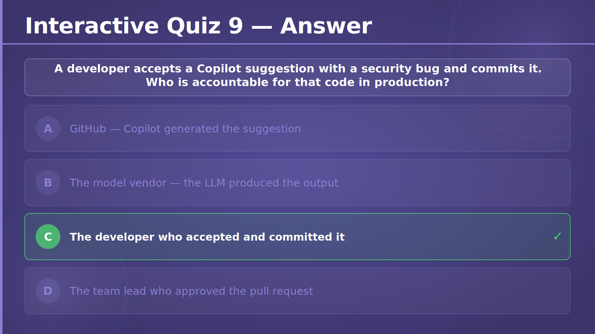
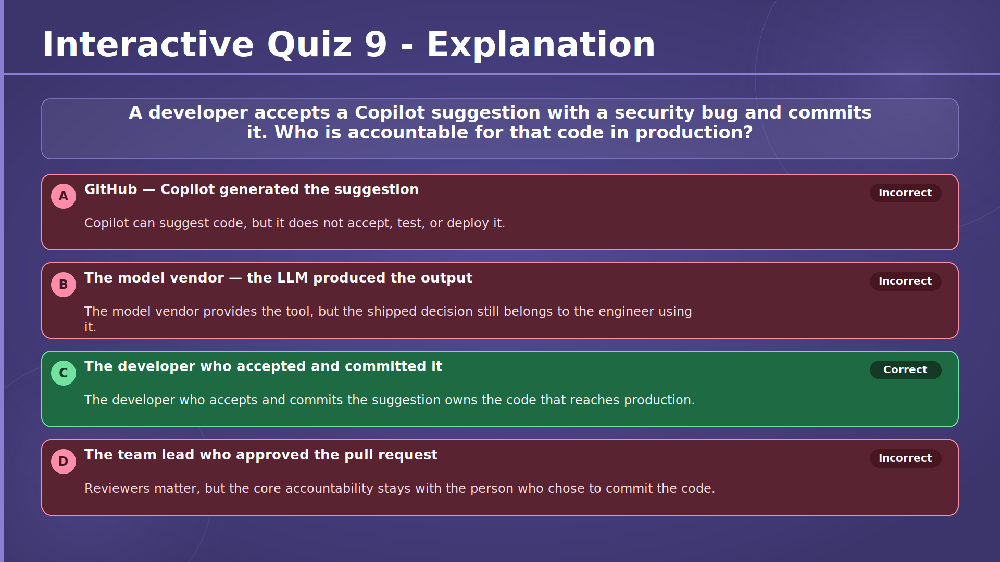

# Chapter 3 — Power with Purpose: Using AI Responsibly
## Slide 01 — AI4Dev

> **TL;DR:** Responsible AI means using powerful tools to move faster without giving up judgment and control.

This title slide introduces the chapter's central theme: AI can be genuinely useful for developers, but it must be used intentionally. The session focuses on practical responsibility, not abstract ethics alone, so the question is how to use tools like Copilot in ways that are fair, safe, secure, transparent, inclusive, and accountable.

## Slide 02 — Chapter 3 — Power with Purpose: Using AI Responsibly

> **TL;DR:** Chapter 3 is about using AI in development with clear principles and deliberate human oversight.

In this chapter, we move beyond features and productivity into responsible usage. You will look at how Copilot works, what data it uses, where risks come from, and what habits help developers stay effective without becoming careless.

## Slide 03 — Six Principles of Responsible AI

> **TL;DR:** Responsible AI in this workshop is organized around six principles that shape how we use and review AI tools.

These six principles give us a practical framework for thinking about AI in software development. Rather than treating responsible use as one vague idea, the chapter breaks it into fairness, reliability and safety, privacy and security, inclusiveness, transparency, and accountability.

The value of the framework is that it turns discussion into action. Each principle points to concrete developer behaviors, such as reviewing outputs for bias, validating generated code, protecting sensitive context, and remembering who owns the final decision.

<!-- Principle 1 — Fairness -->

## Slide 04 — Responsible AI — Fairness

> **TL;DR:** Fairness means checking whether AI output treats similar people and situations consistently.

For developers, fairness is not only a policy topic. It can show up directly in generated names, sample data, validation rules, recommendations, or user-facing logic that quietly favors one group over another.

With Copilot, the main habit is to review suggestions for assumptions you did not intend to encode. If training data contains skewed patterns, those patterns can reappear unless you notice and correct them.

## Slide 05 — Trained on a World of Public Code

> **TL;DR:** Copilot learned from public code, which means it inherits both useful patterns and public-code biases and mistakes.

This slide reminds participants that training data is messy because the real software world is messy. Public repositories contain excellent engineering practice, but they also contain outdated APIs, weak naming, insecure examples, and biased assumptions.

That is why suggestion quality varies. AI can reproduce strong community knowledge, but it can also reproduce the crowd's blind spots, so the developer must still judge what is appropriate.

## Slide 06 — Exercise 301 — Who Does Copilot Picture?

> **TL;DR:** Exercise 301 helps you notice how seemingly harmless generated sample data can reflect stereotypes.

Participants let Copilot suggest names, pronouns, and example values, then run the program and inspect the pattern that emerges. The goal is to surface defaults that may feel normal at first glance but still encode narrow assumptions about gender, ethnicity, or locale.

The mitigation step is crucial. You are not only spotting bias; you are redesigning the code so those defaults are more deliberate, inclusive, and appropriate for the scenario.

→ [Exercise 301 — Who Does Copilot Picture?](../../../exercises/chapter-03/exercise-301/README.md)

<!-- Principle 2 — Reliability & Safety -->

## Slide 07 — Responsible AI — Reliability & Safety

> **TL;DR:** Reliability and safety mean assuming AI output may be wrong and validating it before you depend on it.

Copilot can be impressively fluent, but fluency is not correctness. Suggestions can contain logic bugs, miss edge cases, or ignore error handling, and chat answers can sound confident even when they are incomplete.

A responsible workflow therefore includes review, tests, and defensive thinking. You should also remember that context can be manipulated, which is why prompt injection and hostile repository content matter in AI-assisted development.

## Slide 08 — Treat It Like Stack Overflow

> **TL;DR:** Treat Copilot like a fast source of ideas, not like an authority you can trust without understanding.

The Stack Overflow analogy is useful because it normalizes verification. Developers already know they should read, adapt, and test code from the internet instead of pasting it blindly into production.

The same rule applies here, with even more urgency because Copilot feels embedded and convenient. If you cannot explain the code line by line, you are not ready to own it.

## Slide 09 — Exercise 302 — Infix/Postfix with Ask Mode

> **TL;DR:** Exercise 302 builds reliability habits by making Copilot explain a non-trivial algorithm before you accept it.

Participants use Ask mode for infix-to-postfix conversion and postfix evaluation, but the real task is not just producing code. It is getting Copilot to explain operator precedence, stack behavior, and each transformation step until the algorithm makes sense.

The verification step closes the loop. You run examples, compare expected and actual behavior, and only keep the solution once you can explain both the operator stack and the value stack yourself.

→ [Exercise 302 — Infix/Postfix with Ask Mode](../../../exercises/chapter-03/exercise-302/README.md)

<!-- Principle 3 — Privacy & Security -->

## Slide 10 — Responsible AI — Privacy & Security

> **TL;DR:** Privacy and security start with understanding that not all code or context should be sent to an AI model.

This principle is about protecting sensitive information while still using AI productively. GitHub provides important safeguards, such as not training on Business or Enterprise code and filtering some secret-like completions, but those protections do not remove the need for careful developer behavior.

The core mindset is simple: anything you include in context may matter, so you should actively control what you expose and what you keep out.

## Slide 11 — What Data Is Sent to the Model?

> **TL;DR:** Copilot receives a selected slice of prompt, code, files, and metadata rather than your entire project.

This slide makes the request payload visible. The model can see your chat input, nearby editor context, selected code, attached files, and useful metadata such as language or diagnostics. That is enough to be helpful, but it also means sensitive information can travel if you include it carelessly.

The ranked-slice idea is important. Copilot is not continuously ingesting everything, yet the subset it does receive may still contain business logic, internal names, or secrets if those are in the active context.

## Slide 12 — No Keystrokes, Only Context

> **TL;DR:** Copilot is not logging every keystroke, but each request still sends meaningful context that deserves caution.

Developers sometimes imagine AI coding tools as streaming everything they type in real time. This slide corrects that mental model by showing that the tool sends contextual payloads when you make a request rather than raw continuous keystroke capture.

That distinction matters, but it should not create false comfort. The information sent in a single request can still be sensitive, so you need the same discipline about context selection and prompt hygiene.

## Slide 13 — Watch for Sensitive Data

> **TL;DR:** Sensitive data often leaks through ordinary development context, not just through obvious secret files.

This slide broadens the threat model beyond passwords and tokens. Internal URLs, stack traces, customer examples, TODO comments, sample credentials, and descriptive variable names can all reveal information you would not want to expose unnecessarily.

The best habit is to sanitize before prompting. Replace real values with placeholders, keep sensitive tabs closed when possible, and stay aware that nearby files and repo metadata can influence what gets sent.

## Slide 14 — Is Your Data Used to Train Future Models?

> **TL;DR:** Training use and temporary retention are different questions, and the answer depends on your Copilot plan and settings.

For individual users, some product-improvement behavior can depend on opt-in settings. For Business and Enterprise, the key assurance is that prompts and code are not used to train GitHub foundation models, even though requests may still be retained briefly for abuse prevention, security, or reliability.

The practical lesson is to understand your environment instead of relying on a vague assumption that 'AI trains on everything' or 'nothing is ever stored.' Responsible use starts with knowing the real policy boundaries.

## Slide 15 — Secret Scanning Integration

> **TL;DR:** Secret scanning helps, but it does not remove your responsibility to keep secrets out of prompts and code.

Copilot-side filtering can suppress completions that look like known secret patterns, and GitHub repository secret scanning can catch secrets committed to the repo. Those are strong safeguards, but they only cover specific patterns and specific moments in the workflow.

A crucial limitation is that the system cannot protect you from secrets you paste into chat yourself. That is why the safest rule is still to never share real secrets in prompts.

## Slide 16 — Exercise 303 — Malicious Repo Prompt Trap

> **TL;DR:** Exercise 303 teaches that AI tools must never blindly execute repo-provided setup commands.

Participants inspect a malicious repository flow designed to trick a coding agent into running local commands that appear routine. The exercise shows how quickly trust breaks when the repository controls the script but the agent executes it without human inspection.

The step-by-step work builds a defensive habit: analyse suspicious instructions, threat-model them with AI if useful, but do not let the AI execute them until a human has reviewed what they actually do.

→ [Exercise 303 — Malicious Repo Prompt Trap](../../../exercises/chapter-03/exercise-303/README.md)

## Slide 17 — Exercise 304 — Malicious MCP "Obfuscator" Demo

> **TL;DR:** Exercise 304 shows that even a narrow-sounding MCP tool can become dangerous if you stop reviewing its requests.

An obfuscation tool sounds harmless because the job seems limited and technical. The exercise demonstrates how a malicious MCP server can exploit that trust by asking for secrets or unrelated files, sometimes only after behaving well long enough to seem safe.

Participants learn to keep the human approval boundary intact. Tool descriptions, requested context, and follow-up prompts all need review, even after a tool has seemed trustworthy once.

→ [Exercise 304 — Code Obfuscator MCP Tool](../../../exercises/chapter-03/exercise-304/README.md)

<!-- Principle 4 — Inclusiveness -->

## Slide 18 — Responsible AI — Inclusiveness

> **TL;DR:** Inclusiveness means AI should help more people participate effectively in software development.

This principle highlights the positive side of AI assistance when it is used well. Tools like Copilot can lower barriers for newcomers, support non-native speakers, and provide another path into code understanding for people with different experience levels or working styles.

Inclusiveness is not automatic, though. It depends on quality across languages, accessible host tooling, and thoughtful adoption that considers who benefits and who may still be left out.

## Slide 19 — Lowering the Barrier to Entry

> **TL;DR:** Copilot can lower the barrier to entry by making guidance and examples easier to reach.

For many developers, the hardest part of learning is not intelligence but access. Beginners, career changers, returning developers, and solo contributors may not always have a nearby expert to ask, so conversational help can reduce friction and embarrassment.

That matters most when the tool explains in plain language and turns abstract documentation into concrete, runnable examples. It can make the path into productive contribution feel much shorter.

## Slide 20 — Works in Your Language — Both Kinds

> **TL;DR:** Inclusiveness applies to both programming language coverage and human language support.

Copilot works across many technical ecosystems, but performance is not perfectly even because some languages are much better represented in training data. The same fairness concerns we discussed earlier can affect technical quality here too.

At the same time, being able to ask questions in a natural language you are comfortable with can remove a major barrier. That can make learning and problem solving easier for many developers.

## Slide 21 — Accessible by Design

> **TL;DR:** AI tooling can improve accessibility, but accessibility still depends heavily on the surrounding IDE and your own product choices.

Chat-based and keyboard-first workflows can reduce some friction, especially for developers who prefer less mouse-heavy interaction or benefit from conversational guidance. In some environments, voice support can also help.

But accessible tooling is not guaranteed just because AI is present. The host editor, assistive technologies, and your own testing still determine how usable the experience really is.

## Slide 22 — Available Where You Are

> **TL;DR:** Cloud AI tooling is not equally reachable everywhere, so local models can improve access in constrained environments.

A strong internet connection, permissive network policy, and acceptable data-residency rules cannot always be assumed. In some regions or organizations, cloud inference may be slow, blocked, or unavailable.

Local models are useful here because they keep experiments running on the developer's own machine. They may not match frontier models in every way, but they can make AI assistance available to more people and more contexts.

## Slide 23 — Using Your Own Models with Ollama

> **TL;DR:** Ollama lets you use local models with a familiar tool-calling pattern, trading some convenience for more control.

This slide connects responsible AI to practical architecture. Your application can still send prompts, receive responses, and invoke tools, but the model backend is local instead of hosted in the cloud.

That gives benefits such as offline use and tighter data control, while also introducing trade-offs like local setup, hardware constraints, and possibly smaller context windows or lower quality depending on the model.

## Slide 24 — Exercise 305 — Tool Calls with Ollama

> **TL;DR:** Exercise 305 helps you compare a local-model workflow with a hosted-model workflow using the same tool-call design.

Participants reuse the structure from Exercise 104, keep the same tools, and only swap the backend to Ollama. This makes the comparison fair because the surrounding application design stays familiar.

The exercise is valuable because it turns abstract trade-offs into observable ones. You can compare privacy, setup effort, latency, and answer quality directly instead of debating them theoretically.

→ [Exercise 305 — Tool Calls with Ollama](../../../exercises/chapter-03/exercise-305/README.md)

<!-- Principle 5 — Transparency -->

## Slide 25 — Responsible AI — Transparency

> **TL;DR:** Transparency means understanding what model is being used, how the system behaves, and what is documented about it.

Responsible use becomes easier when the system is observable. Model cards, visible model selection, documentation about data collection, and disclosure of public-code matching all help developers make informed decisions instead of trusting a black box.

Transparency does not remove risk, but it gives you the information needed to manage that risk more intelligently.

## Slide 26 — What Telemetry Is Tracked?

> **TL;DR:** Copilot telemetry focuses on usage, quality, and admin reporting rather than mirroring your full code into dashboards.

This slide helps separate operational telemetry from content exposure. Metrics such as request counts, acceptance rates, latency, and filter outcomes help teams understand product usage and service quality without implying that every code snippet is being surfaced for analytics review.

That distinction matters for trust. Developers and admins need a clearer picture of what is tracked so they can reason about observability without assuming the worst.

## Slide 27 — GitHub Copilot Architecture

> **TL;DR:** Copilot works through a layered architecture that gathers context locally, applies policy in GitHub's control plane, and runs inference on hosted models.

The architecture slide makes the system concrete. Your IDE extension collects relevant prompt and code context, GitHub handles authentication and policy controls, and the model service produces the suggestion or answer that comes back to the editor.

Understanding this flow helps developers ask better questions about privacy, filtering, telemetry, and failure modes because they can see where each responsibility sits.

## Slide 28 — The "Public Code" Filter

> **TL;DR:** The public-code filter tries to stop near-verbatim reproduction before a matching suggestion reaches you.

This is a runtime safety measure, not a training-time guarantee. The model can generate a candidate, GitHub can compare it against indexed public code, and suggestions above the similarity threshold can be blocked or replaced.

The nuance is important: short snippets are often exempt, and the goal is to reduce substantial duplication risk, not to promise that every small familiar fragment is unique.

## Slide 29 — Duplication Detection & the Setting

> **TL;DR:** Duplication detection settings let individuals or admins decide whether matching public-code suggestions should be shown or blocked.

For individuals, allowing matches gives maximum output freedom but increases IP risk. Blocking is the safer default for many teams because it prevents matching completions from appearing in the first place.

Business and Enterprise environments add another important control: administrators can enforce the safer setting centrally, which helps turn policy into consistent practice.

<!-- Principle 6 — Accountability -->

## Slide 30 — Responsible AI — Accountability

> **TL;DR:** Accountability means the human developer and organization remain responsible for the code and decisions AI influences.

This principle ties the whole chapter together. AI can assist, recommend, and accelerate, but it does not own the outcome, the business impact, or the production incident. People do.

That is why review, approval, and policy matter. The final decision to accept, modify, reject, or deploy always belongs to humans.

## Slide 31 — Think of It as a Fast Junior Developer

> **TL;DR:** A good mental model is to treat Copilot as a very fast junior developer who still needs guidance and review.

This analogy is practical because it balances optimism and caution. Copilot is strong at drafting, repeating common patterns, and moving quickly through syntax-heavy tasks, but it lacks your architectural intent, organizational context, and accountability.

Thinking this way helps you use the tool well. You delegate drafting work, but you keep design ownership and final review where they belong.

## Slide 32 — Interactive Quiz 7

> **TL;DR:** This quiz checks whether you understand the limits of Copilot's secret-blocking protection.

The concept being tested is that secret filtering protects against some generated patterns, but not against every way sensitive data can enter an AI workflow. It asks you to identify the case where human behavior bypasses the automated safeguard.

## Slide 33 — Interactive Quiz 7 — Answer

> **TL;DR:** The correct answer is pasting a real API key into Copilot Chat yourself.

That scenario is not prevented by the completion-side secret-blocking filter.

## Slide 34 — Interactive Quiz 7 — Explanation

> **TL;DR:** Secret-blocking helps with generated output, but it cannot save you from manually sharing a real secret.

This is why secure AI usage depends on user behavior as well as platform safeguards. The safest rule is still simple: never paste real credentials, tokens, or connection strings into prompts.

## Slide 35 — Interactive Quiz 8

> **TL;DR:** This quiz checks whether you can connect fairness risk to the composition of public training data.

The question is testing your understanding that biased or unbalanced training data can shape model output. It is not mainly about stale APIs or codebase size, but about whose assumptions are over-represented in what the model learned from.

## Slide 36 — Interactive Quiz 8 — Answer

> **TL;DR:** The correct answer is that training data can over-represent some demographics and their assumptions.

That imbalance is a direct fairness risk because it can surface in the model's outputs.

## Slide 37 — Interactive Quiz 8 — Explanation

> **TL;DR:** Public-code training can carry social and cultural assumptions into generated output.

When some groups, styles, or defaults dominate the training set, the model may reproduce them as if they were neutral. That is why fairness review matters even in ordinary development tasks like sample data or user-facing logic.

## Slide 38 — Interactive Quiz 9

> **TL;DR:** This quiz checks whether you understand who owns the consequences of accepted AI-generated code.

The question reinforces the accountability principle. It asks you to distinguish between who generated the suggestion and who is actually responsible once that suggestion is accepted and committed.

## Slide 39 — Interactive Quiz 9 — Answer

> **TL;DR:** The correct answer is the developer who accepted and committed the code.

The developer owns the decision to let that suggestion become part of the system.

## Slide 40 — Interactive Quiz 9 — Explanation

> **TL;DR:** Accountability stays with humans because humans make the final acceptance and deployment decisions.

Even when an AI tool produced the buggy code, the responsible actor is the person who reviewed it, accepted it, and sent it forward. That is the key habit this chapter wants to reinforce.
