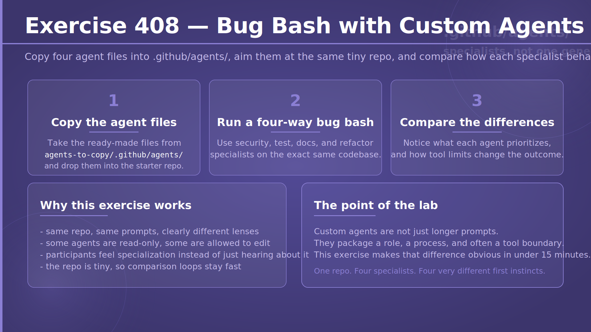
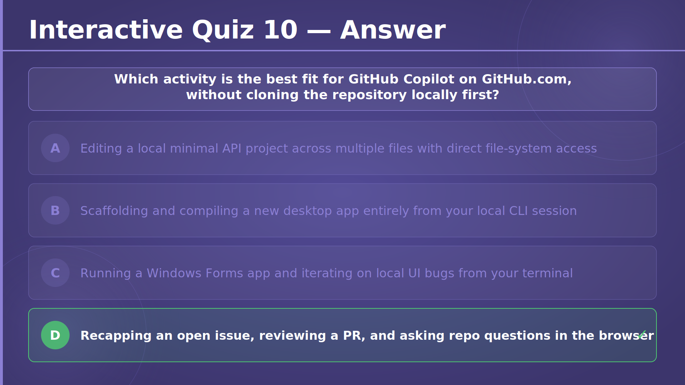
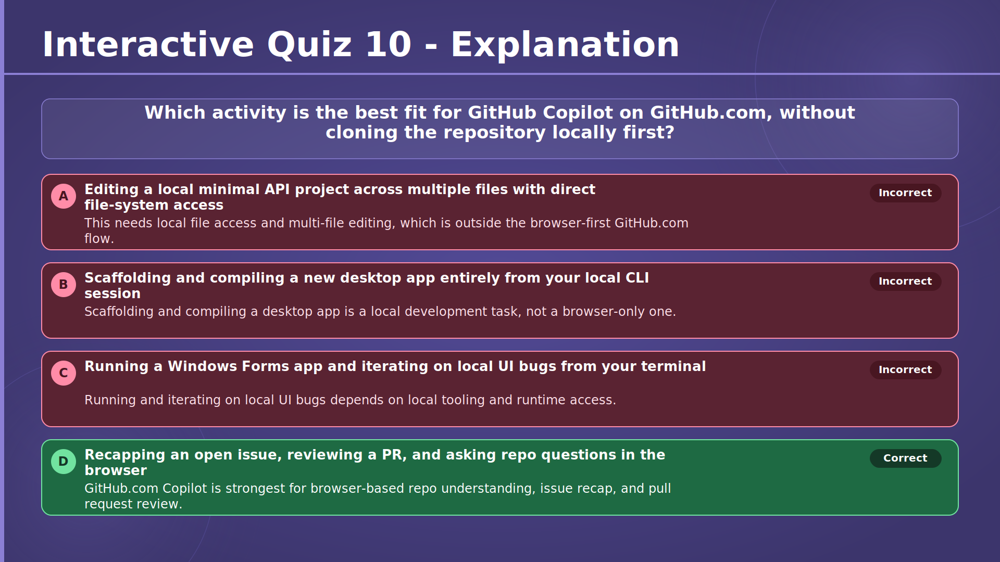

# Chapter 4 — Let Your AI Co-Pilot Take the Wheel

## Slide 01 — AI4Dev

## Slide 02 — Chapter 4 — Let Your AI Co-Pilot Take the Wheel

## Slide 03 — From Occasional User to Daily Driver

<!-- Section 1 — Agent Mode -->

## Slide 04 — Agent Mode — Chat vs. Agent Mode

## Slide 05 — The Agent Loop

## Slide 06 — What "Autonomous" Really Means

## Slide 07 — Enabling Agent Mode in VS Code

## Slide 08 — The Tools Agent Mode Can Reach

## Slide 09 — Staying in Control

## Slide 10 — When Agent Mode Shines

## Slide 11 — MCP — Extending Agent Mode

## Slide 12 — Copilot Edits

## Slide 13 — Inline Chat vs. Edits vs. Agent Mode

## Slide 14 — The Working Set

## Slide 15 — Iterating: Accept, Reject, Undo

## Slide 16 — Exercise 401 — Rename a Field with Agent Mode

→ [Exercise 401 — Rename a Field with Agent Mode](../../../exercises/chapter-04/exercise-401/README.md)

## Slide 17 — Exercise 402 — Add Input Validation

→ [Exercise 402 — Add Input Validation](../../../exercises/chapter-04/exercise-402/README.md)

<!-- Section 2 — Plan Mode -->

## Slide 18 — Plan Mode — What Is Plan Mode?

## Slide 19 — How Plan Mode Works

## Slide 20 — Step 1 & 2 — From Questions to Blueprint

## Slide 21 — Step 3 & 4 — Review, Then Execute

## Slide 22 — Exercise 403 — Paginate, Filter and Sort

→ [Exercise 403 — Paginate, Filter and Sort](../../../exercises/chapter-04/exercise-403/README.md)

<!-- Section 3 — GitHub Copilot CLI -->

## Slide 23 — Copilot CLI — Installing GitHub Copilot CLI

## Slide 24 — The Workflow Shift — Running Outside the IDE

## Slide 25 — More Than Code — Everything in Your Directory

## Slide 26 — Shell Commands — Agentic Development in Action

## Slide 27 — Exercise 404 — Vibe-Code a Slot Machine

→ [Exercise 404 — Vibe-Code a Slot Machine](../../../exercises/chapter-04/exercise-404/README.md)

<!-- Section 4 — Copilot on GitHub.com -->

## Slide 28 — Copilot on GitHub.com — Five Surfaces in the Browser

## Slide 29 — Copilot Code Review, Up Close

## Slide 30 — Exercise 405 — Explore Copilot on GitHub.com

→ [Exercise 405 — Explore Copilot on GitHub.com](../../../exercises/chapter-04/exercise-405/README.md)

<!-- Section 5 — Custom Instructions -->

## Slide 31 — Custom Instructions — Three Layers of Instructions

## Slide 32 — What to Put in the File

## Slide 33 — Exercise 406 — Create a Repository Instruction File

→ [Exercise 406 — Create a Repository Instruction File](../../../exercises/chapter-04/exercise-406/README.md)

<!-- Section 6 — Prompt Files & Skill Files -->

## Slide 34 — Prompt Files & Skill Files — Anatomy of a Prompt File

## Slide 35 — Prompt Files vs. Skill Files

## Slide 36 — Exercise 407 — Experiment with Prompt Files and Skill Files

→ [Exercise 407 — Experiment with Prompt Files and Skill Files](../../../exercises/chapter-04/exercise-407/README.md)

## Slide 37 — Your Daily-Driver Toolkit

## Slide 38 — Interactive Quiz 10

## Slide 39 — Interactive Quiz 10 — Answer

## Slide 40 — Interactive Quiz 11

## Slide 41 — Interactive Quiz 11 — Answer

## Slide 42 — Interactive Quiz 12

## Slide 43 — Interactive Quiz 12 — Answer

## Slide 44 — Lab 401 — Ultimate Snake Web

→ [Lab 401 — Ultimate Snake Web](../../../labs/chapter-04/lab-401/README.md)

## Slide 45 — Lab 401 — Expectations

→ [Lab 401 — Ultimate Snake Web](../../../labs/chapter-04/lab-401/README.md)

## Slide 46 — Lab 402 — Ultimate Snake with Copilot CLI

→ [Lab 402 — Ultimate Snake from Scratch with GitHub Copilot CLI](../../../labs/chapter-04/lab-402/README.md)
