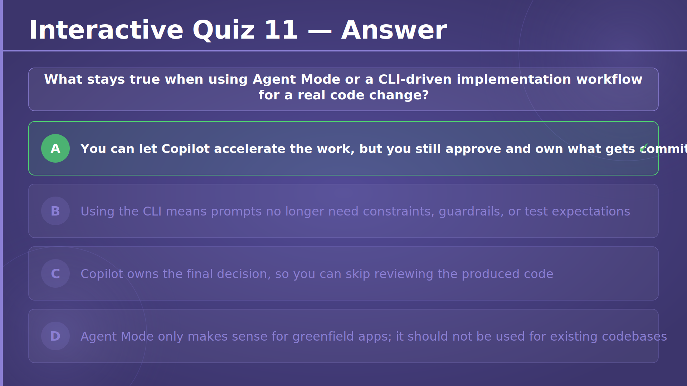
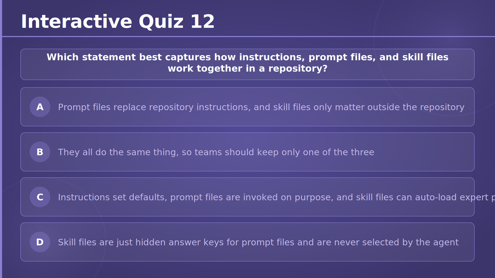
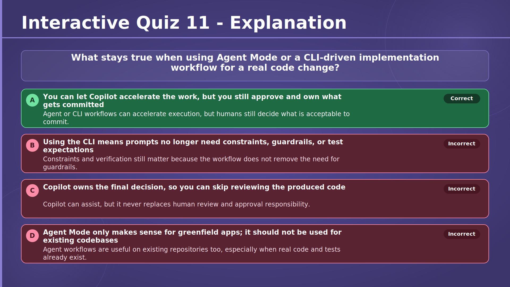
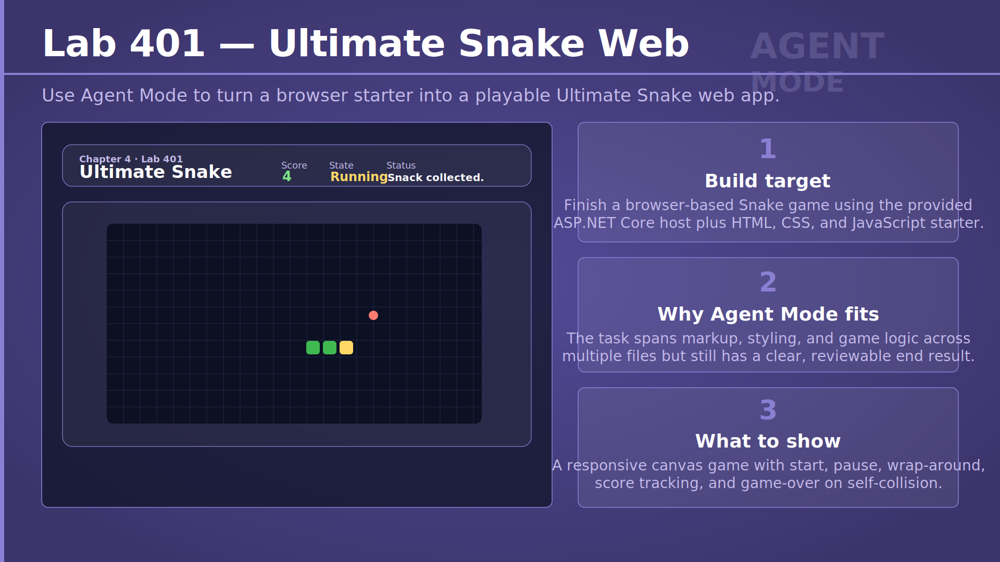
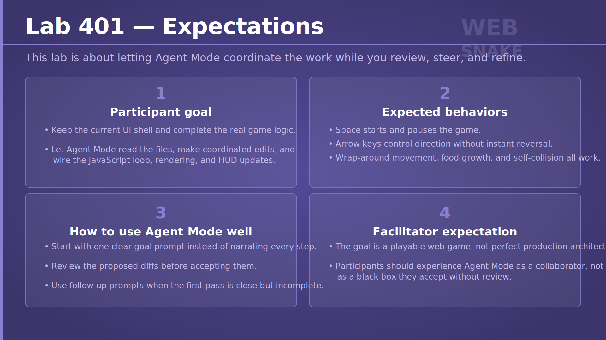
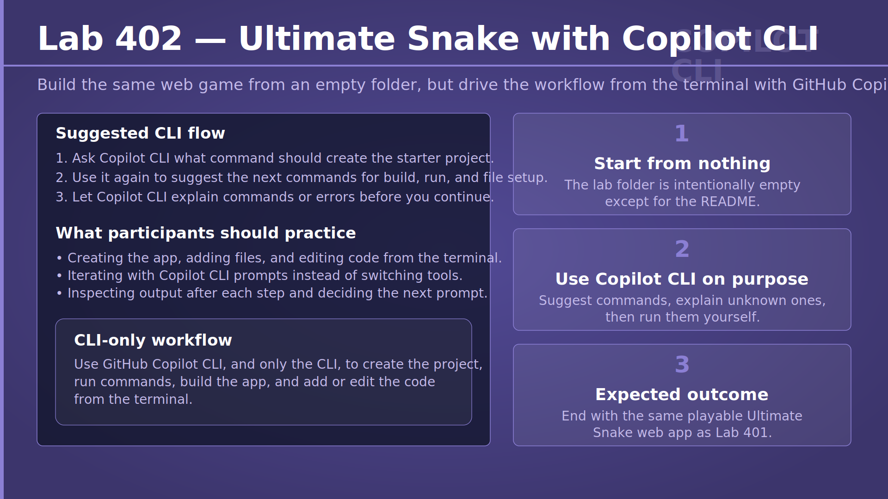

# Chapter 4 — Let Your AI Co-Pilot Take the Wheel
## Slide 01 — AI4Dev

> **TL;DR:** This chapter is about using AI assistance more actively without giving up human judgment.

Chapter 4 sets the tone for the rest of the workshop: Copilot can help you move faster, but you still decide what good software looks like. The goal is not blind automation. The goal is to use AI as a practical teammate that helps you explore, implement, review, and iterate while you stay responsible for the outcome.

## Slide 02 — Chapter 4 — Let Your AI Co-Pilot Take the Wheel

> **TL;DR:** This chapter focuses on letting Copilot do more of the hands-on work while you keep control of the direction.

The chapter title frames a mindset shift. Instead of using AI only for occasional code suggestions, you will learn when to let it take on larger tasks such as planning, multi-file changes, terminal work, and review support. The important part is that taking the wheel does not mean taking over completely; it means helping you drive with less friction.

## Slide 03 — From Occasional User to Daily Driver

> **TL;DR:** Becoming a daily Copilot user means learning several surfaces and choosing the right one for each job.

This slide maps out the six main ways you will work with Copilot in modern development: Agent Mode, Plan Mode, the CLI, GitHub.com, custom instructions, and prompt or skill files. Each surface solves a different problem, from autonomous coding to reusable team knowledge. Together they form one workflow where you can start small, scale up when needed, and still review every meaningful decision.

<!-- Section 1 — Agent Mode -->

## Slide 04 — Agent Mode — Chat vs. Agent Mode

> **TL;DR:** Chat gives you suggestions, while Agent Mode turns a goal into action.

The contrast here is practical. In chat, you ask a question and get back text or code that you still have to apply yourself. In Agent Mode, you describe the outcome you want and Copilot can inspect files, make edits, and run commands as part of a larger loop. That makes Agent Mode much better for tasks that span multiple files or require verification, while chat still works well for quick explanations and small local edits.

## Slide 05 — The Agent Loop

> **TL;DR:** Agent Mode works as a repeatable loop of planning, acting, checking results, and correcting course.

This is the core mental model to teach developers. The agent does not magically jump from prompt to perfect solution. It moves through a loop: understand the goal, make a plan, apply changes, inspect outputs, and adjust when something fails. That loop is why Agent Mode can handle realistic coding tasks such as fixing failing tests or finishing a feature across several files.

## Slide 06 — What "Autonomous" Really Means

> **TL;DR:** Autonomous means reducing your manual steps, not removing your supervision.

This slide is important because the word autonomous can sound riskier than it really is. Copilot can do useful work on its own, such as finding files, applying coordinated edits, and reacting to test failures, but it still operates within checkpoints that you can review. A good way to explain it is that the agent does the heavy lifting between your decisions, not instead of your decisions.

## Slide 07 — Enabling Agent Mode in VS Code

> **TL;DR:** Enabling Agent Mode is mostly about using a current VS Code setup and choosing the right chat mode.

For participants, this is the practical entry point. They need to know where Agent Mode lives, how to switch into it, and what visual cues confirm it is available, especially the Tools section. It is also useful to set expectations early: if Agent Mode is missing, the usual fix is simply updating VS Code and the Copilot Chat extension, not troubleshooting their entire machine.

## Slide 08 — The Tools Agent Mode Can Reach

> **TL;DR:** Agent Mode becomes powerful because it can use tools, not just generate text.

This slide explains the jump from assistant to actor. Once Copilot can read files, edit code, search the workspace, run terminal commands, and call MCP tools, it can gather context and verify its own work instead of guessing. That is the real difference between a clever answer and an agentic workflow: tools let the model observe reality and respond to it.

## Slide 09 — Staying in Control

> **TL;DR:** The workflow stays safe because you approve commands, inspect diffs, and decide what to keep.

Control in Agent Mode is built around visible checkpoints. Commands are shown before they run, edits appear as standard diffs, and the final result can be kept or rolled back. For workshop participants, this is a good reminder that review is not an optional extra. It is part of the workflow, and it is how you turn AI speed into trustworthy results.

## Slide 10 — When Agent Mode Shines

> **TL;DR:** Agent Mode is best for structured, repetitive, and verifiable work, not for every kind of thinking.

The slide helps participants build judgment instead of hype. If the work is repetitive, spread across many files, or easy to validate with tests, Agent Mode is a strong fit. If the task is ambiguous, highly conceptual, or depends on subtle business trade-offs, you usually want to stay more manual. In practice, the best workflow is often hybrid: let Copilot scaffold and automate, then step in for reasoning and refinement.

## Slide 11 — MCP — Extending Agent Mode

> **TL;DR:** MCP extends Agent Mode by letting Copilot use tools beyond the local editor and terminal.

Model Context Protocol is easiest to explain as a standard way to plug external capabilities into AI workflows. Instead of limiting the agent to files and shell commands, MCP servers can expose things like issue trackers, schemas, deployment actions, or internal systems. That makes the agent more useful in real engineering environments where the work is bigger than code alone.

## Slide 12 — Copilot Edits

> **TL;DR:** Copilot Edits is the right tool when you already know which small set of files must change together.

Edits sits between inline chat and Agent Mode. You define a working set, describe the change once, and get coordinated diffs across those files. That makes it predictable and efficient for bounded tasks such as renaming a property, updating a pattern, or keeping tests and implementation in sync without giving the model full autonomy over the codebase.

## Slide 13 — Inline Chat vs. Edits vs. Agent Mode

> **TL;DR:** Inline Chat, Edits, and Agent Mode solve different scopes of work, so picking the right one matters.

This comparison helps developers avoid overusing one surface for everything. Inline Chat is great inside one file, Edits is better for a deliberate set of related files, and Agent Mode is best when you want Copilot to discover the files and drive a larger workflow. A simple rule of thumb is that your known scope determines the tool: one file, a few files, or an open-ended goal.

## Slide 14 — The Working Set

> **TL;DR:** A focused working set makes Copilot Edits more consistent and easier to review.

The working set is a guardrail as much as a convenience. By limiting Copilot to the files that actually matter, you reduce noise, improve cross-file consistency, and make review faster. This is also a good teaching moment: adding every open tab is usually worse than choosing a small, relevant set with clear relationships.

## Slide 15 — Iterating: Accept, Reject, Undo

> **TL;DR:** Accept, reject, and undo let you iterate on Copilot output without throwing away good work.

Participants should see review as selective, not all-or-nothing. If Copilot gets three files right and one file wrong, keep the good changes and refine the rest with a follow-up prompt. That pattern mirrors normal development: you preserve progress, correct mistakes, and move forward instead of restarting from scratch each time.

## Slide 16 — Exercise 401 — Rename a Field with Agent Mode

> **TL;DR:** Exercise 401 practices using Agent Mode for a safe, multi-file rename with verification.

This exercise gives participants a clean first experience with agentic editing in a real ASP.NET Core project. They start the app, ask Agent Mode to rename a field across the codebase, review every proposed diff, and then confirm the result by building and checking the API output. The lesson is not just that Copilot can rename code, but that it can do so across layers while you stay in charge of review.

→ [Exercise 401 — Rename a Field with Agent Mode](../../../exercises/chapter-04/exercise-401/README.md)

## Slide 17 — Exercise 402 — Add Input Validation

> **TL;DR:** Exercise 402 practices using Agent Mode to add validation and confirm behavior with real requests.

Here participants use Copilot for a common backend task: tightening API input rules. They first observe the gap in the current behavior, then ask Agent Mode to add validation, inspect the implementation details, and test the endpoint with invalid requests. It reinforces a healthy workflow of noticing a defect, guiding the change, and verifying the new contract end to end.

→ [Exercise 402 — Add Input Validation](../../../exercises/chapter-04/exercise-402/README.md)

<!-- Section 2 — Plan Mode -->

## Slide 18 — Plan Mode — What Is Plan Mode?

> **TL;DR:** Plan Mode helps you agree on the implementation approach before any files are changed.

Plan Mode is valuable when the cost of a wrong implementation is higher than the cost of slowing down for a minute. Instead of jumping straight into edits, Copilot first helps define scope, assumptions, and steps. That makes the workflow more predictable, especially for features with multiple moving parts or decisions that should be explicit before coding begins.

## Slide 19 — How Plan Mode Works

> **TL;DR:** Plan Mode turns a vague request into an approved blueprint through a short, structured conversation.

The four stages on this slide make planning feel concrete rather than abstract. Copilot asks clarifying questions, proposes a step-by-step plan, lets you revise it, and only then moves into execution. For developers, the key idea is that planning is part of delivery, not a detour from it. A good plan reduces rework and makes later agent execution more reliable.

## Slide 20 — Step 1 & 2 — From Questions to Blueprint

> **TL;DR:** The first half of Plan Mode is about narrowing the problem and making the plan explicit.

Step 1 is where Copilot asks the questions that a good teammate would ask before coding: what belongs in scope, which libraries or patterns to use, and what constraints matter. Step 2 turns those answers into a blueprint with ordered tasks and visible dependencies. By the time the plan appears, participants should feel that the problem is already much clearer than when they started.

## Slide 21 — Step 3 & 4 — Review, Then Execute

> **TL;DR:** The second half of Plan Mode is where you refine the blueprint and then hand it off for execution.

Review is the safety gate. Participants should read the proposed steps, tighten anything that feels vague, and make sure the plan matches their intent before approving implementation. Once the plan is accepted, Agent Mode can execute with much less drift because it is working from a contract you already agreed on.

## Slide 22 — Exercise 403 — Paginate, Filter and Sort

> **TL;DR:** Exercise 403 practices designing a feature in Plan Mode before letting Copilot implement it.

This exercise is a good fit for planning because pagination, filtering, and sorting involve several small design choices rather than one obvious change. Participants describe the desired query behavior, review the generated plan, and only then approve execution. The main skill is learning how a clear plan improves both the implementation quality and the confidence of the review.

→ [Exercise 403 — Paginate, Filter and Sort](../../../exercises/chapter-04/exercise-403/README.md)

<!-- Section 3 — GitHub Copilot CLI -->

## Slide 23 — Copilot CLI — Installing GitHub Copilot CLI

> **TL;DR:** Copilot CLI gives you Copilot in any terminal once it is installed and authenticated.

This slide introduces the CLI as a separate surface, not just an IDE feature moved into a shell. Participants need to understand the basic prerequisites, how to install it on their platform, and that authentication happens through their GitHub account. Once it is set up, the CLI becomes a flexible way to use Copilot in repositories, scripts, and folders that may not even be open in an IDE.

## Slide 24 — The Workflow Shift — Running Outside the IDE

> **TL;DR:** Running Copilot in the CLI keeps heavy agent work out of the IDE while preserving project context.

The workflow shift here is operational. Large edits, searches, or repo-wide tasks can make an IDE feel crowded or slow, especially in big codebases. The CLI moves that work into a separate process, so your editor stays responsive while Copilot continues to reason over the same repository. It is a practical way to scale up without feeling like the tools are fighting each other.

## Slide 25 — More Than Code — Everything in Your Directory

> **TL;DR:** Copilot CLI can work across code, docs, configs, and other files because your whole directory becomes the workspace.

This is an important mindset change for developers who think of Copilot only as a coding assistant. In the terminal, it can help with slides, Markdown, configuration files, Dockerfiles, and project scaffolding as naturally as it helps with C# or JavaScript. That makes it especially useful for real project work, where implementation, documentation, and tooling often evolve together.

## Slide 26 — Shell Commands — Agentic Development in Action

> **TL;DR:** Copilot CLI becomes agentic because it can propose real shell commands, run them with approval, and react to the output.

The loop on this slide mirrors Agent Mode, but through the terminal. Copilot reasons about the next step, suggests an actual command, waits for approval, reads what happened, and adapts. That means the CLI is not only for explanations. It is also a practical execution surface for builds, scaffolding, debugging, and small operational workflows where command-line feedback matters.

## Slide 27 — Exercise 404 — Vibe-Code a Slot Machine

> **TL;DR:** Exercise 404 practices prompting Copilot CLI to scaffold and extend a complete desktop app from the terminal.

Participants use the CLI to turn a plain-English brief into a working WinForms slot machine. The learning goal is not just generating code, but steering the tool with good constraints, approving commands thoughtfully, and checking the running result. It is a strong example of prompt-first development where the terminal becomes the main place to guide the work.

→ [Exercise 404 — Vibe-Code a Slot Machine](../../../exercises/chapter-04/exercise-404/README.md)

<!-- Section 4 — Copilot on GitHub.com -->

## Slide 28 — Copilot on GitHub.com — Five Surfaces in the Browser

> **TL;DR:** Copilot on GitHub.com is best for understanding and reviewing repository work directly in the browser.

This surface is about repository context without local setup. Participants can ask questions about code, summarize issues and pull requests, request review help, and use natural language to find behavior in the codebase. It is especially useful when you want quick understanding or collaboration support, but not when you need to edit files locally or run commands.

## Slide 29 — Copilot Code Review, Up Close

> **TL;DR:** Copilot Code Review is a fast first pass that finds meaningful issues before humans spend review time.

A useful way to frame this slide is that Copilot review helps with obvious risk, not with taste. It can catch logic errors, security concerns, and performance smells, then explain them inline where they occur. That gives human reviewers a cleaner starting point and lets teams focus their attention on design judgment, trade-offs, and domain knowledge.

## Slide 30 — Exercise 405 — Explore Copilot on GitHub.com

> **TL;DR:** Exercise 405 practices using Copilot on GitHub.com for browser-based understanding, review, and issue work.

This exercise keeps participants entirely in the browser so they can experience how much repository work is possible without cloning code locally. They ask questions, recap issues, inspect pull requests, evaluate review comments, and even try the online coding agent. The skill being practiced is choosing the browser surface for discovery and collaboration tasks rather than treating every task as a local IDE task.

→ [Exercise 405 — Explore Copilot on GitHub.com](../../../exercises/chapter-04/exercise-405/README.md)

<!-- Section 5 — Custom Instructions -->

## Slide 31 — Custom Instructions — Three Layers of Instructions

> **TL;DR:** Custom instructions combine organization, repository, and personal guidance to shape Copilot's behavior on every request.

This slide introduces instructions as persistent context rather than one-off prompting. Teams can capture project conventions in a version-controlled repository file, while users and administrators can add their own broader layers. The main idea is that repeated rules should become shared configuration, so developers do not have to restate the same expectations every time they open chat.

## Slide 32 — What to Put in the File

> **TL;DR:** Good instruction files are concrete, specific, and focused on rules that actually change Copilot's output.

The examples on this slide show the difference between vague advice and usable guidance. Naming rules, framework versions, library preferences, testing expectations, and output constraints all help Copilot produce results that fit the team more closely. This is worth emphasizing in the workshop: instructions work best when they sound like executable standards, not generic aspirations.

## Slide 33 — Exercise 406 — Create a Repository Instruction File

> **TL;DR:** Exercise 406 practices writing a repository instruction file so future Copilot outputs match team expectations by default.

Participants create a new repository and add a `.github/copilot-instructions.md` file that describes the stack, conventions, testing style, and preferred response behavior. The real lesson is that prompt quality can be improved structurally, not only with better wording in the moment. By investing in shared instructions once, teams make future Copilot interactions faster and more consistent.

→ [Exercise 406 — Create a Repository Instruction File](../../../exercises/chapter-04/exercise-406/README.md)

<!-- Section 6 — Prompt Files & Skill Files -->

## Slide 34 — Prompt Files & Skill Files — Anatomy of a Prompt File

> **TL;DR:** A prompt file turns a great one-off prompt into a reusable, version-controlled tool for the team.

This slide breaks prompt files into their practical parts: a title, a mode, optional runtime inputs, and attached reference files. The goal is to show that a strong prompt can be packaged and reused instead of rediscovered from memory. That is powerful for tasks your team repeats often, such as scaffolding endpoints, generating tests, or applying a known review checklist.

## Slide 35 — Prompt Files vs. Skill Files

> **TL;DR:** Prompt files are tasks you invoke on purpose, while skill files are expert processes the agent can choose automatically.

The key difference on this slide is who decides when the knowledge is used. A prompt file is deliberate: you pick it from the UI and run that reusable prompt when you want it. A skill file is more agentic: you describe when it applies, and the agent may load it when the current task matches that description. Both capture expertise, but they fit different styles of reuse.

## Slide 36 — Exercise 407 — Experiment with Prompt Files and Skill Files

> **TL;DR:** Exercise 407 helps participants feel the practical difference between manual prompt reuse and automatic skill loading.

This is a comparison exercise, not just a setup task. Participants create a prompt file and a skill file in a small sandbox repository, then observe how Copilot behaves when they invoke one explicitly versus when the agent decides to use the other. That comparison teaches a subtle but important design skill: deciding whether a pattern should be something humans call directly or something agents pick up on their own.

→ [Exercise 407 — Experiment with Prompt Files and Skill Files](../../../exercises/chapter-04/exercise-407/README.md)

## Slide 37 — Your Daily-Driver Toolkit

> **TL;DR:** The daily-driver toolkit is about matching the Copilot surface to the scope of the work and reviewing every kept change.

This slide pulls the chapter together. Agent Mode, Edits, CLI, GitHub.com, instructions, prompts, skills, and agents are not competing features; they are parts of one toolbox. The through-line is disciplined usage: choose the right level of automation for the job, then review, verify, and own the result before it becomes part of the codebase.

<!-- Section 7 — Custom Agents -->

## Slide 38 — Custom Agents — Specialist Teammates on Demand

> **TL;DR:** Custom agents package specialist behavior into named teammates you can select when a task needs a focused role.

This section introduces a stronger form of reuse than instructions or skills alone. A custom agent can have its own identity, description, prompt, tool boundaries, and optional MCP setup, which makes it feel like a specialist rather than a generic assistant with extra notes. That is useful when teams repeatedly need distinct behaviors such as security review, release preparation, or documentation improvement.

## Slide 39 — Anatomy of an Agent File

> **TL;DR:** An agent file is a simple Markdown contract that defines who the agent is, what it can access, and how it should behave.

This slide is useful because it makes custom agents feel approachable. The YAML frontmatter declares the name, description, and optional tool restrictions, while the prompt body describes expertise, scope, and boundaries in plain language. In other words, creating a specialist agent is less about complex infrastructure and more about writing clear, structured instructions that shape a role.

## Slide 40 — One Profile, Many Surfaces

> **TL;DR:** A custom agent profile can be shared across GitHub.com, IDEs, and the CLI because the file itself is the reusable contract.

That portability is what makes custom agents practical for teams. You define the agent once, store it in the repository or a personal location, and then use the same specialist across multiple Copilot surfaces. It also reinforces a good engineering habit: if an agent matters to the team, keep it in version control so its behavior can be reviewed and improved like any other project asset.

## Slide 41 — Exercise 408 — Bug Bash with Custom Agents

> **TL;DR:** Exercise 408 shows how different specialist agents produce different kinds of value on the same tiny codebase.

Participants copy several ready-made agent files into a starter repository and then point each one at the same project. Because the repository is small, the differences in behavior are easy to notice: one agent looks for security flaws, another focuses on tests, another improves docs, and another suggests refactors. The lab makes specialization concrete by holding the code constant and changing only the agent persona and tools.

→ [Exercise 408 — Bug Bash with Custom Agents](../../../exercises/chapter-04/exercise-408/README.md)

## Slide 42 — Exercise 408 — Four Agents, One Tiny Repo

> **TL;DR:** The tiny starter repo is intentionally designed so each custom agent has a different kind of issue to notice.

This slide previews the kinds of findings each specialist should surface. Security sees risky input handling and weak authorization logic, the test-focused agent notices missing coverage, the docs agent finds mismatches between claims and behavior, and the refactor agent spots safe cleanup opportunities. It is a helpful reminder that agent quality is not only about raw intelligence; it is also about giving the agent a clear job.

→ [Exercise 408 — Bug Bash with Custom Agents](../../../exercises/chapter-04/exercise-408/README.md)

## Slide 43 — Copilot SDK — Orchestrating Custom Agents as Sub-Agents

> **TL;DR:** With the Copilot SDK, your own app can orchestrate multiple custom agents and delegate work to the right specialist automatically.

This bonus slide connects workshop concepts to product building. Instead of using custom agents only in the UI, you can register them in a Copilot session and let the runtime select the best sub-agent for a task. That keeps the parent session cleaner, isolates specialist work, and opens the door to agent-based applications where planning, research, editing, and review are handled by different bounded roles.

## Slide 44 — Interactive Quiz 10

> **TL;DR:** This quiz checks whether participants can recognize GitHub.com as the best browser-first surface for repo understanding and review.

The wrong options all depend on local files, local runtime access, or terminal execution. The useful teaching point is that GitHub.com Copilot shines when the work is about asking questions, recapping issues, and reviewing pull requests directly in the browser. Participants are being tested on tool selection, not on memorizing a feature list.

## Slide 45 — Interactive Quiz 10 — Answer

> **TL;DR:** The correct answer is D because browser-based recap, review, and repository questions are exactly what Copilot on GitHub.com is built for.

This answer slide reinforces the fit between task and surface. When you do not want to clone the repository or open local tooling, GitHub.com gives you fast access to issues, pull requests, and repository context. The other options describe local development workflows, which belong in the IDE or CLI rather than the browser.

## Slide 46 — Interactive Quiz 10 — Explanation

> **TL;DR:** The explanation shows why D fits the browser surface and why the other options require local tooling instead.

This is a good debrief slide because it teaches exclusion as well as correctness. Options A, B, and C all depend on direct local access to files, builds, or runtime behavior, so they fall outside a browser-only workflow. Option D stays entirely within repository understanding and review, which is where GitHub.com Copilot is strongest.

## Slide 47 — Interactive Quiz 11

> **TL;DR:** This quiz checks whether participants remember that AI can accelerate implementation while humans still own approval and commits.

The distractors are useful because they reflect common mistakes in mindset. Better tooling does not remove the need for guardrails, review, or clear prompts. Participants are being asked to keep the core principle of the chapter in mind: the workflow can be more autonomous, but accountability never leaves the developer.

## Slide 48 — Interactive Quiz 11 — Answer

> **TL;DR:** The correct answer is A because using Agent Mode or the CLI never removes your responsibility to review and own the result.

This answer is central to the workshop message. Copilot can plan, edit, and execute more than a traditional autocomplete tool, but it does not become the owner of the change. The developer still decides what is acceptable, what gets committed, and whether the output meets the requirements.

## Slide 49 — Interactive Quiz 11 — Explanation

> **TL;DR:** The explanation rejects the myths that better tooling removes the need for constraints, review, or existing-code workflows.

A strong takeaway here is that agentic tools increase the importance of good prompts and verification rather than making them irrelevant. The CLI still benefits from guardrails, code still needs review, and existing repositories are often where these workflows create the most value. The correct answer stands because it preserves the human role in quality control.

## Slide 50 — Interactive Quiz 12

> **TL;DR:** This quiz checks whether participants understand the distinct roles of instructions, prompt files, and skill files in a repository.

The question is really about layering, not terminology. Instructions define default behavior, prompt files package reusable tasks you invoke deliberately, and skill files describe expert processes the agent can auto-load when relevant. Participants are being tested on whether they can separate these responsibilities instead of treating all repository context features as interchangeable.

## Slide 51 — Interactive Quiz 12 — Answer

> **TL;DR:** The correct answer is C because these three features complement each other instead of replacing one another.

This answer matters because it explains how teams can build a richer Copilot environment over time. Repository instructions give stable defaults, prompt files capture repeatable tasks, and skill files help agents act more intelligently when certain work patterns appear. Used together, they make Copilot more consistent and more useful.

## Slide 52 — Interactive Quiz 12 — Explanation

> **TL;DR:** The explanation clarifies that instructions, prompt files, and skill files solve different problems and work best as a set.

This slide helps participants avoid a common oversimplification. Prompt files do not replace instructions, and skill files are not hidden versions of prompts. Each feature adds a different kind of reusable context, so the best repository setup usually combines all three rather than forcing one mechanism to do every job.

## Slide 53 — Lab 401 — Ultimate Snake Web

> **TL;DR:** Lab 401 asks participants to use Agent Mode to complete a playable web-based Snake game across multiple files.

This lab gives Agent Mode a realistic but bounded challenge: finish markup, styling, and JavaScript behavior in an existing starter app. Participants practice giving one clear goal, letting the agent coordinate work across files, and reviewing the outcome as the game becomes functional. The skill being trained is using agentic support for end-to-end feature completion rather than just isolated code suggestions.

→ [Lab 401 — Ultimate Snake Web](../../../labs/chapter-04/lab-401/README.md)

## Slide 54 — Lab 401 — Expectations

> **TL;DR:** The expectations for Lab 401 focus on steering Agent Mode well and ending with a clearly playable game.

This slide is both a technical checklist and a workflow checklist. Participants need the finished game behaviors such as pause, movement rules, wrap-around, growth, and collision handling, but they also need to practice reviewing diffs and refining the first attempt with follow-up prompts. The lab is successful when they experience Agent Mode as a collaborator they guide, not a black box they trust without inspection.

→ [Lab 401 — Ultimate Snake Web](../../../labs/chapter-04/lab-401/README.md)

## Slide 55 — Lab 402 — Ultimate Snake with Copilot CLI

> **TL;DR:** Lab 402 practices building the same Snake game from the terminal so participants learn a CLI-first Copilot workflow.

Unlike Lab 401, this lab starts from an almost empty folder and uses GitHub Copilot CLI as the main interface from beginning to end. Participants ask for commands, let Copilot explain output and errors, and iteratively build the project without switching surfaces. The point is to experience how much of the development loop can happen from the terminal when prompts, command review, and verification are done deliberately.

→ [Lab 402 — Ultimate Snake from Scratch with GitHub Copilot CLI](../../../labs/chapter-04/lab-402/README.md)
