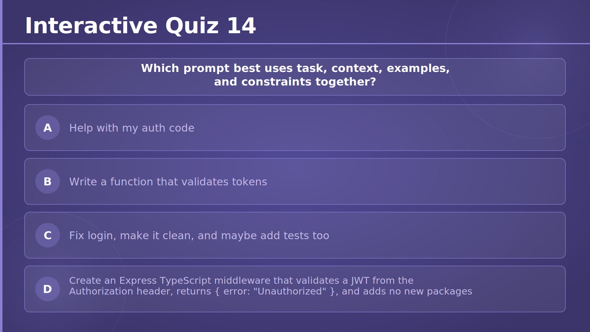
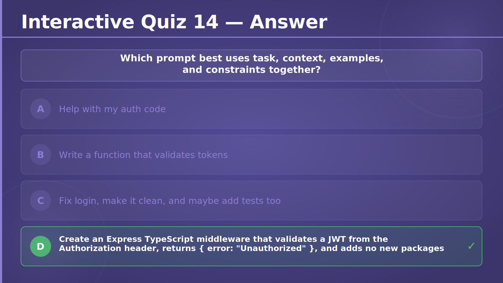
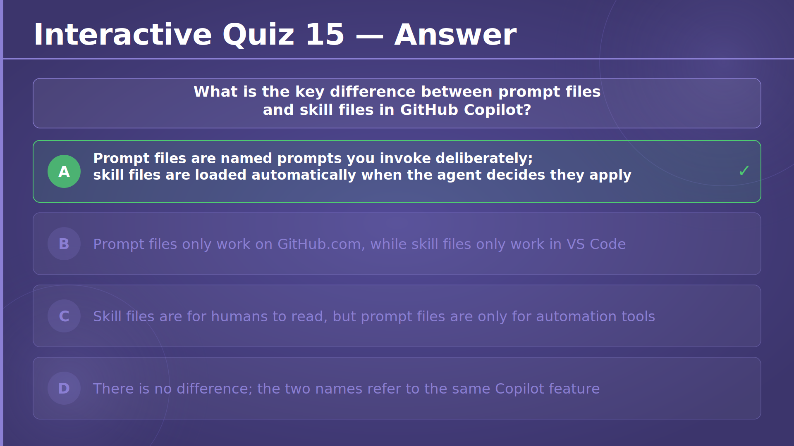
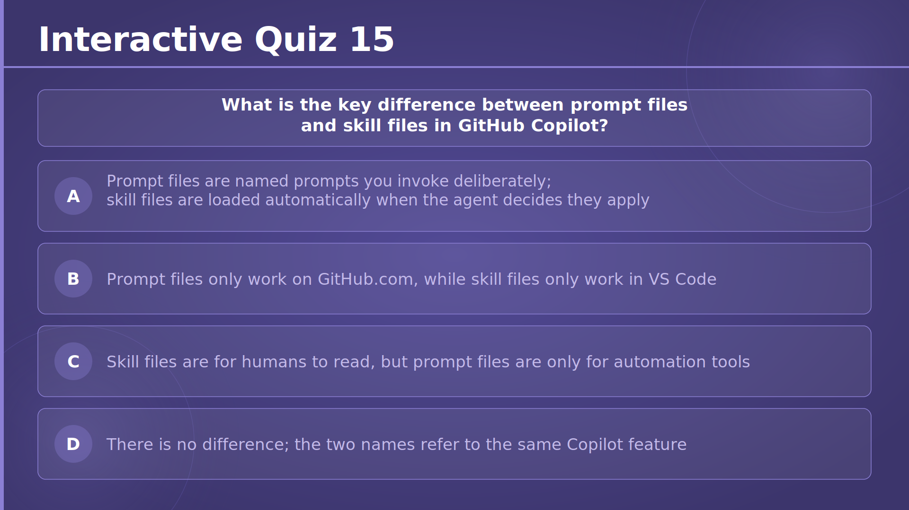
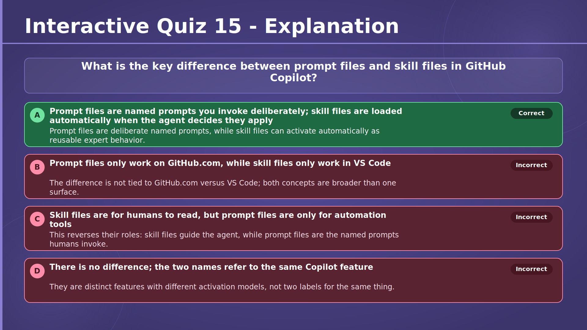
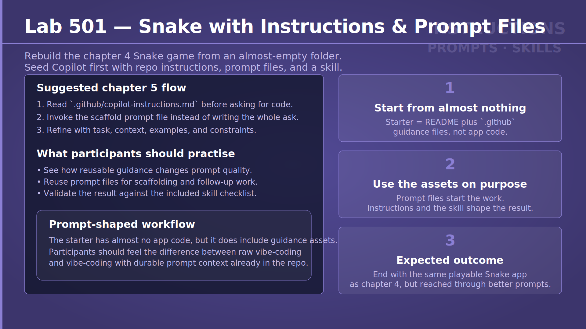
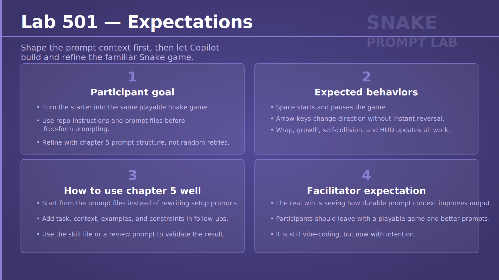

# Chapter 5 — Speak AI's Language: Mastering Prompts & Context
## Slide 01 — AI4Dev

> **TL;DR:** AI can help you build faster without giving up engineering control.

## Slide 02 — Chapter 5 — Speak AI's Language: Mastering Prompts & Context

> **TL;DR:** This chapter shows how better prompts and better context lead to better Copilot results.

## Slide 03 — Better Prompts, Better Code

> **TL;DR:** Prompt quality strongly shapes code quality.

Copilot's model may be a black box, but the information you give it is not. This slide explains that output quality depends on how clearly you describe the task, the context, the examples, and the constraints.

The main message is that prompt engineering is really information design. When you make the request precise and useful, Copilot has a much better chance of producing code that matches your intent.

<!-- Section 1 — How Copilot Reads Your Code -->

## Slide 04 — How Copilot Reads Your Code — The Context Window

> **TL;DR:** Copilot can only reason over the context that is currently visible to it.

This slide introduces the context window as the material Copilot can see right now, such as the current file, cursor position, imports, open tabs, and attached instructions. It also makes clear that closed files, deleted code, and unrelated repositories are outside that window.

That matters because missing context leads to missing or weaker answers. If you want better results, you must make the right information visible before you prompt.

## Slide 05 — Priority of Context Signals

> **TL;DR:** Not all context signals matter equally; direct instructions carry the most weight.

This slide explains that Copilot ranks different kinds of context. System and direct instructions shape the answer most strongly, while open files, related symbols, and general training data matter less.

For participants, the key lesson is to put important guidance in the strongest possible place. A clear instruction usually beats hoping Copilot will infer the right intent from nearby code.

## Slide 06 — Fill-in-the-Middle (FIM)

> **TL;DR:** Copilot can use both the code above and below the cursor to fill the gap in between.

This slide describes fill-in-the-middle prompting, where the prefix above the cursor and the suffix below it both guide generation. Instead of predicting from only what came before, Copilot can use the closing lines, stubs, and surrounding structure as extra hints.

A practical takeaway is to leave useful scaffolding in place. A method signature above and a closing bracket or expected shape below can make the generated code much more accurate.

## Slide 07 — The "Tab Setup" Habit

> **TL;DR:** Open the files that help and close the files that add noise.

This slide teaches a simple working habit: curate your open tabs before prompting. Helpful tabs include the contract you are implementing, a related test, or a similar service that shows the local conventions.

The goal is to improve signal quality inside the context window. Too many unrelated tabs can dilute the useful clues Copilot needs to follow your current task.

## Slide 08 — Exercise 501 — Context Window Copilot Clone

> **TL;DR:** This exercise lets participants simulate how Copilot builds and prioritises context.

Participants will combine open file content, cursor location, suffix code, and relevance scoring to build a small context-window clone. The exercise also includes assembling the final prompt within a token budget and formatting it as a fill-in-the-middle request.

This makes the abstract idea of context concrete. By building a simplified version themselves, participants can better understand why prompt setup changes the quality of suggestions.

→ [Exercise 501 — Context Window Copilot Clone](../../../exercises/chapter-05/exercise-501/README.md)

<!-- Section 2 — The Anatomy of a Good Prompt -->

## Slide 09 — The Anatomy of a Good Prompt — The Four Ingredients

> **TL;DR:** Strong prompts combine task, context, examples, and constraints.

This slide breaks a good prompt into four parts. Copilot needs to know what to do, what surrounding information matters, what good output looks like, and what limits it must respect.

The slide also explains why weak prompts drift. If one ingredient is missing, the answer may still look correct on the surface but fail to match the real intent of the task.

## Slide 10 — Start With the Right Verb

> **TL;DR:** The first verb in your prompt tells Copilot what kind of response to produce.

This slide shows how verbs like refactor, generate, explain, fix, test, and document each signal a different job. The opening word sets expectations for tone, output type, and level of change.

A small wording change can create a very different result. Choosing the verb carefully is an easy way to steer Copilot before you add any other detail.

## Slide 11 — Prompt Anti-Patterns

> **TL;DR:** Vague, broad, conflicting, or under-specified prompts usually produce weak results.

This slide lists common prompt mistakes such as asking for too much, giving no context, mixing incompatible constraints, or failing to define the expected output format. In each case, Copilot is forced to guess what matters most.

The workshop takeaway is practical: most bad prompts can be repaired by adding clearer task wording, better context, useful examples, or explicit boundaries.

## Slide 12 — One-Shot vs. Few-Shot

> **TL;DR:** One example shows the shape, but multiple examples teach the pattern.

This slide compares one-shot prompting with few-shot prompting. A single example is often enough for a simple, predictable structure, while two or more examples help Copilot infer a richer pattern with variation.

Participants should see this as a scaling tool. When the first answer is close but inconsistent, adding another example often sharpens the result more effectively than repeating the same instructions.

## Slide 13 — Iterative Prompting

> **TL;DR:** Good AI-assisted work usually comes from prompt, review, and refinement loops.

This slide presents prompting as an iterative process rather than a one-shot event. You ask, inspect the result, tighten the request, and repeat until the diff is small, understandable, and aligned with the goal.

It also helps participants recognise when to stop. If the answer is now reviewable and the intent is clear, more prompting may only add noise instead of value.

## Slide 14 — Exercise 502 — Prompt Arena

> **TL;DR:** This exercise compares prompt styles against the same coding target.

Participants will try one-shot, few-shot, iterative, and deliberately bad prompts on the same task to observe how wording changes the output. The goal is to see prompt quality as something testable rather than mysterious.

By comparing results side by side, the exercise makes it easier to notice what actually improves code generation and what only sounds helpful.

→ [Exercise 502 — Prompt Arena](../../../exercises/chapter-05/exercise-502/README.md)

<!-- Section 3 — Context Variables -->

## Slide 15 — Context Variables — The @ Participants

> **TL;DR:** @ variables bring broader tools or participants into the conversation.

This slide explains that @ references can invite a workspace, terminal, GitHub, or editor participant into the prompt. Each one expands what Copilot can inspect, but each also changes the scope and cost of the request.

The main lesson is to choose these participants deliberately. Broad tools are useful for broad questions, but they are slower and less focused than a narrow file-level prompt.

## Slide 16 — The # Variables

> **TL;DR:** # variables attach a specific artifact such as a file, symbol, selection, or diff.

This slide focuses on narrow context attachments. Instead of asking Copilot to scan everything, you can point it directly at the file, method, selected code, or recent changes that matter.

Narrow prompts usually produce more relevant answers. For workshop participants, this is a simple way to reduce ambiguity and improve precision during everyday development work.

## Slide 17 — @workspace vs. #file

> **TL;DR:** Start narrow with #file and only go broad with @workspace when you need cross-project context.

This slide contrasts two common context choices. Use @workspace when you do not know where the answer lives or when you need architecture-level understanding, and use #file when you already know the exact file involved.

The rule is practical and easy to apply. Narrower context is usually faster, cheaper, and easier for Copilot to use well.

## Slide 18 — Exercise 503 — Context Variables Playground

> **TL;DR:** This exercise lets participants compare how different context variables change the answer.

Participants will try @workspace, #file, #symbol, and #changes on a real codebase and observe how the scope of context affects the output. The exercise turns abstract syntax into concrete working habits.

It also helps participants build judgment about when to stay local and when to expand the search surface.

→ [Exercise 503 — Context Variables Playground](../../../exercises/chapter-05/exercise-503/README.md)

<!-- Section 4 — Advanced Prompting Patterns -->

## Slide 19 — Advanced Prompting Patterns — Comment-Driven Development

> **TL;DR:** A precise comment can act as a compact specification for generated code.

This slide introduces comment-driven development, where you describe the intended behaviour first and let Copilot implement from that comment. The comment becomes a lightweight spec that states inputs, outputs, and edge cases.

If the generated code misses the target, the fix often starts with improving the comment rather than issuing a separate vague correction.

## Slide 20 — Test-First Prompting

> **TL;DR:** A failing test gives Copilot a precise contract for the implementation.

This slide connects prompting to test-driven development. You write the failing test first, give it to Copilot as context, and ask for the smallest implementation that makes the test pass.

That approach keeps the scope tight and reviewable. It also gives participants a reliable way to turn desired behaviour into concrete code without over-generating.

## Slide 21 — Persona & Chain-of-Thought

> **TL;DR:** You can improve complex responses by setting a role and asking for structured reasoning.

This slide shows two useful prompt patterns. A persona changes the perspective of the answer, while stepwise reasoning makes the path to the answer more explicit.

Used carefully, these patterns help with reviews, debugging, design trade-offs, and explanations for different audiences. They are especially valuable when the final answer depends on judgment, not only code generation.

## Slide 22 — Stepwise & Diff-Driven

> **TL;DR:** Break large tasks into small steps and ask for the change, not the whole file.

This slide encourages participants to keep AI output reviewable. Stepwise prompting limits scope to one stage at a time, while diff-driven prompting avoids flooding the response with unchanged code.

Together, these patterns help maintain control. Smaller outputs are easier to inspect, easier to test, and less likely to hide unintended changes.

## Slide 23 — Completions vs. Chat vs. Agent

> **TL;DR:** Different Copilot modes fit different task sizes and levels of interaction.

This slide compares inline completions, chat, and agent mode. Completions are best for local next steps, chat is useful for focused back-and-forth work, and agents are designed for larger, multi-step tasks.

The key skill is choosing the smallest mode that fits. That keeps the workflow fast while still giving you more power when the task grows.

## Slide 24 — Exercise 504 — Prompt Pattern Playground

> **TL;DR:** This exercise applies advanced prompting patterns to the same real task.

Participants will practise comment-driven, test-first, persona-based, and stepwise diff-driven prompting, then compare the results. The exercise is designed to show that different prompt structures are better suited to different goals.

It also reinforces a central workshop idea: better prompting is less about magic wording and more about choosing the right pattern for the job.

→ [Exercise 504 — Prompt Pattern Playground](../../../exercises/chapter-05/exercise-504/README.md)

<!-- Section 5 — Custom Instructions -->

## Slide 25 — Custom Instructions — Layered Instructions

> **TL;DR:** Instructions work in layers, from broad personal defaults to narrow task-specific rules.

This slide explains how instruction scope changes from global settings, to repository instructions, to the current prompt. When rules conflict, the most specific layer wins.

That matters because participants can decide where guidance belongs. Personal style belongs in global settings, shared repo conventions belong in the repository file, and one-off requirements belong in the current request.

## Slide 26 — Specific, But Not Brittle

> **TL;DR:** Good instructions express stable intent without locking the AI to today's implementation details.

This slide contrasts strong guidance with brittle rules. Useful instructions describe enduring conventions such as test frameworks, dependency injection, or response shapes, while weak instructions hard-code temporary classes or arbitrary numbers.

For workshop participants, the lesson is to write instructions that survive change. That makes Copilot more consistent without making the repo harder to evolve.

## Slide 27 — Test & Iterate the File

> **TL;DR:** Instruction files should be treated like living engineering artifacts.

This slide explains that instruction files are not set once and forgotten. You should test them on real prompts, see which rules are followed or missed, and then refine the wording.

Versioning these files in git also makes the changes reviewable. That turns prompt guidance into something the team can improve together over time.

## Slide 28 — The Prompt Engineer's Checklist

> **TL;DR:** Before sending a prompt, check that task, context, examples, and constraints are all present.

This slide turns the four ingredients into a quick pre-flight checklist. It helps participants ask whether the action is clear, the scope is reviewable, the right files are attached, and the output format and limits are explicit.

Used regularly, this checklist can improve prompt quality with very little extra effort. It is a lightweight habit that prevents many common mistakes.

## Slide 29 — Interactive Quiz 13

> **TL;DR:** The best tab setup keeps relevant files open and unrelated files closed.

This quiz asks participants to identify the practice that improves the quality of the context window. It reinforces the idea that useful open tabs sharpen Copilot's focus, while leftover files from unrelated work mostly create noise.

## Slide 30 — Interactive Quiz 13 — Answer

> **TL;DR:** The correct answer is to open related files and close irrelevant ones.

This answer slide confirms that the strongest setup is a focused set of tabs such as the current service, interface, and tests. It highlights that more context is not automatically better if that context is low quality.

## Slide 31 — Interactive Quiz 13 — Explanation

> **TL;DR:** Relevant context improves suggestions, while noisy context weakens them.

This explanation walks through why the correct choice works and why the distractors fail. It reminds participants that imports, related files, and clean tab discipline give Copilot better signals than random breadth or unnecessary model switching.

## Slide 32 — Interactive Quiz 14

> **TL;DR:** The strongest prompt includes task, context, output shape, and constraints together.

This quiz asks participants to spot the prompt that provides enough information for Copilot to act reliably. It tests whether they can recognise the difference between a vague request and a well-formed engineering prompt.

## Slide 33 — Interactive Quiz 14 — Answer

> **TL;DR:** The best answer is the prompt that clearly defines the stack, task, and boundaries.

This answer slide confirms that the most complete option wins because it names the framework, the input source, the error response, and the package constraint. It shows what an effective prompt looks like in practice.

## Slide 34 — Interactive Quiz 14 — Explanation

> **TL;DR:** Good prompts work because they reduce guessing.

This explanation compares the weak and strong options and shows why specificity matters. The correct answer succeeds because it gives Copilot enough detail to generate the right kind of code without inventing missing requirements.

## Slide 35 — Interactive Quiz 15

> **TL;DR:** Prompt files and skill files are related but not the same thing.

This quiz checks whether participants understand the difference between named prompts you invoke directly and reusable skills that can activate when relevant. It tests a practical feature distinction that affects how guidance is applied.

## Slide 36 — Interactive Quiz 15 — Answer

> **TL;DR:** Prompt files are invoked deliberately, while skill files can activate automatically.

This answer slide confirms the correct distinction between the two feature types. It helps participants remember that the difference is about activation model and behaviour, not about platform.

## Slide 37 — Interactive Quiz 15 — Explanation

> **TL;DR:** The explanation reinforces the different roles of prompt files and skill files.

This slide explains why the correct option is right and why the alternatives are wrong. It gives participants a cleaner mental model for when they are defining explicit reusable prompts versus reusable expert behaviour.

## Slide 38 — Lab 501 — Ultimate Snake with Instructions & Prompt Files

> **TL;DR:** This lab rebuilds Snake while using instructions, prompt files, and skills to shape Copilot from the start.

The lab asks participants to recreate the familiar Snake game from a nearly empty folder, but this time with structured guidance in place before free-form prompting begins. The flow starts with repository instructions, then scaffold prompts, then refinements using the prompt techniques from the chapter.

This matters because it shows how reusable context can raise the floor of AI-assisted development. Instead of repeating setup guidance every time, participants learn to encode it once and benefit throughout the task.

→ [Lab 501 — Ultimate Snake with Instructions, Prompt Files, and Skills](../../../labs/chapter-05/lab-501/README.md)

## Slide 39 — Lab 501 — Expectations

> **TL;DR:** Participants should build a playable Snake game by shaping context first and prompting with intent.

This slide sets the success criteria for the lab: rebuild the game, use the provided instructions and prompt files before improvising, and refine prompts with task, context, examples, and constraints. It also lists the expected gameplay behaviours, such as pausing, movement rules, wrapping, growth, self-collision, and HUD updates.

The slide frames quality as more than just making the game run. Participants are expected to demonstrate a repeatable prompting process, not just random retries until something works.

→ [Lab 501 — Ultimate Snake with Instructions, Prompt Files, and Skills](../../../labs/chapter-05/lab-501/README.md)
