# Chapter 6 — AI Across the Entire Software Lifecycle
## Slide 01 — AI4Dev

> **TL;DR:** AI can support the full software lifecycle while developers stay in control.

## Slide 02 — Chapter 6 — AI Across the Entire Software Lifecycle

> **TL;DR:** This chapter explores how Copilot can help from analysis through pull requests.

## Slide 03 — Overview — Seven Sections

> **TL;DR:** The chapter covers seven lifecycle phases where AI can add practical value.

This slide gives the map for the chapter: analysis, development, testing, refactoring, documentation, debugging, and pull requests. It positions Copilot as one assistant that can support many kinds of work, not just code completion.

For participants, this overview sets the expectation that AI should be integrated into the whole workflow. The goal is to improve how software is delivered end to end.

<!-- Section 1 — Copilot for Analysis -->

## Slide 04 — Section 1 — From Blank Slate to Structured Blueprint

> **TL;DR:** Copilot can help structure thinking before implementation starts.

This section slide introduces analysis as the first place where Copilot adds value. It covers both greenfield work, where you need requirements and architecture, and brownfield work, where you need to understand an existing codebase well enough to act safely.

The message is that faster coding starts with better thinking. If you clarify the blueprint early, later implementation becomes smoother and less risky.

## Slide 05 — Why Copilot Belongs in Analysis

> **TL;DR:** Some of the biggest AI gains happen before anyone writes code.

This slide explains that analysis work benefits from Copilot because it helps teams discover requirements, compare options, surface risks, and draft plans earlier. That means fewer avoidable mistakes later in the lifecycle.

It reframes Copilot as a thinking partner, not only a coding assistant. Better early decisions often save more time than faster typing ever could.

## Slide 06 — Greenfield Analysis — From Idea to First Architecture

> **TL;DR:** For new systems, Copilot can turn an idea into structured requirements and first-pass design artifacts.

This slide walks through greenfield analysis outputs such as actors, workflows, acceptance criteria, non-functional requirements, API contracts, data models, and early backlog items. It shows that a vague product idea can be shaped into concrete planning material very quickly.

That helps participants start implementation with shared clarity instead of assumptions. Even if the first draft is imperfect, it creates something the team can review and improve.

## Slide 07 — Brownfield Analysis — From Unknown Repo to Actionable Map

> **TL;DR:** In existing systems, Copilot can help you understand enough of the repo to make safe changes.

This slide focuses on analysis in a codebase you did not design yourself. It suggests using Copilot to identify system boundaries, hotspots, blockers, and the safest insertion point for a new feature or migration.

For workshop participants, this is highly practical. Many real tasks start in unfamiliar code, so the ability to build an actionable mental map quickly is a major advantage.

## Slide 08 — Prompt Patterns for the Analysis Phase

> **TL;DR:** Analysis prompts work best when they ask for trade-offs, evidence, and open questions.

This slide gives prompt patterns for both new projects and existing repositories. Instead of only asking for answers, it encourages asking for comparisons, risks, assumptions, and unresolved questions.

That produces outputs that are more useful for decision-making. Participants learn to prompt for thinking support, not just for polished conclusions.

## Slide 09 — Exercise 601 — Short URL Discovery Sprint

> **TL;DR:** This exercise uses Copilot to analyse and design a short URL system before coding it.

Participants will capture actors and flows, identify requirements and risks, compare design options, and then only move into implementation after the analysis is good enough. The exercise is structured to show how early lifecycle work can guide later coding.

It matters because it rewards disciplined discovery. Participants experience how a better analysis phase can make vibe coding far more effective and less random.

→ [Exercise 601 — Short URL Discovery Sprint](../../../exercises/chapter-06/exercise-601/README.md)

<!-- Section 2 — Copilot for Development -->

## Slide 10 — Section 2 — Three Modes, One Goal: Ship Features Faster

> **TL;DR:** Autocomplete, chat, and agent mode support different kinds of feature work.

This section slide introduces the three main ways Copilot can help during development. Autocomplete handles local next steps, chat supports focused questions and generation, and agent mode helps with larger multi-file tasks.

The goal is not to use the biggest tool every time. It is to match the mode to the size and complexity of the work.

## Slide 11 — From Ticket to Working Set

> **TL;DR:** Good feature work starts by collecting the right inputs before you ask Copilot to code.

This slide explains that a ticket alone is rarely enough. Better results come when you gather the relevant story, API contract, existing service, tests, or a failing case and then ask Copilot how to approach the work.

That turns a vague request into a grounded working set. Participants learn to front-load context so development can move faster with fewer wrong turns.

## Slide 12 — Prompt Patterns for Feature Development

> **TL;DR:** Ask for a plan, a scaffold, and a limited diff instead of saying only “build this.”

This slide presents a strong development prompt sequence: first ask what files and steps are involved, then ask for a scaffold, then constrain the implementation to a small slice. It shows how scope control improves code quality.

The practical lesson is that development prompts should be anchored in the codebase and limited in size. Smaller, clearer requests lead to more reviewable changes.

## Slide 13 — The Development Loop — Scaffold, Review, Refine

> **TL;DR:** AI-assisted development works best as a loop of clarification, generation, review, and refinement.

This slide lays out a repeatable flow: confirm the criteria, scaffold the structure, review the output, and then refine what is missing. It keeps Copilot in an assistant role rather than handing over the whole task blindly.

For participants, this reinforces that speed comes from disciplined iteration. The developer still owns correctness, trade-offs, and final acceptance.

<!-- Section 3 — Copilot for Testing -->

## Slide 14 — Section 3 — From Zero Coverage to Confident Tests

> **TL;DR:** Copilot can help generate tests, but developers still define what good coverage means.

This section slide introduces testing support across unit, integration, and end-to-end levels. It also connects Copilot to TDD, test scaffolding, and mocking patterns.

The message is that AI can accelerate test creation, but quality still depends on the human deciding what risks and behaviours must actually be covered.

## Slide 15 — Test Types — Unit, Integration, and Automated UI

> **TL;DR:** Different test types answer different questions about the system.

This slide compares unit tests, integration tests, and automated UI tests. Each one covers a different level of confidence, from isolated logic to connected services to real user journeys.

Participants should leave with a balanced view of testing. Faster unit tests are useful, but they do not replace the value of integration and browser-level checks.

## Slide 16 — TDD with Copilot — Red, Green, Refactor

> **TL;DR:** Copilot fits naturally into TDD when the failing test comes first.

This slide maps Copilot onto the classic red, green, refactor cycle. You first define behaviour with a failing test, then ask for the smallest passing implementation, and finally clean up the code.

That workflow keeps Copilot grounded in a precise contract. It is a strong way to turn desired behaviour into working code without losing control over scope.

## Slide 17 — BDD with Reqnroll — Shared Language, Executable Specs

> **TL;DR:** BDD uses readable scenarios as a shared contract between product, test, and code.

This slide introduces Reqnroll-style feature files and step definitions as a way to express behaviour in business language. Copilot can help draft scenarios, generate missing steps, and connect them to the underlying automation.

It matters because shared language reduces misunderstanding. When product, testers, and developers use the same examples, the resulting software is easier to validate.

## Slide 18 — Coverage Reports — Turn Gaps into Better Tests

> **TL;DR:** Coverage reports help you aim new tests where they add the most value.

This slide explains a coverage-driven loop: generate a report, find weak branches or files, attach the relevant code, and ask Copilot for targeted tests. The focus is on using coverage as a guide rather than a vanity number.

For participants, the lesson is to combine evidence with generation. AI can help fill gaps, but the gaps should be chosen intentionally.

## Slide 19 — Exercise 602 — Expression Evaluator Test Lab

> **TL;DR:** This exercise explores several AI-assisted testing workflows on one codebase.

Participants will write tests against existing code, try TDD, express behaviour as BDD scenarios, and inspect coverage gaps. The exercise is designed to show that testing is not one technique but a toolkit.

It helps participants compare approaches and see how Copilot supports each phase differently.

→ [Exercise 602 — Expression Evaluator Test Lab](../../../exercises/chapter-06/exercise-602/README.md)

<!-- Section 4 — Copilot for Refactoring -->

## Slide 20 — Section 4 — Reshape Code Without Breaking It

> **TL;DR:** Refactoring with Copilot should improve code structure while preserving behaviour.

This section slide introduces both everyday cleanup and larger multi-file transformations. It frames Copilot as a helper for safer rewrites, modernisation, and complexity reduction.

The anchor point is behavioural safety. Better structure is only useful if the software still does the right thing when you are done.

## Slide 21 — Architectural Refactoring — Make the Design Better, Not Just Different

> **TL;DR:** Good architectural refactors reduce future friction instead of merely moving code around.

This slide focuses on design-level improvements such as clearer module boundaries, lower coupling, better orchestration, and stronger extension points. It reminds participants that architecture changes should solve real problems.

A successful refactor makes the next feature easier to build. That is the standard for judging whether the design really improved.

## Slide 22 — Refactor from Evidence — Logs, Metrics, Traces, and Load Tests

> **TL;DR:** Use real performance or reliability evidence to choose what to refactor.

This slide argues against refactoring by guesswork. By feeding Copilot logs, profiler output, traces, or load-test results, you can focus on measurable hotspots rather than personal hunches.

That makes the work easier to justify and easier to verify afterward. Participants are encouraged to measure before and after, not just trust intuition.

## Slide 23 — Readability Refactors Developers Feel Every Day

> **TL;DR:** Small readability improvements often pay off immediately in daily development.

This slide highlights everyday refactors such as clearer names, smaller functions, early returns, and named helpers. These changes may not alter architecture, but they make code faster to understand and safer to modify.

For workshop participants, this is a reminder that refactoring is not only about grand redesigns. Many valuable improvements are local and practical.

## Slide 24 — Safer Structural Refactoring — Create Seams, Reduce Coupling

> **TL;DR:** Create safe boundaries first, then refactor behind them.

This slide explains how seams, wrappers, interfaces, and anti-corruption layers make bigger refactors safer. Instead of changing everything at once, you introduce a stable boundary and then improve the internals step by step.

That approach matters in real legacy systems where direct rewrites are risky. Incremental change lowers the chance of breaking important behaviour.

## Slide 25 — Exercise 603 — Optimize Edit Distance

> **TL;DR:** This exercise uses evidence and tests to drive a performance-oriented refactor.

Participants will measure the current implementation, identify the repeated work, refactor to memoization or dynamic programming, and then verify that results stay correct while performance improves. The exercise ties algorithmic reasoning to practical refactoring discipline.

It shows that optimisation is safest when it is guided by data and protected by tests.

→ [Exercise 603 — Optimize Edit Distance](../../../exercises/chapter-06/exercise-603/README.md)

<!-- Section 5 — Copilot for Documentation -->

## Slide 26 — Section 5 — Documentation That Stays True

> **TL;DR:** AI can help create and maintain documentation that evolves with the code.

This section slide introduces documentation as an engineering deliverable, not an afterthought. It covers generated docs, README updates, changelogs, and audits for stale explanations.

The theme is honesty. Documentation is only useful when it reflects the current system, and Copilot can help keep that alignment tighter.

## Slide 27 — Inline Documentation — Explain Intent, Not Just Syntax

> **TL;DR:** The best inline docs explain why and when to use something, not only what it looks like.

This slide moves beyond simple parameter descriptions. It encourages using Copilot to document intent, caveats, error cases, and usage examples so that future readers understand the reasoning behind the code.

That is especially helpful after refactors or handovers. Good inline docs reduce the need to rediscover design intent later.

## Slide 28 — Docs as Code — Markdown That Lives with the Repo

> **TL;DR:** Documentation is easier to maintain when it lives beside the code and follows the same workflow.

This slide explains why project docs, feature guides, ADRs, runbooks, and onboarding notes work well as versioned Markdown in the repository. They can be reviewed, branched, tagged, and released together with the implementation.

For participants, this makes documentation feel like normal engineering work. When docs live in the same place as the code, keeping them current becomes much more natural.

## Slide 29 — Diagrams in Markdown — Draw.io and *.drawio.png

> **TL;DR:** A *.drawio.png file is easy to view in Markdown and still easy to edit later.

This slide introduces a practical diagram format for repositories. It combines previewability with editability, so teams do not have to choose between a readable README image and a separate source file.

That matters because architecture and flow diagrams are more likely to stay useful when they are simple to open, review, and update in normal git workflows.

## Slide 30 — Keep Documentation Honest — Refresh It with Every Change

> **TL;DR:** Documentation should be updated as part of the same change, not as cleanup later.

This slide presents a maintenance loop for finding stale comments, updating README sections, drafting changelog entries, and turning incidents into runbooks. Copilot can speed up those updates, but the important part is making them routine.

The broader lesson is cultural. Honest documentation is the result of consistent habits, not one large catch-up effort.

## Slide 31 — Exercise 604 — Draw.io Playground with MCP and *.drawio.png

> **TL;DR:** This exercise practises generating, editing, and versioning diagrams as real project artifacts.

Participants will prompt for a playful system diagram, sketch or refine it with Draw.io, save it as a *.drawio.png file, and then reopen it for further improvement. The exercise treats diagrams as living documentation rather than static pictures.

It gives workshop participants hands-on practice with a documentation workflow they can reuse in real repositories.

→ [Exercise 604 — Draw.io Playground with MCP and *.drawio.png](../../../exercises/chapter-06/exercise-604/README.md)

<!-- Section 6 — Copilot for Debugging & Root Cause Analysis -->

## Slide 32 — Section 6 — From Symptom to Root Cause, Faster

> **TL;DR:** Copilot can accelerate debugging when you give it real evidence from the failure.

This section slide introduces debugging as a structured investigation. Stack traces, terminal output, logs, traces, and failure descriptions give Copilot something concrete to reason over.

The emphasis is on root cause, not symptom patching. Faster debugging comes from better evidence and tighter loops.

## Slide 33 — Exceptions and Stack Traces — Start with the Real Failure

> **TL;DR:** The best debugging prompt starts with the actual exception and stack trace, not a paraphrase.

This slide teaches participants to extract the exception type, the first application frame, the trigger, and the expected-versus-actual behaviour from a real failure. Those details anchor the investigation in facts.

That matters because debugging quality drops when the evidence is filtered too early. Pasting the real failure often gives Copilot the clue it needs.

## Slide 34 — Give the Agent Eyes — Playwright, Screenshots, DOM, and Network

> **TL;DR:** Visual and browser-level evidence can make UI bugs much easier for an agent to understand.

This slide shows how tools like Playwright, screenshots, DOM snapshots, console errors, and network traces help Copilot inspect a failing scenario more directly. For browser issues, this is often far richer than a short text description.

For participants, the key idea is that better observability improves AI debugging too. When the agent can see the behaviour, it can reason about it more effectively.

## Slide 35 — Logs, Traces, and Metrics — Read the Story Across Systems

> **TL;DR:** Logs, traces, and metrics each reveal a different part of the failure story.

This slide explains how logs show events and inputs, traces show cross-service flow and latency, and metrics show scale and timing. Together they give a fuller picture than any one signal alone.

That is important in distributed systems where the real problem may sit far from the visible symptom. Participants learn to correlate evidence instead of chasing isolated clues.

## Slide 36 — Reproduce, Narrow, Verify — The AI Debugging Loop

> **TL;DR:** Effective debugging follows a loop: reproduce the bug, narrow the cause, fix it, and verify the result.

This slide turns debugging into a repeatable workflow. It starts by defining the scenario and evidence, then narrows the wrong assumption, applies the smallest safe fix, and finishes with verification and better observability.

The slide matters because it keeps debugging disciplined. A bug is not really done when it disappears once; it is done when the cause is understood and the fix is proved.

## Slide 37 — Exercise 605 — Hunt the Cursed Theme Park Checkout Bug

> **TL;DR:** This exercise practises evidence-driven debugging on a deliberately broken checkout flow.

Participants will reproduce the failure, gather logs and other signals, form a hypothesis about the broken assumption, and prove the fix with a regression test or improved diagnostics. The exercise ties tooling, reasoning, and verification together.

It helps participants experience debugging as a methodical loop instead of a random search for a lucky patch.

→ [Exercise 605 — Hunt the Cursed Theme Park Checkout Bug](../../../exercises/chapter-06/exercise-605/README.md)

<!-- Section 7 — Copilot in the Pull-Request Lifecycle -->

## Slide 38 — Section 7 — AI From Commit to Merge

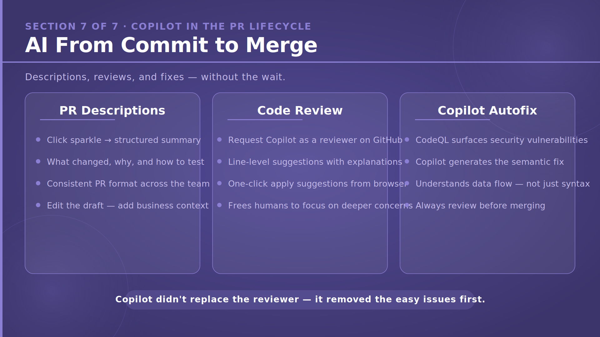

> **TL;DR:** Copilot can help package, review, and improve changes throughout the PR lifecycle.

This section slide introduces PR descriptions, automated review, and security autofix as places where AI adds value after the coding work is done. It shows that the lifecycle continues well beyond implementation.

The important reminder is that AI support does not remove human responsibility. Review and merge decisions still require engineering judgment.

## Slide 39 — Reviewable PRs Start Earlier Than the PR

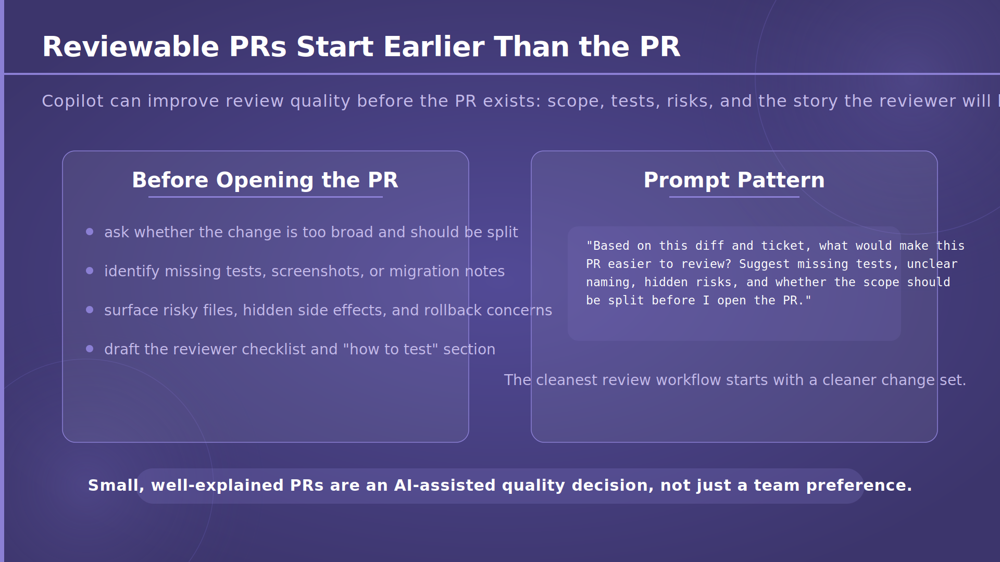

> **TL;DR:** Good pull requests are shaped before the PR is even opened.

This slide explains that reviewability starts with scope control, missing-test checks, rollout notes, screenshots, and a clear reviewer checklist. Copilot can help surface those needs before the PR description is written.

Participants learn that small, well-prepared PRs reduce review friction. Better preparation usually leads to better feedback and faster merges.

## Slide 40 — Copilot Review and Human Review Do Different Jobs

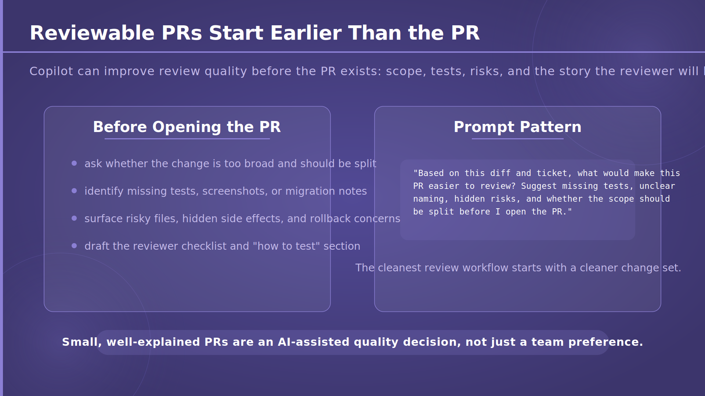

> **TL;DR:** Copilot is good at spotting many code-level issues, while humans still own product and architecture judgment.

This slide separates the strengths of automated and human review. Copilot can quickly flag common implementation issues, but people still need to decide whether the change solves the right problem and fits the system well.

That distinction helps teams use AI review effectively. Let the tool remove easy mistakes so humans can spend more energy on the deeper questions.

## Slide 41 — Security in the Review Loop — CodeQL and Autofix

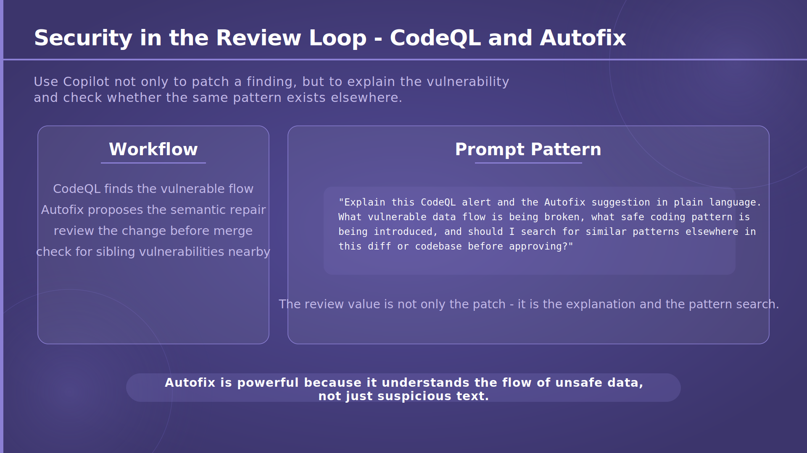

> **TL;DR:** Security review is stronger when detection and fix suggestions are connected.

This slide shows how CodeQL can identify vulnerable flows and how Copilot Autofix can suggest a semantic repair. The important point is that these suggestions still need human review and broader validation.

For workshop participants, this demonstrates a practical security workflow. AI can accelerate triage and repair, but safe merging still depends on careful verification.

## Slide 42 — From Issue to PR — Plan, Implement, Summarize, Iterate

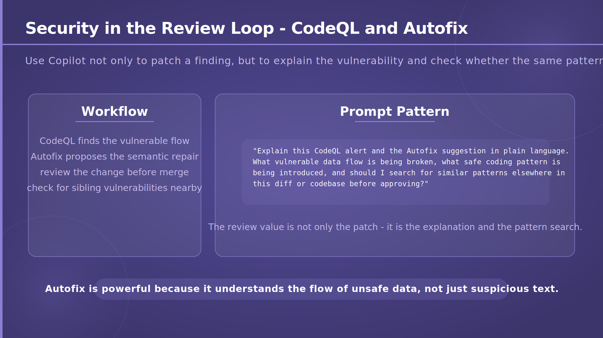

> **TL;DR:** A stronger issue usually leads to a stronger implementation and a clearer pull request.

This slide connects the lifecycle from acceptance criteria and risk planning through coding, testing, PR summarisation, and review iteration. It presents PR quality as the result of the whole workflow, not only the final write-up.

That gives participants a useful mental model: if you want better PRs, improve the steps before the PR as well.

## Slide 43 — Interactive Quiz 16

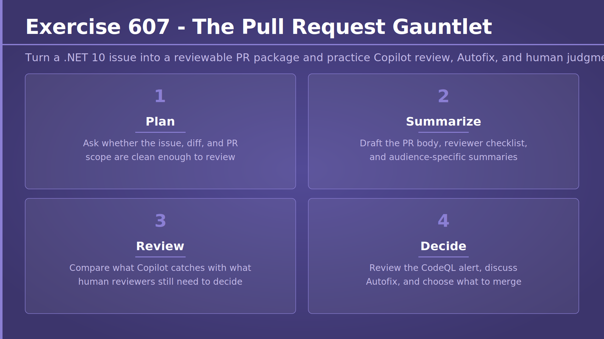

> **TL;DR:** Strong implementation starts with structured analysis before coding begins.

This quiz asks which action gives Copilot the best starting point for a new feature. It reinforces the idea that turning a brief into requirements, risks, architecture options, and a plan creates better downstream results.

## Slide 44 — Interactive Quiz 16 — Answer

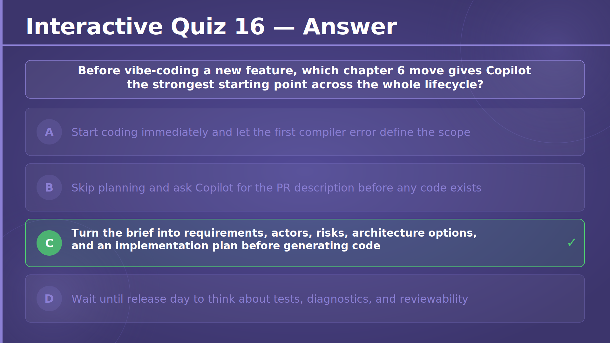

> **TL;DR:** The best starting move is to turn the brief into a structured analysis and plan.

This answer slide confirms that structured discovery is the strongest foundation for later coding. It underlines that good lifecycle work begins well before implementation.

## Slide 45 — Interactive Quiz 16 — Explanation

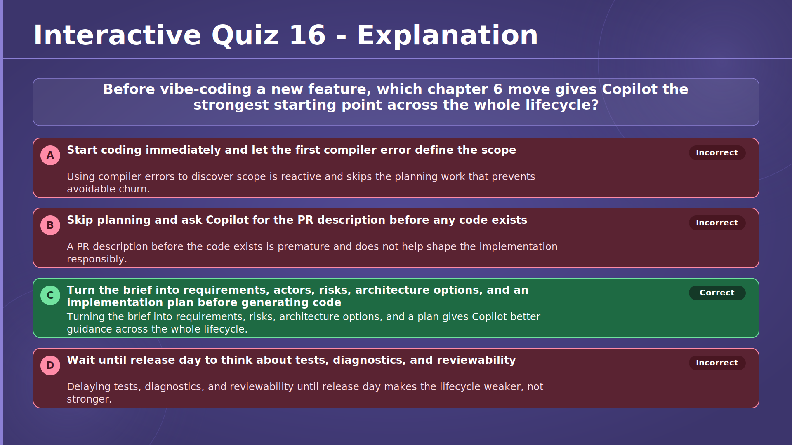

> **TL;DR:** Better early analysis gives Copilot better guidance across the whole lifecycle.

This explanation clarifies why the correct option wins. By turning a rough brief into explicit requirements, risks, and architecture choices, you reduce ambiguity and improve every later stage of the work.

## Slide 46 — Interactive Quiz 17

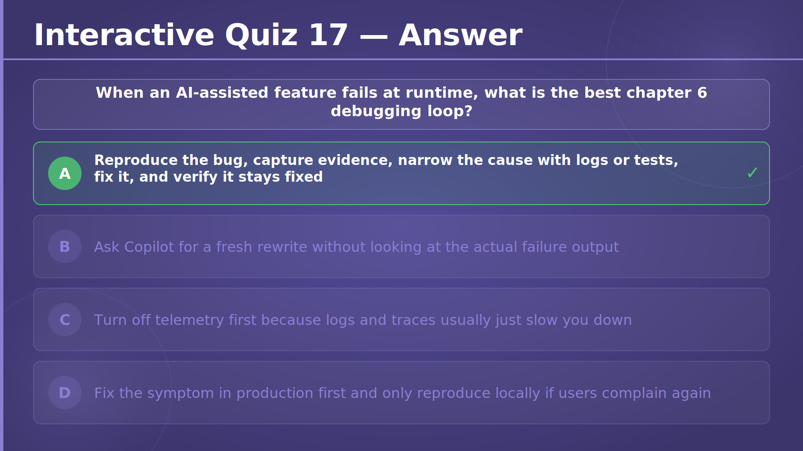

> **TL;DR:** The best debugging workflow is evidence-driven and iterative.

This quiz tests whether participants recognise the proper debugging loop: reproduce the issue, gather evidence, narrow the cause, fix it, and verify the outcome. It reinforces process over guesswork.

## Slide 47 — Interactive Quiz 17 — Answer

> **TL;DR:** The correct answer is to reproduce, inspect, fix, and verify.

This answer slide confirms the preferred debugging loop and frames it as a disciplined method. It reminds participants that quick rewrites or blind production fixes are poor substitutes for understanding the failure.

## Slide 48 — Interactive Quiz 17 — Explanation

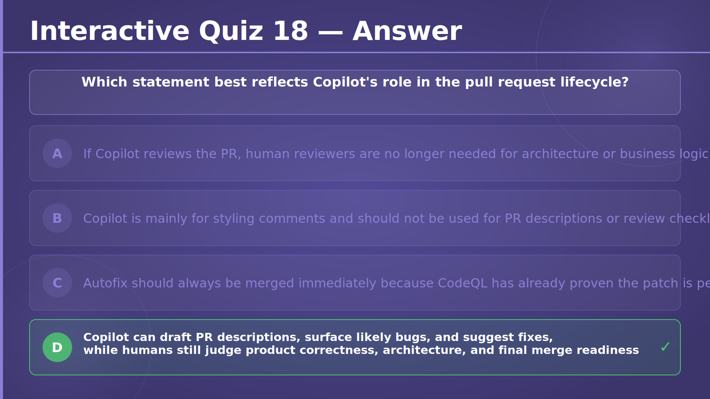

> **TL;DR:** Good debugging fixes the root cause and proves the fix holds.

This explanation expands on why the chosen loop works. The key idea is that evidence, narrowing, and verification produce safer fixes than guess-based interventions.

## Slide 49 — Interactive Quiz 18

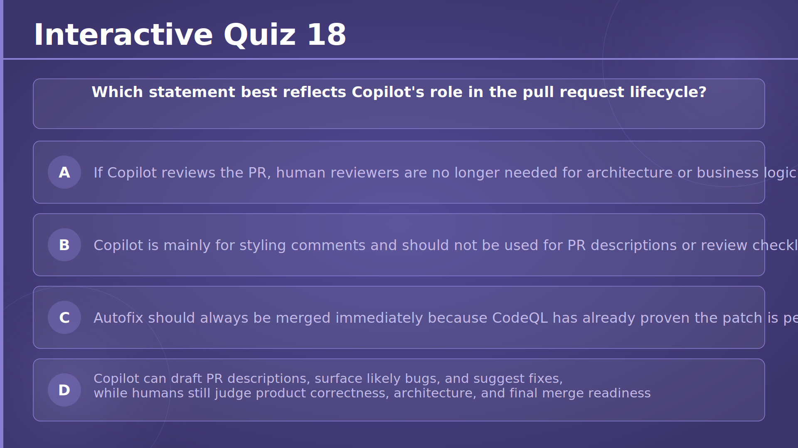

> **TL;DR:** Copilot helps throughout PR work, but humans still own final judgment.

This quiz asks participants to identify the statement that best describes Copilot's role in the pull-request lifecycle. It reinforces the balance between automation support and human responsibility.

## Slide 50 — Interactive Quiz 18 — Answer

> **TL;DR:** The correct answer is that Copilot assists, while humans remain accountable for the merge decision.

This answer slide confirms the right interpretation of AI support in pull requests. It highlights drafting, review hints, and suggested fixes as valuable assistance rather than full replacement for reviewers.

## Slide 51 — Interactive Quiz 18 — Explanation

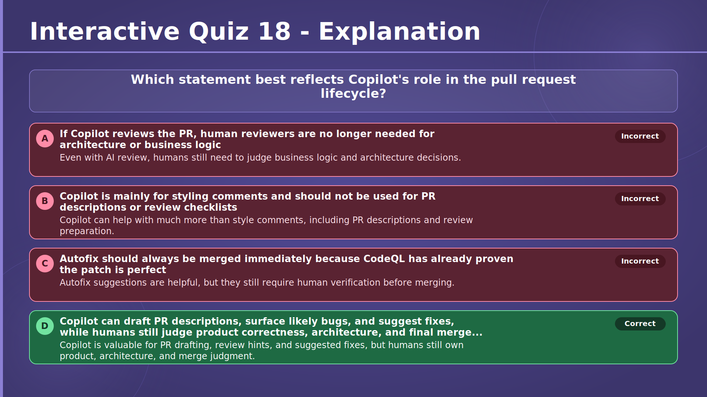

> **TL;DR:** AI is useful in PRs, but product correctness and architectural judgment stay with people.

This explanation reinforces the complementary roles of Copilot and human reviewers. It helps participants remember that automation can speed up review work without taking over the final call.

## Slide 52 — Lab 601 — Ultimate Snake Across the Entire Lifecycle

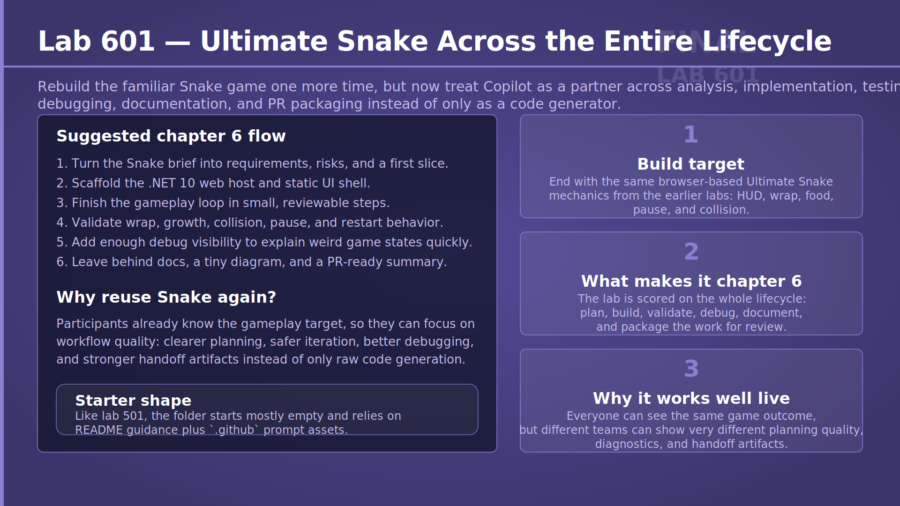

> **TL;DR:** This lab rebuilds Snake while using Copilot across analysis, coding, testing, debugging, documentation, and PR packaging.

The lab asks participants to treat Copilot as a partner from the first requirements discussion to the final PR summary. Because everyone already understands the target game, the focus shifts from product discovery to workflow quality across the lifecycle.

This matters because it turns the chapter into practice. Participants can experience how disciplined AI usage compounds across many stages instead of only during implementation.

→ [Lab 601 — Ultimate Snake Across the Entire Lifecycle](../../../labs/chapter-06/lab-601/README.md)

## Slide 53 — Lab 601 — Expectations

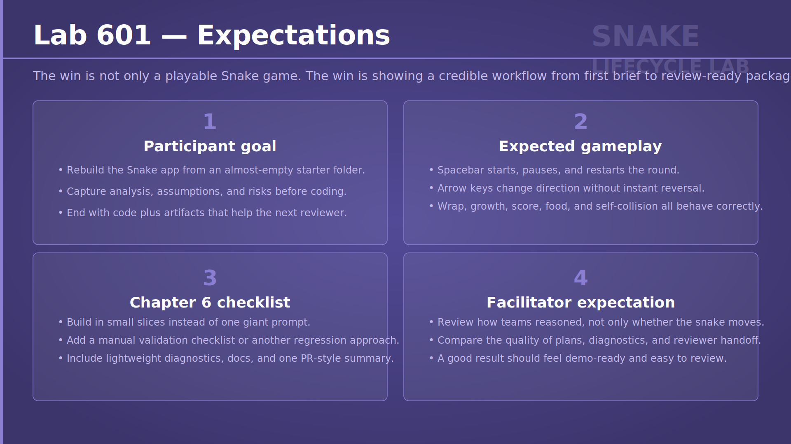

> **TL;DR:** Participants should finish with a working Snake game plus the supporting artifacts a teammate or reviewer would need.

This slide defines success for the lab: capture assumptions and risks before coding, build the expected gameplay behaviours, and produce the surrounding artifacts such as documentation, diagnostics, and a PR summary. It makes clear that the deliverable is more than just playable code.

The slide also reinforces the chapter's end-to-end mindset. A strong result includes implementation quality, validation evidence, and communication for the next person in the lifecycle.

→ [Lab 601 — Ultimate Snake Across the Entire Lifecycle](../../../labs/chapter-06/lab-601/README.md)
