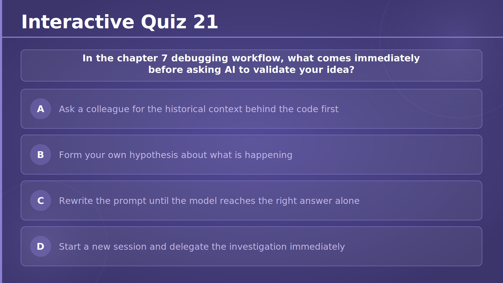
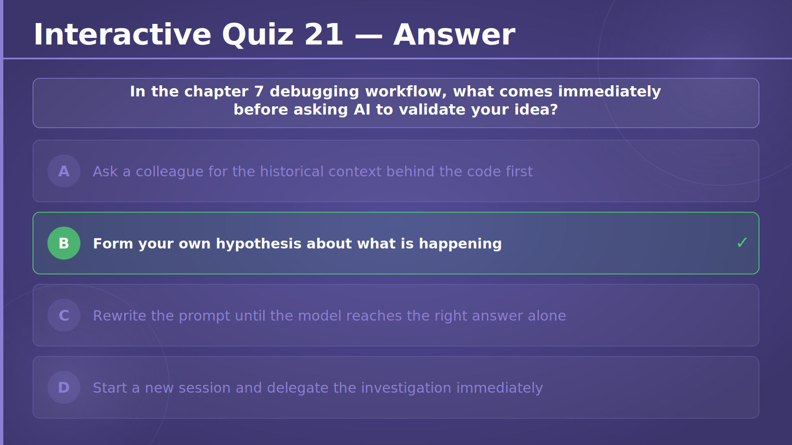
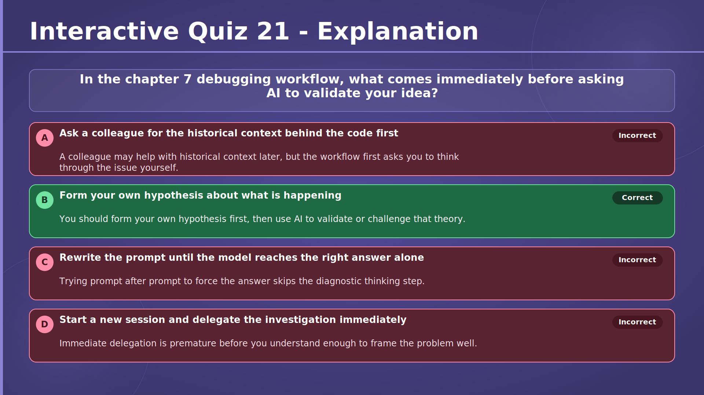

# Chapter 7 — Level Up: Best Practices for AI-Powered Development
## Slide 01 — AI4Dev

> **TL;DR:** This opening slide introduces AI4Dev and the theme of building with AI while staying in control.

## Slide 02 — Chapter 7 — Level Up: Best Practices for AI-Powered Development

> **TL;DR:** This chapter is about turning AI-assisted development into a reliable daily practice.

## Slide 03 — Copilot Best Practices — Start with the Right Job

> **TL;DR:** Copilot works best when you choose tasks that fit the tool instead of asking it to do everything.

This slide explains where Copilot gives the most value, such as tests, scaffolding, debugging syntax, explanations, and large first drafts. It also shows that different surfaces fit different jobs: inline suggestions are strong for local, predictable edits, while chat or agents are better for broader tasks that need reasoning.

The key message is that Copilot can speed up execution, but developers still decide what good work looks like. Choosing the right surface first usually saves time and reduces unnecessary review work.

## Slide 04 — Prompt Engineering — Four Inputs That Change the Output

> **TL;DR:** Better prompts come from clearly defining the task, context, example, and constraints.

This slide breaks prompt design into four practical parts: what you want done, what surrounding code or rules matter, what a good result looks like, and what must not change. That structure helps participants ask for something concrete instead of hoping the model guesses correctly.

It also reinforces that if a request is still too broad, the best move is often to split it into smaller prompts. Smaller prompts are easier for the model to answer well and easier for the developer to verify.

## Slide 05 — Guide the Model — More Context, Better Review, Faster Iteration

> **TL;DR:** Good context improves AI output, but careful human review is still required.

This slide shows how to increase signal by opening relevant files, using focused context references, and rewriting prompts when the first answer is close but not useful. It treats context as something you actively shape instead of something the assistant magically figures out.

It also reminds participants that better answers do not remove the need for judgment. You still need to review correctness, security, readability, and maintainability before accepting changes.

## Slide 06 — Copilot CLI — Customize the Environment Before You Delegate

> **TL;DR:** Copilot CLI becomes more reliable when team rules and permissions are defined up front.

This slide explains that instruction files, repository guidance, and tool permissions are part of the development environment, not an afterthought. When standards for build, test, style, and workflow live in files, the assistant can follow them more consistently.

It also highlights control surfaces such as model choice and tool approvals. The broader lesson is that delegation works better when the environment already reflects how the team wants work to be done.

## Slide 07 — Copilot CLI Workflow — Plan, Focus, and Delegate Intentionally

> **TL;DR:** A strong Copilot CLI workflow uses planning, clean focus, and deliberate delegation.

This slide presents a practical loop: explore the problem, make a plan, write code, verify the result, and then commit. It emphasizes that planning early and checking context between tasks reduces confusion and keeps the assistant aligned with the current goal.

It also distinguishes between work worth delegating and work best kept local, such as interactive debugging. Participants should see AI assistance as a workflow they manage, not a process they blindly hand over.

## Slide 08 — Token-Efficient Workflow — Locate First, Ask Second

> **TL;DR:** Find the exact code location first, then ask AI about that specific hotspot.

This slide teaches a two-phase approach: first use cheap discovery tools like search, symbol lookup, and folder browsing, then ask the model for help on the exact file, method, or symbol that matters. That keeps prompts smaller and improves the relevance of the answer.

For workshop participants, this matters because token efficiency is really clarity efficiency. The more precisely you point at the problem, the more likely the assistant is to help with the real issue instead of a vague version of it.

## Slide 09 — Conversation Hygiene — Keep Context Fresh and Cheap

> **TL;DR:** Resetting stale conversations often gives better results than endlessly correcting a drifting chat.

This slide covers the habits of starting a new chat for a new topic, summarizing before a session gets too long, and replacing outdated code or logs instead of stacking correction after correction. The goal is to keep the conversation accurate, current, and easy for the model to reason about.

It matters because even a well-written prompt can fail inside a cluttered conversation. Clean context lowers cost and makes the next answer easier to trust.

## Slide 10 — Scope the Context — Selection Beats Full File

> **TL;DR:** Send the smallest useful slice of code instead of the whole file or workspace.

This slide compares strong context choices, like selected lines or one method, with weaker choices, like several files pasted just in case. It encourages participants to match the size of the context to the size of the question.

That habit improves both speed and quality. Smaller, sharper context reduces noise, lowers token use, and makes it easier to review the answer against the real problem.

## Slide 11 — Use AI Like a Junior Developer — Diagnose, Then Validate

> **TL;DR:** Form a theory about the bug first, then use AI to test and refine that theory.

This slide frames debugging as a step-by-step workflow: reproduce the issue, locate the code, form a hypothesis, validate it, and then act. AI is useful in the validation step, but it should not replace the developer's own reasoning about what is probably happening.

This matters because good debugging depends on evidence and focus. Treating AI like a junior teammate encourages better prompts and better verification.

## Slide 12 — Team Context Is a Shared Asset

> **TL;DR:** The best AI workflows are shared, documented, and reusable across the whole team.

This slide explains that instructions, prompt files, skills, and architecture docs should be treated as team assets rather than private tricks. When good practices are versioned and reviewable, they become easier to reuse and improve.

It also stresses the social side of adoption: teams should share what works, what fails, and why. That helps newer teammates benefit from the same improvements instead of starting from scratch.

## Slide 13 — Output Discipline — Ask for the Fix, Not the Tutorial

> **TL;DR:** Ask for narrow, reviewable output so you can verify the change quickly.

This slide teaches participants to request only what they need, such as the updated method, the likely causes, or the minimal diff. Smaller outputs are cheaper to generate and much easier to inspect than long explanations plus full rewrites.

It also promotes doing one thing per prompt. Clear, limited asks reduce waste and help the assistant focus on the most useful next step.

## Slide 14 — Cheaper Test Generation — Plan Cases Before Code

> **TL;DR:** Decide which test cases matter before asking AI to generate the test code.

This slide shows how to start with a test matrix, remove weak cases, and then ask for only the needed test methods or data rows. That keeps the generated output aligned with the behavior you actually want to verify.

It matters because tests are easy to overgenerate. Planning first saves tokens, reduces review effort, and leads to test suites that are more focused and maintainable.

## Slide 15 — Local Models — Offload the Cheap Work

> **TL;DR:** Use local models for routine tasks and save stronger cloud models for work that needs judgment.

This slide separates low-risk tasks, like boilerplate, mock data, and simple transformations, from high-judgment tasks like architecture choices, subtle debugging, and security-sensitive review. The idea is to match model cost and capability to the importance of the task.

For participants, this is both a cost and workflow lesson. Starting cheap and escalating only when needed can reduce spend, lower privacy exposure, and still keep quality high.

## Slide 16 — Token FOMO — Do Not Turn AI Into a Slot Machine

> **TL;DR:** More prompts do not automatically mean more progress, especially if you have not reviewed the last answer.

This slide describes a common trap: asking again and again because another prompt feels productive, even when the current answer has not been checked properly. It explains that constant prompting can increase noise, review burden, and false confidence.

The practical takeaway is to set stopping rules and escalate only when the next prompt changes the plan. Participants should measure success by clearer decisions, not by how many prompts they send.

## Slide 17 — Mental Overload — Faster Loops Still Need Breathing Room

> **TL;DR:** AI can speed up the loop, but you still need enough focus to understand what is happening.

This slide warns that too many tabs, chats, diffs, and candidate answers can create the feeling of speed while actually reducing comprehension. It encourages participants to protect working memory and slow down when choices are important or hard to reverse.

The deeper point is that AI should reduce friction, not multiply unfinished thought. Sustainable productivity comes from understandable loops, not just faster ones.

## Slide 18 — Automate Once, Reuse Often — Turn Agent Scripts Into Skills

> **TL;DR:** When an agent generates a useful script, commit it to the repo and turn it into a reusable skill instead of regenerating it every time.

When an AI agent writes a script to solve a complex task, that script represents real value. Rather than prompting the agent to produce it again from scratch next time, developers should commit it to the repository, document what it does, and treat it as a team artifact like any other code.

The next step is wrapping the script in a custom skill or agent so it can be invoked by name in future sessions. This shifts the prompt from "write X again" to "run X", which is faster, cheaper, and more reliable. If an agent needed to generate it once, a skill can run it forever.

## Slide 19 — Stay in Control — Safe Habits When Working With AI Agents

> **TL;DR:** AI agents are powerful but can make mistakes — a few disciplined habits keep you in control and your work safe.

This slide covers the safety habits that matter most when working with autonomous agents: keeping changes incremental and reviewable, committing often to preserve safe restore points, and working on separate branches so agent output never reaches main until it has been checked.

It also warns that agents can damage files and configuration, and that Git commands are particularly risky. Force-pushes, branch deletions, and rebases can cause irreversible harm. The closing message is simple: the agent works for you, not the other way around. Always review output before accepting it.

## Slide 20 — Prompt Hygiene — Say More With Less

> **TL;DR:** Removing unnecessary words from prompts makes them faster to write, cheaper to run, and easier to get right.

Every word in a prompt costs tokens and competes for the model's attention. Social padding, vague preambles, restating what the model already said, and over-explaining context the model already has all dilute the signal without adding value. The model has no feelings and unlimited patience, so there is no need to soften requests.

What to keep is the clear task instruction, relevant constraints like language and framework, scope limits, the expected output shape, and the exact error message or evidence. Shorter prompts tend to produce sharper answers and leave less room for the model to drift away from the real goal.

## Slide 21 — Interactive Quiz 19

> **TL;DR:** This quiz asks which part of the four-input prompt framework sets the guardrails for correctness.

The question reinforces the chapter's prompt engineering framework by asking participants to identify which ingredient defines what the response must not break. It helps distinguish between the task (what to do) and the constraints (what must stay protected).

## Slide 22 — Interactive Quiz 19 — Answer

> **TL;DR:** The correct answer is constraints — they define the guardrails and the non-negotiable limits of the response.

This answer slide makes it explicit that specifying what must not change is just as important as specifying what should be done. Without constraints, the model may produce output that is technically correct but breaks something that was meant to stay stable.

## Slide 23 — Interactive Quiz 19 — Explanation

> **TL;DR:** Constraints protect correctness by setting the boundaries the response must respect.

The explanation walks through each wrong answer to show why task, context, and example alone are not enough. Constraints are the ingredient that prevents the model from solving the wrong version of the problem.

## Slide 24 — Interactive Quiz 20

> **TL;DR:** This quiz checks whether participants know the best starting context for a small, localized bug.

The question reinforces the chapter's scoped-context habit by asking which input gives the clearest signal for a localized issue. It encourages participants to think about precision rather than volume when choosing what to send.

## Slide 25 — Interactive Quiz 20 — Answer

> **TL;DR:** The best first context for a localized bug is the selected method or the exact lines involved.

This answer underlines a practical habit: give the assistant the smallest relevant snippet rather than the whole file or workspace. That usually produces a clearer response and reduces noise that could distract from the real issue.

## Slide 26 — Interactive Quiz 20 — Explanation

> **TL;DR:** For a localized bug, a narrow snippet gives the clearest signal with the least noise.

The explanation connects the answer to the token-efficient and scoped-context practices from earlier in the chapter. Sending unrelated files or stale history pulls focus away from the actual problem and makes the model's answer harder to trust.

## Slide 27 — Interactive Quiz 21

> **TL;DR:** This quiz checks which step comes immediately before asking AI to validate your debugging idea.

The question points back to the chapter's debugging workflow and asks participants to identify the moment when they should form their own hypothesis. It reinforces that AI should support the developer's reasoning, not replace it.

## Slide 28 — Interactive Quiz 21 — Answer

> **TL;DR:** The correct step is to form your own hypothesis before asking AI to validate it.

This answer keeps the workflow grounded in developer judgment. A clear hypothesis gives the assistant something concrete to confirm, challenge, or refine, which leads to a faster and more reliable resolution.

## Slide 29 — Interactive Quiz 21 — Explanation

> **TL;DR:** You should think through the problem yourself first, then use AI to validate or sharpen your theory.

The explanation closes the chapter by confirming that the correct sequence is to reproduce the issue, locate the relevant code, form a hypothesis, and only then ask AI to validate it. Delegating the investigation before you understand enough to frame the problem leads to unfocused answers. Think first, validate second.
