# Chapter 8 — Get Your Hands Dirty: Real-World AI in Action
## Slide 01 — AI4Dev

> **TL;DR:** This opening slide introduces the final chapter and the workshop's core message about using AI with control.

## Slide 02 — Chapter 8 — Get Your Hands Dirty: Real-World AI in Action

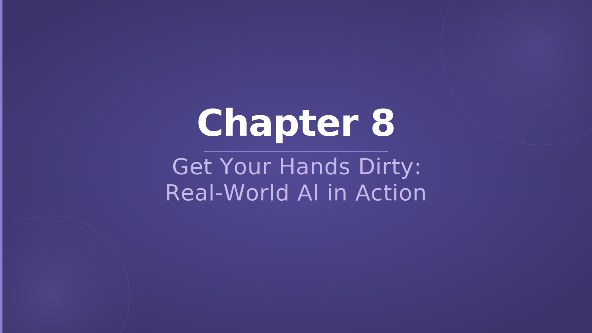

> **TL;DR:** This chapter moves from concepts and habits into a full capstone build.

## Slide 03 — Recap — Chapter 1

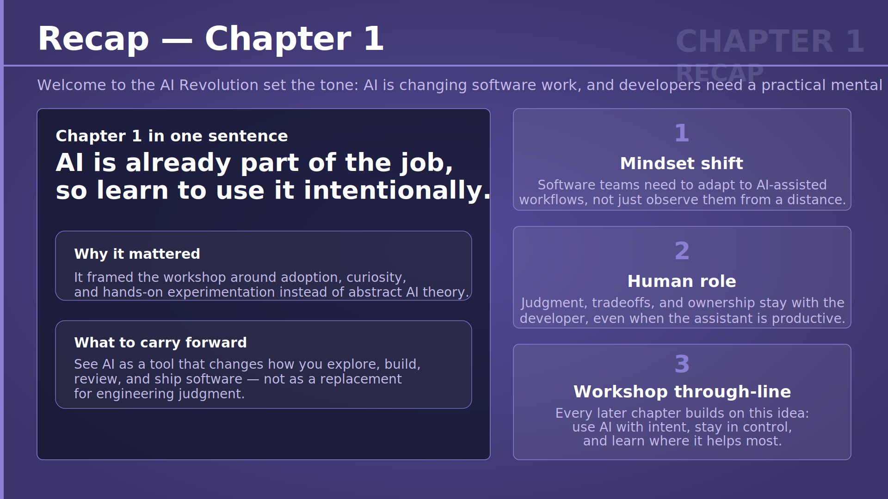

> **TL;DR:** Chapter 1 established that AI is already part of modern software development, so developers need to use it intentionally.

This recap reminds participants that the workshop began with a mindset shift, not a tool demo. The main point was that AI is changing how teams work, but human judgment, trade-offs, and ownership still stay with the developer.

That matters here because the final lab is not just about getting a feature working. It is about applying AI in a way that stays deliberate, practical, and accountable.

## Slide 04 — Recap — Chapter 2

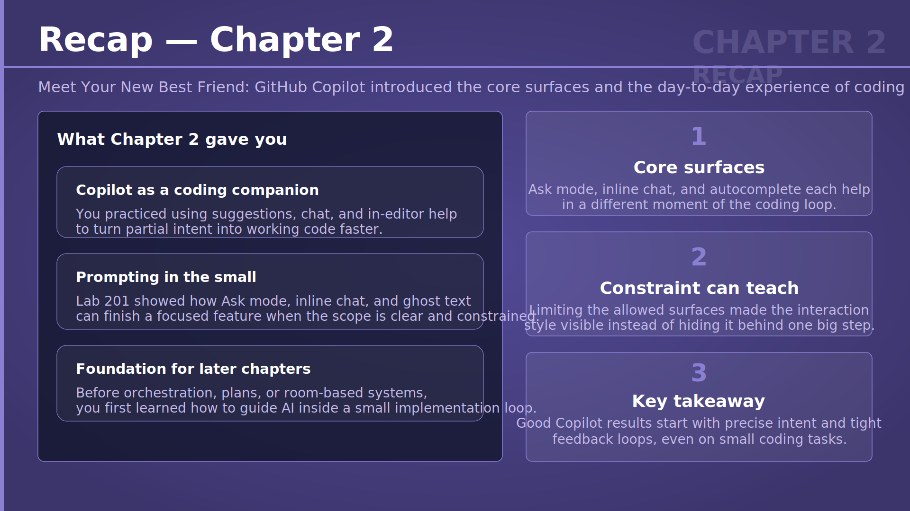

> **TL;DR:** Chapter 2 introduced GitHub Copilot as a day-to-day coding companion across different interaction surfaces.

This slide revisits the core Copilot experiences such as autocomplete, inline chat, and Ask mode. It reminds participants that even small exercises showed how precise prompts and short feedback loops improve the quality of AI-assisted coding.

The recap also connects those early lessons to the capstone. Before handling bigger workflows, participants first learned how to guide AI in a focused implementation loop.

## Slide 05 — Recap — Chapter 3

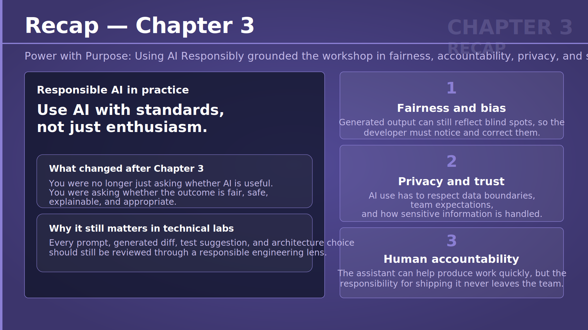

> **TL;DR:** Chapter 3 grounded AI use in responsibility, fairness, privacy, and human accountability.

This recap highlights that technical output is not enough on its own. Developers must still ask whether an AI-assisted result is safe, appropriate, explainable, and respectful of data boundaries.

That lesson matters in every later chapter because prompts, generated code, and design decisions all carry real consequences. Responsible use is part of engineering quality, not a separate topic.

## Slide 06 — Recap — Chapter 4

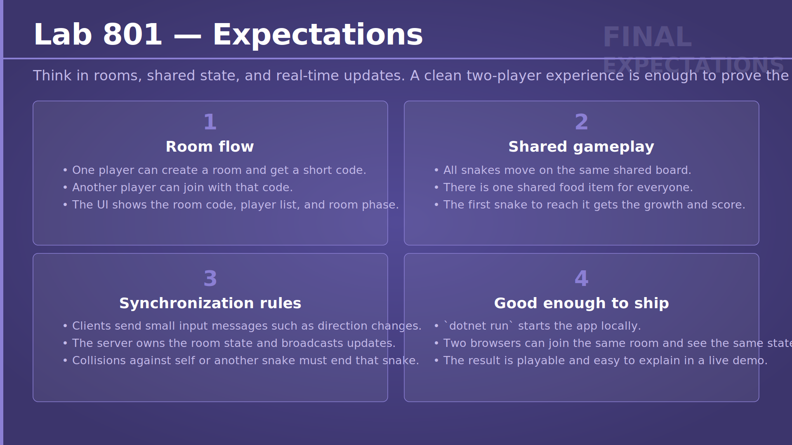

> **TL;DR:** Chapter 4 expanded from simple coding help to larger workflows with agents, plans, edits, and CLI support.

This slide reminds participants that bigger tasks often need coordination across files, tools, and steps. Agent Mode, planning, and terminal-based workflows were introduced as ways to manage work that is too broad for one short chat reply.

The recap matters because the capstone combines UI, server logic, state management, and verification. Choosing the right Copilot surface becomes part of solving the problem well.

## Slide 07 — Recap — Chapter 5

> **TL;DR:** Chapter 5 showed that prompt quality and context selection strongly shape the quality of AI output.

This slide brings back the idea that the assistant can only reason over the context it receives. Clear wording, explicit constraints, and a good working set make it much more likely that the model solves the right problem the right way.

That becomes even more important in larger systems. When a task spans client code, server code, and shared rules, good context management stops the assistant from drifting into vague guesses.

## Slide 08 — Recap — Chapter 6

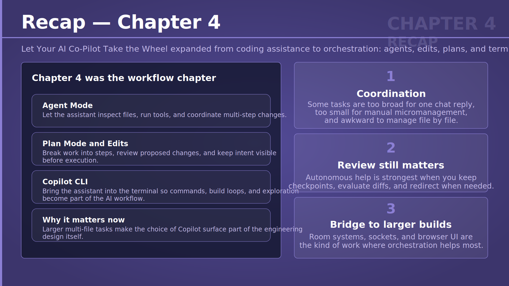

> **TL;DR:** Chapter 6 broadened AI usage from coding alone to support across the full software lifecycle.

This recap covers planning, implementation, debugging, testing, and documentation as connected parts of one engineering loop. It shows that AI is most useful when it helps at many stages instead of being treated as a one-shot code generator.

For the final lab, that means participants should use AI to shape the work, inspect failures, validate behavior, and explain the result, not only to write initial code.

## Slide 09 — Recap — Chapter 7

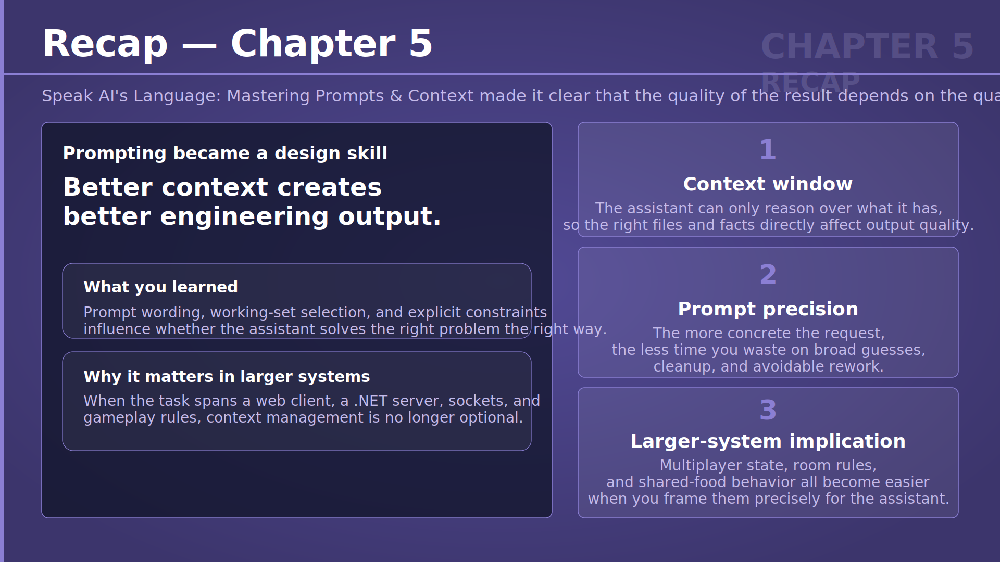

> **TL;DR:** Chapter 7 turned earlier lessons into repeatable habits for sustainable AI-powered development.

This slide summarizes best practices such as choosing the right surface, keeping context clean, reviewing outputs carefully, and validating important changes. The emphasis is on habits that teams can use every day rather than isolated prompt tricks.

That matters before the capstone because larger builds become manageable only when the workflow itself is disciplined. Good habits are what keep speed from turning into chaos.

## Slide 10 — Interactive Quiz 19

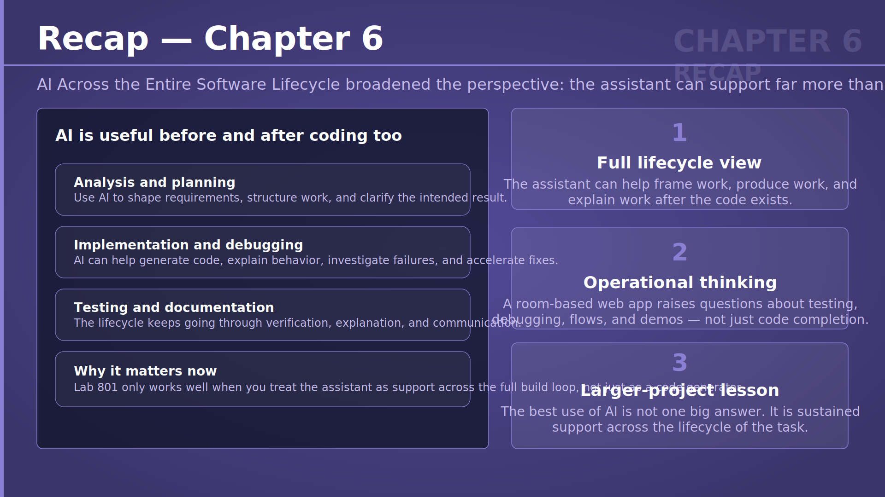

> **TL;DR:** This quiz checks whether participants know the safest first move in an unfamiliar repository with an ambiguous feature request.

The question brings together planning, targeted context, and safety boundaries. It reinforces that the strongest first step is to clarify the work, inspect the code carefully, and make a small plan before generating changes.

## Slide 11 — Interactive Quiz 19 — Answer

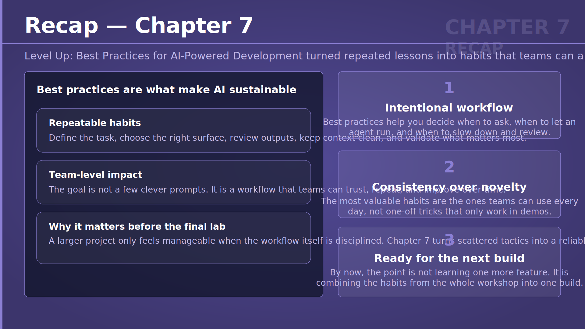

> **TL;DR:** The correct answer is to clarify requirements, inspect targeted context, check boundaries, and plan first.

This answer highlights a core workshop habit: do not rush into generation when the request is unclear or sensitive. A short planning step improves both safety and quality.

## Slide 12 — Interactive Quiz 19 — Explanation

> **TL;DR:** Planning and checking boundaries first is safer than asking AI to implement a vague request immediately.

The explanation ties the answer to responsible engineering practice. Understanding the code and data boundaries before generating code reduces the chance of building the wrong thing or exposing something sensitive.

## Slide 13 — Interactive Quiz 20

> **TL;DR:** This quiz checks whether participants can respond properly when a feature works in a demo but fails in real verification.

The question reinforces that intermittent failures need evidence, not guesswork. Reproducing the issue, collecting browser and test evidence, and then fixing the root cause is the strongest integrated response.

## Slide 14 — Interactive Quiz 20 — Answer

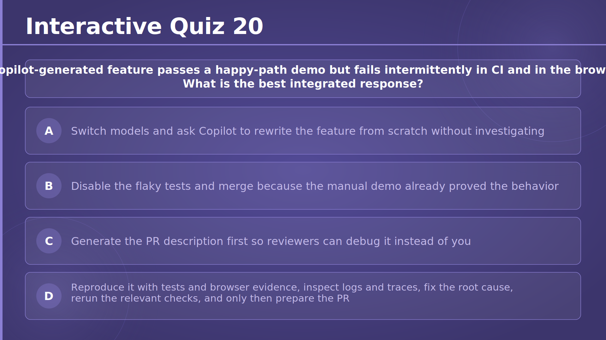

> **TL;DR:** The correct answer is to reproduce the problem, inspect evidence, fix the cause, rerun checks, and only then prepare the PR.

This answer keeps the engineering loop grounded in verification. It shows that passing a happy-path demo is not enough when CI or browser behavior says something is still wrong.

## Slide 15 — Interactive Quiz 20 — Explanation

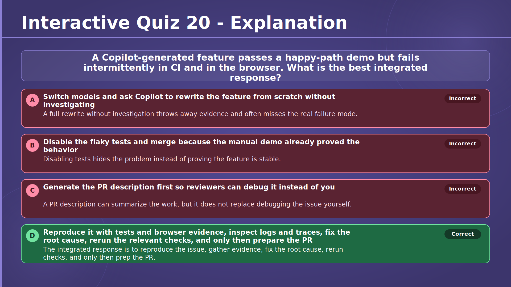

> **TL;DR:** Reliable progress comes from evidence and rerunning checks, not from rewriting blindly or merging around the issue.

The explanation emphasizes root-cause thinking. Gathering proof, making the fix, and rerunning relevant checks is what turns a flaky result into something the team can trust.

## Slide 16 — Interactive Quiz 21

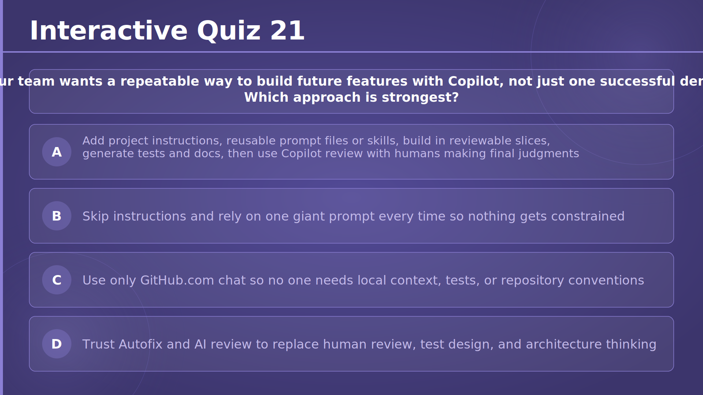

> **TL;DR:** This quiz checks whether participants can identify the best repeatable team workflow for future Copilot use.

The question brings together reusable instructions, prompt assets, reviewable change slices, generated tests and docs, and human review. It frames long-term success as a system of habits rather than a single powerful prompt.

## Slide 17 — Interactive Quiz 21 — Answer

> **TL;DR:** The best approach is to build reusable guidance, work in reviewable slices, and keep humans responsible for final judgment.

This answer captures the workshop's team-level message. Repeatable Copilot success comes from process, shared context, and review, not from trusting automation alone.

## Slide 18 — Interactive Quiz 21 — Explanation

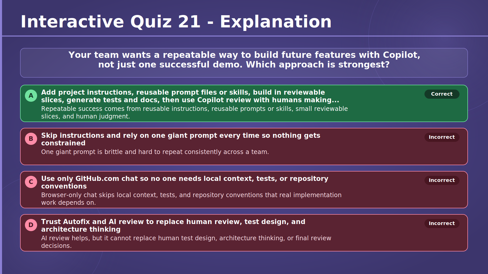

> **TL;DR:** Sustainable AI workflows come from reusable structure plus human oversight.

The explanation closes the recap by showing why instructions, reusable prompts or skills, and small reviewable changes matter. They make future AI-assisted work easier to repeat, inspect, and improve as a team.

## Slide 19 — Lab 801 — Multiplayer Ultimate Snake

> **TL;DR:** The capstone lab turns the earlier Snake work into a real-time multiplayer game with shared state.

This slide introduces the final build target: a browser-based multiplayer Snake experience with rooms, joining by code, and live updates. It combines front-end behavior, server-side decisions, and real-time synchronization into one demo-ready exercise.

It matters because this lab pulls together many workshop themes at once. Participants must use AI thoughtfully across design, implementation, debugging, and review instead of treating the assistant as a one-step solution.

→ [Lab 801 — Multiplayer Ultimate Snake](../../../labs/chapter-08/lab-801/README.md)

## Slide 20 — Lab 801 — Expectations

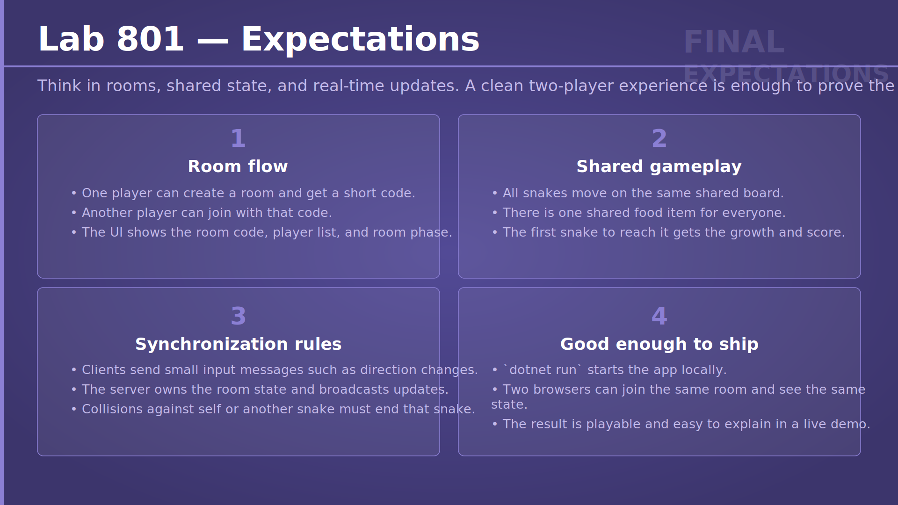

> **TL;DR:** This slide defines what the multiplayer capstone must do to feel complete and demo-ready.

This slide explains the expected room flow, shared gameplay rules, and synchronization model. One player creates a room, another joins by code, clients send lightweight inputs, and the server stays responsible for the authoritative game state.

For workshop participants, these expectations provide a practical finish line. The goal is not perfection, but a working multiplayer experience that can be run locally, explained clearly, and demonstrated with confidence.

→ [Lab 801 — Multiplayer Ultimate Snake](../../../labs/chapter-08/lab-801/README.md)
