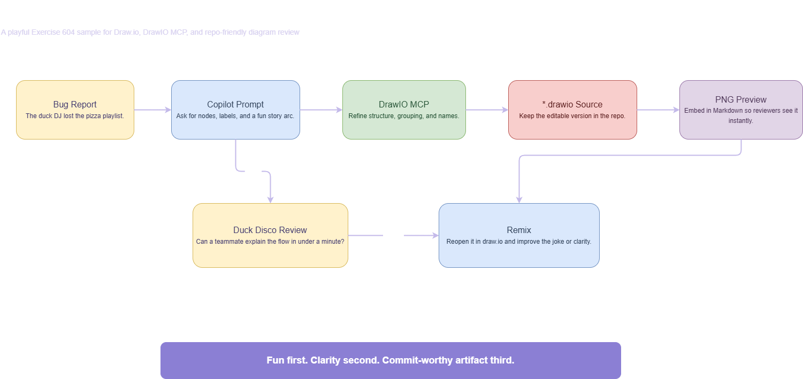

# Exercise 604 Solution — Draw.io Playground with MCP and *.drawio.png

This folder contains a **possible finished result** for Exercise 604.

Contents:

- `copilot-duck-disco.drawio.png` — editable draw.io preview image for Markdown and repo browsing

Preview:

Suggested use:

1. open `copilot-duck-disco.drawio` in draw.io or diagrams.net
2. export your own `*.drawio.png` variant if you want an editable PNG artifact
3. compare the picture, labels, and surrounding README guidance after a refinement pass