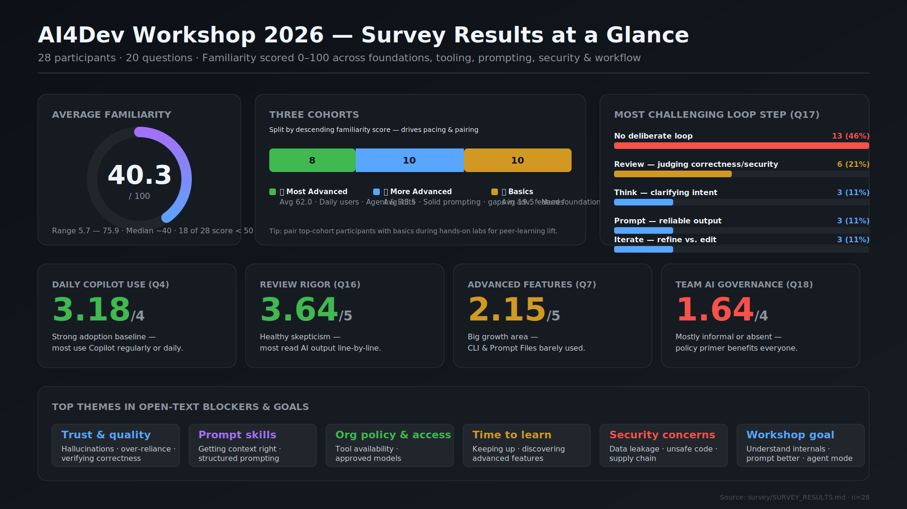
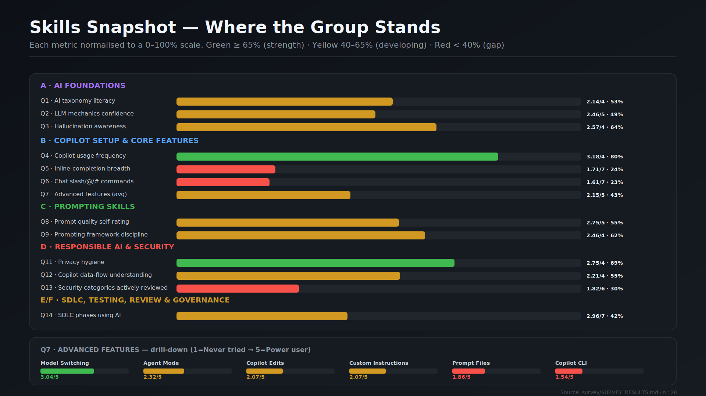
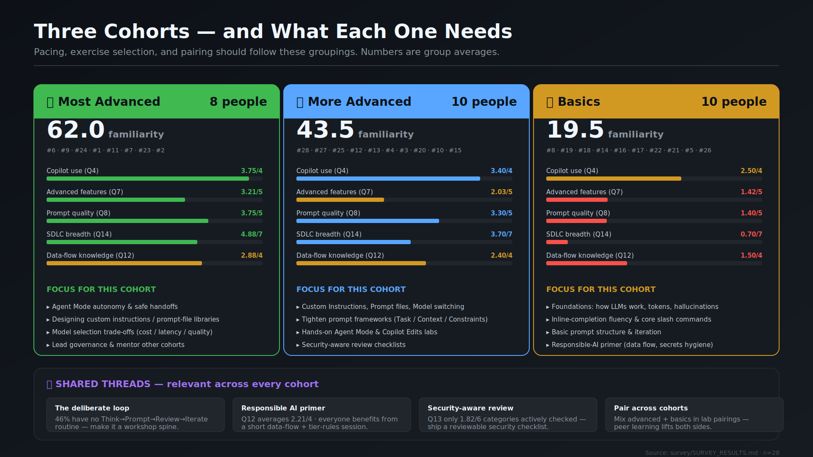
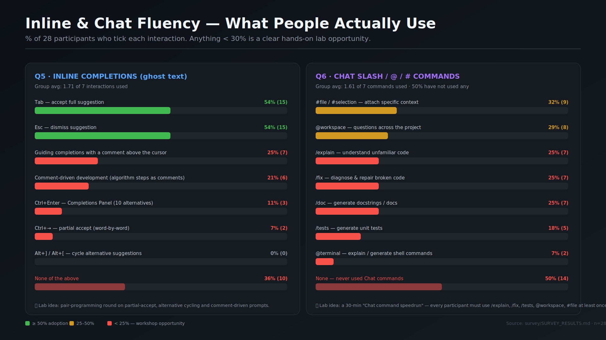
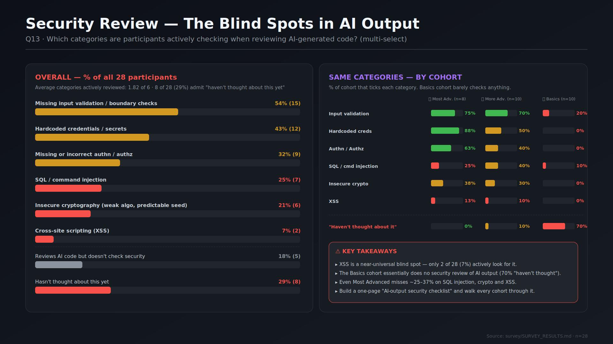
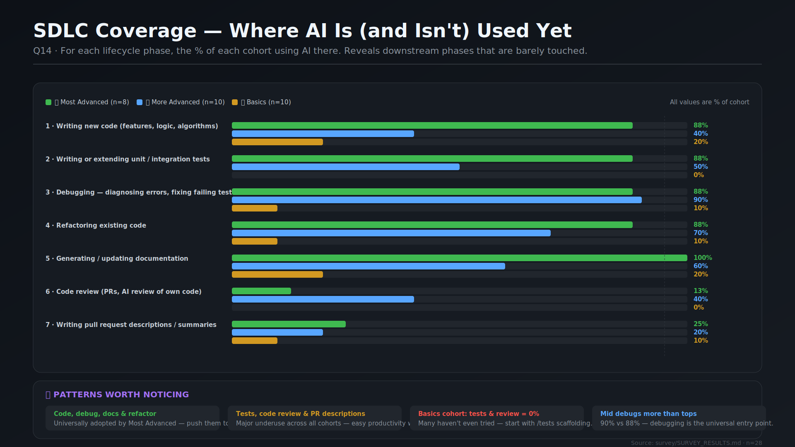
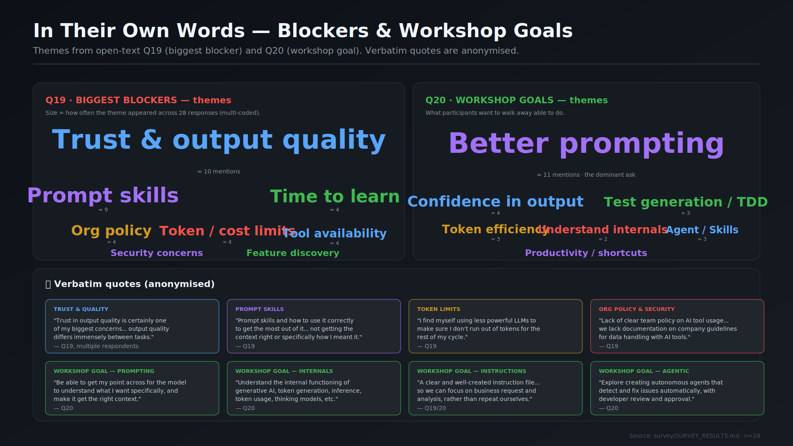
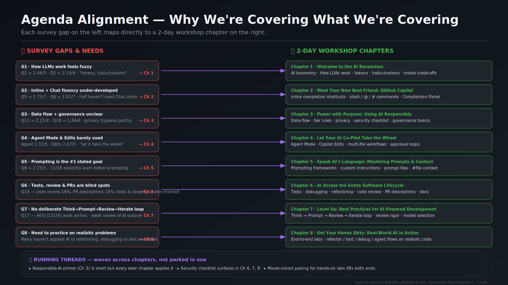

# Survey Infographics

A set of eight 16:9 SVG infographics summarising the **AI4Dev Workshop 2026** pre-survey results (n = 28 participants, 20 questions). They are designed to be read in order — from the executive overview down to per-topic deep dives — but each one also stands alone.

All charts share the same dark visual language so they can be dropped side-by-side in slides, the README, or a printed handout.

| # | File | One-line purpose |
|---|------|------------------|
| 01 | [`01-executive-overview.svg`](01-executive-overview.svg) | Bird's-eye view: KPIs, cohort split, top challenges, dominant blockers |
| 02 | [`02-skills-snapshot.svg`](02-skills-snapshot.svg) | Every Q1–Q14 metric on one normalized scale |
| 03 | [`03-cohorts-and-focus.svg`](03-cohorts-and-focus.svg) | Side-by-side cards for the three skill cohorts |
| 04 | [`04-fluency-heatmap.svg`](04-fluency-heatmap.svg) | What inline & chat features people *actually* use |
| 05 | [`05-security-blindspots.svg`](05-security-blindspots.svg) | Which security categories get reviewed — and which don't |
| 06 | [`06-sdlc-coverage.svg`](06-sdlc-coverage.svg) | Where in the SDLC AI is (and isn't) used yet |
| 07 | [`07-themes-and-quotes.svg`](07-themes-and-quotes.svg) | Open-text themes and verbatim participant quotes |
| 08 | [`08-agenda-alignment.svg`](08-agenda-alignment.svg) | How the 8 workshop chapters map to the survey gaps |

---

## 01 · Executive Overview

**Audience:** stakeholders, sponsors, anyone who only has 30 seconds.

A single dashboard with the highest-level signal:

- **KPI strip** at the top — 28 participants, 20 questions, average familiarity score, and the overall "AI maturity" rating.
- **Cohort split** showing the three groups identified in `SURVEY_RESULTS.md` (🥇 Most Advanced 8 · 🥈 More Advanced 10 · 🥉 Basics 10) with their average familiarity score.
- **Top challenges** — Q17 results: the most common pain points the audience reports today.
- **Blocker themes** — the dominant categories from open-text Q19 (e.g. trust in output, prompting skill, organisational policy).

Use it as the title slide of any presentation about the survey results.

---

## 02 · Skills Snapshot

**Audience:** workshop facilitators preparing content depth.

A long, vertical bar chart that puts **every quantitative question (Q1 through Q14) on the same 0–100% scale**, colour-coded by traffic-light thresholds:

- 🟢 **≥ 65 %** — already strong, no need to teach this from scratch.
- 🟡 **40 – 65 %** — partial knowledge, refresher needed.
- 🔴 **< 40 %** — weak across the cohort, dedicated lab time needed.

Includes a **Q7 drill-down** for the four Copilot interaction modes (Ask, Edit, Agent, Inline) so you can see exactly which mode is the weakest entry point.

This is the single most useful chart for deciding *what* to teach.

---

## 03 · Cohorts and Focus

**Audience:** anyone planning seating, pairing, or differentiated tracks.

Three columns side-by-side — one per cohort — each shaped like a profile card:

- 🥇 **Most Advanced (8 people)** — typical scores, what they already know, what to challenge them with.
- 🥈 **More Advanced (10 people)** — solid base, where the next-level lift lies.
- 🥉 **Basics (10 people)** — entry points, foundational gaps, where to start.

Each card lists the cohort's **average familiarity**, **strongest topics**, **weakest topics**, and a short **suggested focus** for the workshop.

Use it when deciding mixed-cohort vs. tracked exercises, and to brief co-facilitators on whom they'll be sitting next to.

---

## 04 · Fluency Heatmap

**Audience:** Chapter 2 facilitator (Meet Your New Best Friend: GitHub Copilot).

Two stacked panels showing concrete feature adoption:

- **Q5 · Inline completions** — Tab, Esc, comment-guided suggestions, comment-driven development, the Completions Panel (Ctrl+Enter), partial-accept (Ctrl+→), alternative cycling (Alt+] / Alt+[), and "none of the above".
- **Q6 · Chat / @ / # commands** — `#file`, `@workspace`, `/explain`, `/fix`, `/doc`, `/tests`, `@terminal`, and "none".

Each option is a horizontal bar with absolute count and percentage. Bars are coloured red/yellow/green using the same thresholds as 02. The footers contain concrete lab suggestions ("Chat command speedrun", "comment-driven prompts").

Headline finding visible at a glance: **half the room has never used a Chat command**, and **partial-accept / alternative cycling are at 0–7 %** — both are easy wins.

---

## 05 · Security Blindspots

**Audience:** Chapter 3 facilitator (Power with Purpose) and the security/governance lead.

Q13 broken open in two ways:

- **Left card — Overall** — for each of the eight options ("missing input validation", "hardcoded creds", "authn/authz", "SQL/command injection", "insecure crypto", "XSS", "I review but don't check security", "haven't thought about it") — what % of all 28 participants ticks it.
- **Right card — By cohort** — the same six security categories shown as small grouped bars per cohort (🥇 / 🥈 / 🥉). Plus a separate row for "haven't thought about it".

Includes a callout box highlighting the four most important takeaways:

- XSS is a near-universal blind spot (only 2 of 28 check for it).
- 70 % of the Basics cohort hasn't thought about security at all.
- Even the Most Advanced cohort misses ~25–37 % on SQL injection, crypto and XSS.
- A one-page "AI-output security checklist" is the recommended deliverable.

---

## 06 · SDLC Coverage

**Audience:** Chapter 6 facilitator (AI Across the Entire Software Lifecycle).

A grouped horizontal-bar chart with seven SDLC phases (writing new code, tests, debugging, refactoring, documentation, code review, PR descriptions). For each phase, three bars show the percentage of each cohort that uses AI in that phase.

Below the chart is a 4-card insight strip:

- 🟢 **Code, debug, docs & refactor** are universally adopted by Most Advanced.
- 🟡 **Tests, code review & PR descriptions** are underused everywhere — easy productivity wins.
- 🔴 **Basics cohort** has 0 % adoption for tests and code review.
- 🔵 **Mid cohort** debugs slightly more than the top cohort — debugging is the universal entry point.

Use this when justifying why the workshop spends real time on AI-assisted testing and code review even though "everyone uses Copilot already".

---

## 07 · Themes and Quotes

**Audience:** anyone writing the workshop intro, the recap, or marketing material.

Three sections, all sourced from the open-text answers (Q19 = biggest blocker, Q20 = workshop goal):

- **Q19 themes (top-left card)** — a sized "word cloud" where each theme's font size reflects how often it came up. Largest: *trust & output quality* (~10 mentions), then *prompt skills* (~9), then *time to learn* / *org policy* / *token cost* / *tool availability* (~4 each).
- **Q20 themes (top-right card)** — same treatment for workshop-goal themes. Dominant ask: *better prompting* (~11 mentions), then *confidence in output*, *test generation / TDD*, *understand internals*, *agents & skills*, *token efficiency*, *productivity*.
- **Verbatim quotes (bottom)** — eight anonymised quote cards arranged 4 × 2, each tagged with a coloured theme label (Trust, Prompting, Token Limits, Org Policy, plus four workshop-goal cards). These give human texture to the numbers and are useful as slide pull-quotes.

The English/Dutch/French mix in the original responses is preserved in spirit; quotes are kept faithful to participant intent.

---

## 08 · Agenda Alignment

**Audience:** anyone who asks "why are we covering chapter X?".

A two-column flow showing the connection between **what the survey said is missing** and **what the workshop teaches**:

- **Left column — Survey Gaps & Needs** — eight red-bordered pills (G1 through G8), each citing the specific Q-numbers and metrics that justify it.
  - G1 — How LLMs work feels fuzzy
  - G2 — Inline + Chat fluency under-developed
  - G3 — Data flow + governance unclear
  - G4 — Agent Mode & Edits barely used
  - G5 — Prompting is the #1 stated goal
  - G6 — Tests, review & PRs are blind spots
  - G7 — No deliberate Think → Prompt → Review → Iterate loop
  - G8 — Need to practice on realistic problems
- **Right column — 2-Day Workshop Chapters** — eight green-bordered pills (Chapters 1 to 8) with one-line content summaries.
- **Purple arrows** in the middle map each gap to the chapter that addresses it (1 ↔ 1).
- **Bottom strip — Running Threads** — three concerns that aren't parked in a single chapter but woven throughout: Responsible-AI, security checklist, and mixed-cohort pairing.

This is the chart you put up when someone asks "do we really need chapter 3?" — every chapter is justified by data.

---

## Source data

All numbers come from `survey/SURVEY_RESULTS.md`, with chapter titles taken from `content/2-day/chapter-0[1-8]/README.md`. Cohort definitions and rosters are documented in `SURVEY_RESULTS.md` lines 818-887.

## Design language (for future additions)

If you add more infographics, please match the conventions used here:

- Canvas: `viewBox="0 0 1920 1080"` (16:9).
- Background: linear gradient `#0d1117 → #161b22`.
- Cards: fill `#161b22`, stroke `#30363d`, drop-shadow filter named `card`.
- Text: headings `#f0f6fc`, body `#c9d1d9`, muted `#8b949e`, footer `#484f58`.
- Threshold palette: green `#3fb950` (≥ 65 %), yellow `#d29922` (40–65 %), red `#f85149` (< 40 %).
- Accents: blue `#58a6ff`, purple `#a371f7`.
- Font: `'Segoe UI', system-ui, sans-serif`.
- Footer line: `Source: survey/SURVEY_RESULTS.md · n=28` bottom-right.
